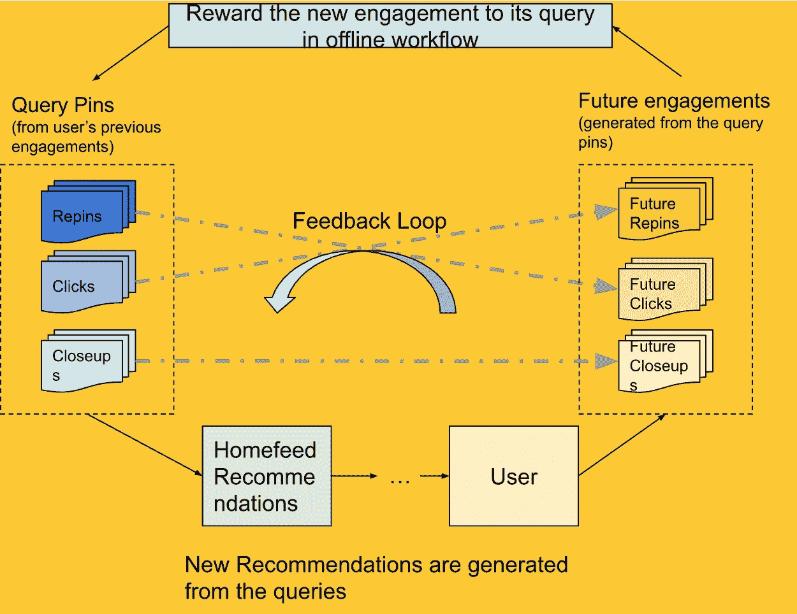
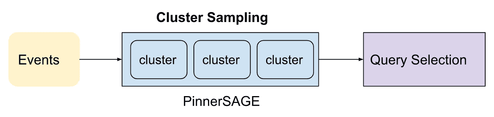
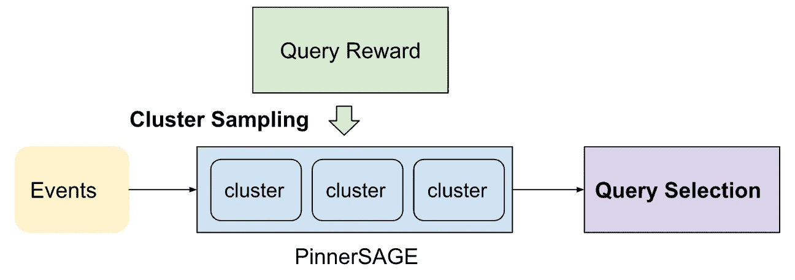

# 查询奖励:在查询选择过程中构建推荐反馈环

> 原文：<https://medium.com/pinterest-engineering/query-rewards-building-a-recommendation-feedback-loop-during-query-selection-70b4d20e5ea0?source=collection_archive---------0----------------------->

Bella Huang |软件工程师，首页候选生成；Raymond Hsu |工程师经理，首页候选人生成；Dylan Wang |工程师经理，家庭相关性

在 Homefeed 中，大约 30%的推荐管脚来自基于管脚到管脚的检索。这意味着在检索阶段，我们使用一批查询 pin 来调用我们的检索系统以生成 pin 推荐。我们通常使用用户先前使用的 pin，并且用户可能有数百个(或数千个！所以我们的一个关键问题是:我们如何从用户简档中选择正确的查询 pin？

# 使用 PinnerSAGE 的用户特征概述

在 Pinterest，我们使用[个人信息](/pinterest-engineering/pinnersage-multi-modal-user-embedding-framework-for-recommendations-at-pinterest-bfd116b49475)作为用户个人信息的主要来源。PinnerSAGE 通过将附近的 pin 分组在一起，基于 pin 嵌入来生成用户参与的 pin 的聚类。每个集群代表用户的特定用例，并且通过从不同的集群中选择查询引脚来允许多样性。我们对作为查询源的 PinnerSAGE 集群进行采样。

# 添加查询奖励前的 Homefeed 查询合成

以前，我们根据集群中的原始动作计数对集群进行采样。然而，这种基本采样方法有几个缺点:

*   如果没有新约定发生，查询选择是相对静态的。主要原因是我们在对聚类进行采样时只考虑了动作量。除非用户采取大量的新动作，否则采样分布大致保持不变。
*   没有反馈用于将来的查询选择。在每个集群抽样期间，我们不考虑最后一个请求的抽样结果中的下游约定。用户在上一次请求中可能有积极或消极的参与，但在下一次请求中不要考虑这一点。
*   除了时间戳，它无法区分相同的操作类型。例如，如果同一聚类中的动作都发生在大约同一时间，则每个动作的权重将是相同的。

*Figure 1\. Previous query selection flow*

# 添加查询奖励后的 Homefeed 查询组合

*Figure 2\. Current query selection flow with query reward*

为了解决前面方法的缺点，我们向查询选择层添加了一个新的组件，称为查询奖励。查询奖励由一个工作流组成，该工作流计算每个查询的参与率，我们存储和检索该参与率以供将来查询选择使用。因此，我们可以建立一个反馈回路，用下游参与来奖励查询。

这里有一个查询奖励如何工作的例子。假设一个用户有两个 PinnerSAGE 集群:一个大集群与食谱相关，一个小集群与家具相关。我们最初向用户展示了许多食谱别针，但用户并不参与其中。查询奖励可以捕捉到食谱聚类具有许多印象但没有未来参与度。因此，以集群的参与率计算的未来回报将逐渐下降，我们将有更大的机会选择小型家具集群。如果我们向用户展示几个家具别针，他们使用它们，查询奖励将增加我们未来选择家具集群的可能性。因此，在查询奖励的帮助下，我们能够基于用户的参与度建立反馈环，并更好地选择候选生成的查询。

一些集群可能没有任何参与度(例如，空的查询奖励)。这可能是因为:

*   该集群在很久以前就被占用了，所以它最近没有机会被选中
*   集群对于用户来说是一个新的用例，所以我们在回报方面没有太多的记录

当集群没有任何参与度时，我们会给它们一个平均权重，这样它们仍有机会向用户公开。在下一次运行查询奖励工作流后，我们将获得更多关于未暴露聚类的信息，并决定下次是否选择它们。

*Figure 3\. Building a feedback loop based on Query Reward*

# 下一步/未来方向

*   Pinterest 作为一个带来灵感的平台，愿意尽我们所能给 Pinners 提供个性化的推荐。我们希望优先考虑用户的下游反馈，包括积极和消极的参与。在未来的迭代中，我们将考虑更多的参与类型，而不是 repin 来建立用户档案。
*   为了最大化 Pinterest 的使用效率，而不是建立离线查询奖励，我们希望转移到实时版本，以丰富在线请求中的分析信号。这将允许反馈回路更加响应迅速，潜在地在用户浏览时在相同的 Homefeed 会话中对用户做出响应。
*   除了基于 pin 的检索之外，我们可以很容易地对任何基于令牌的检索方法采用类似的方法。

# 承认

感谢通过讨论、评论和建议做出贡献的合作者:邓博文、桂新元、、顾能、周敏哲、何大方、吴、陈忠贤

*要在 Pinterest 了解更多工程知识，请查看我们的* [*工程博客*](https://medium.com/pinterest-engineering) *，并访问我们的*[*Pinterest Labs*](https://www.pinterestlabs.com?utm_source=medium&utm_medium=blog-article-link&utm_campaign=huang-hsu-wang-oct-25-2022)*网站。要探索 Pinterest 的生活，请访问我们的* [*职业*](https://www.pinterestcareers.com?utm_source=medium&utm_medium=blog-article-link&utm_campaign=huang-hsu-wang-oct-25-2022) *页面。*