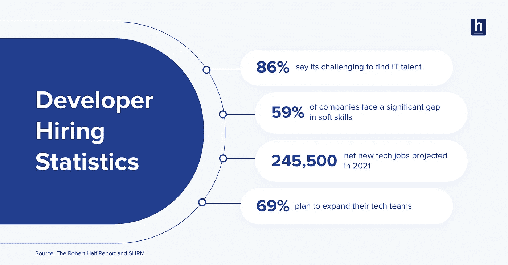

# 2021 年面试开发者时要问的问题——第一部分

> 原文：<https://medium.com/quick-code/questions-to-ask-when-recruiting-developers-in-2021-part-1-142c4d64d06f?source=collection_archive---------7----------------------->

Photo by [Edmond Dantès](https://www.pexels.com/@edmond-dantes?utm_content=attributionCopyText&utm_medium=referral&utm_source=pexels) from [Pexels](https://www.pexels.com/photo/man-people-woman-desk-4344340/?utm_content=attributionCopyText&utm_medium=referral&utm_source=pexels)

一旦开发人员的职位空缺，招聘人员就会感到一种熟悉的恐惧感。他们回忆起以前的面试经历，以及似乎每个月都有一篇关于糟糕的开发人员面试的博客帖子在网上疯传。

虽然招聘经理，尤其是那些挑剔的人，会把这归因于缺乏有才华的开发人员，但如果是时候重新思考你的面试过程了呢？如果招聘人员和招聘经理过于看重每个候选人的技术方面，而没有足够重视他们的软技能，该怎么办？

Robert Half 的一份报告显示 [86%的技术领导者](https://www.roberthalf.com/blog/job-market/the-state-of-us-tech-hiring)表示寻找 it 人才很有挑战性。面试开发人员应该是一次有益的经历，而不是一次挑战。如果你不急于问一些具体的问题，而是设计一个简单的对话来评估候选人的思维方式，这会带来很多好的见解，也很有趣。

Photo By HackerEarth

招聘开发人员时，询问正确的技术面试问题很重要，但清晰的沟通、良好的职业道德以及与组织目标的一致性也很重要。

让我们首先看看什么样的技术面试问题最适合揭示任何开发人员的编码技能和知识，然后解决候选人的行为方面，使他们有别于其他人。

# 通过问正确的问题来招募优秀的开发人员

这里有一些技术面试问题，你应该在面试时问潜在的软件工程师。

# #1 为以下内容编写一个算法

1.  最小堆栈—设计一个提供 4 个函数的堆栈— push(item)、pop、peek 和 Minimum，所有函数的时间复杂度都是固定的。然后继续编写实际的解决方案。
2.  数组中的第 K 个最大元素—这是一个标准问题，具有最佳时间复杂度阶数的多个解决方案，其中 N log(K)是常见的阶数，O(N) + K log(N)是不太常见的阶数。这两种解决方案都是可以接受的，彼此不能直接比较，但都比 N log(N)好，后者是对数组排序并获取第 k 个元素。
3.  二叉树的顶视图-给定二叉树的一个根节点，返回所有元素的集合，如果下雨，这些元素将被淋湿。直接位于其上方的节点不会被弄湿。
4.  哈希表的内部实现，如映射/字典——候选项需要指定如何存储键值对、如何使用哈希以及如何处理冲突。一个好的开发者不仅知道如何使用这个概念，还知道它是如何工作的。如果开发人员还知道当哈希表中的记录数量增加时，数据结构如何扩展，这是一个额外的收获。

算法展示了候选人将复杂问题分解成步骤的能力。推理和模式识别能力是评估候选人时需要考虑的更多因素。一个好的候选人可以在讨论中把他对算法的思考过程编码出来。

# #2 为以下低层次设计(LLD)问题制定解决方案

*   什么是 LLD？用你自己的话，详细说明 LLD 涵盖的不同方面。
*   设计一个类似 BookMyShow 的电影票预订应用。确保您的数据库模式是为具有多个屏幕的剧院定制的，并负责预订、座位可用性、座位安排和座位锁定。您的解决方案不必扩展到付款选项。
*   设计一个基本的社交媒体应用程序。为像 Twitter 这样的平台设计数据库模式和 API，具有关注用户、发布帖子、查看您的推文和查看用户推文的功能。

这样的问题没有正确或错误的答案。它们主要用来揭示开发人员的思维过程和他们处理问题的方式。

# #3 一些高级设计(HLD)问题

*   你对 HLD 的理解是什么？你能指出 LLD 和 HLD 的区别吗？
*   设计一个社交媒体应用程序。除了设计一个像 Twitter 这样的平台，具有关注用户、发布帖子、查看你的推文和查看用户推文的功能，还要设计一个时间表。在设计了一个你可以看到你的追随者的推文的时间线之后，为更多的观众缩放它。如果您还有时间，请尝试将其扩展为名人用例。
*   像 IRCTC 这样的火车票预订应用程序的设计。结合授权，选择始发站和终点站的功能，查看两个车站之间的可用列车和可用座位，保存从始发站到终点站的座位预订，并锁定它们，直到支付确认。
*   你将如何设计一个基本的关系数据库？数据库应该支持表、列、基本字段类型，如整数和文本、外键和索引。开发人员处理这个问题的方式很重要。优秀的开发人员会围绕存储和内存管理设计解决方案。

> 这是给你的建议。LLD 问题新手和有经验的开发者都可以回答。通常，高级开发人员会回答 HLD 问题。明智地选择你的面试问题，问一些与你的候选人的经历相关的问题。

# #4 您曾经使用过 SQL 吗？为需要多个连接的特定用例编写查询。

示例:创建一个表，其中包含学生姓名、科目和分数等单独的列。返回每个学生的姓名和排名。学生的排名取决于所有科目的总分数。

不是所有的开发人员都有使用 SQL 的经验，但是一些关于数据如何存储/结构化的知识是有用的。开发人员应该熟悉简单的概念，如连接、检索查询和 DBMS 的基础知识。

# #5 你认为这段代码有什么问题？

与其让开发人员候选人在一张纸上写代码(反正已经过时了)，不如让他们调试现有的代码。这是评估他们技能的另一种方式。在代码中放置隐蔽的错误，并评估它们对细节的关注。

既然你已经确切地知道了在面试开发人员时应该寻找什么样的技术技能以及什么时候该问什么问题，那么是时候评估这些候选人的软技能了。 [*本博客的第二部分*](/quick-code/questions-to-ask-when-interviewing-developers-in-2021-part-2-2c8af2d6edfa) *揭示了如何以及为什么根据沟通技巧、职业道德以及与公司目标的一致性来评估候选人。*

*我的文章最初发表在*[*www.hackerearth.com*](https://hubs.ly/H0QL95r0)