# 在门迪克斯排队可能是件好事

> 原文：<https://medium.com/mendix/queueing-in-mendix-can-be-a-good-thing-5440261efccb?source=collection_archive---------2----------------------->

## 排队通常被认为是浪费时间，无论你是在排队等公共汽车/电车/火车回家，还是排队买午餐，或者你在等待客服人员接听你的电话<*在此输入你最喜欢的零售商/供应商* >。

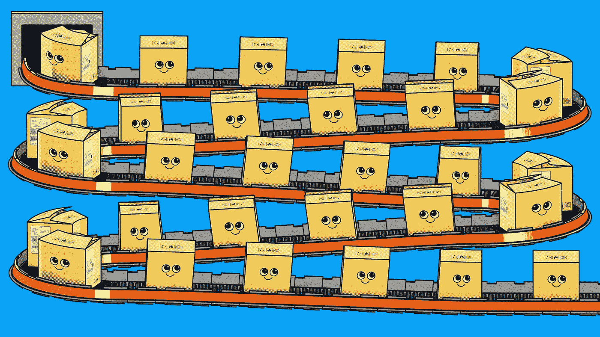

Queueing in Mendix Can Be a Good Thing

在 Mendix 应用程序中，大多数操作都是单线程的，因此，例如，您定义的操作将在开始时开始，在结束时结束，中间将按照您指定的顺序执行您指定的操作。这使得事情变得简单明了，因为你不需要太担心你定义的操作是否会像你期望的那样发生，如果你的动作中有依赖项，你可以清楚地看到它们是什么。

另一方面，队列可能对您的应用程序有好处，因为它们可以用于将流程的执行分散到多个线程和节点上。如果您有一项特定的工作要完成，队列可以让您同时完成工作的不同部分，从而帮助您解决问题，总的来说，这个过程花费的时间更少。那么你如何做到这一点呢？

这是关于 Mendix 应用程序效率的系列博客文章的第三篇。在这个系列的第一篇文章中([Mendix](/p/86a02a4c70a3)中的健康和效率)，我强调了一些可以提高低代码效率的简单方法，在第二篇文章中([Mendix 中的一个字符串有多长？](/mendix/in-mendix-how-long-is-a-string-846b04d96770))，我展示了 Java 动作的使用是如何帮助提高性能的。这一次我想说明如何使用 **Mendix 任务队列**来提高应用程序的效率。

# 任务队列

**Mendix 任务队列**是在 Mendix 9 中引入的，作为流程队列市场模块的现代替代品，它们的特性都有很好的记录。在这篇文章中，我将采用一个特定的简单用例，展示如何使用**任务队列**来显著减少执行所需流程所花费的时间。

在[任务队列页面](https://docs.mendix.com/refguide/task-queue/)上有详细的文档，涵盖了您可以使用**任务队列**做什么，以及如何做，包括更新的功能，例如失败任务的自动重试，以及任务在特定时间开始执行的调度。需要记住的重要一点是，除非您自己管理，否则您必须小心不要让流程中的“子任务”之间存在依赖关系——此处显示的示例用例具有简单的依赖关系，我设计了一种控制这种依赖关系的方法。

## 大量删除

**我的应用程序用于在用户请求时从定义的外部数据源**提取数据。这些数据经过一些简单的分析，这样用户就可以决定如何使用这些数据。当用户满意并完成手头的工作时，**需要删除数据。**

一个测试应用程序已经被组装起来，用来演示一个**任务队列**如何加速删除过程。

 [## GitHub-Adrian-Preston/QueueingCanBeAGoodThing

### 此时您不能执行该操作。您已使用另一个标签页或窗口登录。您已在另一个选项卡中注销，或者…

github.com](https://github.com/Adrian-Preston/QueueingCanBeAGoodThing) 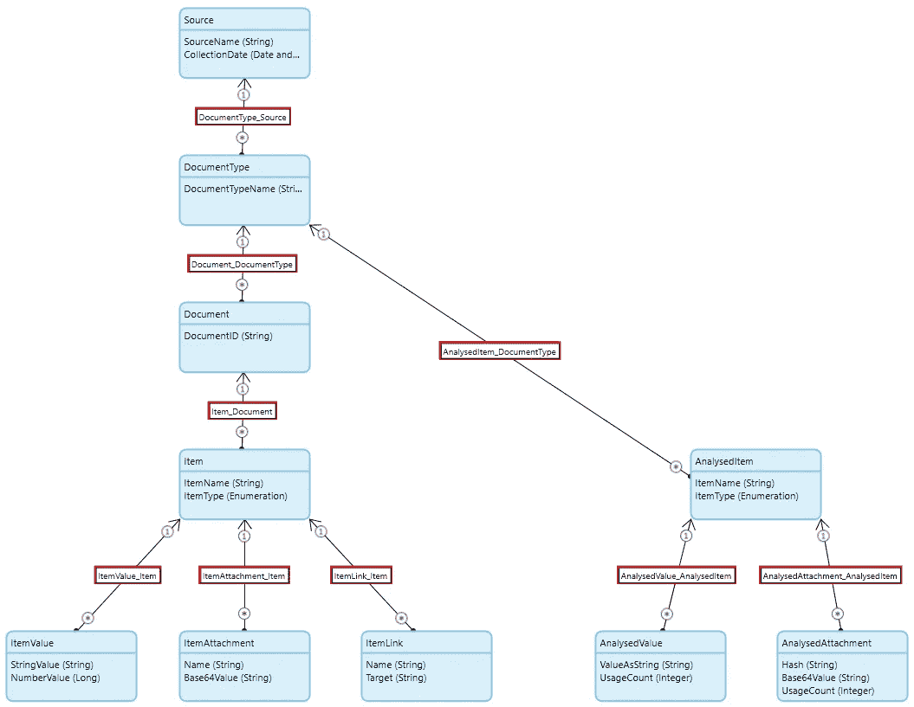

The domain model for the data

在初始设置中，域模型已经配置为自动删除，因此删除源对象将自动沿树向下级联删除所有关联的对象(在域模型中以红色边框突出显示)。这是一个安全的选择，因为它将防止“孤儿”对象被留下，这也意味着开发人员可以删除源代码，其他一切都将随之而来。但是，作为单线程操作，如果树中有大量数据，这可能需要一些时间。

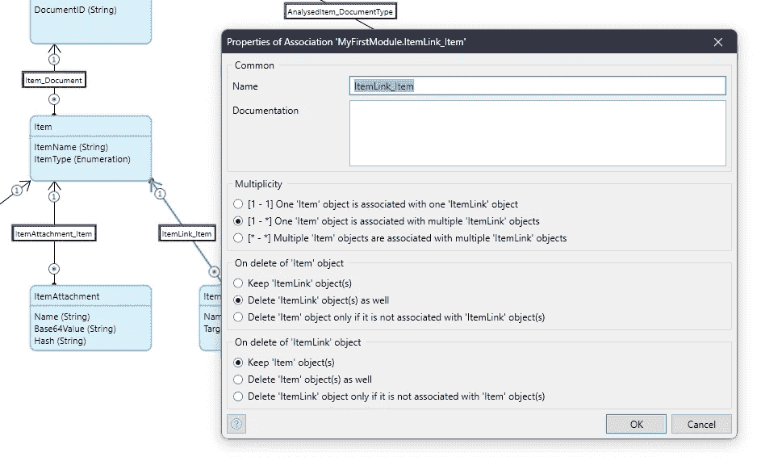

ItemLink is set to be deleted when the associated Item is deleted

由于这是一个相对简单的领域模型，很容易看出我们可以安全地同时删除某些实体的对象。因此，同时删除特定源的 ItemValue、ItemAttachment、ItemLink、AnalysedValue 和 analysed attachment(*Set One*)是安全的。同样，Item 和 AnalysedItem ( *Set Two* )可以同时删除，但必须在 *Set One* 中的记录全部删除后。最后，在*设置一个*和*设置两个*被删除后，必须按照正确的顺序删除 Source、DocumentType 和 Document。这些是我前面提到的依赖关系。

## 那么如何做到这一点呢？

在应用程序 UI 上，有一个页面列出了当前加载的源代码。在那里，用户识别要删除的源，并点击该行上的“智能删除源”按钮。

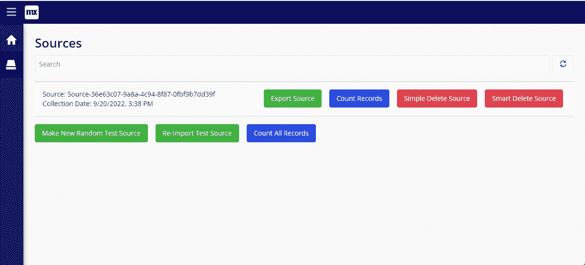

这调用了一个名为“ACT_SmartDeletion”的 nanoflow，它有两个主要任务:首先在后台启动删除过程；其次是等待源记录从数据库中消失，这表明任务已经完成。

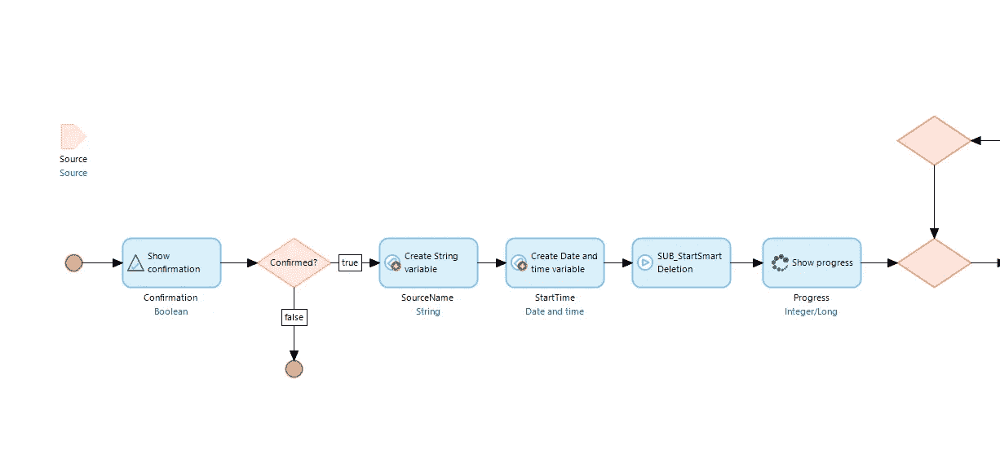

ACT_SmartDeletion first part

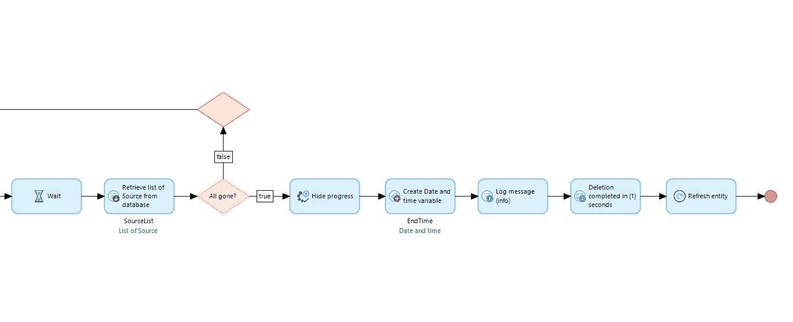

ACT_SmartDeletion second part

nanoflow 调用一个名为“SUB_StartSmartDeletion”的微流，该微流为 *Set One* **中的每个实体类型调用一个子微流，但是每个子微流都是通过将它们放入任务队列中来调用的，这意味着它们不是直接执行的，而是排队等待，因此它们在后台运行**。我们还为每个要接收的子微流创建了一个特殊的 DeletionControl 对象——下面将详细介绍。当这种微流结束时，它返回到纳米流。

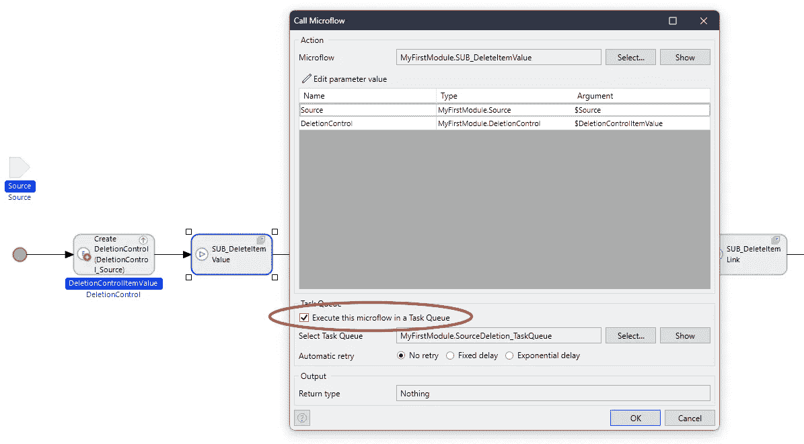

Part of microflow SUB_StartSmartDeletion

然后，nanoflow 进入一个循环，查看源记录是否仍在数据库中，当它在那里时，nanoflow 暂停一小段时间，然后再次检查。当源记录不再在数据库中时，nanoflow 告诉用户并完成。

五个子微流中的每一个都是相同的(除了有一些额外的代码)。子微流删除特定类型实体的源的所有记录，然后最终删除上面给出的 DeletionControl 对象。

The microflow SUB_DeleteItemAttachment

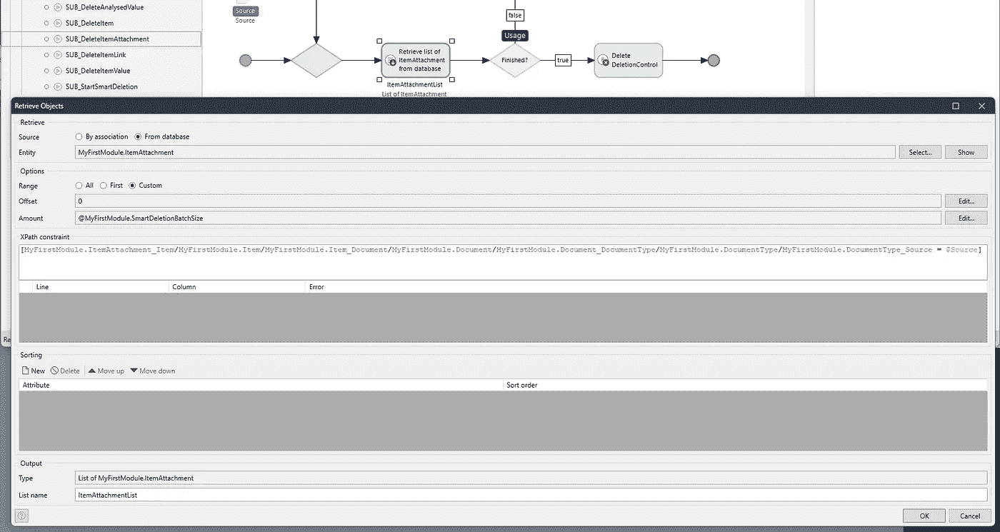

The Retrieve Action in SUB_DeleteItemAttachment

‘SUB _ delete item value’中的附加代码等待，直到所有的*设置一个*完成(通过检查所有的 DeletionControl 对象是否已被删除)，然后它启动同一**任务队列**中的子微流来运行*设置两个*中的实体的删除，因此当*设置一个*完成*设置两个*时，使用相同的机制自动启动删除。

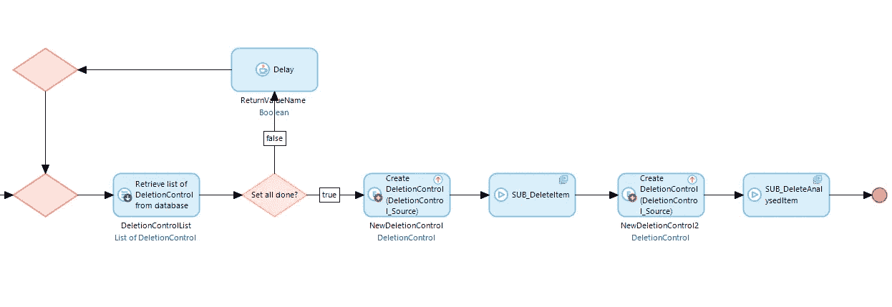

The extra code to start Set Two after Set One is completed

类似地' SUB_DeleteItem '，当它已经删除了所有的项时，等待*设置两个*完成，并最终删除源记录，从而完成该过程。由于 DocumentType 和 Document records 的数量很少，我们只是使用域模型的“删除”行为来删除它们。

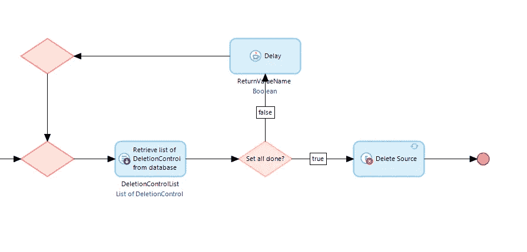

SUB_DeleteItem extra code to delete Source to complete the process

## 他们如何比较？

测试应用程序在源上也有一个“简单的删除源”按钮，这只是直接删除源，并离开域模型以确保依赖对象也被删除。因此，我们可以对一组测试数据运行简单删除或智能删除。此外，该应用程序能够创建一组新的测试数据，导出一组测试数据，并重新导入一组测试数据。通过这种方式，**应用程序将允许创建新的集合，并且可以导出/导入它们，因此简单而智能的删除选项可以重复用于相同的数据**。

我有一个测试数据集，它包含在应用程序的资源目录中，名为“Source-36 e63c 07–9a8a-4c 94–8f 87–0 fbf 9b 7 DD 39 f”，这是我的机器上用来比较删除的数据集。你可以用这个或者自己做。

我在 Mendix 9.18.0 中运行测试应用程序，并将其配置为访问本地 Postgres 10 数据库。在测试每种类型的删除之前，我从头开始运行这个应用程序。然后，我导入测试数据集，并运行五次删除操作。我忽略了五次测试中最好和最差的结果，取了其余三次测试的平均值。

那么结果如何呢？简单的删除选项平均花费了 163.9 秒。智能删除选项平均花费了 **29.4** 秒——比简单删除花费的时间少了五分之一。现在，如果用户正在等待删除完成，那么这听起来像是一个值得的节省。

还有其他方法可以改善此操作的用户体验，例如，您可以将源标记为已删除，方法是在源记录上放置一个布尔标志，然后有一个单独的定期计划事件流程来删除这样标记的源记录及其依赖项。你的问题永远不会只有一个解决方案。

此外，应该意识到，让多个线程为一个用户努力工作可能会降低其他用户的应用程序速度，因此应该充分理解和平衡精确用例的需求和解决方案的效果。

不要忘记，如果您有一个水平扩展的生产环境，那么**任务队列**中的任务将分布在集群中的可用节点上，这可能会为您节省额外的时间(尽管这里给出的场景侧重于始终是共享资源的数据库)。

## 还有一点

就目前情况来看，我们为用户节省了大量时间，我们希望这将改善他们使用该应用程序的体验。但是有一点被忽略了。

在域模型中，Item、ItemValue、ItemAttachment、ItemLink、AnaysedItem、AnalysedValue 和 AnalysedAttachment 之间的关联仍然配置了自动删除选项。现在，当使用智能删除选项时，自动删除域模型中的这些对象实际上不会删除任何内容，因为目标数据已经被删除了。然而，Mendix 运行时仍然需要查看是否有任何记录要删除，这需要时间。

最后，我们可以从域模型中删除自动删除选项，并重新运行智能删除，看看会有什么效果。

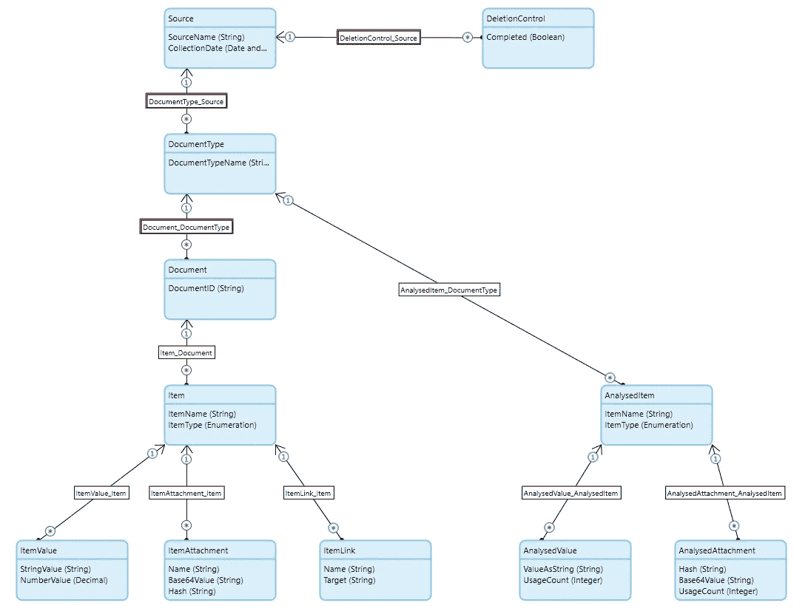

Domain Model with the un-needed auto deletion options removed

在做了这个改变后，像以前一样运行智能删除五次，产生了平均耗时 **10.0** 秒，相比之下 **29.4** 秒。所以我们现在已经将 **163** 秒的“常规”运行时间减少到了 **10** 秒。对我来说，这听起来像是一个胜利，但请注意，删除源将不再向下级联依赖关系，因此如果应用程序中有其他地方需要删除这些数据，那么您也需要设计一个解决方案。

## 概括起来

当明智地应用于适当的用例时，使用**任务队列**可以显著提高运行时间性能。在这种情况下，测试结果显示为用户节省了大量成本。

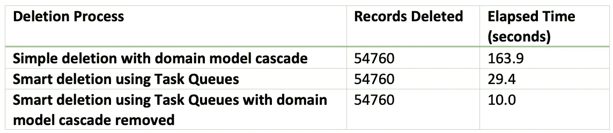

# 您的里程可能会有所不同

我可能不需要说这些，但是使用这种技术的好处(对于任何类型的过程，不仅仅是大的删除)将会有很大的不同，这取决于所进行的操作和域模型的复杂性、您的环境中有多少空闲资源，以及您希望您的模型有多复杂。我再次提到我在以前的博客中关于保持代码可读性和可维护性的评论。

此外，如果两个或更多用户同时删除源记录，队列资源将被共享，每个用户节省的资源可能会更少。

我在真实的生产环境中使用过类似的技术(在 Mendix 9 之前，所以它使用 ProcessQueue Marketplace 模块),并获得了令我惊讶和令产品所有者高兴的性能提升。所以一定要创建一个分支，试一试。

排队愉快！

## 阅读更多

 [## 任务排队

### 任务队列的概念和用法

docs.mendix.com](https://docs.mendix.com/refguide/task-queue/)  [## 进程队列

### 描述进程队列模块的配置和用法，该模块可在 Mendix 市场中获得。

docs.mendix.com](https://docs.mendix.com/appstore/modules/process-queue/) 

*来自发布者-*

*如果你喜欢这篇文章，你可以在我们的* [*中页*](https://medium.com/mendix) *找到更多喜欢的。对于精彩的视频和直播会话，您可以前往*[*MxLive*](https://www.mendix.com/live/)*或我们的社区*[*Youtube PAG*](https://www.youtube.com/c/MendixCommunity/community)*e .*

*希望入门的创客，可以注册一个* [*免费账号*](https://signup.mendix.com/link/signup/?source=direct) *，通过我们的* [*学苑*](https://academy.mendix.com/link/home) *获得即时学习。*

有兴趣加入我们的社区吗？加入我们的 [*松弛社区频道*](https://join.slack.com/t/mendixcommunity/shared_invite/zt-hwhwkcxu-~59ywyjqHlUHXmrw5heqpQ) *。*