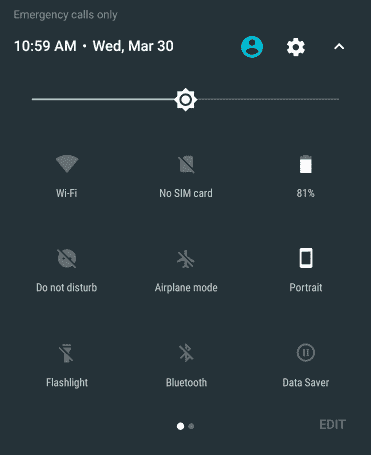
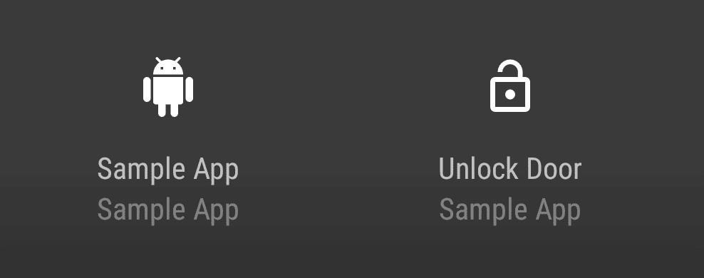

# Android 7.0 上的快速设置磁贴

> 原文：<https://medium.com/androiddevelopers/quick-settings-tiles-e3c22daf93a8?source=collection_archive---------1----------------------->

要求用户打开你的应用程序是 2008 年的 *so* 。自 Android 早期以来，小部件和通知就一直存在，以提供额外的表面来显示应用程序的重要控制和信息，即使应用程序没有打开。Android 7.0 (API 24)中的新功能，任何应用程序现在都可以创建一个**快速设置磁贴**，以便快速访问通知托盘上方可用的关键功能。

除了为你的应用程序提供最新的信息外，点击磁贴还可以触发后台工作，打开一个对话框，甚至打开一个活动。

# 什么是好的快速设置磁贴

在决定是否建立一个快速设置磁贴时，有两个主要的事情要记住:动作的**紧急度**和动作的**频率**。虽然很明显，最好的图块是高紧急性和高频率的图块，但是高紧急性但不是非常频繁的动作仍然可以被认为是有效的快速设置图块。由于不同用户的使用频率往往有很大差异(一个用户可能一天多次使用 Google Cast，另一个用户一周一次)，**在决定什么是好的快速设置磁贴时，优先考虑易用性的紧迫性和重要性**(包括信息和操作)。



由于快速设置磁贴是与应用程序交互的一种持久方式，因此请确保只要安装了应用程序，磁贴就一直有用。这意味着它们不适合一次性活动，如设置任务。

# 构建 TileService

每个图块都与一个 [***图块服务***](https://developer.android.com/reference/android/service/quicksettings/TileService.html?utm_campaign=adp_series_quicksettingstiles_092916&utm_source=medium&utm_medium=blog) 相关联，这是系统传达图块状态的方式，也是您向图块推送更新的方式。像任何服务一样，您必须在清单中声明它:

```
<service
  android:name=".AwesomeTileService"
  android:icon="@drawable/ic_tile_default"
  android:label="@string/tile_name"
  android:permission="android.permission.BIND_QUICK_SETTINGS_TILE">
  <intent-filter>
    <action
      android:name="android.service.quicksettings.action.QS_TILE"/>
  </intent-filter>
</service>
```

需要注意的一点是，**Android:icon 和 *android:label* 实际上是你的 *TileService*** 非常关键的部分。当用户选择将哪些图块添加到快速设置窗格时，将显示这些值。图标和标签都应该告诉用户磁贴的实际作用——复制你的应用程序图标和应用程序名称是一种快速获得用户的方法。



Guess which one of these is the good example. That’s right, the one with a representative icon and label

理想情况下，您选择的标签是短的(少于 18 个字符，否则会被截断)，图标是一个矢量可绘制的，在透明的背景上是纯白的(想象一下只有 alpha 通道是重要的)。请记住，您的磁贴只能在 API 24+设备上使用，因此这是避免向您的应用程序添加另一个 PNG 的最佳时机。

# 瓦工的生活

一个 *TileService* 是一个[绑定服务](https://developer.android.com/guide/components/bound-services.html?utm_campaign=adp_series_quicksettingstiles_092916&utm_source=medium&utm_medium=blog)，因此，它的生命周期主要由 Android 系统控制。一个 *TileService* 有三个阶段:被添加、监听和被删除。

当用户第一次将您的互动程序添加到他们的快速设置窗格时，系统和您的互动程序之间会发生第一次交互。此时，系统会绑定到你的*tileservice*并调用[*【ontleaded()*](https://developer.android.com/reference/android/service/quicksettings/TileService.html?utm_campaign=adp_series_quicksettingstiles_092916&utm_source=medium&utm_medium=blog#onTileAdded())。这是进行任何一次性初始化的合适位置。

添加您的互动程序后，任何时候您的互动程序变得可见，您都会收到对[*onStartListening()*](https://developer.android.com/reference/android/service/quicksettings/TileService.html?utm_campaign=adp_series_quicksettingstiles_092916&utm_source=medium&utm_medium=blog#onStartListening())的回调。在这一点上，你应该保持你的磁贴更新，注册任何你需要的监听器。你会希望继续这样做，直到你得到一个对[*onstolistening()*](https://developer.android.com/reference/android/service/quicksettings/TileService.html?utm_campaign=adp_series_quicksettingstiles_092916&utm_source=medium&utm_medium=blog#onStopListening())的回调——这表明你不再可见。

我希望你永远也不会看到的牌的最后阶段是当你的牌被移除时，你得到一个对[*onTileRemoved()*](https://developer.android.com/reference/android/service/quicksettings/TileService.html?utm_campaign=adp_series_quicksettingstiles_092916&utm_source=medium&utm_medium=blog#onTileRemoved())的回调。此时，你的应用程序应该停止任何与磁贴相关的操作，直到用户重新添加你的磁贴(也许只是一个错误？我们只能希望)。

需要注意的是，当用户不查看磁贴时，您的*磁贴服务*几乎肯定会被解除绑定(并被销毁)——不要假设您的服务在*onStartListening()*/*onstolistening()*方法对之外仍然有效。

# TileService 的~other~寿命:活动模式

默认模式是在磁贴可见时绑定到您的*磁贴服务*，但是如果您确切知道磁贴何时需要更新(比方说，它基于后台数据同步)，强烈考虑使用活动模式，您可以通过将[*META _ DATA _ ACTIVE _ TILE*](https://developer.android.com/reference/android/service/quicksettings/TileService.html?utm_campaign=adp_series_quicksettingstiles_092916&utm_source=medium&utm_medium=blog#META_DATA_ACTIVE_TILE)添加到您的清单条目来启用该模式:

```
<service
  android:name=".AwesomeActiveTileService"
  android:icon="@drawable/ic_tile_default"
  android:label="@string/tile_name"
  android:permission="android.permission.BIND_QUICK_SETTINGS_TILE">
  <intent-filter>
    <action
      android:name="android.service.quicksettings.action.QS_TILE"/>
  </intent-filter>
  **<meta-data
    android:name="android.service.quicksettings.ACTIVE_TILE"
    android:value="true" />** </service>
```

在活动模式下，您的 *TileService* 仍将被绑定到*ontileded()*和 *onTileRemoved()* (以及点击事件)。然而，唯一一次回调 *onStartListening()* 是在调用静态[*tileservice . requestlisteningstate()*](https://developer.android.com/reference/android/service/quicksettings/TileService.html?utm_campaign=adp_series_quicksettingstiles_092916&utm_source=medium&utm_medium=blog#requestListeningState(android.content.Context,%20android.content.ComponentName))方法之后。然后，在收到对*onstolistening()*的回调之前，您将能够更新您的磁贴一次。这使您能够在数据发生变化时(无论切片是否可见)轻松地一次性更新切片。

由于不需要在每次图块可见时绑定活动图块，因此**活动图块更有利于系统健康**。构建活动图块意味着每次快速设置面板变得可见时，系统需要绑定的进程更少。(当然，系统已经根据可用内存等限制了绑定的 TileService 的数量，但是到那时你已经接近了内存崩溃的边缘——这不是你想要的。)

# 更新您的磁贴

一旦你进入到 *onStartListening()* 和*onstolistening()*之间的区域，你就可以更新你的互动程序的用户界面了。每个 *TileService* 都有一个单独的 [*Tile*](https://developer.android.com/reference/android/service/quicksettings/Tile.html?utm_campaign=adp_series_quicksettingstiles_092916&utm_source=medium&utm_medium=blog) 代表你的 Tile 的 UI，可以通过调用 [*getQsTile()*](https://developer.android.com/reference/android/service/quicksettings/TileService.html?utm_campaign=adp_series_quicksettingstiles_092916&utm_source=medium&utm_medium=blog#getQsTile()) 来检索。

图块 UI 的主要组件是图标、标签和内容描述(用于辅助功能)。你会注意到图标使用了棉花糖中引入的 [*图标*](https://developer.android.com/reference/android/graphics/drawable/Icon.html?utm_campaign=adp_series_quicksettingstiles_092916&utm_source=medium&utm_medium=blog) 类。这允许你的图标通过静态的 *createWith* 方法从位图、内容 URI、字节数组、文件路径或资源中创建。

UI 的另一个组成部分是你的磁贴的状态。单幅图块可以处于以下三种状态之一:

*   [*STATE_ACTIVE*](https://developer.android.com/reference/android/service/quicksettings/Tile.html?utm_campaign=adp_series_quicksettingstiles_092916&utm_source=medium&utm_medium=blog#STATE_ACTIVE) 哪个是‘开’或‘使能’状态
*   [*STATE _ INACTIVE*](https://developer.android.com/reference/android/service/quicksettings/Tile.html?utm_campaign=adp_series_quicksettingstiles_092916&utm_source=medium&utm_medium=blog#STATE_INACTIVE)哪个是‘关’或者‘禁用’状态
*   [*STATE _ UNAVAILABLE*](https://developer.android.com/reference/android/service/quicksettings/Tile.html?utm_campaign=adp_series_quicksettingstiles_092916&utm_source=medium&utm_medium=blog#STATE_UNAVAILABLE)禁用您的图块的点击动作

根据您的磁贴所处的状态，您的磁贴图标将自动着色(确切的着色取决于制造商，但预计 *STATE_ACTIVE* 最突出， *STATE_INACTIVE* 不太突出， *STATE_UNAVAILABLE* 根本不突出)。

最重要的是:**你必须调用**[***update tile()***](https://developer.android.com/reference/android/service/quicksettings/Tile.html?utm_campaign=adp_series_quicksettingstiles_092916&utm_source=medium&utm_medium=blog#updateTile%28%29)**来更新你的磁贴。**这是提示系统解析更新后的*图块*中的所有数据并刷新 UI。

```
@Override
public void onStartListening() {
  Tile tile = getQsTile();
  tile.setIcon(Icon.createWithResource(this,
    R.drawable.ic_title_started));
  tile.setLabel(getString(R.string.tile_label));
  tile.setContentDescription(
    getString(R.string.tile_content_description);
  tile.setState(Tile.STATE_ACTIVE); tile.updateTile();
}
```

请记住，当设备安全锁定时，您的互动程序可以显示在锁定屏幕上方。如果您有敏感信息，请考虑检查 [*isSecure()*](https://developer.android.com/reference/android/service/quicksettings/TileService.html?utm_campaign=adp_series_quicksettingstiles_092916&utm_source=medium&utm_medium=blog#isSecure()) 的值，以确定设备是否安全。

# 处理点击

当然，除非你是一个不可用的磁贴，否则用户可以点击你的磁贴并触发一个动作。当您得到对 [*onClick()*](https://developer.android.com/reference/android/service/quicksettings/TileService.html?utm_campaign=adp_series_quicksettingstiles_092916&utm_source=medium&utm_medium=blog#onClick()) 的回调时，您有几个选项。最明显的一个是在后台做一些工作。只要记住 *onClick()* 将在 UI 线程上，所以你应该将任何繁重的工作转移到另一个线程(或者另一个服务——比如说一个[*intent Service*](https://developer.android.com/reference/android/app/IntentService.html?utm_campaign=adp_series_quicksettingstiles_092916&utm_source=medium&utm_medium=blog))。

但是，快速设置磁贴也有一些显示 UI 的机制。第一个是通过 [*showDialog()*](https://developer.android.com/reference/android/service/quicksettings/TileService.html?utm_campaign=adp_series_quicksettingstiles_092916&utm_source=medium&utm_medium=blog#showDialog(android.app.Dialog)) 让你的磁贴显示一个对话框。在一些情况下，对话框很有意义:

*   如果您的操作需要额外的输入(例如从一组选项中选择)
*   如果您的操作影响了另一台设备或器材，请确保用户知道他们将会更换其他设备
*   如果您的操作需要特定的用户同意(比如，在通过计量连接下载大型内容或上传用户尚未同意的数据之前)

基本上，**一个对话框是关于给你的动作**添加上下文的。你能做的最糟糕的事情就是给用户一个简单的搬起石头砸自己的脚的方法。

如果你记住快速设置磁贴的“关键+频繁”焦点，用[*startActivityAndCollapse()*](https://developer.android.com/reference/android/service/quicksettings/TileService.html?utm_campaign=adp_series_quicksettingstiles_092916&utm_source=medium&utm_medium=blog#startActivityAndCollapse(android.content.Intent))开始一个活动的能力可能看起来有点奇怪。如果你在每次用户点击磁贴的时候都这样做，它会非常有用，比如在对话框中响应“更多…”选项，或者如果你有一个独特的用户界面，特别是当设备被锁定时(记住:你有一个启动器图标，不要只是在你的磁贴被点击时才启动)。

**尽管如此，锁定设备还是有一些限制。当 [*isLocked()*](https://developer.android.com/reference/android/service/quicksettings/TileService.html?utm_campaign=adp_series_quicksettingstiles_092916&utm_source=medium&utm_medium=blog#isLocked()) 返回 true 时，您将无法显示对话框，活动必须设置[*FLAG _ SHOW _ WHEN _ LOCKED*](https://developer.android.com/reference/android/view/WindowManager.LayoutParams.html?utm_campaign=adp_series_quicksettingstiles_092916&utm_source=medium&utm_medium=blog#FLAG_SHOW_WHEN_LOCKED)以显示在锁定屏幕上方。[*unlockAndRun()*](https://developer.android.com/reference/android/service/quicksettings/TileService.html?utm_campaign=adp_series_quicksettingstiles_092916&utm_source=medium&utm_medium=blog#unlockAndRun(java.lang.Runnable))方法可用于提示用户解锁他们的设备，允许您仅在他们解锁设备后运行代码(如显示对话框)。**

> **注意:**你会注意到一些系统磁贴有一个额外的用户界面，用自定义的用户界面替换了整个快速设置面板。遗憾的是，这不适用于第三方互动程序。

默认情况下，长时间点击快速设置磁贴会进入应用程序的“应用程序信息”屏幕。您可以通过使用[*ACTION _ QS _ TILE _ PREFERENCES*](https://developer.android.com/reference/android/service/quicksettings/TileService.html?utm_campaign=adp_series_quicksettingstiles_092916&utm_source=medium&utm_medium=blog#ACTION_QS_TILE_PREFERENCES)将 *<意图过滤器>* 添加到您的一个活动中来覆盖该行为。

# 触手可及的便利

快速设置磁贴为您提供了一个全新的界面来与用户互动，并允许您最热心的用户快速访问您应用程序中的关键和频繁操作。一定要在开发过程中留出一些额外的时间，让你的快速设置磁贴在几天内真正发挥作用:确保它在应用程序的整个生命周期中继续保持有用和直观。

# BuildBetterApps

关注 [Android 开发模式集合](https://plus.google.com/collection/sLR0p?utm_campaign=adp_series_quicksettingstiles_092916&utm_source=medium&utm_medium=blog)了解更多！

