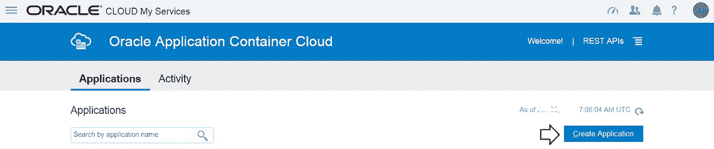

# Quickie:在 Oracle 云上部署 Go web 应用程序

> 原文：<https://medium.com/oracledevs/quick-start-deploy-a-go-web-app-on-oracle-cloud-cf0ef6a8276a?source=collection_archive---------0----------------------->

这里有一个(真的很快！)快速入门使用非常简单的 [Golang](https://golang.org) web 应用程序(使用 [Beego 框架](https://beego.me/))使用 [Oracle 应用程序容器云](https://cloud.oracle.com/application-container-cloud)

> 您还可以查看以前的博客，了解 Golang 在 Oracle 应用程序容器云上使用 Event Hub (Kafka)和 MySQL cloud 的情况

[](/oracledevs/go-with-kafka-mysql-on-oracle-cloud-9c93e71167c2) [## 在 Oracle 云上使用 Kafka 和 MySQL

medium.com](/oracledevs/go-with-kafka-mysql-on-oracle-cloud-9c93e71167c2) 

# 事实真相…

> 以下是 Github 上的代码

[](https://github.com/abhirockzz/accs-golang-beego-quickstart.git) [## abhirockzz/accs-golang-beego-quick start

### 在 GitHub 上创建一个帐户，为 accs-golang-beego-quickstart 开发做贡献。

github.com](https://github.com/abhirockzz/accs-golang-beego-quickstart.git) 

老实说，就代码而言，几乎没有什么可说的..我们所做的就是使用 *bee 工具*创建一个*新的 Beego* 项目，然后*运行*它——所有的繁重工作都在启动脚本中完成！

## start.sh

```
go get github.com/astaxie/beego
echo "got beego"go get github.com/beego/bee
echo "bee tool installed"bee new accsbeego
echo "new project bootstrapped!"cd src/accsbeego
sed -i -e ‘s/8080/$PORT/g’ conf/app.conf
echo "updated conf to pick up PORT from container"bee run
```

*   `beego` 和`bee tool`依赖关系被拉出
*   引导一个新的 beego 项目(使用`bee new`
*   修改(自动生成)`**app.conf**`文件，将`8080` 替换为`**$PORT**`(使用`sed` 命令)

```
appname = accsbeego
**httpport = $PORT** //defaulted to **8080** before modification
runmode = dev
```

## 部署. json

```
{
 "memory": "1G",
 "instances": 1,
 "environment": {
 "GOPATH”: "$GOPATH:$APP_HOME",
 "PATH": "$PATH:$GOPATH/bin"
 }
}
```

我们确保

*   我们将`GOPATH`指向应用容器云用来存储工件的位置，即由`**APP_HOME**`环境变量引用的位置
*   我们调整`PATH`来包含之前安装的`bee tool`
*   ..以及`topology` ——在本例中，它有 1 个实例，内存为 1 GB

## manifest.json

我们只需调用我们的**启动**脚本并指定 Golang 版本(在本例中为`1.8.3`)

```
{
 "runtime": {
 "majorVersion": "1.8.3"
 },
 **"command": "sh start.sh",**
 "notes": "ACCS Beego quickstart"
}
```

# 部署到云

## 开始之前…

*   `git clone [https://github.com/abhirockzz/accs-golang-beego-quickstart.git](https://github.com/abhirockzz/accs-golang-beego-quickstart.git)`
*   创建一个包含`start.sh`和`manifest.json`的 zip 文件


**Zip** file — the deployment artifact

借助 Oracle Application Container Cloud，您在部署应用程序方面有多种选择。这篇博客将展示控制台和 [**PSM CLI**](https://docs.oracle.com/en/cloud/paas/java-cloud/pscli/abouit-paas-service-manager-command-line-interface.html) (这是一个用于管理 Oracle 云服务的强大命令行界面)

> *其他部署选项包括*[*REST API*](https://docs.oracle.com/en/cloud/paas/app-container-cloud/apcsr/index.html)*[*Oracle 开发者云*](https://docs.oracle.com/en/cloud/paas/developer-cloud/csdcs/deploying-application-oracle-developer-cloud-service.html#GUID-6FE6D850-65DC-471D-A249-F7CCA9CAB56F)*

## *使用控制台*

*导航到 Oracle 应用容器云中的主页，然后单击**创建应用**开始*

**

*Landing page*

*选择运行时间— **转到***

**

***Go** runtime*

*提供详细信息*

*   *应用名称*
*   *上传**存档** (zip)文件和 **deployment.json***

**

*App details*

*点击**创建***

**

***Create** to start*

## *使用 PaaS 服务管理器 CLI*

*在您的机器上下载并设置 PSM CLI(使用`psm setup` ) — [详细信息请点击](https://docs.oracle.com/en/cloud/paas/java-cloud/pscli/using-command-line-interface-1.html)*

***部署应用** — `psm accs **push** -n ACCSGoBeegoSample -r **golang -e dockerhub** -s hourly -d **deployment.json** -p accs-beego.zip`*

*注意到*

*   *我们引用 zip 文件(使用`-p`和部署描述符(`-d`)*
*   *包括运行时名称(`-r golang`)和它来源于 Docker Hub(带有`-e dockerhub`)的事实*

*就这样——应该开始创建应用程序了！*

**

***Golang web app** on Oracle Application Container Cloud*

*..部署完成后，您可以看到它的详细信息*

**

*Successfully deployed*

# *查看您的应用程序*

*点击应用程序的网址，它应该会带你到应用程序的主页*

**

*好吧，这并不是突破性的，但看看好的一面——您现在有了一个运行在 Oracle 应用容器云上的 Golang web 应用程序！*

# *不要忘记…*

*   *查看 Oracle Application Container Cloud 教程—每个运行时都有适合的内容！*

 *[## Oracle 应用容器云服务—创建您的第一批应用

### Oracle 应用容器云服务教程。学习创建你的第一个应用程序。

docs.oracle.com](https://docs.oracle.com/en/cloud/paas/app-container-cloud/create-first-applications.html)* 

*   *关于应用容器云的其他博客*

*[](/tag/app-container-cloud/latest) [## 关于应用容器云的最新故事和新闻—中型

### 阅读关于应用容器云的最新文章。每天，成千上万的声音阅读、书写和分享重要的…

medium.com](/tag/app-container-cloud/latest) 

干杯！

> 本文表达的观点是我个人的观点，不一定代表甲骨文的观点。*