# 快速入门:在 Oracle 云上开发和部署. NET 核心应用

> 原文：<https://medium.com/oracledevs/quick-start-develop-deploy-a-net-core-app-on-oracle-cloud-aca69158c592?source=collection_archive---------0----------------------->

[Oracle 应用容器云](https://cloud.oracle.com/application-container-cloud)的运行时间仍在继续..而最新加入的是[微软。网芯](https://www.microsoft.com/net/)！这使得它成为第四个直接来源于[*docker hub*](https://hub.docker.com/r/microsoft/dotnet/)*的运行时(除了 Python、Ruby 和 Go 之外)*

*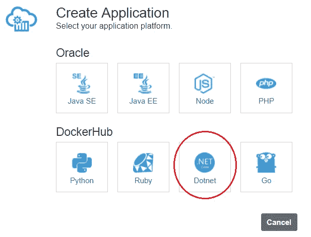*

*Hello .NET Core !*

*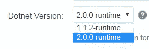*

*currently supported versions*

*这个博客是一个**入门指南**来构建和部署一个. NET 核心应用到 Oracle 应用容器云。这是一个简单的应用程序，使用现有的引导。网芯[反应](https://reactjs.org/)模板*

> **对了，我们介绍过*[*Golang*](http://golang.org)*不久前支持**

* [## 在 Oracle 云上使用 Kafka 和 MySQL

medium.com](/oracledevs/go-with-kafka-mysql-on-oracle-cloud-9c93e71167c2)* 

# *让我们开始吧…*

*从安装**开始。NET Core SDK***

* [## 。净下载量

### 构建和运行的免费下载。NET 应用程序。的下载。网芯，。网络…

www.microsoft.com](https://www.microsoft.com/net/download/windows) 

引导一个项目——因为我是一个 UI noob，所以 *react* 模板是一个神送！让我们用它来快速搭建一个项目

`dotnet new **react** -n DotnetCoreOnAppContainerCloud`

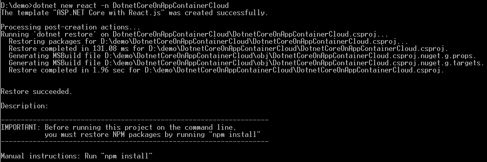

New ‘dotnet’ project

移动到新创建的应用程序目录—您应该会看到项目内容

`cd DotnetCoreOnAppContainerCloud`

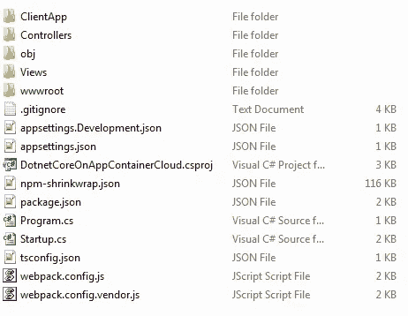

the stage is set

编辑`Program.cs`文件，将其添加到**第 23 行** — `.UseUrls("http://0.0.0.0:"+ Environment.GetEnvironmentVariable("PORT"))`

> *这是为了确保 HTTP 服务器在部署到 Oracle 应用程序容器云*后绑定到 `*$PORT*` *环境变量*

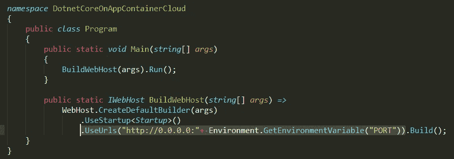

tweak the code

要获取各自的依赖关系，请执行以下命令

*   `npm install`
*   `dotnet restore`

然后

*   构建项目— `dotnet build`

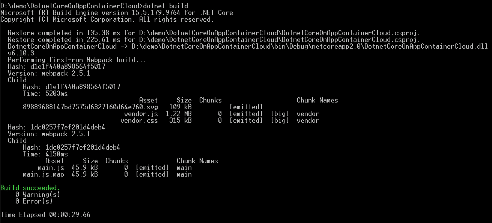

*   然后为 Linux 平台创建一个二进制文件`dotnet publish -c Release -r linux-x64`——这将在`bin\Release\netcoreapp2.0\linux-x64`中创建`publish`目录

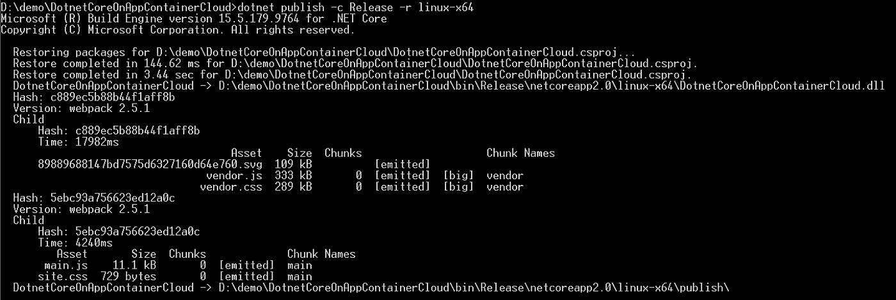

‘dotnet build’ process

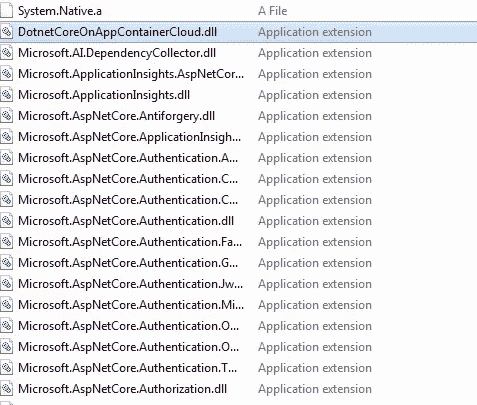

(some of) the contents of the ‘publish’ directory

压缩`publish` 目录的内容，例如`accs-dotnetcore-sample.zip`

# 创建部署元数据文件

> *这些描述符/元数据文件将在部署步骤(接下来的步骤)中被引用*

从`manifest.json`开始，在这里指定`version` 和应用程序引导/启动`command`

`{
"runtime":{
"majorVersion":"**2.0.0-runtime"**
},
"command": "**dotnet** **DotnetCoreOnAppContainerCloud.dll"**
}`

和指定`topology` 的`deployment.json`——在本例中，它有 1 个 1 GB 内存的实例

`{
"memory":"1G",
"instances":1
}`

# 推至云

借助 Oracle Application Container Cloud，您在部署应用程序方面有多种选择。本博客将利用 **PSM CLI** ，这是一个用于管理 Oracle 云服务的强大命令行界面

> *其他部署选项包括*[*REST API*](https://docs.oracle.com/en/cloud/paas/app-container-cloud/apcsr/index.html)*[*Oracle 开发者云*](https://docs.oracle.com/en/cloud/paas/developer-cloud/csdcs/deploying-application-oracle-developer-cloud-service.html#GUID-6FE6D850-65DC-471D-A249-F7CCA9CAB56F) *当然还有* [*控制台/UI*](https://docs.oracle.com/en/cloud/paas/app-container-cloud/csjse/creating-application.html)*

*   *在您的机器上下载并设置 PSM CLI(使用`psm setup` ) — [详细信息请点击](https://docs.oracle.com/en/cloud/paas/java-cloud/pscli/using-command-line-interface-1.html)*
*   *部署应用程序— `psm accs **push** -n DotnetCoreReactApp -r **dotnet -e dockerhub** -s hourly -m **manifest.json** -d **deployment.json** -p bin\Release\netcoreapp2.0\linux-x64\publish\accs-dotnetcore-sample.zip`*

*注意到*

*   *我们引用 zip 文件(使用`-p`)和部署描述符(`-m`和`-d`)*
*   *包括运行时名称(`-r dotnet`)和它来源于 Docker Hub(带有`-e dockerhub`)的事实*

*就这样——应该开始创建应用程序了*

*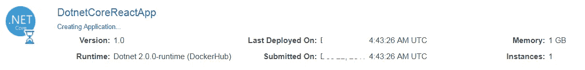*

*.NET Core app on Oracle Application Container Cloud*

*..部署完成后，您可以看到它的详细信息*

*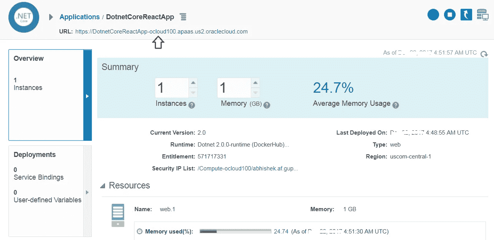*

*application details** 

# **查看您的应用程序**

**点击应用程序 URL(上面突出显示的),它会将您带到应用程序主页**

**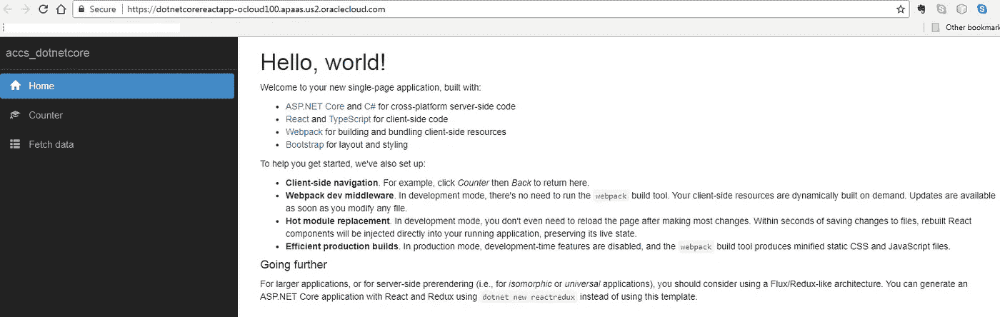**

**Up and running !**

**这并不难！你现在有一个**。基于 NET Core** 的应用运行在 Oracle 应用容器云上**

# **不要忘记…**

*   **查看 Oracle Application Container Cloud 教程—每个运行时都有适合的内容！**

 **[## Oracle 应用容器云服务—创建您的第一批应用

### Oracle 应用容器云服务教程。学习创建你的第一个应用程序。

docs.oracle.com](https://docs.oracle.com/en/cloud/paas/app-container-cloud/create-first-applications.html)** 

*   **关于应用容器云的其他博客**

** [## 关于应用容器云的最新故事和新闻—中型

### 阅读关于应用容器云的最新文章。每天，成千上万的声音阅读、书写和分享重要的…

medium.com](/tag/app-container-cloud/latest) 

干杯！

> 本文表达的观点是我个人的观点，不一定代表甲骨文的观点。**