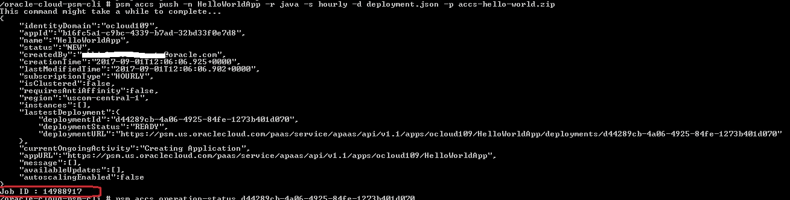
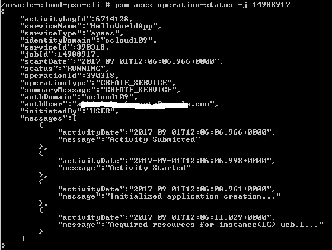
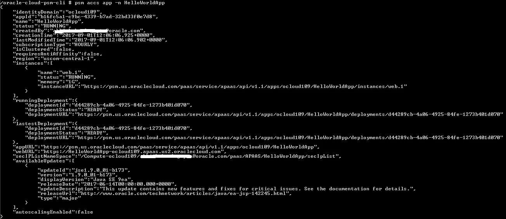
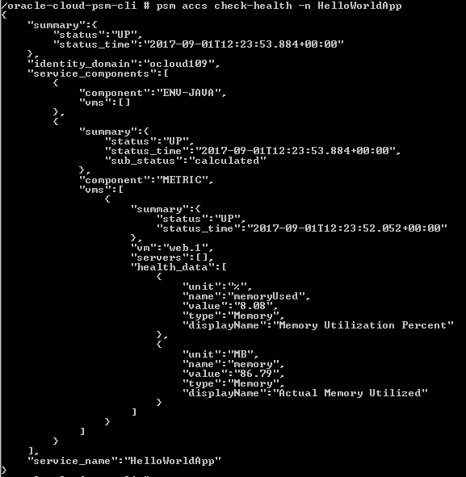
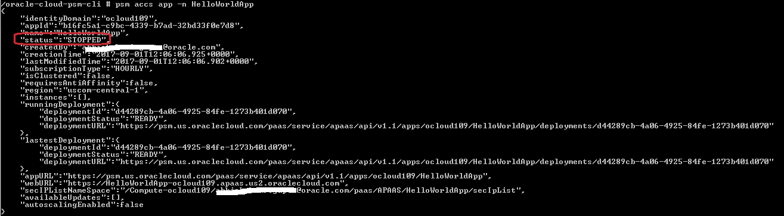
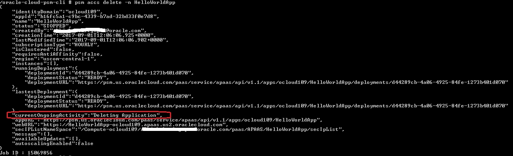

# 使用 Docker 上的 PaaS Service Manager CLI 将您的应用部署到 Oracle 云

> 原文：<https://medium.com/oracledevs/quick-start-docker-ized-paas-service-manager-cli-f54eaf4ebcc7?source=collection_archive---------1----------------------->

本博客将带您快速浏览 Oracle [PaaS 服务管理器命令行界面](https://docs.oracle.com/en/cloud/paas/java-cloud/pscli/toc.htm)(简称 **PSM CLI** )，它提供命令行界面(CLI)来管理各种服务的生命周期(例如 Oracle 应用容器云、Oracle 大数据云计算版、Oracle Java 云、Oracle 事件中心云等)。)在 Oracle 公共云中

具体来说，我们将探讨针对 [Oracle 应用容器云](https://cloud.oracle.com/en_US/application-container-cloud) (ACCS)的 PSM CLI 功能(对于所有 PSM ACCS 命令，[请参考文档](https://docs.oracle.com/en/cloud/paas/java-cloud/pscli/accs-commands.html))

*   我们将首先将 PSM CLI 与我们的应用程序对接，一旦我们的对接容器准备就绪，
*   执行各种生命周期活动—部署、检查运行状况、停止、删除等。

> [这里有一篇博客](/oracledevs/creating-an-oracle-cloud-infrastructure-cli-toolkit-docker-image-35be0ca71aa)，它是这篇文章的灵感/触发点！

# Dockerfile 文件概述

这是 Dockerfile 文件以及正在发生的事情的摘要…

```
#1
FROM **python:3.6.2-alpine3.6**#2
ARG **USERNAME**
ARG **PASSWORD**
ARG **IDENTITY_DOMAIN**
ARG **PSM_USERNAME**
ARG **PSM_PASSWORD**
ARG **PSM_REGION**
ARG **PSM_OUTPUT**#3
WORKDIR “/oracle-cloud-psm-cli/”#4
RUN apk add --update curl && \
 rm -rf /var/cache/apk/*#5
RUN curl -X GET -u $**USERNAME**:$**PASSWORD** -H X-ID-TENANT-NAME:$**IDENTITY_DOMAIN** [https://psm.us.oraclecloud.com/paas/core/api/v1.1/cli/$**IDENTITY_DOMAIN**/client](https://psm.us.oraclecloud.com/paas/core/api/v1.1/cli/$IDENTITY_DOMAIN/client) -o psmcli.zip#6
RUN pip3 install -U psmcli.zip#7
RUN echo -e “$**PSM_USERNAME**\n$**PSM_PASSWORD**\n$**PSM_PASSWORD**\n$**IDENTITY_DOMAIN**\n$**PSM_REGION**\n$**PSM_OUTPUT**” | psm setup#8
COPY accs-hello-world/target/accs-hello-world.zip .
COPY accs-hello-world/deployment.json .#9
CMD [“/bin/sh”]
```

1.  base[Docker Python image](https://hub.docker.com/r/library/python/)—[PaaS CLI 需要 Python](https://docs.oracle.com/en/cloud/paas/java-cloud/pscli/performing-prerequisite-tasks-command-line-interface-1.html)
2.  声明参数(稍后将在`docker build`中使用)
3.  设置工作目录
4.  安装`cURL`
5.  下载 PSM CLI ( [使用 REST API](https://docs.oracle.com/en/cloud/paas/java-cloud/pscli/downloading-cli-using-rest-api.html) )
6.  安装 Python 包
7.  [自举](https://docs.oracle.com/en/cloud/paas/java-cloud/pscli/configuring-command-line-interface-1.html) PSM
8.  包括示例应用程序(zip)和`deployment.json`
9.  指定 Docker 容器启动时要执行的默认命令

# 让我们开始吧…

此处提供了[应用程序..为了开始，](https://github.com/abhirockzz/accs-psm-cli-docker)

## 克隆 git 存储库

`git clone [https://github.com/abhirockzz/accs-psm-cli-docker.git](https://github.com/abhirockzz/accs-psm-cli-docker.git)`

## 构建应用程序

`mvn clean install` 将使用`accs-hello-world.zip`创建一个目标目录——这是将被推送到云的工件

## 构建 Docker 映像

```
docker build --build-arg **USERNAME**=”foo@bar.com” --build-arg **PASSWORD**=”foobared" --build-arg **IDENTITY_DOMAIN**=”foodomain" --build-arg **PSM_USERNAME**=”foo@bar.com” --build-arg **PSM_PASSWORD**=”foobared" --build-arg **PSM_REGION**=”us” --build-arg **PSM_OUTPUT**=”json” -t psm-cli .
```

执行`docker images` —您应该会在图像列表中看到`psm-cli`

## 启动 Docker 容器

`docker run --rm -it psm-cli` —你将降落在贝壳里..现在是时候执行我们的命令了

## 健全性检查

`psm --version`

*响应* : `PSM CLI Client — version 1.1.16`

## 将应用部署到 Oracle 应用容器云

```
psm accs **push** -n HelloWorldApp -r java -s hourly -d deployment.json -p accs-hello-world.zip
```



## 检查(部署)作业状态

我们将使用由**推送**操作返回的*任务 ID* (上面高亮显示)

`psm accs **operation-status** -j 14988917`



## 申请信息

`psm accs **app** -n HelloWorldApp`



## 访问应用程序 URL

示例应用程序使用一个简单的基于 [JDK 的](https://github.com/abhirockzz/accs-psm-cli-docker/blob/master/accs-hello-world/src/main/java/com/oracle/cloud/accs/helloworld/Bootstrap.java#L18)

`curl [https://helloworldapp-<identity-domain>.apaas.us2.oraclecloud.com/](https://helloworldapp-ocloud109.apaas.us2.oraclecloud.com/)`将返回类似`Hello @ Fri Sep 01 13:37:39 UTC 2017 from 10.199.34.135`的内容

## 健康检查

`psm accs check-health -n HelloWorldApp`



## 停止应用程序

`psm accs stop -n HelloWorldApp` —流程将被触发

使用作业 ID(与之前相同)进行跟踪，并在一段时间后使用`psm accs app -n HelloWorldApp`检查状态



## 删除应用程序

`psm accs delete -n HelloWorldApp` —使用作业 ID 跟踪进度



那都是乡亲们！

# 不要忘记…

*   查看 Oracle 应用容器云的[教程—每个运行时都有一些内容！](https://docs.oracle.com/en/cloud/paas/app-container-cloud/create-first-applications.html)
*   [其他关于应用容器云的博客](http://bit.ly/2gR3nrV)

> *本文所表达的观点是我个人的观点，不一定代表甲骨文的观点。*