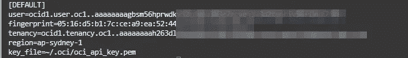

# Oracle 云外壳快速入门

> 原文：<https://medium.com/oracledevs/quick-start-with-the-oracle-cloud-shell-82cc2d78d381?source=collection_archive---------0----------------------->


您已经有了 Oracle Cloud 帐户，接下来要做的事情是运行 Oracle Github 存储库中的一些官方示例。然而，Github 中的许多例子仍然需要您正确地配置您的租用。

[](https://github.com/oracle-quickstart) [## Oracle 快速入门

### OCI 上企业软件的自动部署。此时您不能执行该操作。您登录时使用了…

github.com](https://github.com/oracle-quickstart) 

幸运的是，Oracle 在一个过程中详细介绍了为您的工作站安装和配置的先决条件。

[](https://github.com/oracle-quickstart/oci-prerequisites) [## GitHub-Oracle-quick start/OCI-先决条件:让您的环境做好部署准备的说明…

### 本自述文件介绍了设置您的环境的步骤，以便它可以运行 Oracle 云基础架构(OCI)快速入门…

github.com](https://github.com/oracle-quickstart/oci-prerequisites) 

出于评估的目的，您可能希望尽量减少安装和配置的数量。使用的理想工具是原生 Oracle 云 Shell。

在本文中，我将介绍您需要在 Oracle Cloud Shell 中做些什么，为您运行一些官方示例做准备。

## 将（行星）地球化（以适合人类居住）

由于我们使用的是 Oracle Cloud Shell，因此已经为您预装了最新版本的 Terraform。

```
terraform -v
```


您可能会收到一条警告，提示您有更高版本的 Terraform 可用，但没有必要使用最新版本。

OCI 平台提供商也会为您提供服务。

这里没什么可做的了！

## 为 SSH 和 API 设置密钥

通过命令行创建 SSH 密钥对和 API 密钥对非常容易。

*注意:广泛建议 RSA 使用至少 2048 位的密钥。*

```
# create an SSH key
ssh-keygen -t rsa -N "" -b 2048 -f ~/.ssh/oci

# create an API key
mkdir ~/.oci
openssl genrsa -out ~/.oci/oci_api_key.pem 2048
openssl rsa -pubout -in ~/.oci/oci_api_key.pem -out ~/.oci/oci_api_key_public.pem
```

SSH 密钥将用于登录服务器，默认情况下位于~/中。ssh 目录。

API 密钥将在~/中创建。oci 目录。这些密钥将被命名为 oci_api_key.pem 和 oci_api_key_public.pem。

## 创建指纹文件

创建公钥的指纹。ie ~/。oci/oci_api_key_public.pem

```
openssl rsa -pubout -outform DER -in ~/.oci/oci_api_key.pem
```

从 oci_api_key.pem 文件中，识别指纹并将其复制到名为~/的文件中。oci/oci_api_key.fingerprint

```
vim ~/.oci/oci_api_key.fingerprint
```

另外，打开浏览器，导航到身份，然后导航到用户，然后导航到用户详细信息。在 API 密钥下，添加一个 API 密钥。


从文件~/中复制并粘贴公钥。oci/oci_api_key_public.pem，进入控制台。

然后，您将得到指示，将显示的文本添加到~/中。oci/config 文件。


将内容复制并粘贴到~/中。oci/config 文件。然后，在关闭配置文件之前，您需要编辑 key_file 参数来引用私钥:

```
key_file=~/.oci/oci_api_key.pem
```

因此，您的配置文件将如下所示:



~/。oci 目录将显示这些文件:


控制台会显示 API 键，如下所示:


## 为 Terraform 设置环境变量

下载名为 env-vars.sh 的模板。

```
curl -o ~/env-vars.sh https://raw.githubusercontent.com/oracle-quickstart/oci-prerequisites/master/env-vars.sh
```

现在编辑 env-vars 文件，并更正以下引用以匹配您的租用:

*   TF_VAR_compartment_ocid
*   TF_VAR_tenancy_ocid
*   TF_VAR_user_ocid
*   TF _ VAR _ 指纹

所有信息都来自控制台。

现在快速检查一下，确保所有的环境变量都是正确的。

```
source ~/env-vars.sh
env | grep TF
```


您已经准备好运行示例了！

想谈谈吗？加入我们的[甲骨文开发者大会](https://bit.ly/odevrel_slack):)

*Paul Guerin 出席了一些世界领先的甲骨文会议，包括甲骨文 2013 年世界开放大会。自 2015 年以来，他的工作一直是 IOUG 最佳实践技巧小册子以及 AUSOUG、Oracle Technology Network、Quest 和 Oracle Developers (Medium)出版物的主题。2019 年，他被授予 My Oracle 支持社区最有价值贡献者。他将继续参与 Oracle ACE 计划。*