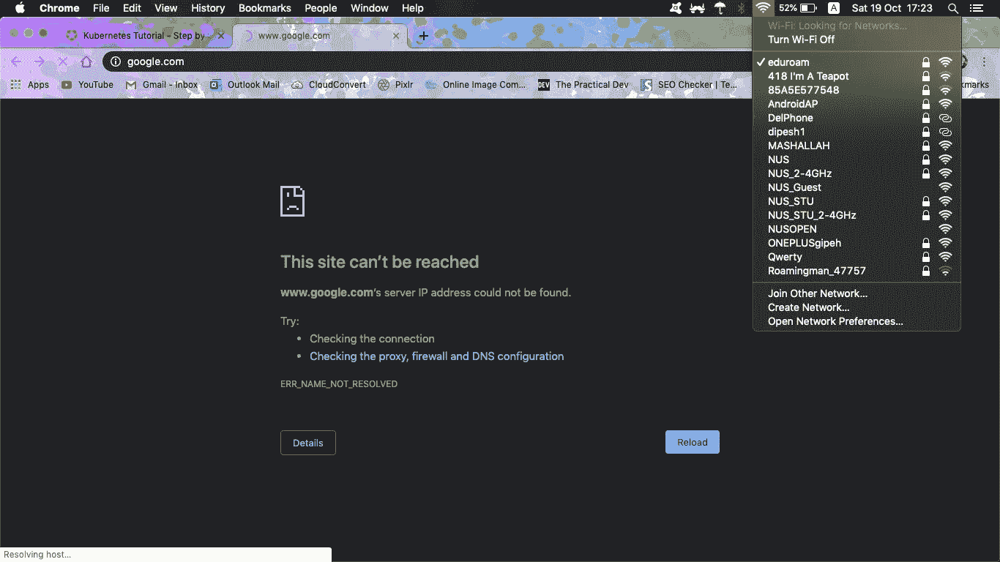

# 基于终端的快速 DNS 切换

> 原文：<https://medium.easyread.co/quick-terminal-based-dns-switching-4ffa407dfd38?source=collection_archive---------7----------------------->

## 切换 DNS 服务器设置以解决域名服务器阻塞和企业代理的快速指南


# 动机

我们中的大多数人，在生活中的某个时候，都至少为我们的计算机使用过定制的 DNS 服务器配置。无论是为了避免审查，更快的浏览，安全，还是绕过内容限制，我们都尝试过将我们的 DNS 服务器设置为一些公共 DNS 服务器，如谷歌的服务器(还记得 8.8.8.8 和 8.8.4.4 吗？).我自己也不例外，因为我一直使用[1.1.1.1](https://1.1.1.1/dns/)的隐私和速度。不幸的是，拥有定制的 DNS 域名服务器也会给那些在不同地方一直使用他们的电脑的人带来一些挫折。对于定制的 DNS 服务器，这就是你在试图阻止它们(连同 VPN 服务等)的网络上得到的结果。)



自定义 DNS 服务器的另一个问题是，网络登录页面不会显示，因为默认 DNS 没有用于将我们重定向到本地网络登录页面。当然，删除配置会很容易，因为您(很可能)是设置它们的人，删除会有多难呢？但是如果我们再次需要这些备用 DNS 服务器呢？我个人觉得这种手动删除和添加它们的方式太麻烦了。因此，我将它们包装在一个 bash 函数中，该函数像所有懒惰的程序员一样为我完成这项工作。

# 1.1.1.1

在开始解释我在下一部分做了什么之前，我想对这个令人敬畏的项目大声欢呼，它是来自 [Cloudflare](https://www.cloudflare.com/) 和[APNIC](https://www.apnic.net/)—[1.1.1.1](https://1.1.1.1/dns/)的联合努力。这是一项为互联网用户提供更快更安全的 DNS 的努力(它比谷歌公共 DNS 快两倍多🚀🚀🚀).但不仅仅如此，它还是一个隐私优先的 DNS 服务器。你认为只有像谷歌、脸书这样的公司会试图追踪你所有的在线活动吗(这些活动可以被令人敬畏的隐私卫士屏蔽掉)？你的 ISP 也会窃听你正在访问的任何网站，并出售这些数据以向你投放广告，你猜怎么着，他们是通过 DNS 解析器做到这一点的！

1.1.1.1 以 0 美元的价格(是的，你没看错)保护你免受所有这些伤害。一个尊重你隐私的免费、快速、安全的 DNS 服务器——听起来好得令人难以置信，不是吗？但这是为了建设一个更好的互联网而做出的努力。你不必相信我的话，可以在 [Cloudflare 的](https://blog.cloudflare.com/announcing-1111/)和 [APNIC 的](https://labs.apnic.net/?p=1127)博客上了解更多。

# 通过 bash 切换 DNS 名称服务器

正如我之前提到的，每当我在学校和家里的网络之间来回切换时，通过网络设置 UI 手动更新 DNS 配置对我来说太麻烦了。很自然，我会试着通过我的终端弄清楚怎么做。就在那时，我发现了 macOS 内置的这个非常棒的工具。使用`networksetup`，更改我的 DNS 配置非常简单

```
# Adding 1.1.1.1 to my nameservers
networksetup -setdnsservers Wi-Fi 1.1.1.1
# Clear all my alternate nameservers
networksetup -setdnsservers Wi-Fi empty
```

现在，我可以通过以下方式轻松地将我的 DNS 解析器配置为与 1.1.1.1 的说明相同

```
# 4 nameservers - 2 IPv4 & 2 IPv6
networksetup -setdnsservers Wi-Fi 1.1.1.1 1.0.0.1 2606:4700:4700::1111 2606:4700:4700::1001
```

但是这也是相当长的输入时间，尽管我更喜欢这个而不是网络偏好用户界面。因此，我将它封装在一个 bash 函数中，达到了另一种程度的懒惰

```
function dns1111() {
    networksetup -setdnsservers Wi-Fi 1.1.1.1 1.0.0.1 2606:4700:4700::1111 2606:4700:4700::1001
}
```

这看起来很简洁，也很有效，但是请稍等。换回空的怎么样？这个 bash 函数的一个标志/参数可以很好地完成这项工作，但是我想尽可能地使用最少的努力，并节省自己记住备用 DNS 配置是否为空的精神负担。所以我对自己说:“为什么不检测当前状态并基于此切换 DNS 配置呢？就像一个文字开关按钮——你不需要告诉它你想要它是什么状态，只是与之前的状态相反。考虑到这一点，我为`networksetup`找到了这个选项，它会告诉我当前的状态

```
networksetup -getdnsservers Wi-Fi
```

它会列出我所有的备用 DNS 服务器，或者如果没有的话，打印出这个字符串`There aren't any DNS Servers set on Wi-Fi`。现在我可以完成我的功能了，用一些很酷的表情符号来表示配置是刚刚被应用还是被删除

```
function dns1111() {
  if [[ $(networksetup -getdnsservers Wi-Fi) == "There aren't any DNS Servers set on Wi-Fi"* ]]; then
    networksetup -setdnsservers Wi-Fi 1.1.1.1 1.0.0.1 2606:4700:4700::1111 2606:4700:4700::1001 && echo 🚀 🚀 🚀
  else
    networksetup -setdnsservers Wi-Fi empty && echo 🚦 🚦 🚦
  fi
}
```

现在我可以很容易地在 1.1.1.1 和默认 DNS 配置之间来回切换，只需一个简短的命令`dns1111`

# 额外收获:基于 Linux 的机器

由于`networksetup`在基于 Linux 的操作系统上不可用，我们需要使用一个不同的包来帮助处理名为`dnsmasq`的 DNS 名称服务器。

使用发行版的软件包管理器安装它

```
# this is for Ubuntu
sudo apt-get install dnsmasq
```

安装包将附带一个配置文件`/etc/dnsmasq.conf`，以便我们更新名称服务器。我在下面包含了我的实现。如果你有更好的方法，请不要犹豫，通过[hung.ngn.the@gmail.com](mailto:hung.ngn.the@gmail.com)联系我

```
function dns1111() {
  # detect existence of the backup file to see whether the config is in place
  if [ -e /etc/dnsmasq.conf.bak ]]; then
    sudo mv /etc/dnsmasq.conf.bak /etc/dnsmasq.conf && echo 🚦 🚦 🚦
  else
    sudo cp /etc/dnsmasq.conf /etc/dnsmasq.conf.bak && \
    sudo echo "server=1.1.1.1
server=1.0.0.1
server=2606:4700:4700::1111
server=2606:4700:4700::1001" >> /etc/dnsmasq.conf && \
    sudo service dnsmasq restart && \
    sudo service network-manager restart && \
    echo 🚀 🚀 🚀
  fi
}
```

这篇文章最初发表在[the decodous](https://thecodecousins.com/posts/dns-command/)上。