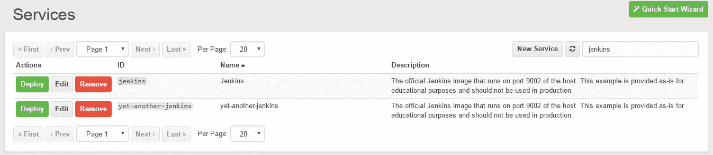
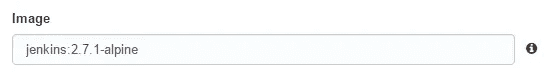
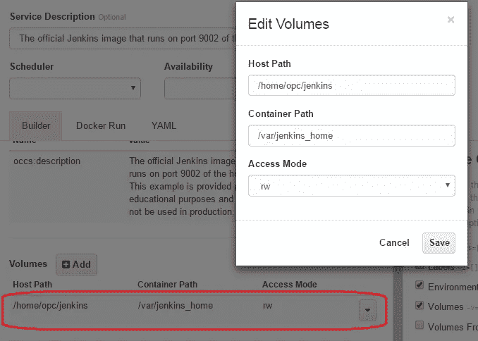
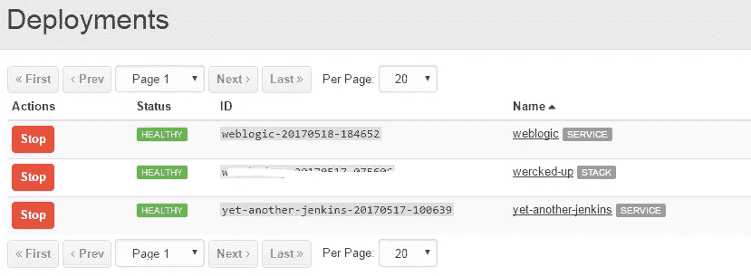
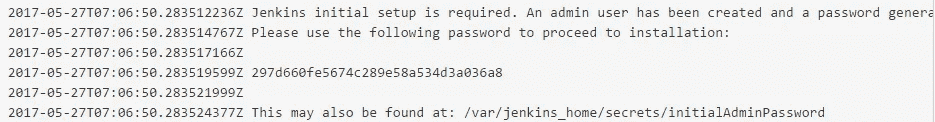
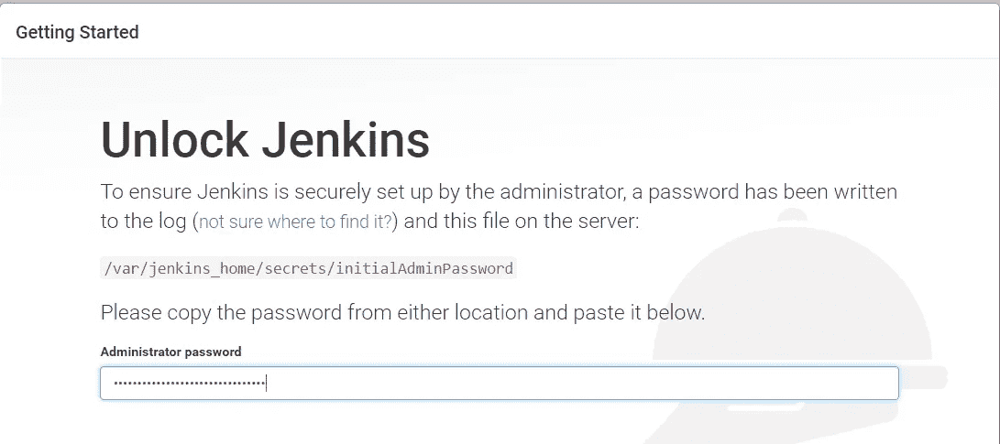

# Quickie:使用 Docker 设置 Jenkins

> 原文：<https://medium.com/oracledevs/quickie-setup-jenkins-on-oracle-container-cloud-670f2990ba1c?source=collection_archive---------5----------------------->

在 [Oracle 容器云](http://cloud.oracle.com/container)上使用 Jenkins 实例非常容易。你可以利用 OCC 提供的现成的服务(名为**詹金斯**)或者创建自己的服务。在这个例子中，我们将创建一个新的服务(名称**-另一个-jenkins** ):



使用现有的 Docker 图像或您选择的另一个图像(标签)(例如，来自 Docker Hub)



# 地图卷

如果您想保存您的 Jenkins 数据(例如插件、配置等)。)容器重启后，您需要将容器路径映射到主机容器上的持久卷

Docker Hub Jenkins 图像将数据存储在`/var/jenkins_home`

这很容易做到，因为 Oracle Container Cloud 允许通过 SSH 访问 worker 节点和 Manager 节点

你需要做的就是下面的事情

## SSH 到您的工作节点

更多[细节在此](https://docs.oracle.com/en/cloud/iaas/container-cloud/contu/connecting-oracle-container-cloud-service-manager-and-worker-nodes-ssh.html#GUID-6B085862-5BA9-41D6-8B69-621E5F0D535F)

## 创建 Jenkins 数据目录

这需要在 worker 节点上完成，并且需要分配权限

```
cd /home/opc mkdir jenkins sudo chmod 777 jenkins
```

## 在 OCCS 詹金斯服务中配置卷

[更多信息请点击此处](http://docs.oracle.com/en/cloud/iaas/container-cloud/contu/service-configuration-option-reference.html)



## 部署服务

好了..现在只需点击**部署**来启动您的 Jenkins 容器。您应该会在**部署**列表中看到它



# 访问詹金斯

## 获取管理员密码

在 Oracle 容器云中访问正在运行的 Jenkins 容器，并单击**查看日志**(向下滚动查看密码)



grab the Jenkins admin password from the startup logs

Jenkins 容器公开端口 9002(默认情况下)。只需浏览到[**http://**](http://community.oracle.com/)**<occs-host-IP>:9002/**输入密码即可入门



根据您的要求配置 Jenkins

> 本文表达的观点是我个人的观点，不一定代表甲骨文的观点