# 快速开发和托管友好的邻居应用程序—免费使用… Oracle APEX

> 原文：<https://medium.com/oracledevs/quickly-developing-and-hosting-your-friendly-neighbourhood-application-for-free-using-oracle-c6743e0c2e8f?source=collection_archive---------1----------------------->

我的挑战:

我妻子想为我们的一些朋友和亲戚建立一个系统，让彼此了解他们可以分享的电器和物品，以及他们提供的物品(因为他们打算扔掉它们)。规格相当简单:用户是已知的，应该经过身份验证，应用程序应该可以通过笔记本电脑和移动设备访问，报价可以与至少一张物品图像一起放置，任何对报价感兴趣的人都应该有机会提问并表明自己的兴趣。

最初，我查看了 Google Forms，过了一会儿又查看了 Google Sheets(以及用 Google WebScript 定制的稍微高级一些的表单)。我做了一些调查，看了一段信息丰富的视频，然后决定走一条不同的路线。我很快就进入了低级代码，而不是没有代码(随着我妻子的需求越来越多，我相信他们会越来越多，我会进入中级代码)。因此，如果低代码，我将面临越来越多地进行编码的选择，我将看到一个非常小的应用程序，从功能、流量、可用性、性能等方面来看，我将不得不进行一些编码，Oracle APEX 和托管 apex.oracle.com 环境难道不是一个非常合适的选择吗？用 SQL、PL/SQL 和 JavaScript 编写代码——这些技术我都掌握得很好。在那里，我所有其他的非功能性需求都可以很容易地得到满足。且这些小规模应用管理环境是免费提供的。

我在这个阶段最大的问题是:

*   在我的应用程序上实现身份验证是否容易，以确保只有我们认识和喜爱的人(甚至不是所有人)才能进入应用程序
*   对于我所期待的一些不太懂计算机的用户来说，创建一个足够直观的用户界面容易吗
*   对我来说——没有太多的顶点经验可言——快速创建至少一个 MVP 来让我的妻子开始做这件事可行吗

让我们找出答案。

我的步骤是:

*   在[https://apex.oracle.com](https://apex.oracle.com/)建立我自己的工作空间
*   创建数据库表来支持我的应用程序(至少对于 MVP 来说)
*   创建一个应用程序和第一个页面来创建和查询数据
*   实施认证并管理部分试点用户
*   发布应用程序，并让试点用户进行一些初步的探索

# 1.入门指南

在 https://apex.oracle.com/en/learn/getting-started/[的](https://apex.oracle.com/en/learn/getting-started/)，开始很容易

在申请了我自己的工作空间后

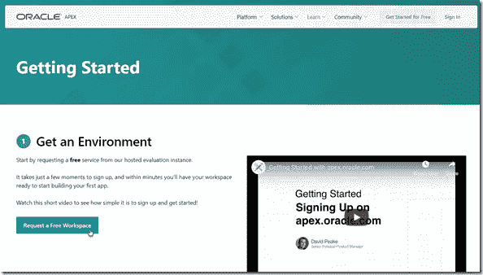

几分钟后，包含登录详细信息的电子邮件就到了

# 2.创建数据库表来支持我的应用程序(至少对于 MVP 来说)

使用 APEX 开发环境中的 Quick SQL 工具，我编写了我的表定义。

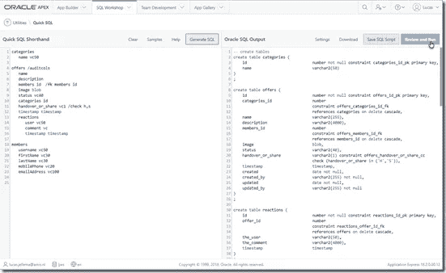

通过查看和运行，我可以在与 APEX 工作区相关联的 Oracle 数据库模式中快速执行 DDL。

使用对象浏览器，我可以检查表和约束，并开始编辑数据:

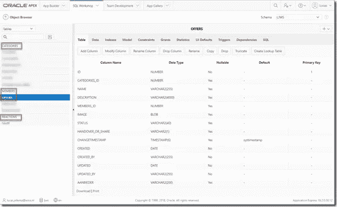

# 3.创建一个应用程序和第一个页面来创建和查询数据

在应用程序构建器选项卡中，我单击创建新应用程序

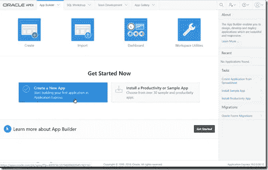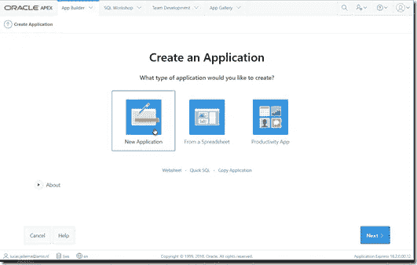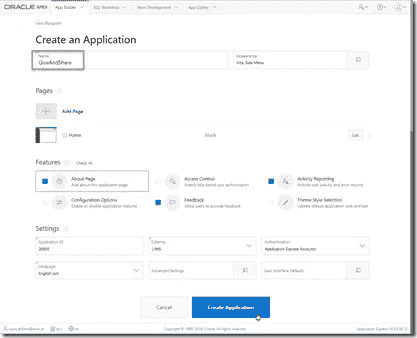

我提供了名称，选择了几个应用程序选项(包括使用 Application Express 帐户进行身份验证),然后单击“创建应用程序”:

这将创建一个带有主页和管理页面的 APEX 应用程序。我设置的任何 APEX 用户都可以访问该应用程序。这个用户不需要 Oracle 帐户，只需使用我提供给他们的凭证。

要将特定于我创建的表的页面添加到应用程序中，请单击创建页面:

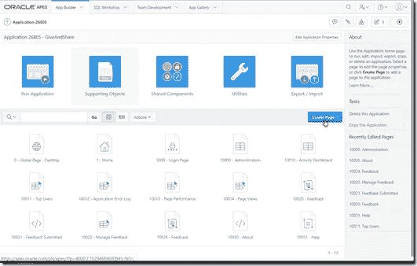

现在我要指定页面的样式—表格和表格:

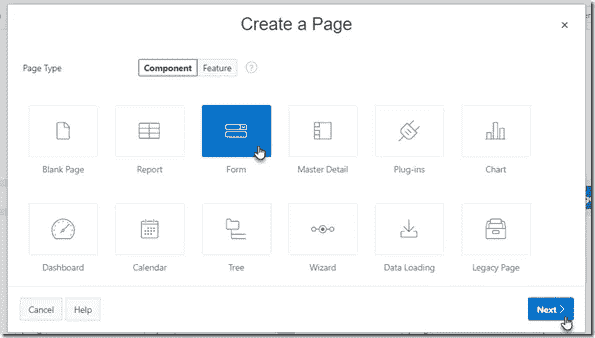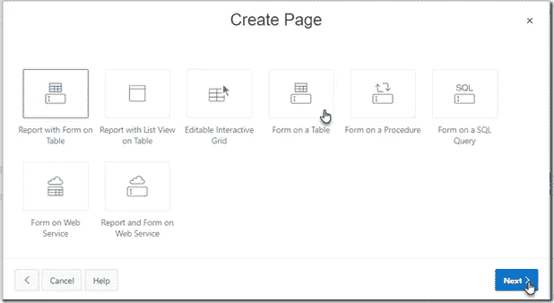

接下来，我要定义页面的名称、这个新页面的默认导航流以及是否应该添加面包屑:

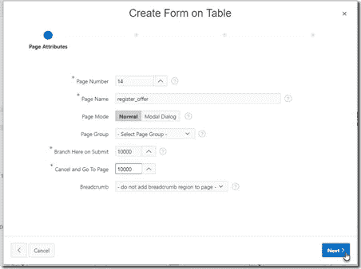

更有趣的是页面的菜单项

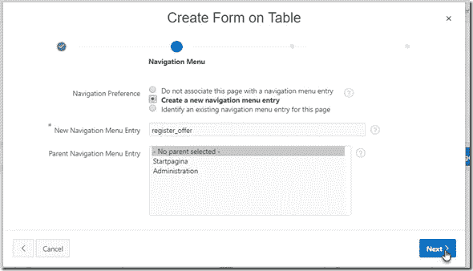

以及表单所基于的表:table OFFERS —以及要在页面中显示的列:

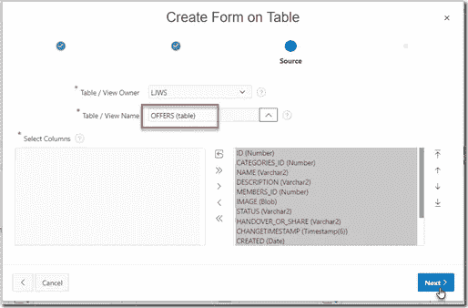

最后，我为报价记录指定主键列:

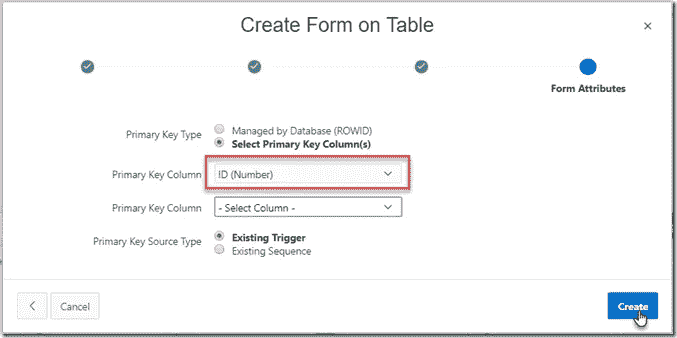

并且页面被创建。

如果我愿意，我可以对页面和页面项目进行微调——但我没有必要这样做。此时，我有了一个工作页面，可以通过单击 run 按钮立即进行测试运行:

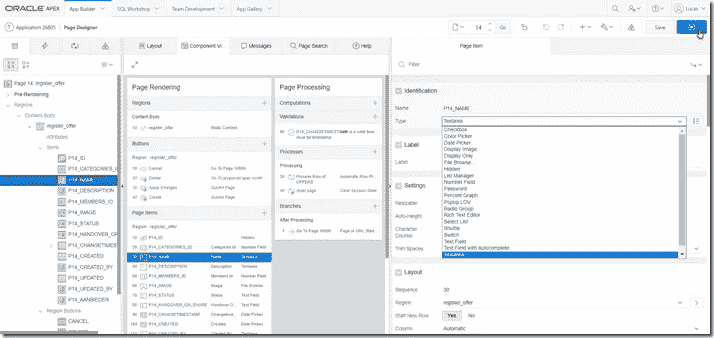

最终用户将看到以下页面:

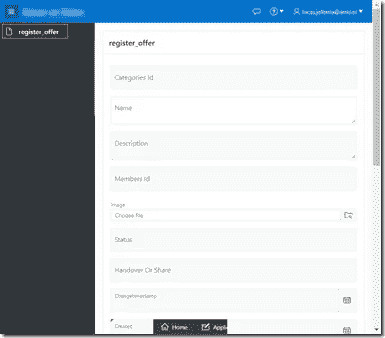

可以输入所有字段、创建记录和上传图像(其中一个表列是 BLOB 类型)。

# 4.向外部用户发布应用程序—实施身份验证并管理一些试点用户

我以为这将是一大进步。将应用程序投入使用——这肯定会是一个非常复杂的操作吧？事实证明并非如此。我为我的妻子创建了一个用户帐户:

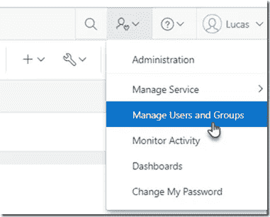

并且非常明确地指出，她既不是管理员，也不是开发人员:

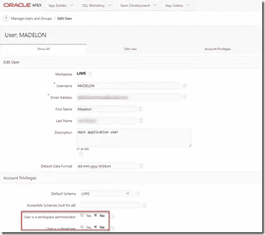

在创建应用程序时，我将身份验证方案设置为 *Application Express Accounts。*创建用户帐户后，我可以将应用程序的 URL 发送给这些用户，并附上他们的用户名和密码，他们就可以开始进行一些初步的探索了。

# 5.初始用户体验

经过一点调整和优化，这是我妻子在她的移动设备上的体验:

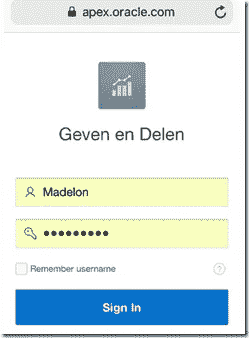

移动友好登录—开箱即用。登录后:

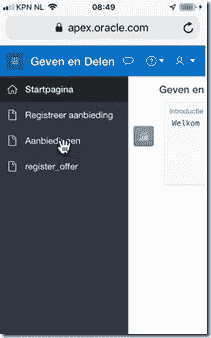

并提交新提议—注册可用于共享和接管的对象:

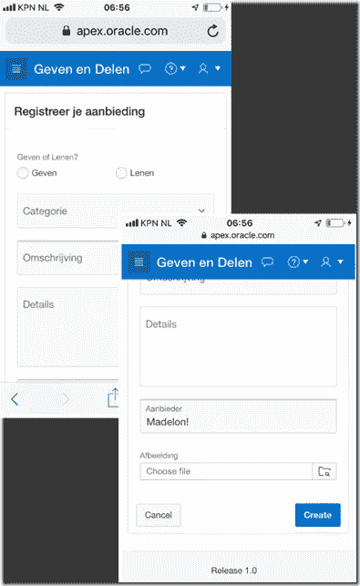

提交报价后

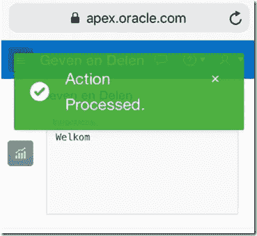

可以回顾一下:

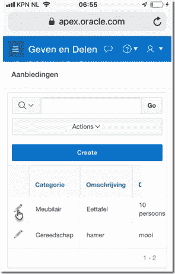

并详细检查了:

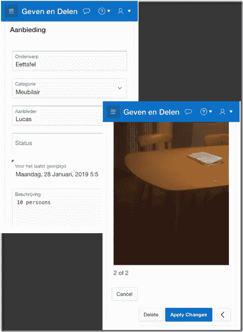

注意:这只是 MVP——一个最小的特性集。几乎在任何时候都实现了。

此时的状态:

*   基于云的数据持久性(在关系数据库中)
*   网络和移动应用体验
*   对集中管理的用户(而不是其他人)进行身份验证
*   记录创建、操作和审查
*   上传图像

这涵盖了我妻子的核心要求。而且我很有信心我也能满足她以下大部分要求。

我想提一下 APEX 的一些非常好的特性:

*   搜索整个应用程序(例如，查找您想要在应用程序中修改的一个文本字符串)
*   定义可重复使用的值列表
*   预定义的页面模式(如向导、主-详细信息、交互式网格)
*   内置用户反馈机制，以及“将反馈转化为待办事项”的选项
*   开箱即用，在移动设备上具有出色的外观和感觉，包括拍摄照片和将照片添加为上传图像的能力
*   免费—不仅是产品顶点，还有轻量级、完全受管理的环境

# 结论

如果您希望为一小部分已知用户快速创建一个应用程序，使其可以在世界任何地方的桌面和移动设备上使用，可以在其中输入、浏览和操作数据，并且不希望在安装、管理和其他与功能无关的事情上花费时间，并且希望它看起来很漂亮，那么您可能应该考虑将 Oracle APEX 作为一个解决方案。当 Google Forms 和 SurveyMonkey 太有限(到目前为止)并且低代码平台不提供免费可用的托管环境时，当您不想编码但如果必须编码，SQL 和 PL/SQL 很好，那么 Oracle APEX 可以成为您的朋友。

我设法让一个简单的基于四个数据库表的应用程序启动并运行——在一个慵懒的周日下午，我妻子用她的手机在大约三个小时内访问了该应用程序——事先没有关于 APEX 的知识或技能。如果我不得不再次做同样的事情，它将花费不到一个小时。从一开始，我的妻子和她的四个朋友就生活在一个(移动)网络应用程序上，他们在那里创建和分享数据。

APEX —适用于您的所有邻居应用。

# 资源

请求 APEX 工作区:在[https://apex.oracle.com/en/learn/getting-started/](https://apex.oracle.com/en/learn/getting-started/)(这需要一个 Oracle 帐户)

当前 APEX 文档:【https://apex.oracle.com/en/learn/documentation/ 

APEX 社区论坛:[https://Community . Oracle . com/Community/ground breakers/database/developer-tools/application _ express](https://community.oracle.com/community/groundbreakers/database/developer-tools/application_express)

# *原载于 2019 年 1 月 28 日*[*technology . amis . nl*](https://technology.amis.nl/2019/01/28/quickly-developing-and-hosting-your-friendly-neighbourhood-application-for-free-using-oracle-apex/)*。*