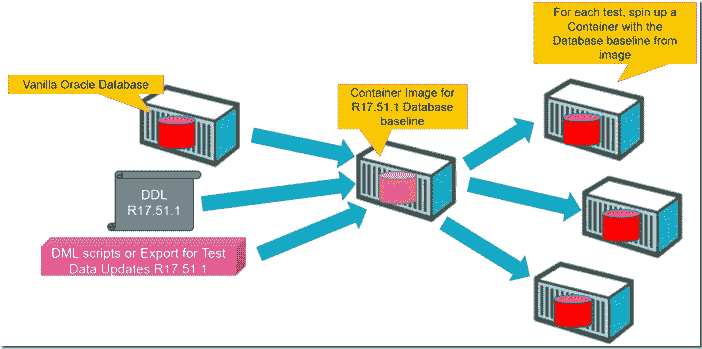

# 使用基线 Oracle 数据库设置快速启动 Docker 容器—用于执行自动化测试

> 原文：<https://medium.com/oracledevs/quickly-spinning-up-docker-containers-with-baseline-oracle-database-setup-for-performing-5a715ab92e6a?source=collection_archive---------0----------------------->



以下是运行 Oracle 数据库、准备对象(表、存储过程)和数据中的基线、创建该基线的映像以及随后基于该基线映像运行容器的过程。每个容器都以全新的设置开始。对于运行需要测试数据在已知状态下可用的自动化测试来说，这是一种很好的工作方式。

最初的 Docker 容器是使用 Oracle 数据库 11gR2 XE 映像创建的:[https://github.com/wnameless/docker-oracle-xe-11g](https://github.com/wnameless/docker-oracle-xe-11g)。

在 Docker 主机上执行以下语句:

```
docker run -d -p 49160:22 -p 49161:1521 -e ORACLE_ALLOW_REMOTE=true --name oracle-xe  wnameless/oracle-xe-11g
```

这将启动一个名为 oracle-xe 的容器。5–20 秒后，数据库创建并启动，可以从外部数据库客户端访问。

从数据库客户端，准备数据库基线，例如:

```
create user newuser identified by newuser; 
create table my_data (data varchar2(200)); 
insert into my_data values ('Some new data '||to_char(sysdate,'DD-MM HH24:MI:SS')); 
commit;
```

这些操作代表应用程序的完整数据库安装—可能包含数百或数千个对象和数兆字节的数据。步骤和原理保持完全相同。

在这一点上，创建一个基线的映像——它由应用了当前应用程序版本的 DDL 和 DML 的普通数据库组成:

```
docker commit --pause=true oracle-xe
```

这个命令返回一个 id，即现在为容器的当前状态创建的 Docker 映像的标识符——我们的基线。原始容器现在可以被停止(或杀死)甚至移除。

```
docker stop oracle-xe
```

从基线图像旋转容器现在已经完成:

```
docker run -d -p 49160:22 -p 49161:1521 -e ORACLE_ALLOW_REMOTE=true  --name oracle-xe-testbed  <image identifier>
```

几秒钟后，数据库启动，远程数据库客户机可以开始与数据库交互。他们将找到作为基线映像一部分的数据库对象和数据。要进行测试，不需要额外的设置或任何拆卸。

执行需要执行的测试。试验后的拆卸包括杀死和移除试验台容器:

```
docker kill oracle-xe-testbed && docker rm oracle-xe-testbed
```

现在回到步骤“旋转容器”

旋转容器需要几秒钟——5 到 10 秒钟。时间主要被不得不从头开始的数据库进程占用。

应该可以创建一个正在运行的容器的快照(使用 Docker 检查点)并从该快照中恢复 testbed 容器。这种从检查点-kill-rm 开始的创建-启动应该比我们现在开始的 run-kill-rm 循环更快。一个挑战是，打开数据库不仅要启动进程和操作内存，还要处理文件。这意味着我们需要提交正在运行的容器，并将恢复的检查点与该映像相关联。我一直在努力解决这个问题——但还没有成功——遇到了各种问题(O [RA-21561](https://stackoverflow.com/questions/31338916/sqlplus-remote-connection-giving-ora-21561) OID 生成失败，ora 27101 共享内存领域不存在，找不到重做日志文件等等)。我会继续调查此事。

# 使用 Oracle Database 12c 映像

注意:代替之前使用的 Oracle 数据库 XE 映像，我们可以基于例如映像 sath89/oracle-12c 执行相同的步骤(参见 https://hub.docker.com/r/sath89/oracle-12c/)。

命令和步骤现在是:

```
docker pull sath89/oracle-12c docker run -d -p 8080:8080 -p 1521:1521 --name oracle-db-12c sath89/oracle-12c
```

从客户端连接—创建基线。

设置好基线数据库和数据库内容后，创建该状态的容器映像:

```
docker commit --pause=true oracle-db-12c
```

返回图像标识符。停下集装箱。

```
docker stop oracle-db-12c
```

现在要运行一个测试迭代，从基线图像运行一个容器:

```
docker run -d -p 1521:1521  --name oracle-db-12c-testbed  <image identifier>
```

在端口 1521 连接到数据库，或者让正在测试的 web 应用程序或 API 建立连接。

# 资源

Docker 创建命令:[https://docs . Docker . com/engine/reference/Command line/Create/# parent-Command](https://docs.docker.com/engine/reference/commandline/create/#parent-command)

Docker 日常使用的俏皮 Docker 命令:[https://codefresh.io/docker-tutorial/everyday-hacks-docker/](https://codefresh.io/docker-tutorial/everyday-hacks-docker/)

Circle CI 博客—使用 CRIU 检查点和恢复 Docker 容器—[https://circle CI . com/Blog/check point-and-restore-Docker-container-with-criu/](https://circleci.com/blog/checkpoint-and-restore-docker-container-with-criu/)

*原载于 2018 年 4 月 18 日*[*technology . amis . nl*](https://technology.amis.nl/2018/04/18/quickly-spinning-up-docker-containers-with-baseline-oracle-database-setup-for-performing-automated-tests/)*。*