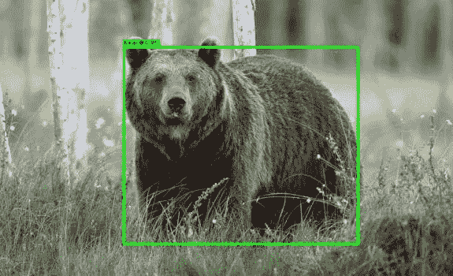

# 在不到 10 分钟的时间内创建和部署您的第一个图像分类模型

> 原文：<https://medium.com/walmartglobaltech/quickly-train-and-deploy-computer-vision-models-using-fastai-binder-3ba2e2f662b4?source=collection_archive---------0----------------------->

Source: [cvedia](https://www.cvedia.com/wp-content/uploads/2020/02/cvedia-model-library.jpg)

我们生活在一个奇怪的时代。COVID 时代迫使我们走进自己的家，虽然这是与我们所爱的人叙旧的好时机，但它也为我们实现长期未完成的学习目标和尝试新东西(你知道，我们感兴趣的东西)开辟了一条途径。我最近完成了一些关于人工智能的课程，并决定分享一系列与之相关的帖子。在今天的…