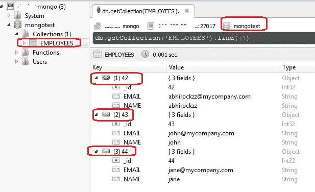

# 快速入门:MongoDB 与 Oracle 应用容器和开发人员云

> 原文：<https://medium.com/oracledevs/quickstart-mongodb-with-oracle-application-container-oracle-developer-cloud-e05d2d5207ba?source=collection_archive---------3----------------------->

这个博客将展示如何开始使用一个简单的基于 MongoDB 的应用程序

*   在 **Oracle 应用容器云**上运行
*   使用 **Oracle 开发者云**的单元测试和 CI/CD
*   我们的 MongoDB 实例将在 Oracle 容器云**上的 **Docker** 容器中运行**

# 应用

示例项目相对简单

*   它使用 **JPA** 和 **Hibernate OGM** 来定义数据层
*   [**Fongo**](https://github.com/fakemongo/fongo) (内存中的 Mongo DB)用于单元测试
*   **Jersey**(JAX-RS 实现)用于提供一个 REST 接口

你可以在这里查看[项目](https://github.com/abhirockzz/accs-mongodb)

# MongoDB，休眠 OGM

MongoDB 是一个开源的、基于文档的分布式数据库..更多[信息在这里](https://docs.mongodb.com/)。Hibernate OGM 是一个框架，它帮助你使用 JPA (Java Persistence API)来处理 NoSQL 商店，而不是 RDBMS(JPA 就是为 RDBMS 设计的)

*   它支持各种 NoSQL 存储(文档、列、键值、图表)
*   它支持的 NoSQL 数据库包括 MongoDB(如本博客所示)、Neo4j、Redis、Cassandra 等。

更多[详情在此](http://hibernate.org/ogm/)

在这种应用中

*   我们使用普通的 JPA 定义我们的实体和数据操作(创建、读取)
*   **Hibernate OGM** 用于*用 MongoDB* 在后台使用原生 Mongo DB Java 驱动说出 JPA。我们不明确地与 Java 驱动程序交互/在其上编写代码

下面是来自 **persistence.xml** 的一个片段，它让您对 Hibernate OGM 相关的配置有一个概念


# 设置

让我们配置/设置我们的云服务，并启动和运行应用程序…

## Oracle 容器云上的 MongoDB


# Oracle 开发人员云

您需要为*持续构建*以及*部署*过程配置开发人员云。您可以参考以前的博客(这里将重点介绍这个例子的一些细节)

**参考文献**

*   Oracle 开发人员云中的引导应用程序— [项目&代码库创建](https://community.oracle.com/community/cloud_computing/oracle-cloud-developer-solutions/blog/2017/05/25/getting-started-with-kafka-based-microservices-using-oracle-event-hub-cloud-application-container-cloud-developer-cloud#jive_content_id_Project__code_repository_creation)
*   持续集成设置— [配置构建任务](https://community.oracle.com/community/cloud_computing/oracle-cloud-developer-solutions/blog/2017/05/25/getting-started-with-kafka-based-microservices-using-oracle-event-hub-cloud-application-container-cloud-developer-cloud#jive_content_id_Configure_build_job)
*   部署设置— [持续部署(CD)到应用容器云](https://community.oracle.com/community/cloud_computing/oracle-cloud-developer-solutions/blog/2017/05/25/getting-started-with-kafka-based-microservices-using-oracle-event-hub-cloud-application-container-cloud-developer-cloud#jive_content_id_Continuous_Deployment_CD_to_Application_Container_Cloud)

## JUnit 相关配置

确保您设置了 Oracle Developer Cloud 来提供 JUnit 结果


## 提供 Oracle 应用程序容器云(配置)描述符

作为部署配置的一部分，我们将向 Oracle Developer Cloud 提供 *deployment.json* 细节——在这种情况下，它专门用于以环境变量的形式设置 MongoDB 坐标。Oracle 开发人员云将处理部署到 Oracle 应用容器云的复杂性


## JUnit 成就了 Oracle 开发人员云

从**构建日志**


从**测试**到**报告**


## Oracle 开发人员云中的部署确认


## 应用程序容器云中的部署后状态

请注意，环境变量是在部署过程中植入的


# 测试应用程序

*   我们使用 [cURL](https://curl.haxx.se/) 与我们的应用程序 REST 端点进行交互，并且
*   [Robomongo](https://robomongo.org/) 作为(胖)客户端验证 Mongo DB 中的数据

首先检查 ACCS 应用程序的 URL

## 添加员工

```
curl -X POST [https://my-accs-app/employees](https://my-accs-app/employees) -d 42:abhirockzz 
curl -X POST [https://my-accs-app/employees](https://my-accs-app/employees) -d 43:john 
curl -X POST [https://my-accs-app/employees](https://my-accs-app/employees) -d 44:jane
```

请求负载是带有员工 ID 和姓名的“:”分隔的字符串

## 获取员工

作为响应，您将得到一个 XML 有效负载

```
curl -X GET [https://my-accs-app/employees](https://my-accs-app/employees) - all employees 
curl -X GET [https://my-accs-app/employees/44](https://my-accs-app/employees/44) - specific employee (by ID)
```

让我们也来看看 MongoDB

*   *蒙哥测试*是数据库
*   *雇员*是 MongoDB 集合(相当于 JPA 中的`@Table`)



# 测试 CI/CD 流

做一些代码修改，推送给开发者云服务 Git repo。这应该

*   自动触发构建，一旦成功将
*   自动触发部署流程，以及
*   将新的应用程序版本重新部署到应用程序容器云

# 不要忘记…

*   查看 Oracle 应用容器云的[教程—每个运行时都有一些内容！](https://docs.oracle.com/en/cloud/paas/app-container-cloud/create-first-applications.html)
*   [其他关于应用容器云的博客](http://bit.ly/2gR3nrV)

> 本文表达的观点是我个人的观点，不一定代表甲骨文的观点。