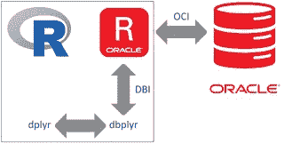

# 在 R 语言和 Oracle 数据库中使用 dplyr 和 dbplyr

> 原文：<https://medium.com/oracledevs/r-and-the-oracle-database-using-dplyr-dbplyr-with-roracle-in-windows-10-8ddcabdd6e97?source=collection_archive---------0----------------------->

r 广泛使用数据。数据通常驻留在数据库中。在这篇博客中，我将介绍如何在 Windows 10 上安装和使用 dplyr、dbplyr 和 ROracle，以便使用 r。



# 从 R 访问 Oracle 数据库

dplyr 使 R 中最常见的数据操作任务变得更加容易。dplyr 可以使用 dbplyr。dbplyr 提供了从 dplyr 动词到 SQL 查询的转换。dbplyr 1.1.0 于 2017 年 6 月 27 日发布。此处见[。它使用 DBI (R 数据库接口)。见](https://blog.rstudio.com/2017/06/27/dbplyr-1-1-0/)[此处](https://cran.r-project.org/web/packages/DBI/index.html)。该接口由各种驱动程序实现，如 [ROracle](https://cran.r-project.org/web/packages/ROracle/index.html) 。ROracle 是一个基于 [OCI](http://www.oracle.com/technetwork/database/features/oci/index-090945.html) (Oracle 调用接口)的 Oracle 驱动程序，它是一个连接 Oracle 数据库的高性能原生 C 接口。

## 在 Windows 10 上安装 ROracle

我在 R 3.3.3 上的 Windows 10 中安装 ROracle 时遇到了几个错误。要一步到位地做到这一点，需要采取以下步骤:

*   确定您的 R 平台架构。32 位或 64 位。对我来说，这是 64 位
*   下载并安装相应架构的 oracle instant client(此处[为](http://www.oracle.com/technetwork/database/features/instant-client/index-097480.html))。下载 basic 和 SDK 文件。将 sdk zip 中的 sdk 文件放在提取的 basic zip 的子目录中(与 vc14 在同一级别)
*   下载并安装 RTools ( [此处](https://cran.r-project.org/bin/windows/Rtools/))
*   将 OCI_LIB64 或 OCI_LIB32 变量设置为即时客户端路径
*   设置 PATH 变量以包含 oci.dll 的位置
*   安装 ROracle(R 中的 install . packages(“ROracle”)

## **遇到错误**

```
Warning in install.packages :
package ‘ROracle_1.3–1.zip’ is not available (for R version 3.3.3)
```

您可能试图在太新的 R 版本上安装 Oracle 提供的 ROracle 包(参见此处的)。这在 R 3.3.3 上不起作用。您可以自己编译 ROracle，也可以使用 Oracle 支持的(旧)R 版本。

```
Package which is only available in source form, and may need compilation of C/C++/Fortran: ‘ROracle’ These will not be installed
```

这可以通过安装 RTools 来实现(此处[为](https://cran.r-project.org/bin/windows/Rtools/))。这将在 Windows 机器上安装编译源代码所需的所有工具。

接下来你会得到以下问题:

```
Package which is only available in source form, and may need compilation of C/C++/Fortran: ‘ROracle’
Do you want to attempt to install these from sources?
 y/n:
```

如果您说 y，您将得到以下错误:

```
installing the source package ‘ROracle’
trying URL ‘[https://cran.rstudio.com/src/contrib/ROracle_1.3-1.tar.gz'](https://cran.rstudio.com/src/contrib/ROracle_1.3-1.tar.gz')
 Content type ‘application/x-gzip’ length 308252 bytes (301 KB)
 downloaded 301 KB

 * installing *source* package ‘ROracle’ …
 ** package ‘ROracle’ successfully unpacked and MD5 sums checked
 ERROR: cannot find Oracle Client.
 Please set OCI_LIB64 to specify its location.
```

为了解决这个问题，您可以下载并安装 Oracle 即时客户端(基础版和 SDK 版下载)。请注意，当运行 64 位版本的 R 时，您还需要 64 位版本的即时客户端。您可以使用 R version 命令进行检查。我的情况是:平台:x86_64-w64-mingw32/x64 (64 位)。接下来，您必须将 OCI_LIB64 变量(对于 64 位 else OCI_LIB32)设置为指定的路径。之后，您将得到如下所示的错误:接下来它将失败，类似于:

```
Error in inDL(x, as.logical(local), as.logical(now), …) :
unable to load shared object ‘ROracle.dll’:
 LoadLibrary failure: The specified module could not be found.
```

这是由于即时客户端的 oci.dll 不在 path 环境变量中。加进去就行了！(至少在我的机器上是这样的)。ROracle 包中的安装文件包含许多关于安装过程中可能出现的不同错误的信息。如果遇到其他错误，一定要检查一下。

## **成功的 64 位编译看起来如何**

```
> install.packages(“ROracle”)
Installing package into ‘C:/Users/maart_000/Documents/R/win-library/3.3’
(as ‘lib’ is unspecified)
Package which is only available in source form, and may need compilation of C/C++/Fortran: ‘ROracle’
Do you want to attempt to install these from sources?
y/n: y
installing the source package ‘ROracle’
trying URL ‘[https://cran.rstudio.com/src/contrib/ROracle_1.3-1.tar.gz'](https://cran.rstudio.com/src/contrib/ROracle_1.3-1.tar.gz')
Content type ‘application/x-gzip’ length 308252 bytes (301 KB)
downloaded 301 KB
* installing *source* package ‘ROracle’ …
** package ‘ROracle’ successfully unpacked and MD5 sums checked
Oracle Client Shared Library 64-bit — 12.2.0.1.0 Operating in Instant Client mode.
found Instant Client C:\Users\maart_000\Desktop\instantclient_12_2
found Instant Client SDK C:\Users\maart_000\Desktop\instantclient_12_2/sdk/include
copying from C:\Users\maart_000\Desktop\instantclient_12_2/sdk/include
** libs
Warning: this package has a non-empty ‘configure.win’ file,
so building only the main architecture
c:/Rtools/mingw_64/bin/gcc -I”C:/PROGRA~1/R/R-33~1.3/include” -DNDEBUG -I./oci -I”d:/Compiler/gcc-4.9.3/local330/include” -O2 -Wall -std=gnu99 -mtune=core2 -c rodbi.c -o rodbi.o
c:/Rtools/mingw_64/bin/gcc -I”C:/PROGRA~1/R/R-33~1.3/include” -DNDEBUG -I./oci -I”d:/Compiler/gcc-4.9.3/local330/include” -O2 -Wall -std=gnu99 -mtune=core2 -c rooci.c -o rooci.o
c:/Rtools/mingw_64/bin/gcc -shared -s -static-libgcc -o ROracle.dll tmp.def rodbi.o rooci.o C:\Users\maart_000\Desktop\instantclient_12_2/oci.dll -Ld:/Compiler/gcc-4.9.3/local330/lib/x64 -Ld:/Compiler/gcc-4.9.3/local330/lib -LC:/PROGRA~1/R/R-33~1.3/bin/x64 -lR
installing to C:/Users/maart_000/Documents/R/win-library/3.3/ROracle/libs/x64
** R
** inst
** preparing package for lazy loading
** help
*** installing help indices
** building package indices
** testing if installed package can be loaded
* DONE (ROracle)
```

## 测试柜

你可以在这里阅读文档[。Oracle 非常友好，提供了开发人员虚拟机来玩数据库。你可以在这里下载它们](https://cran.r-project.org/web/packages/ROracle/ROracle.pdf)。我用的是“数据库应用开发虚拟机”。

安装 ROracle 后，您可以连接到数据库，例如从 EMP 表中获取雇员。请参见下面的示例(确保您也安装了 DBI)。

```
library(“DBI”)
library(“ROracle”)
drv <- dbDriver(“Oracle”)
host <- “localhost”
port <- “1521”
sid <- “orcl12c”
connect.string <- paste(
“(DESCRIPTION=”,
“(ADDRESS=(PROTOCOL=tcp)(HOST=”, host, “)(PORT=”, port, “))”,
“(CONNECT_DATA=(SID=”, sid, “)))”, sep = “”)
con <- dbConnect(drv, username = “system”, password = “oracle”, dbname = connect.string, prefetch = FALSE,
bulk_read = 1000L, stmt_cache = 0L, external_credentials = FALSE,
sysdba = FALSE)
dbReadTable(con, “EMP”)
```

这将产生 EMP 表中的数据。

```
EMPNO ENAME JOB MGR HIREDATE SAL COMM DEPTNO
1 7698 BLAKE MANAGER 7839 1981–05–01 00:00:00 2850 NA 30
2 7566 JONES MANAGER 7839 1981–04–02 00:00:00 2975 NA 20
3 7788 SCOTT ANALYST 7566 1987–04–19 00:00:00 3000 NA 20
4 7902 FORD ANALYST 7566 1981–12–02 23:00:00 3000 NA 20
5 7369 SMITH CLERK 7902 1980–12–16 23:00:00 800 NA 20
6 7499 ALLEN SALESMAN 7698 1981–02–19 23:00:00 1600 300 30
7 7521 WARD SALESMAN 7698 1981–02–21 23:00:00 1250 500 30
8 7654 MARTIN SALESMAN 7698 1981–09–27 23:00:00 1250 1400 30
9 7844 TURNER SALESMAN 7698 1981–09–08 00:00:00 1500 0 30
10 7876 ADAMS CLERK 7788 1987–05–23 00:00:00 1100 NA 20
11 7900 JAMES CLERK 7698 1981–12–02 23:00:00 950 NA 30
```

## 使用 dplyr

dplyr 使用 dbplyr，它使处理数据库数据变得容易得多。你可以在这里看到一个例子[。在 R 中安装 dplyr 和 dbplyr 很容易:](https://db.rstudio.com/dplyr/)

```
install.packages(“dplyr”)
install.packages(“dbplyr”)
```

提供了各种函数来处理 data.frames，这是一种流行的 R 数据类型，与数据库中的数据结合使用。此外，dplyr 使用了 SQL 之上的抽象，这使得为非 SQL 编码人员编写 SQL 更加容易。在某些方面，您可以将其与 Hibernate 进行比较，Hibernate 使得使用 Java 对象世界中的数据库更加容易。dplyr 提供的一些功能:

*   filter()根据值选择案例。
*   arrange()对案例进行重新排序。
*   select()和 rename()根据名称选择变量。
*   mutate()和 trustee()添加新变量，这些变量是现有变量的函数。
*   summarise()将多个值浓缩为一个值。
*   sample_n()和 sample_frac()获取随机样本。

我将使用与上面使用普通 ROracle 的示例相同的示例数据

```
library(“DBI”)
library(“ROracle”)
library(“dplyr”)

#below are required to make the translation done by dbplyr to SQL produce working Oracle SQL
sql_translate_env.OraConnection <- dbplyr:::sql_translate_env.Oracle
sql_select.OraConnection <- dbplyr:::sql_select.Oracle
sql_subquery.OraConnection <- dbplyr:::sql_subquery.Oracle 

drv <- dbDriver(“Oracle”)
host <- “localhost”
port <- “1521”
sid <- “orcl12c”
connect.string <- paste(
“(DESCRIPTION=”,
“(ADDRESS=(PROTOCOL=tcp)(HOST=”, host, “)(PORT=”, port, “))”,
“(CONNECT_DATA=(SID=”, sid, “)))”, sep = “”)

con <- dbConnect(drv, username = “system”, password = “oracle”, dbname = connect.string, prefetch = FALSE,
bulk_read = 1000L, stmt_cache = 0L, external_credentials = FALSE,
sysdba = FALSE)

emp_db <- tbl(con, “EMP”)
emp_db
```

输出类似于:

```
# Source: table<EMP> [?? x 8]
# Database: OraConnection
 EMPNO ENAME JOB MGR HIREDATE SAL COMM DEPTNO
 <int> <chr> <chr> <int> <dttm> <dbl> <dbl> <int>
 1 7839 KING PRESIDENT NA 1981–11–16 23:00:00 5000 NA 10
 2 7698 BLAKE MANAGER 7839 1981–05–01 00:00:00 2850 NA 30
 3 7782 CLARK MANAGER 7839 1981–06–09 00:00:00 2450 NA 10
 4 7566 JONES MANAGER 7839 1981–04–02 00:00:00 2975 NA 20
 5 7788 SCOTT ANALYST 7566 1987–04–19 00:00:00 3000 NA 20
 6 7902 FORD ANALYST 7566 1981–12–02 23:00:00 3000 NA 20
 7 7369 SMITH CLERK 7902 1980–12–16 23:00:00 800 NA 20
 8 7499 ALLEN SALESMAN 7698 1981–02–19 23:00:00 1600 300 30
 9 7521 WARD SALESMAN 7698 1981–02–21 23:00:00 1250 500 30
 10 7654 MARTIN SALESMAN 7698 1981–09–27 23:00:00 1250 1400 30
 # … with more rows
```

如果我现在想选择特定的记录，我可以这样做:

```
emp_db %>% filter(DEPTNO == “10”) 
```

这将产生

```
# Source: lazy query [?? x 8]
# Database: OraConnection
 EMPNO ENAME JOB MGR HIREDATE SAL COMM DEPTNO
 <int> <chr> <chr> <int> <dttm> <dbl> <dbl> <int>
 1 7839 KING PRESIDENT NA 1981–11–16 23:00:00 5000 NA 10
 2 7782 CLARK MANAGER 7839 1981–06–09 00:00:00 2450 NA 10
 3 7934 MILLER CLERK 7782 1982–01–22 23:00:00 1300 NA 10
```

稍微复杂一点的查询:

```
emp_db %>%
group_by(DEPTNO) %>%
 summarise(EMPLOYEES = count())
```

将得出每个部门的员工人数:

```
# Source: lazy query [?? x 2]
# Database: OraConnection
 DEPTNO EMPLOYEES
 <int> <dbl>
 1 30 6
 2 20 5
 3 10 3
```

您可以通过以下方式查看生成的查询:

```
emp_db %>%
group_by(DEPTNO) %>%
 summarise(EMPLOYEES = count()) %>% show_query()
```

会导致

```
<SQL>
SELECT “DEPTNO”, COUNT(*) AS “EMPLOYEES”
 FROM (“EMP”) 
 GROUP BY “DEPTNO”
```

如果我想从数据集中随机抽取一个样本进行分析，我可以这样做:

```
sample_n(as_data_frame(emp_db), 10)
```

这可能会产生如下结果:

```
# A tibble: 10 x 8EMPNO ENAME JOB MGR HIREDATE SAL COMM DEPTNO<int> <chr> <chr> <int> <dttm> <dbl> <dbl> <int>1 7844 TURNER SALESMAN 7698 1981–09–08 00:00:00 1500 0 302 7499 ALLEN SALESMAN 7698 1981–02–19 23:00:00 1600 300 303 7566 JONES MANAGER 7839 1981–04–02 00:00:00 2975 NA 204 7654 MARTIN SALESMAN 7698 1981–09–27 23:00:00 1250 1400 305 7369 SMITH CLERK 7902 1980–12–16 23:00:00 800 NA 206 7902 FORD ANALYST 7566 1981–12–02 23:00:00 3000 NA 207 7698 BLAKE MANAGER 7839 1981–05–01 00:00:00 2850 NA 308 7876 ADAMS CLERK 7788 1987–05–23 00:00:00 1100 NA 209 7934 MILLER CLERK 7782 1982–01–22 23:00:00 1300 NA 1010 7782 CLARK MANAGER 7839 1981–06–09 00:00:00 2450 NA 10
```

再次执行相同的命令将产生不同的样本。

# 最后

有多种方法可以从 Oracle 数据库获取数据并对其执行操作。Oracle 提供 [Oracle R Enterprise](http://docs.oracle.com/cd/E67822_01/OREUG/GUID-05AE35BA-CD91-437A-BAB7-EA08F2CE5EEB.htm#OREUG187) 。Oracle R Enterprise 是 Oracle 数据库企业版的 Oracle 高级分析选项的一个组件。您可以在 R 会话中从驻留在数据库中的数据创建 R 代理对象。这允许您在 R 中处理数据库数据，而数据库完成大部分计算。Oracle R Enterprise 的另一个特性是数据库中的 R 脚本存储库，以及允许从数据库(嵌入式)中执行 R 脚本的特性，甚至可以在 SQL 语句中执行。可以想象这是相当强大的。在以后的博客中会有更多的介绍！

*原载于 2017 年 8 月 23 日*[*【javaoraclesoa.blogspot.com*](http://javaoraclesoa.blogspot.nl/2017/08/r-and-oracle-database-using-dplyr.html)*。*