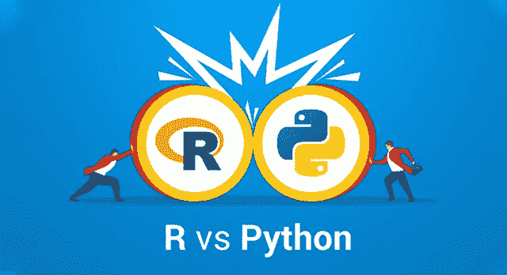
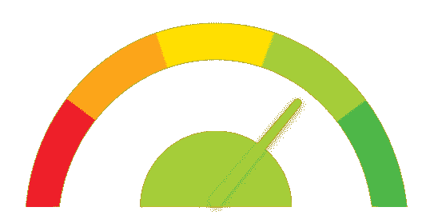

# R vs Python:最佳编程语言之战

> 原文：<https://medium.com/edureka/r-vs-python-48eb86b7b40f?source=collection_archive---------1----------------------->

R vs Python — Edureka

随着大数据、机器学习和数据科学在软件行业或软件服务公司中的重要性的大幅增长，两种语言已经成为对开发者最有利的语言。R 与 Python 的比较将为您提供关于数据科学家和数据分析师最流行和最喜欢的两种语言的清晰知识。这篇 R vs Python 博客将按以下顺序为您提供对这些语言的全面了解:

*   R & Python 简介
*   比较因素
*   易于学习
*   速度
*   数据处理能力
*   图形和可视化
*   灵活性
*   受欢迎指数
*   工作场景
*   社区和客户支持

# R & Python 简介

r 被认为是任何统计学家的最佳编程语言，因为它拥有大量的统计和图形方法。另一方面，Python 可以做与 **R** 几乎相同的工作，但由于其简单性和高性能，它更受数据科学家或数据分析师的青睐。r 是一种强大的脚本语言，高度灵活，拥有活跃的社区和资源库，而 Python 是一种广泛使用的面向对象的语言，易于学习和调试。

因此，让我们继续比较 R 和 Python，看看比较因素。

# 比较因素

**R** 是为数据分析而引入的，而 **Python** 是作为通用语言而开发的。前者最适用于即席分析和探索数据集，而后者适用于数据操作和重复任务。

让我们来看一下**因素**，我们将在 **R 与 Python:** 的**比较中使用这些因素**

# 易于学习

## **R**

r 有一个陡峭的学习曲线，在编程方面经验不足或没有经验的人一开始会觉得很难。一旦你掌握了这门语言，理解起来就没那么难了。

## 计算机编程语言

Python 强调生产率和代码可读性，这使得它成为最简单的编程语言之一。由于其易于学习和理解，它是优选的。

# 速度

## 稀有

r 是一种**低级**编程语言，因此对于简单的程序，它需要较长的代码。这是**减速**的原因之一。

## 计算机编程语言

Python 是一种高级编程语言，它已经成为构建关键而快速的应用程序的选择。

# 数据处理能力

## 稀有

r 便于分析，因为**大量的包**，易于使用的测试和使用公式的优势。但是它也可以用于基本的数据分析，而不需要安装任何包。

## 计算机编程语言

用于数据分析的 Python 包**是一个问题**，但这在最近的版本中有所改善。Numpy 和 Pandas 用于 Python 中的数据分析。它也适用于并行计算。

# 图形和可视化

## 稀有

可视化数据比原始值更容易理解。r 由许多提供高级图形功能的**包组成**。

## 计算机编程语言

在选择数据分析软件时，可视化很重要，Python 有一些令人惊叹的可视化库。它有更多的库，但是它们很复杂，并给出一个整洁的输出。

# 灵活性

## 稀有

在 R 中使用**复杂的公式很容易，统计测试和模型也很容易获得和使用。**

## 计算机编程语言

当从零开始构建时，Python 是一种灵活的语言。它也用于编写网站或其他应用程序的脚本。

# 流行

现在，如果我们看看这两种语言的受欢迎程度，它们在十年前从同一水平开始，但 **Python 见证了受欢迎程度的巨大增长**，与排名第六的 R 相比，Python 在 2016 年排名第一。

与后者的用户相比，Python 的用户对他们的语言更加忠诚，因为从 R 转向 Python 的比例是 Python 转向 R 的两倍。

软件公司更倾向于诸如**机器学习**、**人工智能**和**大数据**等技术，这解释了对 Python 开发者需求的增长。虽然这两种语言都可以用于统计和分析，但是 Python 比另一种语言略胜一筹，因为它简单，在工作趋势中排名更高。

# 客户支持和社区

商业软件通常提供付费的客户支持，但 R 和 Python 没有客户服务支持，这意味着如果你遇到任何麻烦，你只能靠自己。尽管这两种语言都有在线社区来寻求帮助。与 r 相比，Python 拥有更大的社区支持。

至此，我们已经结束了 R 与 Python 的比较。这两种语言在数据科学和数据分析领域展开了正面交锋。但是 Python 在这两者中脱颖而出，因为它在编写代码方面非常流行和简单。

如果你想查看更多关于 Python、DevOps、Ethical Hacking 等市场最热门技术的文章，你可以参考 Edureka 的官方网站。

请留意本系列中的其他文章，它们将解释数据科学的各个方面。

> *1。* [*数据科学教程*](/edureka/data-science-tutorial-484da1ff952b)
> 
> *2。* [*数据科学的数学与统计*](/edureka/math-and-statistics-for-data-science-1152e30cee73)
> 
> *3。*[*R 中的线性回归*](/edureka/linear-regression-in-r-da3e42f16dd3)
> 
> *4。* [*数据科学教程*](/edureka/data-science-tutorial-484da1ff952b)
> 
> *5。*[*R 中的逻辑回归*](/edureka/logistic-regression-in-r-2d08ac51cd4f)
> 
> *6。* [*分类算法*](/edureka/classification-algorithms-ba27044f28f1)
> 
> *7。* [*随机森林中的 R*](/edureka/random-forest-classifier-92123fd2b5f9)
> 
> *8。* [*决策树中的 R*](/edureka/a-complete-guide-on-decision-tree-algorithm-3245e269ece)
> 
> *9。* [*机器学习入门*](/edureka/introduction-to-machine-learning-97973c43e776)
> 
> *10。* [*朴素贝叶斯在 R*](/edureka/naive-bayes-in-r-37ca73f3e85c)
> 
> *11。* [*统计与概率*](/edureka/statistics-and-probability-cf736d703703)
> 
> *12。* [*如何创建一个完美的决策树？*](/edureka/decision-trees-b00348e0ac89)
> 
> *13。* [*关于数据科学家角色的 10 大误区*](/edureka/data-scientists-myths-14acade1f6f7)
> 
> *14。* [*顶级数据科学项目*](/edureka/data-science-projects-b32f1328eed8)
> 
> *15。* [*数据分析师 vs 数据工程师 vs 数据科学家*](/edureka/data-analyst-vs-data-engineer-vs-data-scientist-27aacdcaffa5)
> 
> 16。 [*人工智能类型*](/edureka/types-of-artificial-intelligence-4c40a35f784)
> 
> 17。[*5 大机器学习算法*](/edureka/machine-learning-algorithms-29eea8b69a54)
> 
> 18。 [*人工智能 vs 机器学习 vs 深度学习*](/edureka/ai-vs-machine-learning-vs-deep-learning-1725e8b30b2e)
> 
> *19。* [*机器学习项目*](/edureka/machine-learning-projects-cb0130d0606f)
> 
> 20。 [*数据分析师面试问答*](/edureka/data-analyst-interview-questions-867756f37e3d)
> 
> *21。* [*面向非程序员的数据科学和机器学习工具*](/edureka/data-science-and-machine-learning-for-non-programmers-c9366f4ac3fb)
> 
> *二十二。* [*十大机器学习框架*](/edureka/top-10-machine-learning-frameworks-72459e902ebb)
> 
> *23。* [*用于机器学习的统计*](/edureka/statistics-for-machine-learning-c8bc158bb3c8)
> 
> *24。* [*随机森林中的 R*](/edureka/random-forest-classifier-92123fd2b5f9)
> 
> *25。* [*广度优先搜索算法*](/edureka/breadth-first-search-algorithm-17d2c72f0eaa)
> 
> *26。*[*R 中的线性判别分析*](/edureka/linear-discriminant-analysis-88fa8ad59d0f)
> 
> *27。* [*机器学习的先决条件*](/edureka/prerequisites-for-machine-learning-68430f467427)
> 
> *28。* [*互动 WebApps 使用 R 闪亮*](/edureka/r-shiny-tutorial-47b050927bd2)
> 
> *29。* [*机器学习十大书籍*](/edureka/top-10-machine-learning-books-541f011d824e)
> 
> 三十。 [*无监督学习*](/edureka/unsupervised-learning-40a82b0bac64)
> 
> *31.1* [*0 最佳数据科学书籍*](/edureka/10-best-books-data-science-9161f8e82aca)
> 
> *32。* [*监督学习*](/edureka/supervised-learning-5a72987484d0)

*原载于 2019 年 7 月 15 日*[*【www.edureka.co】*](https://www.edureka.co/blog/r-vs-python/)*。*