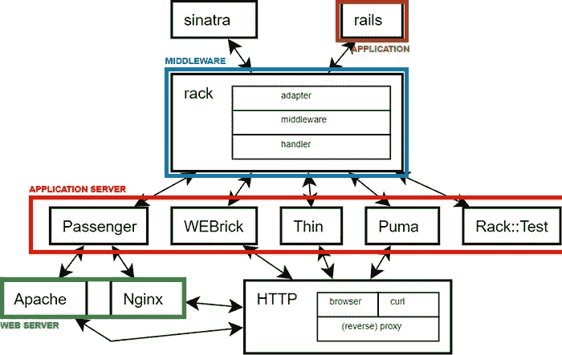
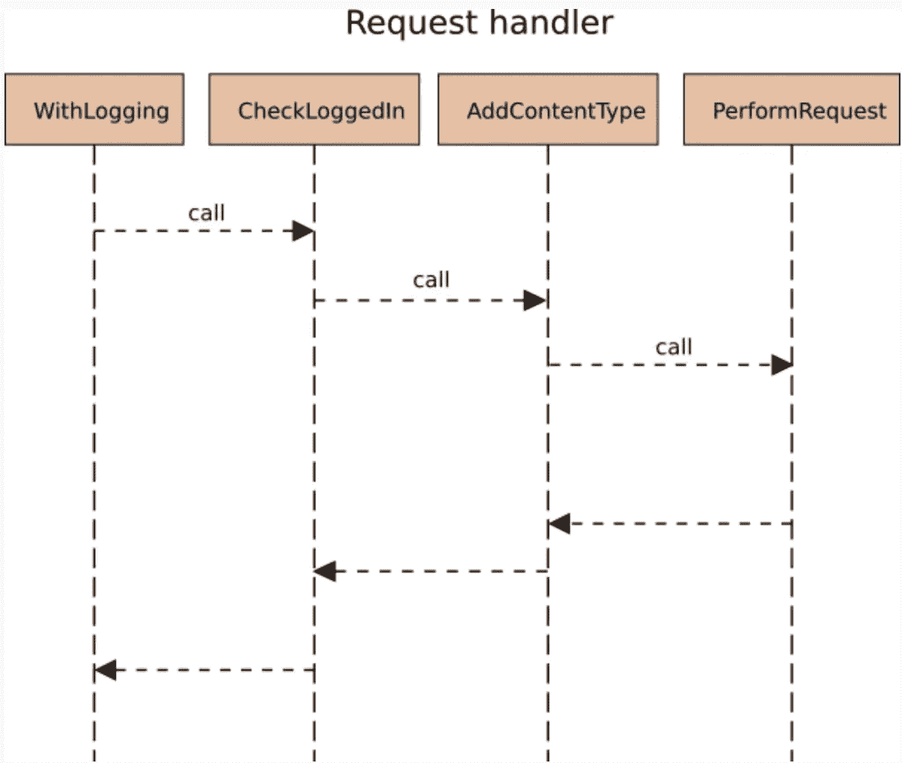

# 机架中间件 vs 机架应用 vs 机架(gem) vs 机架(架构)

> 原文：<https://medium.com/quick-code/rack-middleware-vs-rack-application-vs-rack-the-gem-vs-rack-the-architecture-912cd583ed24?source=collection_archive---------4----------------------->

## Rack 到底是什么？

标题中有一大堆不同类型的机架！在我深入定义它们之前，我将简要概述一下什么是 Rack。

首先，你可以在这里阅读 R [ack 文档以获得官方定义。](https://github.com/rack/rack)

这一切都是因为我最近开始(强烈推荐)诺亚·吉布的[重建 Rails](https://rebuilding-rails.com/) ，第一步的一部分是创建一个 Rack 应用程序。在这一点上，诺亚对 Rack 的描述非常有用。

> Rack 是将您的框架连接到 Ruby 应用服务器(如 Mongrel、Thin、Lighttpd、Passenger、WEBrick 或 Unicorn)的利器。应用服务器是一种特殊类型的 web 服务器，通常使用 Ruby 运行服务器应用程序。在真实的生产环境中，您将在应用服务器前面运行一个 web 服务器，如 Apache 或 NGinX。

我是一个图表人，所以下面是用图表表示的上述定义:



I got this from [this](/ruby-on-rails-web-application-development/custom-400-500-error-pages-in-ruby-on-rails-exception-handler-3a04975e4677) medium article

正如你所看到的，它在图中既有 Sinatra 又有 Rails，这很好地描述了框架是如何非常容易地切换出来的(这实际上是使用 Rack 的一大优势)。

## 定义所有不同类型的机架

在作为诺亚教程的一部分构建了一个基本的 Rack 应用程序后，我变得很好奇，想了解更多关于 Rack 的知识。我的同事 Sebastian 最近写了一些定制的框架中间件，有人建议框架中间件是我面临的问题的原因或解决方案(我不得不耸耸肩，相信他们，因为我没有更深入的知识)。我的同事 Dan 甚至写了一篇文章[，揭露了 Rack 中间件](https://www.simplybusiness.co.uk/about-us/tech/2019/07/rack-middleware-pattern-description/)的核心设计模式！感觉是时候动手了，当我动手的时候，我不断看到 Rack 被称为宝石、架构、中间件和应用程序。我不知道你怎么想，但我对 Racks 身份危机感到困惑，所以我想我应该写这篇博客来定义和对比它们。

**Rack(宝石):**正如我们在诺亚的定义中看到的，Rack 是红宝石宝石。这是在 [RubyGems](https://rubygems.org/gems/rack/versions/1.6.4) 上。这意味着，如果您在应用程序中包含 Rack gem，您将可以访问它的库。你可以在它的 [lib 文件夹](https://github.com/rack/rack/blob/master/lib/rack.rb)中看到你有权访问的方法。

**Rack(架构):** Rack 不仅仅是一块宝石，它还是一种架构(或设计模式)。为什么？因为它定义了一个非常简单的接口，任何符合这个接口的代码都可以在一个机架应用中使用。(感谢[思维机器人](https://thoughtbot.com/upcase/videos/rack))

**Rack application**:Rack application 是响应 *call* 方法的任何 Ruby 对象，它接受单个散列参数，并以字符串数组的形式返回包含响应状态代码、HTTP 响应头和响应体的数组。([来源](https://www.thoughtco.com/what-is-rack-2908122))。最简单的例子:

```
class MyApp
  def call(env)
     [ 200, {"Content-type" => "text/plain"}, ["hello world"]]
  end
end
rack_application = MyApp.new
```

实际上，那是一种谎言。从技术上讲，响应体不需要是一个字符串数组，它只需要响应`each`方法。

**Rack 中间件:**记住 Rack 是服务器和你的 ruby 应用程序(比如 Rails 或者 Sinatra)之间的一个接口(也就是在中间)。例如，如果您使用 Rails，那么 Rails 本身不支持 HTTP，这意味着所有来自互联网的 HTTP 请求(例如，来自浏览器的请求)在到达您的 Rails 应用程序之前都要经过 Rack 中间件的过滤。

中间件被安排在一个堆栈中(您可以通过运行`rails middleware`来[检查中间件堆栈](https://guides.rubyonrails.org/rails_on_rack.html#inspecting-middleware-stack)以查看您的 rails 应用程序正在使用什么中间件，以及使用的顺序)。每个中间件都是一个遵循 Rack 规范的 Ruby 对象(参见上面的 Rack 应用程序定义)，每个中间件都将执行并调用堆栈中下一个中间件上的`call`方法(传递`request`)，然后将响应传递回调用者。这里有一个图表会有所帮助:



Stolen from Dans [excellent article](https://www.simplybusiness.co.uk/about-us/tech/2019/07/rack-middleware-pattern-description/)

如果你(像我一样)好奇 rails 在哪里定义了它的中间件堆栈，Rails [会自动加载一个默认的中间件堆栈](https://github.com/rails/rails/blob/master/railties/lib/rails/application.rb#L86)，它是在`[ActionDispatch](https://github.com/rails/rails/blob/master/railties/lib/rails/application/default_middleware_stack.rb#L15)`中定义的，来自 [ActionPack](https://github.com/rails/rails/tree/master/actionpack) 。

这整个中间件部分的灵感来自于[这篇出色的博文](https://www.engineyard.com/blog/understanding-rack-apps-and-middleware)中的中间件部分，如果你想阅读更多或者以稍微不同的方式听到它，那么一定要去看看。它还包括从运行 rails 服务器(运行`config.ru`文件)开始发生的事情的更多细节，参见“Rails 如何使用 Rack”一节。

我希望这能对你有所帮助，如果你发现了什么错误，或者你认为有什么有用的地方需要补充，请告诉我！