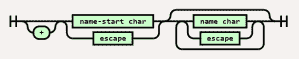
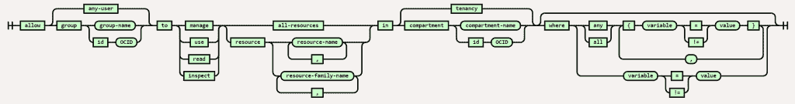
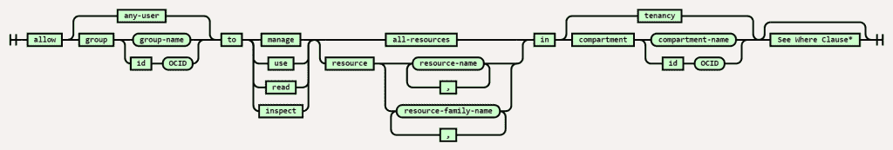
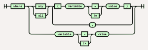
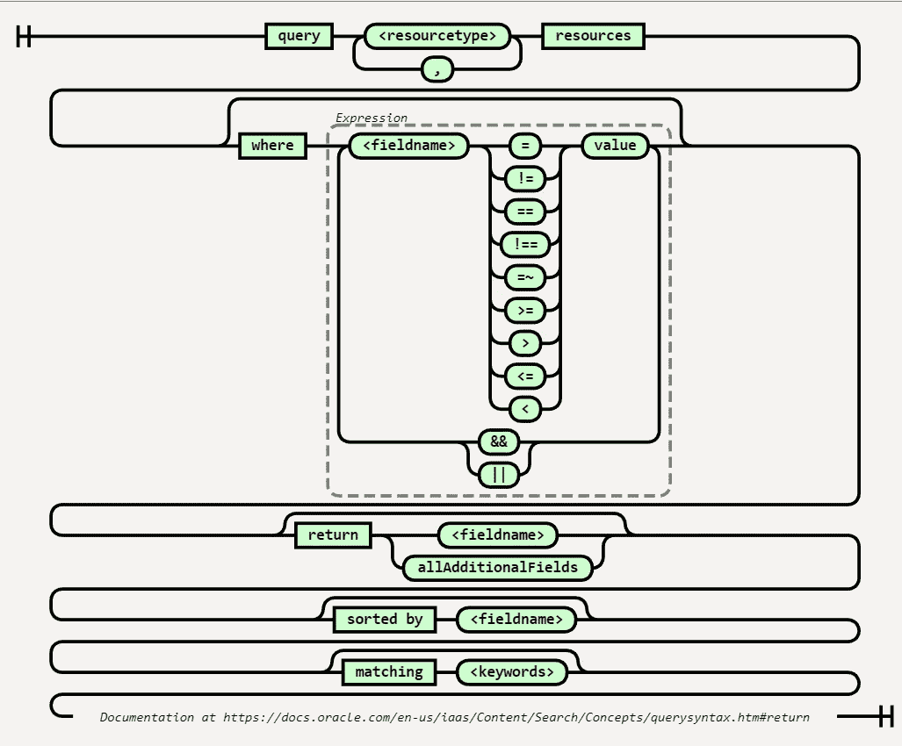

# OCI 政策的铁路图

> 原文：<https://medium.com/oracledevs/railroad-diagrams-for-oci-policies-219ac6612728?source=collection_archive---------6----------------------->

很久以来，我一直是铁路语法图的粉丝。我总是发现它们是一种以有效的方式理解语法选项和保留/关键字的简单方法。

我一直在文档中寻找常见情况下不使用的 [OCI](https://cloud.oracle.com/) 策略语法中的关键字。过了一会儿，我找到了我需要的东西。但是铁路代表可以帮助我毫不费力地得到正确的表达。

政策文件可在以下网址找到:

*   [https://docs . Oracle . com/en-us/iaas/Content/Identity/Concepts/policy syntax . htm](https://docs.oracle.com/en-us/iaas/Content/Identity/Concepts/policysyntax.htm)
*   [https://docs . Oracle . com/en-us/iaas/Content/Identity/Reference/policy Reference . htm](https://docs.oracle.com/en-us/iaas/Content/Identity/Reference/policyreference.htm)
*   [https://docs . Oracle . com/en-us/iaas/Content/Identity/policy reference/policy reference . htm](https://docs.oracle.com/en-us/iaas/Content/Identity/policyreference/policyreference.htm)

一旦我解决了我的问题，我决定看看我是否能找到可以轻松创建铁路图的东西，并在 [GitHub](https://github.com/tabatkins/railroad-diagrams) 上遇到了来自 [Tab Atkins Jr.](https://xanthir.com/) 的一段奇妙的代码。这是一段整洁的 JavaScript，甚至可以从他们的 GitHub 页面运行——转到[这里](https://tabatkins.github.io/railroad-diagrams/generator.html)。Tab 花时间很好地记录了这个工具，所以制定定义这个图的语法很简单(因为这个工具写得很好，所以您不需要读太多)。

下图显示了在单个图像中编写 OCI 策略的语法，为了便于阅读，将完整的语法分成了两个图像。它还解决了一个事实，即你通常不需要 *Where* 子句。

如果需要更新图表，工具的源代码在我的 [GitHub 库](https://github.com/mp3monster/oci-railroad-syntax-diagrams)中。该实用程序的一个非常酷的特性是，填充编辑器视图的信息包含在 URL 中(这确实会产生一个很长的 URL)，但这意味着如果您想修改定义，这个链接会直接将您带到视图和编辑器。所以链接是:

*   [单图](https://tabatkins.github.io/railroad-diagrams/generator.html#Diagram(%0A%20%20NonTerminal('allow')%2C%0A%20%20Choice(1%2C%0A%20%20%20%20NonTerminal('any-user')%2C%0A%20%20%20%20Sequence(NonTerminal('group')%2C%20%0A%20%20%20%20%20%20Choice%20(0%2C%20%0A%20%20%20%20%20%20%20'group-name'%2C%20%0A%20%20%20%20%20%20%20Sequence%20(NonTerminal('id')%2C%20'OCID')%0A%20%20%20%20%20%20)%0A%20%20%20%20)%0A%20%20)%2C%0A%20%20NonTerminal('to')%2C%0A%20%20Choice(0%2C%0A%20%20%20%20%20%20NonTerminal('manage')%2C%0A%20%20%20%20%20%20NonTerminal('use')%2C%0A%20%20%20%20%20%20NonTerminal('read')%2C%0A%20%20%20%20%20%20NonTerminal('inspect'))%2C%0A%20%20Choice%20(0%2C%0A%20%20%20%20%20%20NonTerminal%20('all-resources')%2C%0A%20%20%20%20%20%20Sequence(NonTerminal('resource')%2C%0A%20%20%20%20%20%20%20Choice(0%2C%0A%20%20%20%20%20%20%20%20%20OneOrMore('resource-name'%2C%20%0A%20%20%20%20%20%20%20%20%20%20%20NonTerminal('%2C')%0A%20%20%20%20%20%20%20%20%20)%2C%0A%20%20%20%20%20%20%20%20%20OneOrMore('resource-family-name'%2C%20%0A%20%20%20%20%20%20%20%20%20%20%20NonTerminal('%2C')))%0A%20%20%20%20%20%20%20%20%20)%20%20%0A%20%20)%2C%0A%20%20NonTerminal('in')%2C%0A%20%20Choice(1%2C%0A%20%20%20%20NonTerminal('tenancy')%2C%0A%20%20%20%20Sequence(%0A%20%20%20%20%20%20NonTerminal('compartment')%2C%20%0A%20%20%20%20%20%20Choice(0%2C%0A%20%20%20%20%20%20%20%20'compartment-name'%2C%0A%20%20%20%20%20%20%20%20Sequence(NonTerminal('id')%2C%20'OCID')%0A%20%20%20%20%20%20)%0A%20%20%20%20)%0A%20%20)%2C%0A%20%20Optional(%0A%20%20%20%20Sequence(%0A%20%20%20%20%20%20NonTerminal('where')%2C%0A%20%20%20%20%20%20Choice(0%2C%0A%20%20%20%20%20%20%20%20Sequence(Choice(0%2C%20NonTerminal('any')%2C%20NonTerminal('all'))%2C%0A%20%20%20%20%20%20%20%20OneOrMore(%0A%20%20%20%20%20%20%20%20%20%20Sequence(%0A%20%20%20%20%20%20%20%20%20%20%20NonTerminal%20('%7B')%2C%0A%20%20%20%20%20%20%20%20%20%20'variable'%2C%0A%20%20%20%20%20%20%20%20%20%20Choice(0%2C%20%0A%20%20%20%20%20%20%20%20%20%20%20%20%20NonTerminal('%3D')%2C%20%0A%20%20%20%20%20%20%20%20%20%20%20%20%20NonTerminal('!%3D')%0A%20%20%20%20%20%20%20%20%20%20%20)%2C%0A%20%20%20%20%20%20%20%20%20%20'value'%2C%0A%20%20%20%20%20%20%20%20%20%20NonTerminal%20('%7D'))%2C%20'%2C')%0A%20%20%20%20%20%20%20%20)%2C%0A%20%20%20%20%20%20%20Sequence('variable'%2CChoice(0%2C%20NonTerminal('%3D')%2C%20NonTerminal('!%3D'))%2C'value')%0A%20%20%20%20%20)%0A%20%20%20)%0A%20%20)%0A)%0A)
*   两部分图:
*   [第二部分](https://tabatkins.github.io/railroad-diagrams/generator.html#Diagram(%0A%20%20%20%20Sequence(%0A%20%20%20%20%20%20NonTerminal('where')%2C%0A%20%20%20%20%20%20Choice(0%2C%0A%20%20%20%20%20%20%20%20Sequence(Choice(0%2C%20NonTerminal('any')%2C%20NonTerminal('all'))%2C%0A%20%20%20%20%20%20%20%20OneOrMore(%0A%20%20%20%20%20%20%20%20%20%20Sequence(%0A%20%20%20%20%20%20%20%20%20%20%20NonTerminal%20('%7B')%2C%0A%20%20%20%20%20%20%20%20%20%20'variable'%2C%0A%20%20%20%20%20%20%20%20%20%20Choice(0%2C%20%0A%20%20%20%20%20%20%20%20%20%20%20%20%20NonTerminal('%3D')%2C%20%0A%20%20%20%20%20%20%20%20%20%20%20%20%20NonTerminal('!%3D')%0A%20%20%20%20%20%20%20%20%20%20%20)%2C%0A%20%20%20%20%20%20%20%20%20%20'value'%2C%0A%20%20%20%20%20%20%20%20%20%20NonTerminal%20('%7D'))%2C%20'%2C')%0A%20%20%20%20%20%20%20%20)%2C%0A%20%20%20%20%20%20%20Sequence('variable'%2CChoice(0%2C%20NonTerminal('%3D')%2C%20NonTerminal('!%3D'))%2C'value')%0A%20%20%20%20%20)%0A%20%20%20)%0A)%0A)

# 单一图表视图

OCI Policies Syntax — Railroad Syntax Diagram

# 分割(两部分)视图

OCI Policies Syntax — Railroad Syntax Diagram (Part 1)

OCI Policies Syntax — Railroad Syntax Diagram (Part 2)

# OCI 查询语法

OCI 提供了一个相当强大的查询功能来查找 OCI 控制台顶部提供的资源。尽管语法不像策略那样复杂，但是表达式仍然有一系列不同的部分。所以我们也为此绘制了一张铁路图。

OCI Query — Railroad Syntax Diagram

*   ***<资源类型>*** 指所有可以使用和创建的不同资源类型。这大致与可以地形化的实体相关。例如，*集群节点池* (OKE)和*路由表*(核心服务-网络)。
*   ***<字段名称>*** 是指资源的属性，如*显示名称*和*预定义标签*。
*   ***<关键词>*** 是字段中使用的词(不需要完全匹配)。

我们还利用了表达式语法中的另一个特性，将流堆叠得更多一些。访问编辑器可以在这里找到[。](https://tabatkins.github.io/railroad-diagrams/generator.html#Diagram(%0AStack(%0ASequence(NonTerminal('query')%2COneOrMore(Terminal('%3Cresourcetype%3E')%2C%20'%2C')%2C%20NonTerminal('resources'))%2C%0AOptional(Sequence%20(NonTerminal('where')%2C%20Group(OneOrMore(Sequence(Terminal('%3Cfieldname%3E')%2CChoice%20(0%2C%20'%3D'%2C%20'!%3D'%2C%20'%3D%3D'%2C%20'!%3D%3D'%2C%20'%3D~'%2C%20'%3E%3D'%2C%20'%3E'%2C%20'%3C%3D'%2C%20'%3C')%2C%20Terminal('value'))%2C%20Choice(0%2C'%26%26'%2C%20'%7C%7C'))%2C'Expression')))%2C%0AOptional%20(Sequence(NonTerminal('return')%2C%20Choice(0%2C'%3Cfieldname%3E'%2C%20'allAdditionalFields')))%2C%0A%0AOptional(Sequence(NonTerminal('sorted%20by')%2C%20'%3Cfieldname%3E'))%2C%0AOptional(Sequence(NonTerminal('matching')%2C%20Terminal('%3Ckeywords%3E')))%2C%0AComment('Documentation%20at%20https%3A%2F%2Fdocs.oracle.com%2Fen-us%2Fiaas%2FContent%2FSearch%2FConcepts%2Fquerysyntax.htm%23return'%2C'https%3A%2F%2Fdocs.oracle.com%2Fen-us%2Fiaas%2FContent%2FSearch%2FConcepts%2Fquerysyntax.htm%23return'%2C'docs'%2C'https%3A%2F%2Fdocs.oracle.com%2Fen-us%2Fiaas%2FContent%2FSearch%2FConcepts%2Fquerysyntax.htm%23return'))%0A))

想讨论一下吗？加入我们的[开发者公共松弛频道](https://bit.ly/devrel_slack)！