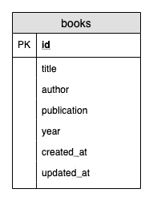

# Rancang Database-mu dengan Migration Pada Laravel

> 原文：<https://medium.easyread.co/rancang-database-mu-dengan-migration-pada-laravel-28d419d0089e?source=collection_archive---------0----------------------->

## Part 6 — Migration


Photo by [Barth Bailey](https://unsplash.com/@7bbbailey?utm_source=medium&utm_medium=referral) on [Unsplash](https://unsplash.com?utm_source=medium&utm_medium=referral)

# Laravel Series List

[**0\. Laravel Series — Belajar Laravel dari Awal yok!**](https://medium.com/easyread/laravel-series-belajar-laravel-dari-awal-yok-c21dc47863da)[**1\. Persiapan untuk Pengerjaan Proyek dengan Laravel**](https://medium.com/easyread/persiapan-untuk-pengerjaan-proyek-dengan-laravel-2f9a99146313)[**2\. Pengenalan Laravel Framework**](https://medium.com/easyread/pengenalan-laravel-framework-1c829b8164af)[**3\. Instalasi Laravel Framework**](https://medium.com/easyread/instalasi-laravel-framework-41eeec1551ef)[**4\. Struktur Folder Laravel Framework**](https://medium.com/easyread/struktur-folder-laravel-framework-299f0225cd55)[**5\. Apa itu Artisan CLI pada Laravel?**](https://medium.com/easyread/apa-itu-artisan-cli-pada-laravel-62a94232a29a) **6\. Rancang Database-mu dengan Migration Pada Laravel — (You’re here)** [**7\. Mengarahkan Request dengan Router pada Laravel**](https://medium.com/easyread/mengarahkan-request-dengan-router-pada-laravel-a0df91142f51)[**8\. Olah Request dengan Controller pada Laravel**](https://medium.com/easyread/olah-request-dengan-controller-pada-laravel-a77b52235a4b)[**9\. Mudahnya Mengolah Data Menggunakan Model dan Eloquent pada Laravel**](https://medium.com/easyread/mudahnya-mengolah-data-menggunakan-model-dan-eloquent-pada-laravel-80af915c80b5)[**10\. Membuat Tampilan Web dengan Blade pada aplikasi Laravel — Part I**](https://medium.com/easyread/membuat-tampilan-web-dengan-blade-pada-aplikasi-laravel-part-i-c9f5ceee65e6)[**11\. Membuat Tampilan Web dengan Blade pada aplikasi Laravel — Part II**](https://medium.com/easyread/membuat-tampilan-web-dengan-blade-pada-aplikasi-laravel-part-ii-9e233233972a)

Pada *part* ini kita akan belajar apa itu *migration* pada Laravel. Singkatnya begini, *migration* adalah suatu cara yang bisa kita gunakan untuk membuat skema *database* kita secara langsung dengan mengeksekusi kode program, bukan melalui eksekusi SQL. Dengan menggunakan *migration* , kita menggantikan kode SQL dengan kode program PHP untuk membuat skema *database* kita. Masih bingung? Saya harap teman-teman tidak bingung. Kalau masih bingung, mungkin kalau dikasih contoh bisa lebih memahami. *Semoga ya ~*

Sebelum kita melanjutkan pembuatan *migration,* pertama sekali kita perlu merancang *database* kita. Seperti yang saya ceritakan dipart sebelumnya, kita akan membuat aplikasi untuk mengolah daftar buku favorit kita. Data yang kita perlukan adalah data pengguna dan data bukunya. Relasi antara tabel *user* dan tabel *books* adalah *one to many,* artinya setiap orang bisa memiliki banyak buku. Berikut gambaran table dan relasinya.



Skema database

Mungkin teman-teman ada yang bingung dengan atribut `**created_at**` dan `**updated_at**` . Simplenya, atribut `**created_at**` dan `**updated_at**` dipakai untuk menyimpan informasi kapan data tersebut diciptakan dan kapan terakhir kali data tersebut diperbaharui.

Sebelum memulai pembuatan file *migration,* pertama sekali coba teman-teman hapus semua file *migration* yang sudah ada pada folder `**database\migrations**` .

# Membuat File Migrasi

Untuk membuat file migrasi, kita akan menggunakan Artisan CLI seperti yang pernah saya jelaskan di part sebelumnya.

Untuk membuat file migrasi kita, jalankan perintah berikut.

```
**$ php artisan make:migration create_books_table**
```

Mari kita bedah perintah diatas

*   `**php**` adalah perintah untuk menjalankan PHP, kita butuhkan ini karena Artisan CLI dibuat menggunakan bahasa pemrograman PHP
*   `**artisan**` adalah perintah untuk menjalankan artisan itu sendiri
*   `**make:**` adalah perintah untuk membuat file baru, diikuti dengan parameter `**migration**` untuk menunjukkan bahwa kita akan membuat file *migration.* Untuk membuat *file* lainnya, bisa mengganti parameternya sesuai kebutuhan kita dan contohnya sudah ada pada part sebelumnya.
*   `**create_books_table**` adalah parameter yang menginformasikan kepada Artisan bahwa *file* *migration* yang akan kita buat adalah untuk menciptakan tabel *books.* Perlu diperhatikan, awalan `**create_**` diperlukan untuk menginformasikan Artisan bahwa kita akan membuat tabel, dengan demikian Artisan akan men- *generate file migration* yang lebih lengkap dibanding tanpa menggunakan awalan `**create_**` .

Berikut adalah contoh pembuatan *file* *migration* dengan penggunaan awalan `**create_**` . Perintah yang saya jalankan adalah

```
**php artisan make:migration create_books_table**
```

Berikut adalah contoh pembuatan *file* *migration* tanpa penggunaan awalan `**create_**` . Perintah yang saya jalankan adalah

```
**php artisan make:migration add_books_table**
```

Kita bisa melihat perbedaan pada kedua fungsi `**up()**` dan `**down()**` . Pada *file* *migration* yang ter- *generate* dengan penggunaan awalan `**create_**` , fungsi `**up()**` dan `**down()**` sudah mengenali nama tabel yang akan kita buat secara otomatis. Berbeda dengan *file* *migration* yang ter- *generate* tanpa penggunaan awalan `**create_**` , fungsi `**up()**` dan `**down()**` masih kosong, sehingga kita perlu menambahkannya secara manual. Itu salah satu trik untuk membuat *file* *migration* pada Laravel agar kerjanya lebih cepat.

Salah satu tips yang juga sangat berguna adalah mengikuti aturan penamaan yang sesuai standar Laravel, hal ini akan sangat membantu kita. Contoh yang bisa kita terapkan dalam pembuatan file *migration* adalah pada Laravel nama sebuah tabel ditandai dengan kata jamak sedangkan untuk modelnya dikenali dengan kata tunggal. Artinya untuk model dengan nama `**User**` akan dipadankan dengan tabel dengan nama `**users**` dan untuk model dengan nama `**Book**` akan dipadankan dengan tabel dengan nama `**books**` . Jika kita tidak mengikuti aturan penamaan ini, kita perlu menentukan secara manual apa nama tabel yang berpadanan dengan model kita.

# Melengkapi File Migrasi

Tahapan berikutnya adalah melengkapi *file* *migration* kita. Pada *file* *migration* `**create_users_table**` , lengkapi fungsi `**up()**` seperti contoh dibawah ini.

Mari kita bedah potongan kode program diatas.

*   `**Schema::create('books', …**` adalah kode program untuk membuat tabel. Parameter `**books**` adalah sebagai nama tabel yang akan dibuat. Jika diterjemahkan ke kode program SQL maka perintah diatas sama dengan `**CREATE TABLE books (....**`
*   `**$table->bigIncrements('id')**` adalah kode program untuk membuat atribut `id` dengan ketentuan bertipe data *big* *int, unsigned,* bersifat *not null,* bersifat *auto_increment,* dan dijadikan sebagai *primary key. Unsigned* artinya nilainya tidak akan bisa negatif, *not null* artinya tidak boleh dikosongkan, *auto_increment* artinya akan bertambah secara otomatis ketika menambah data baru. Jika diterjemahkan ke kode program SQL maka perintah diatas sama dengan `**'id' int unsigned not null auto_increment primary key**` .
*   `**$table->string('title')**` adalah kode program untuk membuat atribut `name` dengan ketentuan bertipe data *varchar(255)* dan bersifat *not null. Varchar(255)* artinya adalah tipe berupa rangkaian karakter dengan panjang maksimal 255 karakter, sama dengan 255 bit, karena setiap karakter membutuhkan alokasi memori sebesar 1 bit. Angka 255 adalah angka *default* dan bisa diganti dengan kebutuhan panjang data kita dengan cara mengubah kode program menjadi `**$table->string('title', 100)**` , untuk panjang maksimal 100 karakter. Jika diterjemahkan ke kode program SQL maka perintah diatas sama dengan `**'name' varchar(255) not null**` . Hal yang sama berlaku juga untuk kode program `**$table->string(‘author’)**` dan `**$table->string(‘publication’)**`
*   `**$table->unsignedInteger('year')**` adalah kode program untuk membuat atribut `**year**` dengan ketentuan *int unsigned not null.* Kita buat bersifat *unsigned* untuk membatasi kesalahan memasukkan data berupa bilangan negatif. Jika diterjemahkan ke kode program SQL maka perintah diatas sama dengan `**'year' int unsigned not null**`
*   `**$table->timestamps()**` adalah potongan kode untuk membuat atribut `**created_at**` dan `**updated_at**` dengan ketentuan *timestamp null. Timestamp* adalah tipe data untuk menyimpan tanggal dan waktu sekaligus. *Null* artinya tidak wajib disini. Jika diterjemahkan ke kode program SQL maka perintah diatas sama dengan `**'created_at' timestamp null, 'updated_at’ timestamp null**`

Jadi untuk potongan kode fungsi `**up()**` diatas jika diterjemahkan ke kode program SQL, maka hasilnya akan seperti ini.

# Mengeksekusi File Migrasi

Setelah *file* *migration* kita lengkapi, maka saatnya untuk mengeksekusi *file* *migration* kita. Kita akan menggunakan Artisan CLI untuk mengeksekusi *file* *migration* kita. Sebelumnya, pastikan teman-teman sudah mengisi konfigurasi koneksi ke *database* pada file `**.env**` . Lalu jalankan perintah berikut

```
**php artisan migrate**
```

Jika tidak ada pesan error yang muncul itu pertanda bahwa *migration* berjalan dengan benar. Coba perhatikan *database* teman-teman, jika *migration* berjalan dengan baik seharusnya tabel `**users**` dan tabel `**books**` sudah tercipta. Kalau ada coba baca pesan error-nya dan temukan solusinya di stackoverflow atau di forum-forum :D

# Haruskah dengan Migration?

Bagi teman-teman yang terbiasa dengan merancang skema *database* menggunakan *database GUI tools* mungkin agak janggal menggunakan *migration.* Saya juga dulu seperti itu kok. Tetapi kita tidak diwajibkan untuk menggunakan *migration* untuk pengembangan aplikasi dengan *framework* Laravel *.* Teman-teman bisa juga menggunakan cara biasa yang teman-teman pakai untuk merancang *database* .

Tapi setelah mengetahui kelebihan menggunakan *migration,* saya selalu menggunakan *migration* untuk setiap proyek Laravel yang saya kerjakan. Kelebihan yang saya rasakan adalah

*   Tidak perlu `**.sql**` file untuk men- *generate* skema *database* ketika orang lain ingin menggunakan aplikasi kita. Sama juga halnya ketika ingin men-deploy aplikasi ke server, kita tinggal menjalankan perintah Artisan-nya untuk men- *generate* skema *database* kita *.*
*   Adanya catatan perubahan pada skema *database* kita. Jika tidak menggunakan *migration* , kita akan langsung mengubah rancangan *database* melalui *GUI tools* atau *CLI tools* dan kita tidak bisa mengingat sejarah perubahannya. Jika menggunakan *migration,* setiap file *migration* menjadi catatan perubahan yang terjadi pada skema *database* kita.
*   Kode program pada file *migration* lebih mudah dibaca dibanding kode program SQL. Cuma saya yang merasa seperti itu? :D


Taken from me.me