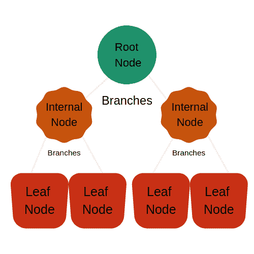
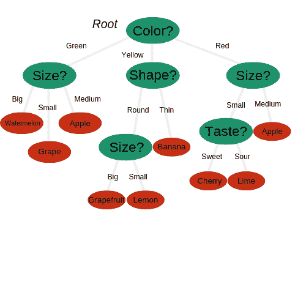
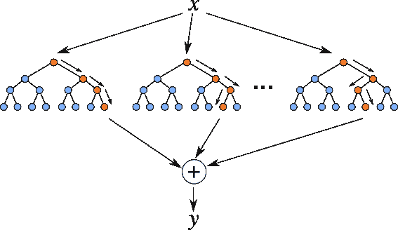
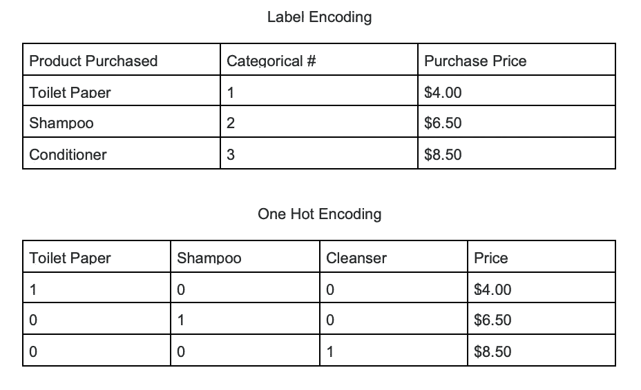
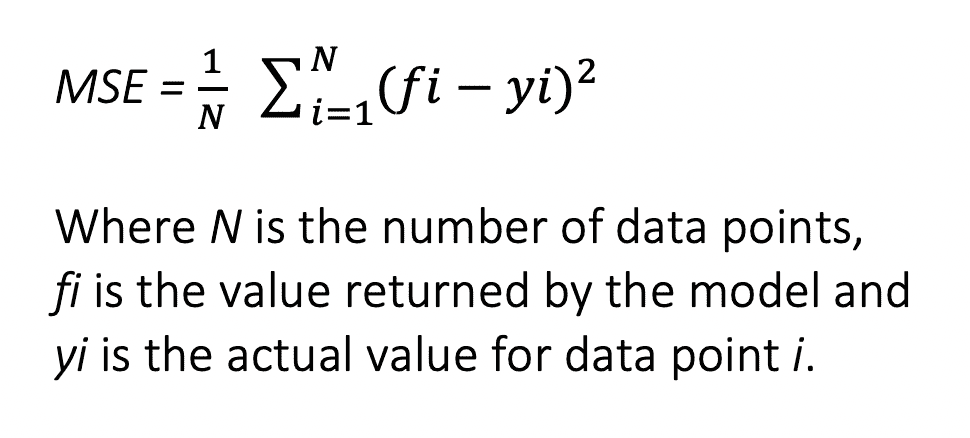
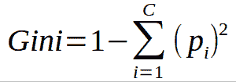
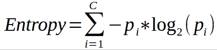

# 机器学习的随机森林算法

> 原文：<https://medium.com/capital-one-tech/random-forest-algorithm-for-machine-learning-c4b2c8cc9feb?source=collection_archive---------2----------------------->

## 机器学习算法介绍系列的第 4 部分

*我们已经讲述了* [*k 近邻*](/capital-one-tech/k-nearest-neighbors-knn-algorithm-for-machine-learning-e883219c8f26) *和* [*k 均值聚类*](/capital-one-tech/k-means-clustering-algorithm-for-machine-learning-d1d7dc5de882) *，以及* [*朴素贝叶斯分类器*](/capital-one-tech/naives-bayes-classifiers-for-machine-learning-2e548bfbd4a1) *，今天我们将讲述随机森林算法。*

# 介绍

你曾经问过自己一系列问题来帮助你对某件事做出最终决定吗？也许这是一个简单的决定，就像你晚饭想吃什么一样。你可能会问自己，你是想做饭，还是想去取食物，还是想去送货。如果你决定做饭，那么你需要弄清楚你想吃什么类型的菜肴。最后，你可能需要弄清楚你的冰箱里是否有所有的食材，或者需要跑一趟商店。找到这些问题的答案会帮助你在那天晚上的晚餐上做出最后的决定。

我们每天都要多次使用这个决策过程。在机器学习领域，这个过程被称为*决策树*。你从一个节点开始，然后分支到另一个节点，重复这个过程，直到你到达一个叶子。一个节点提出一个问题，以帮助对数据进行分类。一个分支代表这个节点可能导致的不同可能性。叶子是决策树的末端，或者不再有任何分支的节点。

R [andom Forest](https://en.wikipedia.org/wiki/Random_forest) 算法由不同的决策树组成，每个决策树都有相同的节点，但是使用不同的数据导致不同的树叶。它合并多个决策树的决策，以便找到一个答案，该答案代表所有这些决策树的平均值。

随机森林算法是一种[监督学习](https://en.wikipedia.org/wiki/Unsupervised_learning)模型；它使用已标记的数据来“学习”如何对未标记的数据进行分类。这与 K-means 聚类算法相反，我们在过去的文章中了解到，K-means 聚类算法是一种无监督的学习模型。随机森林算法用于解决回归和分类问题，使其成为工程师广泛使用的多样化模型。

**优点:**

*   用于回归和分类问题，使其成为一个多样化的模型。
*   防止数据过度拟合。
*   用测试数据快速训练。

**缺点:**

*   一旦模型制作完成，创建预测的速度很慢。
*   必须小心数据中的异常值和漏洞。

[https://dsc-spidal.github.io/harp/docs/examples/rf/](https://dsc-spidal.github.io/harp/docs/examples/rf/)

在上面的例子中，我们有三个单独的决策树，它们共同组成了一个随机森林。随机森林被认为是[集成学习](https://en.wikipedia.org/wiki/Ensemble_learning)，这意味着它有助于通过使用多个模型来得出结论，从而创建更准确的结果。该算法使用每个节点的叶子或最终决策来得出自己的结论。这增加了模型的准确性，因为它会查看许多不同决策树的结果并找到平均值。

# 在哪里使用随机森林

## **回归举例**

假设您想要估计您所在城镇的平均家庭收入。使用随机森林算法可以很容易地找到一个估计值。你可以从分发调查问卷开始，让人们回答一些不同的问题。根据他们如何回答这些问题，将为每个人产生一个估计的家庭收入。

找到多人的决策树后，可以对这些数据应用随机森林算法。您将查看每个决策树的结果，并使用随机森林来查找所有决策树之间的平均收入。应用这种算法将为你提供被调查者平均家庭收入的准确估计。

## **分类举例**

我们的下一个例子处理分类数据，或者非数字数据。假设你正在为一家新公司做市场调查，这家公司想知道什么样的人可能会购买他们的产品。首先，你可能会问同一目标市场中的一些人一系列关于他们购买行为和他们喜欢的产品种类的问题。根据他们的回答，你可以将他们归类为潜在客户或潜在客户。

在对这些结果应用随机森林算法之前，你需要执行一个叫做[的编码。这需要给一个分类变量分配一个数字，以便应用数学来解决问题。](https://en.wikipedia.org/wiki/One-hot)

在数据被一次性编码之后，数学可以被应用，并且随机森林算法可以得出结论。如果算法得出的结论是，这个目标市场中的大多数人都不是潜在客户，那么公司应该考虑这些类型的人，重新思考他们的产品。

# **随机森林背后的数学原理**

## **回归问题**

当使用随机森林算法解决回归问题时，您将使用[均方误差(MSE)](https://en.wikipedia.org/wiki/Mean_squared_error) 来描述您的数据如何从每个节点分支。

该公式根据预测的实际值计算每个节点的距离，有助于决定哪个分支更适合您的林。这里， *yi* 是你在某个节点测试的数据点的值， *fi* 是决策树返回的值。

## **分类问题**

当基于分类数据执行随机森林时，您应该知道您经常使用[基尼指数](https://en.wikipedia.org/wiki/Gini_coefficient)，或者用于决定决策树上的节点如何分支的公式。

此公式使用类别和概率来确定节点上每个分支的基尼系数，从而确定哪个分支更有可能出现。这里， *pi* 代表你在数据集中观察的类的相对频率， *c* 代表类的数量。

您还可以使用熵来确定决策树中节点的分支方式。

[熵](https://en.wikipedia.org/wiki/Entropy_(information_theory))使用某个结果的概率来决定节点应该如何分支。与基尼指数不同的是，由于在计算基尼指数时使用了对数函数，所以基尼指数更具有数学内涵。

# 结论

在完全理解随机森林算法之前，理解单个决策树是非常重要的。你必须了解节点、分支和叶子之间的区别，以及如何应用不同的公式来做出最终决定。

正确使用时，随机森林算法对所有不同类型的数据集都非常有用，无论是回归数据还是分类数据。它易于使用，训练速度快，并能找到它所使用的决策树的准确表示。

有关更多资源，请查看一些使用随机森林的项目:

*   [使用 Python 的随机森林练习](https://www.kaggle.com/dansbecker/exercise-random-forests)
*   [从头开始构建随机森林模型](https://machinelearningmastery.com/implement-random-forest-scratch-python/)
*   [随机森林教程使用 R](https://www.guru99.com/r-random-forest-tutorial.html)

# 相关:

*   [用于机器学习的 K-Means 聚类算法](/capital-one-tech/k-means-clustering-algorithm-for-machine-learning-d1d7dc5de882)
*   [机器学习的 K-最近邻(KNN)算法](/capital-one-tech/k-nearest-neighbors-knn-algorithm-for-machine-learning-e883219c8f26)
*   [用于机器学习的朴素贝叶斯分类器](/capital-one-tech/naives-bayes-classifiers-for-machine-learning-2e548bfbd4a1)
*   [用于机器学习的人工神经网络](/capital-one-tech/artificial-neural-networks-for-machine-learning-79c67d0681e9)

披露声明:2019 首创一。观点是作者个人的观点。除非本帖中另有说明，否则 Capital One 不隶属于所提及的任何公司，也不被这些公司认可。使用或展示的所有商标和其他知识产权是其各自所有者的财产。