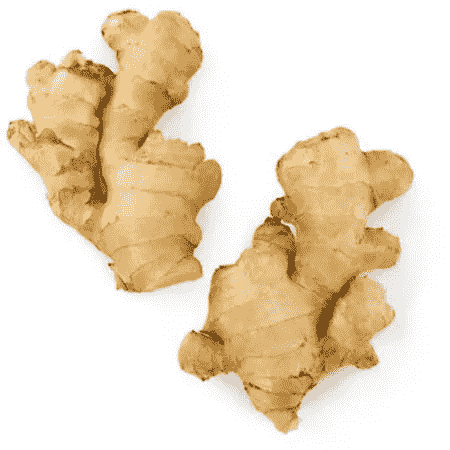
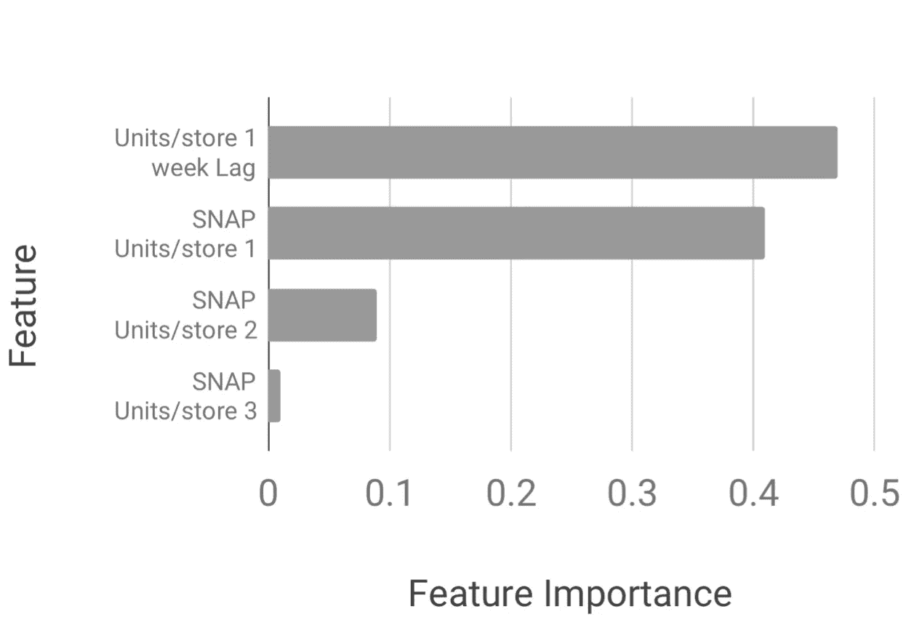
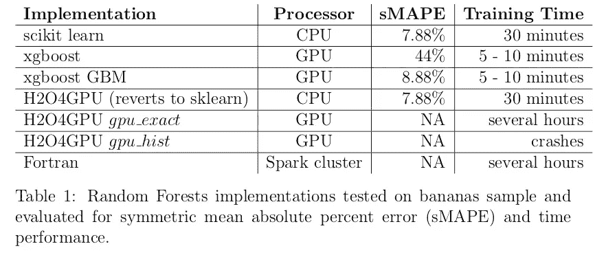

# 沃尔玛规模商店预测的随机森林

> 原文：<https://medium.com/walmartglobaltech/random-forests-for-store-forecasting-at-walmart-scale-82af5b55a4db?source=collection_archive---------4----------------------->

由苏切塔·贾瓦尔卡、约翰·鲍曼撰写

沃尔玛实验室的智能预测团队的任务是每周为超过 7000 万种商店商品组合提供需求预测！例如，在接下来的 52 周内，每一周美国的每一家沃尔玛商店需要多少种生姜，目的是提高库存和减少食物浪费。

我们的算法策略是建立一套机器学习模型，并大规模部署它们，为(哦，太多了！)商店-商品-周组合。随机森林将是这个套件的一部分。

我们经历了数据发现、识别需求驱动因素、功能工程、培训、交叉验证和测试的传统模型开发工作流程。

**功能工程和概念验证**

模型输入来自领域专业知识，包括

*   商店级别特征，如地理位置、商店大小、商店开业后的天数
*   日期功能，如月份和星期几
*   事件提升特征，如圣诞节、感恩节等
*   来自针对低收入家庭的补充营养援助计划(SNAP)的提升功能
*   滞后特征，如过去两周的平均销售额

我们建立了香蕉的概念证明，这是沃尔玛最高的速度项目之一，并评估了对称平均绝对百分比误差作为我们的预测准确性指标。我们发现 SNAP 特性是香蕉最重要的特性之一。

然后我们看了结果

*   苹果
*   包装沙拉
*   排骨和背排骨

这三个类别都有独特的需求预测问题，对于进入算法套件的任何模型来说都是很好的测试。随机森林优于苹果现有的梯度提升机器和状态空间模型，表明了具有大规模商业影响的可行解决方案。

然后，我们对肉类和农产品的所有类别运行随机森林模型，并在测试集上评估我们的指标，测试集是从训练数据中保留的连续 52 周的时间段。

我们的模型是根据七年销售历史构建的功能进行训练的。培训在周中进行，预测在周五销售结束后进行。预测必须在短时间内进行，所有预测都必须在周末进行补充。

随机森林模型在周中被腌制、压缩并存储在对象存储中。该模型随后于周五从 object store 中取出，并用于预测需求。

**研究要紧(不好双关警惕！)**

我们评估了三种绕过收养障碍的选择——

第一个是看我们是否可以减少功能的数量，并把自己扔进超级参数调整的兔子洞里。原来有一篇超级酷的论文是由 [S. Bernard 写的。l .厄特和 s .亚当](https://hal.archives-ouvertes.fr/hal-00436358/document)的文章，其中有许多关于调整每个节点所选特性数量的宝贵见解。我们采用了多维超参数的 [Sobol 序列](/@antoine_savine/sobol-sequence-explained-188f422b246b)路线，而不是具有有希望的早期结果的网格搜索。超参数调整是一个缓慢的过程。沃尔玛规模的超参数调整是一个非常缓慢的过程。

第二个是评估随机森林的替代实现。Scikit-learn 提供了最好的度量性能，因此我们计划继续使用它。

第三个解决方案是一个高性能计算选项。Python 在其模型文件中存储了所有可能有用的信息。通过在写出模型对象之前解析模型对象，只保存相关的数据，可以构建一个最小的模型文件。我们还可以使用最小尺寸表示来存储字段，例如，阈值、浮点值(双精度值的一半)、短整数的特征 id(整数的一半；整数形式的节点 id。我们用 zstd 多线程压缩代替了 gzip 压缩(无处不在！)

我们测试了 HPC 解决方案，发现性能提高了一个数量级。具体到 mangoes，模型大小从 Python 中的 12.58 GB 变成了 C++中的 1.02 GB 得分时间从 30 分钟变成了 27 秒。

停下来静静地思考。

**展望**

我们的结论是，随机森林是一个可行的、可扩展的选项，可用于预测具有广泛季节性趋势的高速度项目的需求，这些项目没有很多尖峰行为，例如苹果、芒果、生姜和大蒜。我们目前正在将我们的工作扩展到生产类别，并在其他几个部门测试该模型！

*感谢 John Bowman 对 HPC 工作的技术领导；Ritesh Agarwal 负责 HPC 工作；向 Amir Motaei 寻求技术反馈；Anton Bubna-Litic 负责特征工程工作；Abhishek Kumar 负责 ML 工程支持；和 Abhinav Prateek 提供产品支持。*

我在威廉玛丽学院获得了实验核物理博士学位，在 T2 杜克大学和 T4 圣塔克拉拉大学的物理系做了博士后研究，在那里我模拟了数十亿字节的散射数据，以了解已知宇宙的微小结构。我是 Insight 数据科学研究员，Aspen 学者，喜欢大规模研究机器学习！