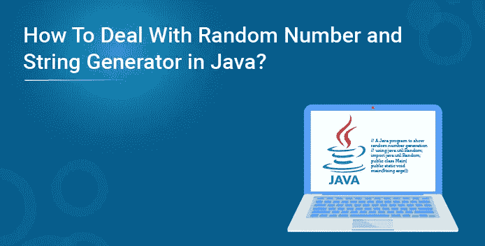
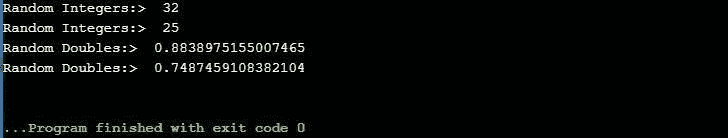
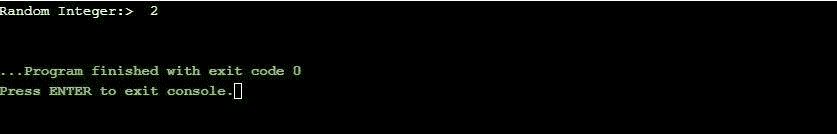
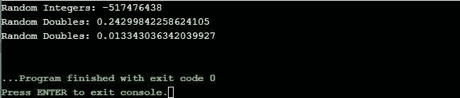
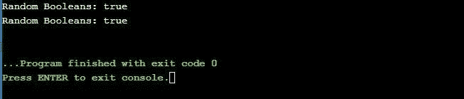
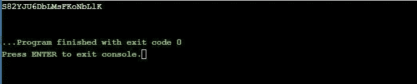
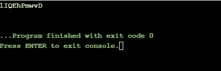
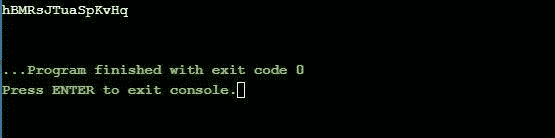

# Java 中的随机数和字符串生成器

> 原文：<https://medium.com/edureka/random-number-and-string-generator-in-java-9c8d8332728f?source=collection_archive---------0----------------------->



本文将向您介绍 Java 中的随机数和字符串生成器，并通过编程演示来跟进。本文将涉及以下几点:

*   Java.util.Random
*   Math.random()
*   Java . util . concurrent . thread local random 类
*   在 Java 中生成随机字符串
*   使用 Math.random()
*   使用字符集
*   使用正则表达式

在 java 中，有三种使用内置方法和类生成随机数的方法。

*   Java.util.Random 类
*   数学。随机方法
*   ThreadLocalRandom 类

因此，让我们开始阅读关于 Java 中随机数和字符串生成器的文章，

# Java.util.Random

首先，我们需要在程序中创建该类的一个实例，然后使用我们创建的实例调用各种内置方法，如 nextInt()、nextDouble()等。使用这个类可以创建整数、浮点、双精度、长整型、布尔型的随机数。
参数可以传递给定义上限的方法，直到生成数字。例如，nextInt(4)将生成范围为 0 到 3(包括 0 和 3)的数字。

**例 1:**

```
// A Java program to demonstrate working of
// Math.random() to generate random numbers
import java.util.*;
public class Main
{
public static void main(String args[])
{
// Generating random value of data type double
System.out.println("Random value: " + Math.random());
}
}
```

**输出:**



**举例:**

```
// A Java program to demonstrate working of
// Math.random() to generate random numbers
import java.util.*;
public class Main
{
public static void main(String args[])
{
// Generating random value of data type double
System.out.println("Another Random value: " + Math.random());
}
}
```

**输出:**



继续这篇关于 java 中的随机数和字符串生成器的文章

# Math.random()

名为 Math 的类包含各种方法，用于执行许多不同的数字运算，包括对数、求幂等。在这些操作中，有一个 random()用于生成范围在 0.0 和 1.0 之间的 doubles 类型的随机数。此方法返回一个大于或等于 0.0 且小于或等于 1.0 的 double 值以及一个正号。random()返回的值是机器随机选择的。

**例 1:**

```
// A Java program to demonstrate working of ThreadLocalRandom
// for generating random numbers.
import java.util.concurrent.ThreadLocalRandom;
public class Main
{
public static void main(String args[])
{
// Generating random integers in range 0 to 99
int int2 = ThreadLocalRandom.current().nextInt();
// Printing random integer
System.out.println("Random Integers: " + int2);
// Generating Random doubles
double dub1 = ThreadLocalRandom.current().nextDouble();
double dub2 = ThreadLocalRandom.current().nextDouble();
// Printing random doubles
System.out.println("Random Doubles: " + dub1);
System.out.println("Random Doubles: " + dub2);
}
}
```

**输出:**



**例 2:**

```
// Java program to demonstrate working of ThreadLocalRandom
// to generate random numbers.
import java.util.concurrent.ThreadLocalRandom;
public class Main
{
public static void main(String args[])
{
// Generating random booleans
boolean bool1 = ThreadLocalRandom.current().nextBoolean();
boolean bool2 = ThreadLocalRandom.current().nextBoolean();
// Print random Booleans
System.out.println("Random Booleans: " + bool1);
System.out.println("Random Booleans: " + bool2);
}
}
```

**输出:**



**例 2:**

```
// Java program to demonstrate working of ThreadLocalRandom
// to generate random numbers.
import java.util.concurrent.ThreadLocalRandom;
public class Main
{
public static void main(String args[])
{
// Generating random booleans
boolean bool1 = ThreadLocalRandom.current().nextBoolean();
boolean bool2 = ThreadLocalRandom.current().nextBoolean();
// Print random Booleans
System.out.println("Random Booleans: " + bool1);
System.out.println("Random Booleans: " + bool2);
}
}
```

**输出:**


继续这篇关于 java 中的随机数和字符串生成器的文章

# 在 Java 中生成随机字符串

我们可以使用以下方法生成随机的字母数字字符串:

继续这篇关于 java 中的随机数和字符串生成器的文章

## 使用 Math.random()

下面是一个例子，可以更好地理解这个概念。

```
// A Java program generating a random AlphaNumeric String
// using Math.random() method
public class Main {
// define a function to generate a random string of length n
static String RequiredString(int n)
{
// chose a Character random from this String
String AlphaNumericString = “ABCDEFGHIJKLMNOPQRSTUVWXYZ”
+ “0123456789”
+ “abcdefghijklmnopqrstuvxyz”;
// create StringBuffer size of AlphaNumericString
StringBuilder s = new StringBuilder(n);
int y;
for ( y = 0; y < n; y++) {
// generating a random number
int index
= (int)(AlphaNumericString.length()
* Math.random());
// add Character one by one in end of s
s.append(AlphaNumericString
.charAt(index));
}
return s.toString();
}
public static void main(String[] args)
{
// Get the size n
int n = 20;
// Get and display the alphanumeric string
System.out.println(Main.RequiredString(n));
}
}
```

**输出:**



继续这篇关于 java 中的随机数和字符串生成器的文章

# 使用字符集

我们必须在这里使用一个不同的包，即 java。nio.charset 包。下面是一个说明性的例子。

```
// A Java program generate a random AlphaNumeric String
// using CharSet
import java.util.*;
import java.nio.charset.*;
class Main {
static String RequiredString(int n)
{
// length declaration
byte[] array = new byte[256];
new Random().nextBytes(array);
String randomString
= new String(array, Charset.forName("UTF-8"));
// Creating a StringBuffer
StringBuffer ra = new StringBuffer();
// Appending first 20 alphanumeric characters
for (int i = 0; i < randomString.length(); i++) { char ch = randomString.charAt(i); if (((ch >= 'a' && ch <= 'z') || (ch >= 'A' && ch <= 'Z') || (ch >= '0' && ch <= '9')) && (n > 0)) {
ra.append(ch);
n--;
}
}
// returning the resultant string
return ra.toString();
}
public static void main(String[] args)
{
// size of random alphanumeric string
int n = 10;
// Get and display the alphanumeric string
System.out.println(RequiredString(n));
}
}
```

**输出:**



继续这篇关于 java 中的随机数和字符串生成器的文章

# 使用正则表达式

实现如下例所示。

```
// A Java program generate a random AlphaNumeric String
// using Regular Expressions method
import java.util.*;
import java.nio.charset.*;
class Main {
static String getAlphaNumericString(int n)
{
// length declaration
byte[] array = new byte[256];
new Random().nextBytes(array);
String randomString
= new String(array, Charset.forName("UTF-8"));
// Creating a StringBuffer
StringBuffer ra = new StringBuffer();
// remove all spacial char
String AlphaNumericString
= randomString
.replaceAll("[^A-Za-z0-9]", "");
// Append first 20 alphanumeric characters
// from the generated random String into the result
for (int k = 0; k < AlphaNumericString.length(); k++) {
if (Character.isLetter(AlphaNumericString.charAt(k))
&& (n > 0)
|| Character.isDigit(AlphaNumericString.charAt(k))
&& (n > 0)) {
ra.append(AlphaNumericString.charAt(k));
n--;
}
}
// returning the resultant string
return ra.toString();
}
public static void main(String[] args)
{
// size of random alphanumeric string
int n = 15;
// Get and display the alphanumeric string
System.out.println(getAlphaNumericString(n));
}
}
```

**输出:**



这样我们就结束了这篇文章。如果您想了解更多，请查看 Edureka 提供的 Java 培训，这是一家值得信赖的在线学习公司。Edureka 的 Java J2EE 和 SOA 培训和认证课程旨在培训您掌握核心和高级 Java 概念以及各种 Java 框架，如 Hibernate & Spring。

如果你想查看更多关于人工智能、DevOps、道德黑客等市场最热门技术的文章，你可以参考 Edureka 的官方网站。

请留意本系列中解释 Java 其他各方面的其他文章。

> *1。* [*面向对象编程*](/edureka/object-oriented-programming-b29cfd50eca0)
> 
> *2。*[*Java 中的继承*](/edureka/inheritance-in-java-f638d3ed559e)
> 
> *3。*[*Java 中的多态性*](/edureka/polymorphism-in-java-9559e3641b9b)
> 
> *4。*[*Java 中的抽象*](/edureka/java-abstraction-d2d790c09037)
> 
> *5。* [*Java 字符串*](/edureka/java-string-68e5d0ca331f)
> 
> *6。* [*Java 数组*](/edureka/java-array-tutorial-50299ef85e5)
> 
> *7。* [*Java 收藏*](/edureka/java-collections-6d50b013aef8)
> 
> *8。* [*Java 线程*](/edureka/java-thread-bfb08e4eb691)
> 
> *9。*[*Java servlet 简介*](/edureka/java-servlets-62f583d69c7e)
> 
> *10。* [*Servlet 和 JSP 教程*](/edureka/servlet-and-jsp-tutorial-ef2e2ab9ee2a)
> 
> *11。*[*Java 中的异常处理*](/edureka/java-exception-handling-7bd07435508c)
> 
> *12。* [*Java 教程*](/edureka/java-tutorial-bbdd28a2acd7)
> 
> *13。* [*Java 面试题*](/edureka/java-interview-questions-1d59b9c53973)
> 
> *14。* [*Java 程序*](/edureka/java-programs-1e3220df2e76)
> 
> *15。*[*kot Lin vs Java*](/edureka/kotlin-vs-java-4f8653f38c04)
> 
> 16。 [*依赖注入使用*](/edureka/what-is-dependency-injection-5006b53af782)
> 
> 17。 [*堪比 Java 中的*](/edureka/comparable-in-java-e9cfa7be7ff7)
> 
> 18。 [*十大 Java 框架*](/edureka/java-frameworks-5d52f3211f39)
> 
> *19。* [*Java 反射 API*](/edureka/java-reflection-api-d38f3f5513fc)
> 
> 20。[*Java 中的 30 大模式*](/edureka/pattern-programs-in-java-f33186c711c8)
> 
> *21。* [*核心 Java 备忘单*](/edureka/java-cheat-sheet-3ad4d174012c)
> 
> *二十二。*[*Java 中的套接字编程*](/edureka/socket-programming-in-java-f09b82facd0)
> 
> *23。* [*Java OOP 备忘单*](/edureka/java-oop-cheat-sheet-9c6ebb5e1175)
> 
> *24。*[*Java 中的注释*](/edureka/annotations-in-java-9847d531d2bb)
> 
> *25。*[*Java 中的库管理系统项目*](/edureka/library-management-system-project-in-java-b003acba7f17)
> 
> *26。*[*Java 中的树*](/edureka/java-binary-tree-caede8dfada5)
> 
> *27。*[*Java 中的机器学习*](/edureka/machine-learning-in-java-db872998f368)
> 
> *28。*[*Java 中的顶级数据结构&算法*](/edureka/data-structures-algorithms-in-java-d27e915db1c5)
> 
> *29。* [*Java 开发者技能*](/edureka/java-developer-skills-83983e3d3b92)
> 
> 三十。 [*前 55 名 Servlet 面试问题*](/edureka/servlet-interview-questions-266b8fbb4b2d)
> 
> *31。*[](/edureka/java-exception-handling-7bd07435508c)*[*顶级 Java 项目*](/edureka/java-projects-db51097281e3)*
> 
> **32。* [*Java 字符串备忘单*](/edureka/java-string-cheat-sheet-9a91a6b46540)*
> 
> **33。*[*Java 中的嵌套类*](/edureka/nested-classes-java-f1987805e7e3)*
> 
> *34。 [*Java 合集面试问答*](/edureka/java-collections-interview-questions-162c5d7ef078)*
> 
> *35。[*Java 中如何处理死锁？*](/edureka/deadlock-in-java-5d1e4f0338d5)*
> 
> *36。 [*你需要知道的 50 大 Java 集合面试问题*](/edureka/java-collections-interview-questions-6d20f552773e)*
> 
> **37。*[*Java 中的字符串池是什么概念？*](/edureka/java-string-pool-5b5b3b327bdf)*
> 
> *38。[*C、C++和 Java 有什么区别？*](/edureka/difference-between-c-cpp-and-java-625c4e91fb95)*
> 
> *39。[*Java 中的回文——如何检查一个数字或字符串？*](/edureka/palindrome-in-java-5d116eb8755a)*
> 
> *40。 [*你需要知道的顶级 MVC 面试问答*](/edureka/mvc-interview-questions-cd568f6d7c2e)*
> 
> **41。*[*Java 编程语言的十大应用*](/edureka/applications-of-java-11e64f9588b0)*
> 
> **42。*[*Java 中的死锁*](/edureka/deadlock-in-java-5d1e4f0338d5)*
> 
> **43。*[*Java 中的平方和平方根*](/edureka/java-sqrt-method-59354a700571)*
> 
> **44。*[*Java 中的类型转换*](/edureka/type-casting-in-java-ac4cd7e0bbe1)*
> 
> **45。*[*Java 中的运算符及其类型*](/edureka/operators-in-java-fd05a7445c0a)*
> 
> **46。*[*Java 中的析构函数*](/edureka/destructor-in-java-21cc46ed48fc)*
> 
> **47。*[*Java 中的二分搜索法*](/edureka/binary-search-in-java-cf40e927a8d3)*
> 
> **48。*[*Java 中的 MVC 架构*](/edureka/mvc-architecture-in-java-a85952ae2684)*
> 
> **49。* [*冬眠面试问答*](/edureka/hibernate-interview-questions-78b45ec5cce8)*

**原载于 2019 年 8 月 19 日*[*https://www.edureka.co*](https://www.edureka.co/blog/random-number-and-string-generator-in-java/)*。**