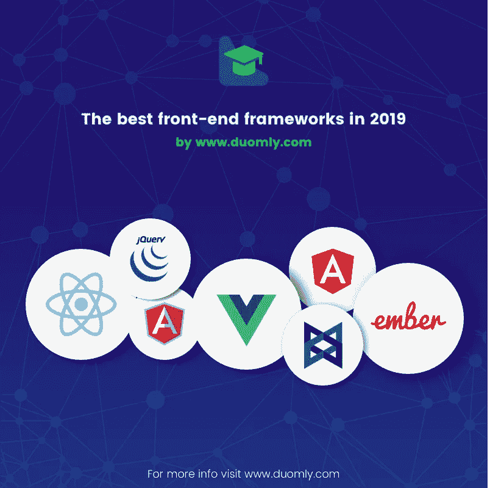

# 2019 年最佳前端框架排名

> 原文：<https://medium.com/duomly-blockchain-online-courses/ranking-of-the-best-front-end-frameworks-in-2019-777ec90c8884?source=collection_archive---------1----------------------->

[Duomly — programming online courses](https://www.duomly.com/)

本文最初发布于:[https://www . blog . duomly . com/which-front-end-framework-is-the-best-in-2019](https://www.blog.duomly.com/which-front-end-framework-is-the-best-in-2019)

框架是现代 web 和移动应用程序开发中非常强大的工具。想想脸书、网飞和 Instagram 这样的网站和应用程序。正是框架通过为用户提供完整的体验来负责不间断的运行。

最简单地说，我们可以将一个框架定义为大量预先构建的组件，这些组件使开发人员能够根据他们开发的应用程序来扩展和定制它们。大多数框架都有源代码语言 JavaScript。

记住，最重要的是，不断的技术发展，web 和移动应用程序用户的需求，以及前端开发人员支持它们的趋势，本文的主题是最流行的框架。在本文中，我根据它们的性能和受欢迎程度分析了六个最好的框架。

**1。React.js**

React 是一个基于 JavaScript 组件的库，具有 JSX 语法。

脸书的软件工程师 Jordan Walke 创建了 React 的原型，以应对网络扩张导致的脸书应用程序工作中的常见问题。官方上，它的第一个应用程序是由脸书在 2011 年获得的，两年后，2013 年，它成为一个开源库。

React 的主要特点是一个虚拟 DOM，但有必要提一下，它是单向数据绑定。得益于虚拟 DOM 特性，React 的特点是性能卓越。

从难度的高低来看，反应式是最容易学的，尤其是相比棱角分明。

**用在哪里？** 
React 专注于构建单页面 web app (SAP)和移动 app 的 UI。由于 React 是一个库，所以为了开发更复杂的应用程序，有必要包含其他几个库，我将从这些库中指定 Redux 和 React Router。此外，React Native 是构建高质量 iOS 和 Android 应用程序的额外平台。

React 以其高性能而闻名，已被证明对需要动态、经常升级和更新的应用程序要求极高。这足以说明 React，因为 Instagram 是在脸书之后实现的。

**有多受欢迎？**

说到 React 的受欢迎程度，我就看看 GitHub 的统计数据。根据目前的数据，它拥有 122，529 颗恒星，在过去的一年中，恒星每天的平均增长为 93 颗。这个库在相对较短的时间内变得流行并被广泛接受。毫无疑问，这代表了一种趋势，这个社区正在快速成长。

**使用的大项目/公司？**

除了我之前提到的公司，React 是网飞、纽约时报、雅虎的选择 Mail、Vivaldi 浏览器、Dropbox、PayPal、Pinterest、Timber、优步和许多其他应用程序。

**优点**

*   由脸书维护，
*   社区在不断发展，
*   虚拟 DOM，
*   高性能，
*   适用于高流量的应用，
*   经常更新

**缺点**

*   不支持搜索引擎优化
*   需要其他库来构建更复杂的应用程序

[Duomly — programming online courses](https://www.duomly.com/)

**2。角度**

极其流行的框架 Angular 是这个列表中唯一一个源语言是 TypeScript 的框架。

谷歌团队开发它是为了升级早期版本的 AngularJS。在发展的焦点上，一方面，满足现代需求，谈论技术，另一方面，倾向于结合实践中最好的概念。有了这个框架，谷歌团队无疑已经在这个领域设立了标准。他们在 2016 年发布了 Angular (v2)的第一个版本。在此之前，2014 年和 2015 年分别发布了 alpha 和 beta。

Angular 是一个基于组件的框架，但与 React 不同，它是一个双向数据绑定。

虽然文档和社区非常多，但是学习 Angular 很困难。文档更加混乱，尤其是对于初学者。

**用在哪里？**

Angular 用于开发 web 和移动应用程序。除了使用标准的单页应用程序和适当的库，例如 Universal，还可以创建多页应用程序。至于移动应用程序，他们承诺谷歌将为用户提供一个出色的 Ionic 平台，专注于本地应用程序和渐进式网络应用程序的开发。

**有多受欢迎？**

在 GitHub Angular，目前有 45，376 颗恒星，而在过去的一年中，平均每天的恒星数量为 33 颗。一个有趣的事实是，与增长的反应相比，恒星的数量在下降。Angular 在编程社区中已经流行了很多年，现在拥有最大的一个。

**使用 it 的大项目/公司？**

除了谷歌，Angular 还用了微软 Office Home、福布斯、Blender Video、Xbox、桑坦德银行、宝马。

**优点**

*   强大的社区，
*   双向数据绑定，
*   简单的单页 app，
*   影子 DOM，
*   以打字打的文件

**缺点**

*   复杂且不易学习，
*   必须学习打字稿，

[Duomly — programming online courses](https://www.duomly.com/)

**3。安古拉吉斯**

AngularJS 来源于前面描述的 Angular，其源语言是 JavaScript。因此，AngularJS 是由两位杰出的开发人员 Misko Hevery 和 Adam Abrons 开发的第一个版本，于 2009 年出版。随着它的出现，AngularJS 很快在专业 web 开发中流行起来。这个框架是一个双向数据绑定。

这个框架和早期的框架之间的根本区别肯定在于源语言，但也在于特征和目的。他们并没有将 AngularJS 建立在今天的现代框架概念上，但毫无疑问，他们对 AngularJS 的发展负有责任。

另外，AngularJS 有一个 MVC(模型—视图—控制器)架构。

**用在哪里？**

AngularJS 主要设计用于构建动态 web 应用程序。适合单页应用。然而，它不支持将移动应用解释为它的继承者。

**它有多受欢迎？**

这个框架在 GitHub 上总共有 59379 颗星。年平均值下降，因此每天的星级约为 3.7。如果我们考虑 Angular 的外观，这是一个标准的情况，这是一个显著改进的版本。

**使用它的大项目/公司？**

使用 AngularJS 构建的一些公司或网站有 Google Gmail、Upwork、The Guardian、HBO、Sony、General Motors、Weather。

**优点**

*   与 Angular 相比 JavaScript 友好，
*   双向数据绑定，
*   快速发展，
*   高度可测试的应用程序

**缺点**

*   难学，
*   旧版本，
*   人气低，

[Duomly — programming online courses](https://www.duomly.com/)

**4。Vue.js**

另一个最近广受欢迎的框架是 Vue.js。与之前的框架不同，Vue 没有大公司的支持，是由参与 AngularJS 开发的尤雨溪开发的。2014 年首次推出。

Vue 是一个基于组件的可视化 DOM，这使得它非常快。另一个重要的特点是，与 React 和 Angular 相比，它的尺寸要小得多。此外，这个框架和 React 一样是单向绑定的。

Vue 的独特之处以及我需要强调的是，它是最直白的 JavaScript 框架之一。他的创造者努力使它尽可能简单，这影响了他，改变了安古拉杰的复杂概念。Vue 是一个初学者友好的详细文件和一个不断增长的社区。

**有多受欢迎？**

令人着迷的是，Vue 正在成为前端开发社区的一种趋势，而其背后却没有大型知名公司的名字。简单的结构和易于集成无疑会盖过他的人气。

据统计，Vue 在 GitHub 上有 128，158 颗星，每年 121 颗星，其社区每天都在增长。在日常水平写文章的时候，他有 102 颗星。

**用在哪里？**

这个框架有广泛的用途，从 web 应用程序到移动和 PWA。与 React 类似，它适用于不同类型的项目，从简单的单页应用程序到更复杂和动态的应用程序。主要使用 Weex 框架开发一款手机 app。除了其主要特性高性能和简单性之外，Vue 还拥有众多组件的支持，这进一步增加了它的潜力。

**使用 it 的大项目/公司？**

Vue.js 被用于小米、阿里巴巴、Gitlab、Laracasts、路透社、9gag 等应用中。

**优点**

*   初学者友好，
*   受欢迎程度和社区正在快速增长，
*   简单的语法，
*   灵活性，
*   类型脚本支持，
*   高性能，

**缺点**

*   它不是由像谷歌这样的知名公司维护的，
*   最年轻的来自所有框架，
*   在结构上过于灵活可能会有问题，

[Duomly — programming online courses](https://www.duomly.com/)

**5。jQuery**

我确信几乎每个人都熟悉 jQuery，这是一个极大地促进了 JavaScript 工作的库。John Resig 开发了它，并于 2006 年发表，这使它成为了最古老的前端库，与这个列表中的其他库相比。尽管如此，它的使用在今天仍然令人印象深刻。我们多年来使用 jQuery 的原因之一是它在编写 JavaScript 代码时的简单性和最小化。

与其他框架和库不同，jQuery 对初学者完全友好。

**有多受欢迎？**

GitHub 上的星星总数为 50，928 颗。恒星每天的增长在一年中是恒定的，大约 8，没有太多的波动。一个社区是巨大的，多年来在很多关于你在工作中可能遇到的问题中，已经有了答案。

**用在哪里？jQuery 的目的不像其他被分析的框架，因为 jQuery 主要是一个库。其使用的本质是 DOM 和 CSS 操纵，主要集中在网站的交互性和功能性上。**

使用 jQuery Ajax 方法可以完成与服务器数据的通信。我必须指出，随着应用程序的增长，这个库可能会使应用程序的开发过程变得复杂，导致性能下降。

然而，尽管 jQuery 并不打算构建一个移动应用程序，但它已经从 jQuery Mobile 框架中获得了一个新的特性。这个框架已经扩展了它的使用范围，适应了现代需求，但是与 React 或 Vue 相比，它的使用范围仍然很小。另一件重要的事情是，jQuery 有丰富的插件，在您的工作中会有很大的帮助。

与其他框架和库相比，jQuery 的特别之处在于它兼容所有浏览器。与 it 不同，通常情况下，其他框架开发得非常快，因此并不是所有的浏览器都支持。

**使用 it 的大项目/公司？**

使用 jQuery 的公司有 Twitter、微软、优步、Kickstarter、Pandora 和 SurveyMonkey。

**优点**

*   初学者友好，
*   兼容所有浏览器，
*   易用性，
*   很多插件，
*   大社区，

**缺点**

*   jQuery 可能非常慢，
*   它不打算开发更复杂的项目，
*   不打算开发移动应用程序，

[Duomly — programming online courses](https://www.duomly.com/)

**6。Ember.js**

另一个 JavaScript 框架是 Ember，由于它的特性，它值得出现在这个列表中。它是基于组件和双向绑定的，就像 Angular。由 Yehuda Katz 创作，于 2011 年出版。

当我们谈到学习的重量时，Ember 是较难掌握的框架之一，它不是一个灵活的结构，你将不得不花费大量的时间(对于初学者来说尤其如此)。它的建筑令人惊叹。关于学习过程本身，我不得不提到的是 Ember 有一个最好的文档，我相信它会有很大的帮助。

**有多受欢迎？**

根据 GitHub 的统计，Ember 拥有 20，637 颗恒星，在过去的一年中，恒星每天的平均增长率为 5。

尽管它从未像 Vue 一样受到欢迎，但一些有经验的开发人员很欣赏 Ember，除了其他框架之外，他也见过 Ember。

**用在哪里？**

和其他框架一样，Ember 适应了现代技术的需求。他们打算用它来开发网络应用和移动应用。Cordova 框架最常用于创建移动应用程序。

与其他框架相比，Ember 旨在满足非常复杂的 web 应用程序的需求。但是，由于渲染速度较慢，这可能不是最佳选择。

**使用 it 的大项目/公司？**

使用 Ember 的公司有 LinkedIn，Yahoo！、微软、苹果、网飞、Skylight 等。

**优点**

*   双向绑定，
*   最好的架构之一，
*   适合开发复杂的应用程序，

**缺点**

*   难学，
*   一个小社区，

[Duomly — programming online courses](https://www.duomly.com/)

**7。Backbone.js**

非常小，有组织和有效的 JavaScript 库。那是骨气。

杰里米·阿什肯纳斯创建了这个图书馆，并于 2010 年出版。Backbone 不提供数据绑定，创建者将其组织基于 MVC 原则。由于这是一个库，学习很简单，尤其是它有大量的文档。

**它有多受欢迎？**

当出现在框架中时，Backbone 的受欢迎程度明显下降。目前有 27，284 颗星，每年都有一颗星。

**用在哪里？**

虽然不太受欢迎，但 Backbone 可以为小而简单的 web 应用程序提供非凡的应用。主干不适合大型应用程序，因为在这种情况下，性能会很低。

**使用 it 的大项目/公司？**

使用 Backbone 的公司有 LinkedIn Mobile，Pandora，AudioVroom。

**优点**

*   初学者友好，
*   小应用的好选择，
*   有组织，
*   干净，

**缺点**

*   对于一个大的 app 来说不是一个好的选择，
*   随着框架的出现，

[Duomly — programming online courses](https://www.duomly.com/)

**作业量最高的框架排名**

1.react . js—8203

2.角度— 2，082 度

3.jQuery — 1，795

4.安古拉吉斯— 830

5.Vue.js — 370

6.Ember.js — 170

7.Backbone.js — 46

**薪资最高的语言排名**

为了估算薪酬最高的技术，我们采用了过去六个月的工资中位数。

1.react . js——6.2 万美元

2.棱角——5.9 万美元

3.安古拉吉斯——5.9 万美元

4.backbone . js——5.9 万美元

5.ember . js——5.4 万美元

6.vue . js——5.3 万美元

7.jQuery——5 万美元

**易学排名**

1.jQuery

2.骨干网. js

3.vue . j

4.React.js

5.有角的

6.安古拉吉斯

7.Ember.js

框架的选择和评估主要取决于您想要解决什么样的问题。例如，如果您只需要一个简单的单页应用程序，Angular 是正确的选择。但是，如果我们谈论更多的要求，那么这是肯定的反应。你应该记住，例如，Angular、Vue 和 ember 是完整的库，而 React 在包含其他库时变得完整。

在移动应用开发领域，PWA 正在慢慢占领原生应用的地盘，主要是因为它的有效性。jQuery、Backbone 和 AngularJS 在这个领域无法与 Angular、React、Vue 和 Ember 竞争。但是，它们虽然没有跟上现代的潮流，但也有它们的优点，尤其是 jQuery，至今仍被广泛使用。

当谈到高工作量和最高工资时，反应和棱角分明的开发人员现在是收入最高和最受欢迎的，但 Vue 达到他们的水平只是时间问题。Vue 是独一无二的，因为它非常类似于 Angular，但更直接，是初学者的正确选择。关于 Vue 的另一件重要的事情。如果你跟踪流行度的统计数据，它已经超过 Angular 和 React，而且与它们不同，它不是由大公司创建的。所以，我认为这个事实对于框架本身的评估和质量是非常重要的。

**赢家:React 和 Vue**

[Duomly — programming online courses](https://www.duomly.com/)

感谢阅读。

内容由我们的队友安杰拉提供