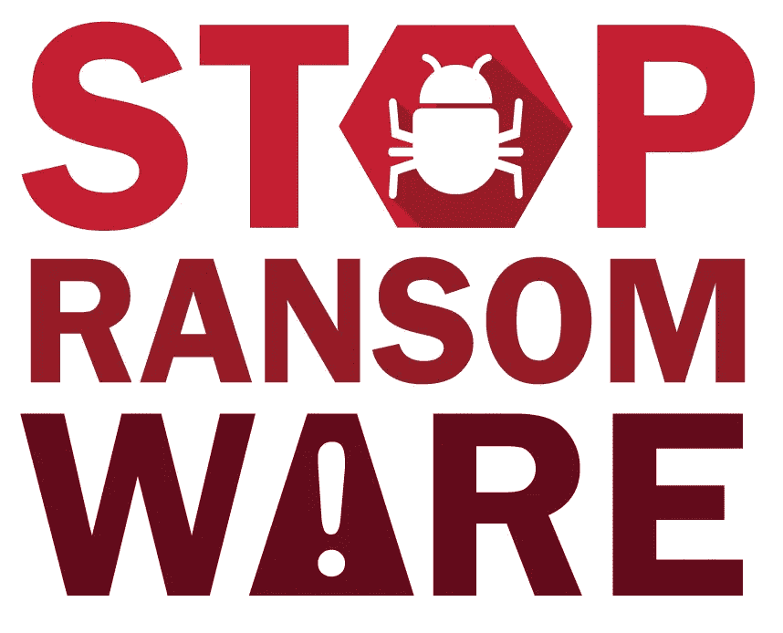
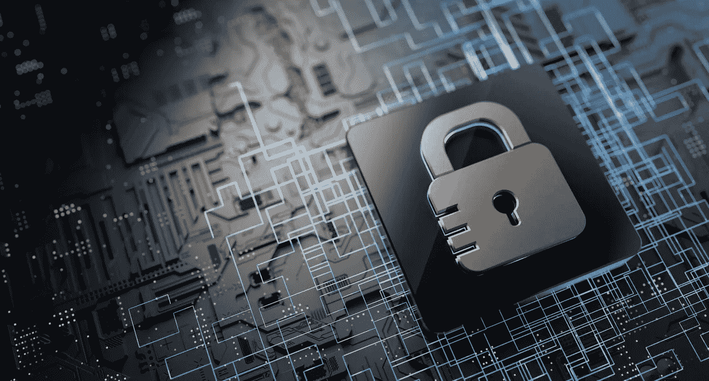
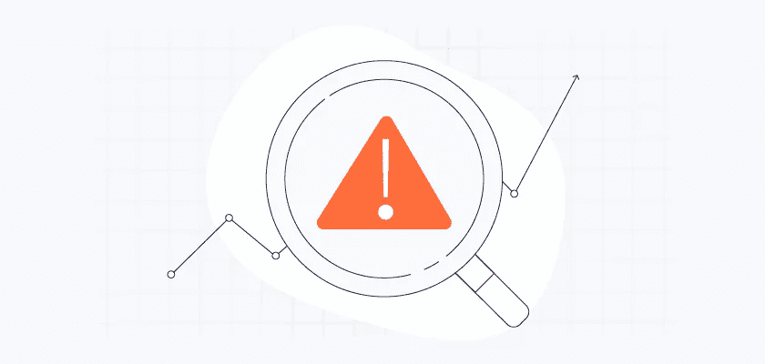
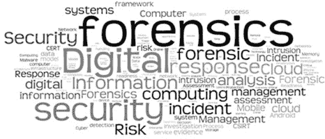

# 勒索软件:我们能做些什么来减轻它的影响？

> 原文：<https://medium.com/globant/ransomware-what-can-we-do-to-mitigate-its-impact-d515a6a49c27?source=collection_archive---------0----------------------->

## 如何防范和应对勒索病毒

勒索软件是任何用户或公司都可能面临的最可怕的攻击之一，因为其最有价值的资产(数据)面临风险，或者更糟糕的是，它可能被加密，从而变得无法访问，这已经不是新闻了。

在开始之前，我们先来看看勒索软件如何影响我们的一些数据:

**统计数据**

*   每秒钟有 20 次勒索攻击尝试。( [TechTarget](https://www.techtarget.com/searchsecurity/news/252513538/SonicWall-Ransomware-attacks-increased-105-in-2021)
*   78%的组织在 2021 年经历过基于电子邮件的勒索软件攻击。([校样点](https://www.proofpoint.com/us/resources/threat-reports/state-of-phish))
*   被勒索软件攻击最多的操作系统:Windows (85%)、macOS (7%)、Android (5%)和 iOS (3%)。([安全侦探](https://www.safetydetectives.com/blog/ransomware-statistics/))
*   对勒索病毒感染最常见的解释是钓鱼电子邮件(67%)、缺乏网络意识培训(36%)、弱密码/访问管理(30%)、不良用户行为(25%)、恶意网站或广告(16%)和其他(16%)。有些是多种方法的目标。([安全侦探](https://www.safetydetectives.com/blog/ransomware-statistics/))

**成本**

*   2021 年上半年支付了 5.9 亿美元赎金。([金融犯罪执法网络](https://www.fincen.gov/sites/default/files/2021-10/Financial%20Trend%20Analysis_Ransomware%20508%20FINAL.pdf))
*   2021 年，勒索软件的平均成本为 462 万美元，其中大型入侵的成本高达 100 倍。( [Mimecast](https://www.mimecast.com/blog/the-biggest-ransomware-attacks-of-2021/#:~:text=Ransomware%20damages%20like%20these%20averaged,Unit%2042%20threat%20intelligence%20group)
*   2021 年感染勒索软件的组织中有 58%同意支付赎金，而 2020 年这一比例为 34%。([校样点](https://www.proofpoint.com/us/resources/threat-reports/state-of-phish)
*   单个受害者的最高赎金要求从 2020 年的 3000 万美元上升到 2021 年上半年的 5000 万美元。([帕洛阿尔托](https://www.paloaltonetworks.com/blog/2021/08/ransomware-crisis/)
*   2021 年第三季度，勒索软件攻击造成的平均停机时间为 22 天，而 2020 年第三季度为 19 天。( [Coveware](https://www.coveware.com/blog/2021/10/20/ransomware-attacks-continue-as-pressure-mounts#payment)

现在来说说数据。对于那些不确定什么是有价值的数据的人，让我们想一些例子:作为一家公司，它的机密商业秘密，它的客户和员工个人身份信息()，或者它的应用程序源代码；对于一个普通人来说，你的孩子的健康史，你的医疗保障计划，余额(收入和债务)等。

在对什么是关键数据对我们有了更清晰的认识之后，我会从安全的角度来阐述我对勒索软件的想法。首先，让我问你几个问题。 ***您采取了哪些措施来减轻或降低勒索软件攻击的几率？*** 你可能已经实施了大量的控制措施，但是，更多的问题又出现了: ***你对自己采取的措施有多少信心？你测试过它们的有效性吗？你做得够了吗，还是你必须做得更多？***

> 我们的资产永远不会 100%安全；总会有更多的方式(技战术)来攻击我们，不管我们实施了多少控制。 ***没有任何风险的生活是我们的梦想，但这需要太多的努力、投资、人力资源和时间*** ，而且说实话，这几乎是不可能的，因为我们每天都会面临各种新的威胁。

好吧，回到勒索软件，如果我告诉你，某些类型的攻击的影响可以在不使用任何控制的情况下减轻，会怎么样？我们需要结构良好的政策、流程和程序。听起来很奇怪，不是吗？如果我没有检测即将发生的攻击的控制措施，我该如何减轻这种攻击？我并不是说面对攻击的唯一方法就是等待，什么都不做。我要说的是，有一些行动和任务可以帮助我们改善我们的安全状况，减少影响，首先从治理的角度思考，通过主动和检测活动，最后在缓解和恢复阶段，作为一项规则，必须始终与业务目标和需求保持一致。

# 降低风险的四个宏观活动

以下部分解释了如何降低勒索软件攻击的风险及其负面影响。

## ***【政策(治理)】***

我们需要一个清晰的数据治理结构，这可以通过政策来实现。

*   **一项数据分类政策**

> 当我们考虑保护流程时，数据分类是必须完成的关键任务的一部分。*根据其分类(类型和敏感性)* ***当其不可用(被盗、被破坏)*** 或在这种情况下由于勒索软件攻击而无法访问时，更容易理解其对公司的价值。

*   **数据管理和存储策略**(必须存储数据的地方)
*   **以数据为中心的灾难恢复计划**(遵循[3–2–1 方法](https://www.networkworld.com/article/3527303/for-secure-data-backup-here-s-how-to-do-the-3-2-1-rule-right.html)
*   **端点&服务器安全策略**(端点控制和流程、电子邮件策略、 [IAM](https://www.imperva.com/learn/data-security/iam-identity-and-access-management/) 策略，使用包含 PAM 流程的最小权限原则)
*   **互联网访问安全策略**分为两部分:第一部分定义哪些资源是基于信誉和行为而非类别来访问的，第二部分定义允许下载哪些文件扩展名。一些公司有开放的安全策略，这需要更多的时间来控制，但也是可以管理的。
*   **以安全和数据分类矩阵为重点的事件响应计划**。
*   后备政策。备份哪些数据，从哪些资源备份，频率如何(每周/每天)？备份策略是最重要的一点。在此策略下，测试备份是一项必须经常执行的重要任务，但有时会被遗忘。如果备份数据是一种好的做法，那么测试备份就更好了，因为它可以保证在出现故障(数据丢失、被盗、被加密等)时。)，数据将可用且正常工作，并允许我们继续照常开展业务。

备份流程必须涵盖操作系统和软件安装程序的关键系统“黄金映像”。

## ***主动出击***

**针对最终用户(员工、提供商)的安全意识计划**，强调绝不打开未知/不常见/不可信电子邮件以及绝不点击其中包含的链接的重要性。当用户打开电子邮件时，电子邮件服务被攻击者用作进入公司的入口。与其他活动一样，该计划必须定期向所有用户运行，至少每年一次，并在入职流程中运行。

*   在云环境中，将数据备份到多个可用性区域，或者更好的是备份到其他区域。
*   始终保留备份的离线副本。
*   用户设备(端点)和服务器不允许敏感数据的本地存储。关于数据存储位置的政策必须明确，而不是将云企业服务(google drive / one drive)用于不同 az/区域(在云环境中)的服务器的端点和备份。
*   在法规遵从性活动中，应定期扫描设备以找到本地存储的敏感数据，并根据这些发现制定补救计划。
*   保持漏洞扫描过程。

> 勒索软件攻击并不是唯一试图利用漏洞的攻击；许多其他类型的攻击使用这个媒介作为进入公司的入口点；出于这个原因，以及合规性要求和维护健康的环境，**必须实施漏洞流程，以识别、报告和触发针对调查结果的补救计划。一个良好的实践定义了该过程应该至少每年运行两次，运行次数越多越好。**

覆盖率和可达性是关键，因为流程必须覆盖所有资产。

*   执行补丁程序以保持所有软件更新。

这是漏洞扫描过程触发的下一个活动。补丁程序流程的目标是处理发现的问题，如果不应用补丁程序，公司将更容易遭受迫在眉睫的攻击。修补过程应与漏洞扫描过程一起执行，因为它们在相似的周期下一起工作，首先是在检测阶段，然后是在安全计划的补救/缓解阶段。

*   网络分段。

分段是一个强大且更安全的架构的一部分，有助于保护数据，减少来自不同威胁的表面攻击，例如勒索软件经常使用的横向移动。有不同的策略，每种策略在满足业务和法规需求时都是有用的。关键是要有一个适当的网络分段方案，其中基于其重要性的服务和信息不会与其他服务和信息共享相同的网段，并且可以检测、减少和阻止横向移动。

数据保护是主要目标。应用程序和数据都很重要，但它们在不可用时的影响并不相同。这就是为什么有必要识别关键/重要资产，根据其业务价值分离(细分)并保护它们。

> 分段适用于**谁、什么、何时以及如何**一个人/系统消费/访问一个服务/数据等。

*   **阻止未授权软件运行**。基线(操作系统和软件)是公司必须确保的初始过程之一。IT 和 SecOps 团队必须了解/监控/阻止哪些软件包获得授权，哪些未获授权。这个原理使得检测具有更快响应的设备中的偏差变得更容易。无人值守的软件为攻击者打开了方便之门。
*   **保持 AV/**[**【XDR】**](https://www.vmware.com/topics/glossary/content/xdr-extended-detection-and-response.html)**完全更新并正常运行**。除了漏洞扫描和补丁程序之外，AV / XDR 解决方案还必须进行更新，并准备好检测最新的矢量攻击。它是 SecOps 团队在设备中可用的工具之一，用于在攻击的早期阶段检测恶意活动。应该将控制配置为保持更新，经常运行扫描(每周一次，检查注册表更改和可下载文件)，并遏制应用机器学习和行为模式的攻击。
*   **在所有系统(用户和服务账户)中应用最小特权原则。**我们都知道 [IAM](https://www.imperva.com/learn/data-security/iam-identity-and-access-management/) 是一个基础的流程，在这个流程中实施好的政策可以确保最重要的资产得到保护。*在环境中的所有帐户中应用最小特权原则是一项关键活动，有助于我们在所有层中实现更准确的实施。*
*   **在环境中定期运行 pen 测试流程(应用程序、服务和控件**)到目前为止提到的所有活动和步骤对于构建和维护更安全的环境都非常重要。这里的目标是运行一个评估环境的受控流程，并完成识别(漏洞流程)、补救(修补流程)和评估安全流程所有层(应用程序/服务、控制和人员)的有效性的循环。笔测试可以用作我们测试服务、应用和控制的过程，寻找差距和错误配置。

> 目标是明确的；我们不能等待外部实体(出于好的或坏的意图)来检测、通知和利用我们的缺陷来开始减轻它们。我们必须拥有并经常执行适当的流程。

*   **针对您的 VPN 访问(提供商和内部员工)的零信任政策。**不信任任何东西的原则，包括用户、设备和来源，应该应用于所有连接。例如，可以从不同的(不可信的)设备上使用可信的帐户，这完全没问题。尽管如此，一旦检测到模式的变化，一个好的零信任过程应该能够添加更多的条件来允许新的连接尝试。在组件之间创建新的信任关系，包括模式(源 ip、浏览器、状态)，只有在满足条件时才有可能。增加了额外的挑战，以识别并尽可能减少对受损账户/设备的使用。

> 零信任适用于帐户创建(用户和服务)、连接模式以及检测这些连接中的异常。**当任何异常发生时，该过程将准备好向连接添加更多条件，帮助使用先前创建的行为配置文件(态势设备、域帐户、设备和可信设备)来识别受损资产(帐户、设备)**、*。*

作为一个独立的过程工作的活动可能会产生良好的结果并且是充分的，但是它们只有在所有的控制/过程一起工作时才会有效。

> *之前，我说过减轻勒索软件攻击可以在没有控制的情况下完成。不幸的是，这只是事实的一部分。我们总是需要他们，因为*我们不能信任用户，期望他们利用自己的知识，应用所有的程序和最佳实践来避免所有攻击我们的恶意企图*。而是需要使用控件，几乎都是在检测阶段使用。* **策略和程序是基础，但控制是应用策略、运行配置的程序、检测异常并通过阻止异常和恶意行为来减轻影响的基础。**

## ***检测(集成和自动化是关键)***

*   *开发一种安全架构，其中存在分段和微分段，提醒资产(端点和服务器)之间新的和未知的尝试流。这有助于降低横向移动的风险。*
*   将零信任原则应用于所有连接(解密)，除了那些带有个人身份信息( [PII](https://csrc.nist.gov/glossary/term/personally_identifiable_information) )的连接，如银行、教育和健康。
*   安全控制必须对资产和用户应用机器学习( [ML](https://www.mdsny.com/5-top-machine-learning-use-cases-for-security/) )和行为分析，以阻止异常模式，并与 [SIEM](https://www.gartner.com/en/information-technology/glossary/security-information-and-event-management-siem) 控制相集成，从而可以创建和改进新的用例以加快检测和遏制。
*   将检测控制( [XDR](https://www.vmware.com/topics/glossary/content/xdr-extended-detection-and-response.html) 、电子邮件保护、 [SWG](https://www.gartner.com/en/information-technology/glossary/secure-web-gateway) 、 [NAC](https://www.gartner.com/reviews/market/network-access-control) )和外围控制(防火墙、IPS、SWG)与威胁情报源相集成，定期更新和阻止 IoC(受损的域、IP、URL 和恶意参与者)。
*   应用沙盒程序(在此过程中复制公司当前使用的操作系统版本)。这将有助于了解新软件安装、下载的文件或受控环境中的可执行文件可以在操作系统中执行哪些操作/更改。

> **检查行为模式的任何偏差(异常/不可信连接、文件下载、进出电子邮件)。** *这是一个警告信号，必须进行审查，有时需要加以控制，以减轻对数据和资产的更大影响。*

*   自动化控制和安全团队的事件响应流程。在这一阶段，可以将一个 [SOAR](https://expertinsights.com/insights/the-top-soar-solutions/) 添加到流程中，以自动化活动、集成控制、获得环境的多个视图，并寻找对异常活动的更快响应。集成和自动化是安全计划中至关重要的活动。

## ***【隔离、调查和恢复】***

*   通过阻止来自受感染设备的连接来保护备份/存储服务器。
*   ***隔离设备中应用的进程，阻止进程、互联网访问、连接协议，并禁用维护任务。***
*   在云的 VPC 中隔离设备(微分段),在本地(端点或服务器)的分段中隔离设备，以记录攻击的证据。
*   检查设备上的高权限帐户，必要时阻止它们。它们也可能被折衷并用于横向运动。
*   销毁机器、创建新实例(保证操作系统映像和安装程序的完整性)以及恢复备份。
*   ***将取证安全流程应用于整个攻击，而不仅仅是受感染的设备。*** *检查先前开发的模式和活动，并可能在其他控制中检测到，如连接、源(域/ IP)、文件和进入方式(邮件、URL 消费、文件下载等)。).*

# 综上

我不是说我们应该保持冷静，什么都不做，面对/承担由于勒索软件攻击而造成的损失，并选择支付作为解决问题的唯一出路。相反，我是说，如果我们遵循这些政策/程序/良好做法，我们可以减少其影响。这样，我们将更有准备地应对攻击，更有效地面对问题。

> 是的，最终会有影响，但同样的攻击，不同的应对策略会产生不同的后果。说我们的设备有大问题和说公司的所有数据都被加密是两码事。

这里提到的所有活动都是众所周知的，但是记住并实践它们作为实现更安全环境的基础是很重要的。

最后，这里有一些补充本文信息的材料:

1.  [勒索软件统计](https://panaseer.com/business-blog/ransomware-statistics-2022/)
2.  [零信任模型—超越边界](/globant/zero-trust-model-beyond-the-perimeter-a4f4a97c7b8c)
3.  [数据备份 3–2–1 规则正确](https://www.networkworld.com/article/3527303/for-secure-data-backup-here-s-how-to-do-the-3-2-1-rule-right.html)

网络安全——Globant