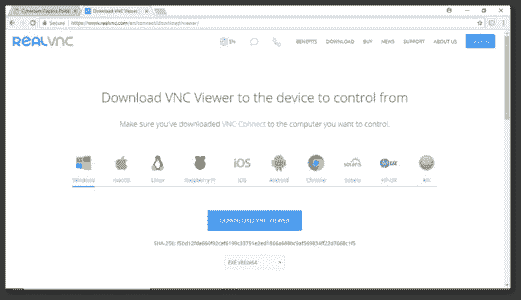

# 树莓 Pi 教程-树莓 Pi 3 入门

> 原文：<https://medium.com/edureka/raspberry-pi-tutorial-48ea09514fba?source=collection_archive---------4----------------------->

Raspberry Tutorial — Edureka

物联网正在引领下一次技术革命。 ***物联网*** 将撼动传统的做事方式，让世界变得智能。在过去的 2-3 年里，人们对物联网开发板的兴趣大幅增加。这篇关于 *Raspberry Pi 教程*的博客聚焦于一个这样的物联网开发板和基于它的应用。

这个 Raspberry Pi 教程博客将包含以下主题:

*   树莓派背后的想法
*   什么是树莓派？
*   Raspberry Pi 功能
*   树莓 Pi 组件
*   Raspberry Pi 操作系统安装
*   感官帽

# 树莓派背后的想法

树莓派基金会是一家注册于英国的教育慈善机构。该基金会旨在促进计算机科学领域的教育。该基金会的目标是为世界各地的人们提供低成本、高性能的计算机，以便他们能够理解、创建和模拟我们进步的数字世界。

# 什么是树莓派？

什么？信用卡大小的电脑？是啊！你没看错，这是一台功能齐全的信用卡大小的电脑，可以插在显示器上。树莓 pi 3 基于 *Broad-com 片上系统*，配有 1.2GHz 左右的 ARM 处理器、GPU 和 1 GB SDRAM。

# Raspberry Pi 功能

由于 Raspberry Pi 是一台功能齐全的计算机，我们可以执行诸如浏览互联网、文字处理、玩游戏和开发基于物联网的应用程序等任务。

# 树莓 Pi 组件

现在，让我们来看看 Raspberry Pi 3-B 模型的不同组件:

# 配置树莓 Pi

配置 raspberry pi 的第一步是安装 *raspbian 操作系统。转到*[*https://www.raspberrypi.org/downloads/*](https://www.raspberrypi.org/downloads/)*并选择 raspbian 操作系统*

**

*一旦你下载了 raspbian 操作系统，你就需要格式化 sd 卡并把 raspbian 操作系统刷新到你的 sd 卡上。所以，你需要一个磁盘映像软件。转到 [sourceforge](https://sourceforge.net/projects/win32diskimager/) 并下载 Win32 磁盘映像。*

**

*我们还需要一个图形桌面共享系统，这样我们就可以用图形用户界面来控制树莓派。一个这样的图形桌面共享软件是 VNC 浏览器。因此，我们将继续下载 [VNC 浏览器](https://www.realvnc.com/en/connect/download/viewer/)。*

**

*完成上述所有步骤后，我们最后将 SD 卡插入 micro SD 插槽，并将电源线连接到 Pi。*

**

*接下来，将 Raspberry Pi 连接到显示器并插入电源线。点击 install Raspbian，按照说明在 Raspberry Pi 上安装 Raspbian 操作系统。*

*下次当您将电源连接到 Raspberry Pi 时，它将开始搜索开放的 wi-fi 网络。因此，我们将打开系统中的移动热点，并让它连接。一旦树莓 pi 连接到我们的 wifi，我们将获得树莓 Pi 的动态 IP 并将其输入 VNC 浏览器对话框，瞧，我们可以开始使用 Pi 了。*

**

# *感官帽*

*Raspberry Pi 最出色的地方之一就是能够将外部物理硬件连接到 Raspberry Pi 上。树莓派有许多附加的帽子，其中一个就是 Sense 帽子。*

*Sense HAT 配有一个 8×8 RGB LED 矩阵、一个五按钮操纵杆，并包括以下传感器:*

*   *陀螺仪*
*   *加速计*
*   *磁力计*
*   *温度*
*   *大气压*
*   *湿度*

**

*如下图所示，您可以将 Sense Hat 连接到 raspberry Pi。*

**

**这就把我们带到了关于树莓派教程的文章的结尾。我希望这篇文章对你有所帮助，并增加了你的知识价值。**

*如果你想查看更多关于人工智能、DevOps、道德黑客等市场最热门技术的文章，那么你可以参考 [Edureka 的官方网站。](https://www.edureka.co/blog/?utm_source=medium&utm_medium=content-link&utm_campaign=raspberry-pi-tutorial)*

*请留意本系列中的其他文章，它们将解释物联网的各个其他方面。*

> *1.[物联网教程](/edureka/iot-tutorial-7b204b7e1d98)*
> 
> *2.[物联网应用](/edureka/iot-applications-c62cd48b7363)*

**原载于 2018 年 5 月 26 日*[*www.edureka.co*](https://www.edureka.co/blog/raspberry-pi-tutorial/)*。**