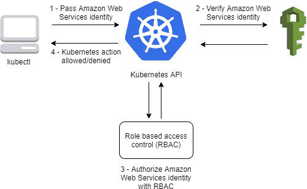

# EKS (AWS)和 RBAC，步步为营

> 原文：<https://medium.com/globant/rbac-and-eks-aws-step-by-step-e2f9c38f1aeb?source=collection_archive---------1----------------------->

# 介绍

**亚马逊弹性 Kubernetes 服务(亚马逊 EKS)** 提供了一套丰富的控件，可用于有效保护集群及其应用。本文将关注两个关键控制:环境分段和基于角色的访问控制。

**环境分割**作为障碍，使得横向移动困难，隔离安全问题。无论是恶意攻击还是技术故障，适当的隔离都可以限制向其他内部区域的传播，从而降低潜在的影响。**基于角色的访问控制(RBAC)** 是一种根据企业内个人用户的角色来管理对计算机或网络资源的访问的方法。

**本指南旨在提供分步信息，以实现以下目标:**

1.  创建三个不同的环境:开发、质量保证和生产
2.  创建三个不同的角色:管理员、开发人员、生产维护人员

*   管理员将拥有对所有环境的完全访问权限
*   开发人员将有充分的访问开发，有限的访问质量和没有访问生产
*   生产维护无权访问开发和 qa，但可以完全访问生产

3.创建三个不同的用户，每个角色一个

4.将 aws-cli 配置为从一个用户“跳转”到另一个用户，以检查每个环境的权限

**本文涵盖了以下几点:**

1-概念

2-配置

3-测试

4-结论

5-参考文献

# 1-概念

## EKS

EKS 是由 AWS 构建的 Kubernetes 平台。云提供商允许创建必要的元素，以便在短时间内启动并运行 Kubernetes 集群。

## 授权/认证模型

将 AWS 的授权和身份验证模式与 k8s 提供的模式相集成的最有价值的方法之一是 RBAC(基于角色的访问控制)

在这个模型中，身份验证委托给 aws，而授权通过 aws_cli 软件保留在 k8s 集群中，该软件允许从 AWS 云中的命令行执行操作。

# 2-配置

一个有效的 EKS 集群，安装并配置了 aws-cli，安装并配置了 kubectl 来管理 EKS 集群。以下步骤设计用于*NIX 系统

## 创建名称空间

在这一步中，我们设置了三个名称空间，这些名称空间将被应用到配置中。这只是一个开发环境的典型情况。

## 创建 IAM 角色、组和策略

三个角色、组和策略的创建如下:

**管理员**

**开发商**

**生产**

## 角色和权限绑定

在这一步中，k8s 角色收到了他们的授权。每个权限和 api 组和资源做什么的细节将在另一篇文章中解释。

**管理 EKS 集群角色和集群角色绑定创建**

在这一步中，预定义的 Kubernetes 管理员角色被分配给整个集群的“我们的”AWS 角色

**EKS 开发人员角色和角色绑定**

在这一步中，我们将开发人员权限绑定到开发环境。

**EKS QA 的开发人员角色和角色绑定**

在这一步，我们将开发人员权限绑定到 qa 环境。

**支持 EKS prod 的角色和角色绑定**

在此步骤中，我们将生产支持角色权限绑定到生产环境。

## 创建 EKS 角色

在这些步骤中，我们在集群中创建角色，并使它们明确用于 RBAC 配置

我们从以下内容开始配置图编辑:

*kubectl 编辑配置图-n kube-系统 AWS-授权*

并按以下方式添加角色

## 为测试创建 IAM 用户

现在是时候为测试创建一些用户和配置了。对于本教程中的 porpoise 来说，这一步不是必需的，但是对于测试最近创建的角色的能力来说，这一步很有用

**开发者**

**管理员**

**生产**

**为 EKS 添加用户配置**

# 3-测试

现在，只需在命令行中设置 AWS_PROFILE 变量，就可以从一个用户跳到另一个用户

*导出 AWS_PROFILE=admin*

## 测试凭据

*AWS STS get-caller-identity*

# 4-结论

在 Kubernetes 中，RBAC 是处理授权过程的强大工具。与 AWS EKS 的集成有点棘手，因为在配置映射中的结构是:

用户名:管理员用户

尽管标签名如此，但它指的是 AWS 角色，这可能会造成混淆，因为 AWS 对自己的容器管理服务下了赌注，如 ECS 和 EKS 是基于 Kubernetes 作为 orchestrator 的成功而出现的。

# 5-参考文献

基本角色定义

[https://kubernetes . io/docs/reference/access-authn-authz/RBAC/# discovery-roles](https://kubernetes.io/docs/reference/access-authn-authz/rbac/#discovery-roles)

Kubernetes cheatsheet

[https://kubernetes.io/docs/reference/kubectl/cheatsheet](https://kubernetes.io/docs/reference/kubectl/cheatsheet)

Kubernetes 中的动词和资源

[https://kubernetes . io/docs/reference/access-authn-authz/authorization/](https://kubernetes.io/docs/reference/access-authn-authz/authorization/)