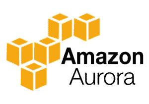
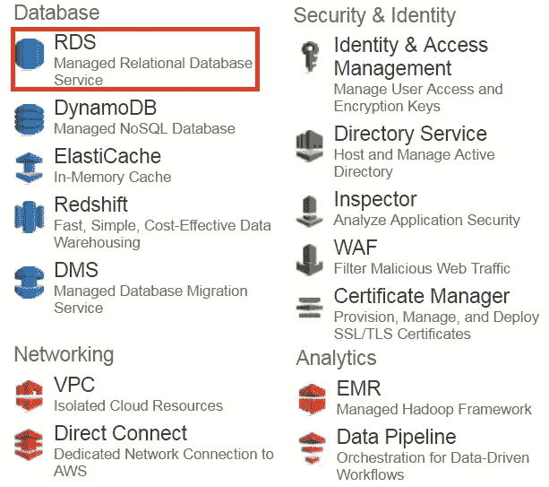

# RDS AWS 教程—RDS AWS 完全指南

> 原文：<https://medium.com/edureka/rds-aws-tutorial-for-aws-solution-architects-eec7217774dd?source=collection_archive---------0----------------------->

AWS RDS Tutorial - Edureka

今天，在本 ***RDS AWS 教程*** 中，我们将详细讨论亚马逊的关系数据库管理服务 RDS AWS，并动手操作，但首先让我们了解它为什么会出现。

世界在不断变化，每一个想法都被转化为应用程序，每天都有数以百万计的新应用程序上线。现在，任何应用程序或项目要取得成功，背后都应该有一个独特的想法。

让我们来谈谈你，你刚刚有了一个世界上最惊人的想法，你想围绕它创建一个应用程序。

现在想象一下 10 年前，当应用程序启动并准备就绪时，您必须设置一个后端服务器，研究并安装各种软件来支持您的应用程序，在完成所有这些累人的任务后，您将开始开发您的应用程序。

嘿，等等！*它的保养呢？*您必须为您的后端服务器安装所有最新的安全补丁和更新，并确保它保持健康状态。

现在，当您处理所有这些时，您的应用程序一夜成名，大量流量流向您的应用程序，扩展需求成为您的首要任务，现在让我们甚至不要考虑您将在这项任务上进行的投资，您将如何快速完成扩展和配置所有这些额外服务器的任务？

吓人吧？如果我告诉你，有人会为你做所有这些工作，你只需专注于你的应用程序。此外，其成本只是您之前投资的一小部分。

岂不是很神奇？

嗯，令人惊叹的是，不好意思**亚马逊**在这里，*亚马逊网络服务(AWS)* 提供了一种叫做 RDS AWS(关系数据库服务)的服务，它会自动为你完成所有这些任务(即设置、操作、更新)。

您只需选择要启动的数据库，只需单击一下，您就可以拥有一个后端服务器，它将自动进行管理！

*这里举个例子，假设你开了一家小公司。*

你想启动一个由 MySQL 数据库支持的应用程序，由于有大量的数据库工作，开发工作有可能会落后。

再想象一下这个场景，用亚马逊 RDS，形象不言自明！

这只是一个例子。对于更大的公司，你有一个更大的团队来管理你的数据库服务器；使用 RDS，该团队可以减少到一个相当大的数量，也许可以优化部署！

让我们在 RDS AWS 教程中继续深入，看看 Amazon 是如何定义他们的服务的:

**亚马逊关系数据库服务(RDS AWS)** 是一种 web 服务，它使得在云中建立、操作和扩展关系数据库变得更加容易。它在行业标准的关系数据库中提供了经济高效、可调整大小的容量，并管理常见的数据库管理任务。

因此，当人们将 RDS 与数据库混淆时，往往会产生误解。

*RDS 是* ***不是*** *一个数据库*，是一个管理数据库的服务，说了这么多，我们来讨论一下截至目前 RDS 可以管理的数据库:

它是由 Amazon 制造的关系数据库引擎，结合了高端商业数据库的速度和可靠性以及开源数据库的简单性和成本效益。亚马逊声称 Aurora 比 RDS MySQL 快 5 倍。

它是一个开源的数据库管理系统，使用 SQL(结构化查询语言)来访问存储在其系统中的数据。

PostgreSQL 是另一个使用 SQL 访问数据的开源数据库管理系统。

SQL Server 是一个关系数据库管理系统，由微软在 2005 年为企业环境开发。

它是由 Oracle 公司开发的对象关系数据库管理系统。

MariaDB 是社区开发的 MySQL DBMS 的分支。其分叉的原因是对甲骨文收购 MySQL 的担忧

**Fork** 的意思是复制原应用程序的源代码，开始开发新的应用程序。

有趣的是，RDS 支持的 DB 引擎是现有的关系数据库，因此，您不必更改应用程序的代码或学习一种新的查询语言来在现有的应用程序中使用 RDS。

***现在你可能想知道普通的 MySQL 和由 RDS 管理的 MySQL 有什么区别。***

因此，就使用而言，您将像使用自己的数据库一样使用它，但是现在，作为开发人员，您将不再担心底层基础结构或数据库的管理。更新、安装 SQL 的系统的健康监控、定期备份等。，所有这些任务将由 RDS AWS 管理。

AWS 还提供 EC2 关系数据库 ami，现在*你可能会问，既然我们已经有了 AWS RDS，为什么还要增加一个关系数据库服务？*

因此，EC2 关系数据库 ami 允许您在 AWS 基础设施上完全管理自己的关系数据库，而 RDS 为您管理它们。因此，根据您的使用情况，您可以选择 AWS 服务。我希望，你现在清楚了！

在本 RDS AWS 教程中，我们将讨论 RDS 的组件。

# RDS AWS 组件:

*   数据库实例
*   区域和可用性区域
*   安全组
*   数据库参数组
*   数据库选项组

让我们详细讨论其中的每一个:

## **数据库实例**

*   它们是 RDS 的组成部分。它是云中的一个隔离的数据库环境，可以包含多个用户创建的数据库，并且可以使用与独立数据库实例相同的工具和应用程序进行访问。
*   可以使用 AWS 管理控制台、Amazon RDS API 或 AWS 命令行界面创建 DB 实例。
*   数据库实例的计算和内存容量取决于数据库实例类。对于每个数据库实例，您可以选择 5GB 到 6TB 的关联存储容量。
*   数据库实例有以下类型:

1.  标准实例(m4、m3)
2.  内存优化(r3)
3.  微实例(t2)

## **地区和可用区**

*   AWS 资源位于高度可用的数据中心，这些数据中心位于世界的不同地区。这个“区域”称为地区。
*   每个区域都有多个可用性区域(AZ)，它们是不同的位置，被设计为与其他 AZ 的故障相隔离。
*   您可以在多个 AZ 中部署您的 DB 实例，这确保了故障转移，即在一个 AZ 关闭的情况下，有第二个 AZ 可以切换到。故障转移实例称为备用实例，原始实例称为主实例。

## **安全组**

*   安全组控制对数据库实例的访问。它通过指定一个 IP 地址范围或您希望授予访问权限的 EC2 实例来实现这一点。
*   Amazon RDS 使用 3 种类型的安全组:

1.VPC 安全集团

它控制 VPC 内部的数据库实例。

2.EC2 安全组

它控制对 EC2 实例的访问，可以与 DB 实例一起使用。

3.数据库安全组

它控制不在 VPC 中的数据库实例。

## **DB 参数组**

*   它包含可应用于同一实例类型的一个或多个数据库实例的引擎配置值。
*   如果没有将 DB 参数组应用于实例，则会为您分配一个具有默认值的默认参数组。

## **数据库选项组**

*   一些 DB 引擎提供了简化数据库管理的工具。
*   RDS 通过使用选项组使这些工具可用。

**RDS AWS 优势**

让我们来谈谈使用 RDS AWS 的一些有趣优势，

*   因此，当您谈论数据库服务时，通常会将 CPU、内存、存储、IOs 捆绑在一起，也就是说，您无法单独控制它们，但是使用 AWS RDS，可以单独调整这些参数。
*   就像我们之前讨论的那样，它管理您的服务器，将它们更新到最新的软件配置，进行备份，一切都是自动进行的。
*   备份有两种方式

1.  自动备份，您可以在其中设置完成备份的时间。
2.  数据库快照，您可以手动对数据库进行备份，您可以根据需要频繁地拍摄快照。

*   它自动为故障切换创建一个辅助实例，因此提供了高可用性。
*   RDS AWS 支持**读取副本**，即从源数据库创建快照，并且源数据库的所有读取流量在读取副本之间分配，这降低了源数据库的总体开销。
*   RDS AWS 可以与 IAM 集成，以便为将要使用该数据库的用户提供定制的访问权限。

RDS AWS 中对数据库的更新在**维护窗口**中应用。这个维护窗口是在创建数据库实例的过程中定义的，其工作方式如下:

*   当您的数据库有可用的更新时，您会在 RDS 控制台中收到通知，您可以采取以下操作之一

1.  推迟维护项目。
2.  立即应用维护项目。
3.  为这些维护项目安排时间。

*   一旦维护开始，您的实例必须离线进行更新，如果您的实例在多 AZ 中运行，在这种情况下，首先更新备用实例，然后将其提升为主实例，然后主实例离线进行更新，这样您的应用程序就不会停机。
*   如果您想要扩展您的数据库实例，对您的数据库实例所做的更改也发生在维护窗口期间，您也可以立即应用它们，但是如果您的应用程序在单个 AZ 中，那么您的应用程序将会经历停机。

RDS AWS Advantages - AWS RDS Tutorial

# 定价

RDS AWS 基于以下参数计费:

*   **实例类**即你正在选择的实例类型。
*   **运行时间**即一个实例运行的时间量，部分时间按完整时间计费。
*   **存储，即您为数据库实例调配的存储量**
*   **每月 I/O 请求**即每月对数据库实例的 I/O 请求
*   **数据传输**:将数据传入和传出数据库实例。

为 AWS RDS 付费的另一种方式是预订一些实例。

**保留实例**也是使用 AWS RDS 的一种方式，在这种情况下，您可以在一段时间内保留 RDS 实例，可以通过一次性付款的方式保留一年或三年，与每月支付的账单相比，这种方式更便宜。

# 自由层

AWS 的大多数服务都有惊人的免费层使用，因此客户可以先使用服务，然后再做必要的事情。

同样，它为 RDS AWS 提供了免费层使用，包括以下优势:

*   从注册之日起一年内，每月在单 AZ 中为 db.t2.micro 实例使用亚马逊 RDS 750 小时。
*   20 GB 数据库存储:通用(SSD)或磁性存储的任意组合。
*   1000 万 IOs
*   20GB 的备份存储

理论讲够了，让我们把这个 RDS AWS 教程变得更有趣，*现在让我们在 RDS* 中推出一个 MySQL DB。

# 亲自动手

**第一步:**首先从 AWS 管理控制台选择 RDS 服务。

**步骤 2:** 因为我们将启动一个 MySQL 实例，所以从数据库列表中选择 ***MySQL*** 实例。在本 RDS AWS 教程中，让我们转到步骤 3。

**步骤 3:** 由于我们是出于演示目的创建此实例，因此我们将选择开发/测试选项并单击下一步。

**第 4 步:**在下一页，您将填写以下详细信息:

*   您可以在此选择所需的数据库实例
*   您可以选择是否要在 MySQL 数据库中启用多 AZ。
*   您可以选择要分配给数据库实例的空间大小，它可以从 5GB 到 6TB 不等。
*   最后，您将为您的数据库实例设置用户名和密码

**步骤 5:** 在下一步中，您将为您的数据库配置高级设置

*   您将在此处选择 VPC，如果您不想在 VPC 中启动实例，您可以保留默认设置并继续。
*   在下一部分中，您可以选择想要使用的数据库版本，对于我们的示例，我们使用的是 MySQL 5.6
*   在下一部分，您可以设置备份首选项，如保留期等。
*   之后，我们将设置维护窗口，这是更新数据库实例的时间段。
*   一旦您填写了所有的细节，您将启动数据库实例！

**恭喜你！**您已经成功启动了您的第一个 RDS 数据库实例！

我希望你喜欢这个 RDS AWS 教程。您在这篇 RDS AWS 教程文章中学习的主题是招聘人员在 AWS 解决方案架构师专业人员中最需要的技能。如果你想查看更多关于人工智能、DevOps、道德黑客等市场最热门技术的文章，那么你可以参考 [Edureka 的官方网站。](https://www.edureka.co/blog/?utm_source=medium&utm_medium=content-link&utm_campaign=rds-aws-tutorial)

请留意本系列中的其他文章，它们将解释 AWS 的各个方面。

> *1。*T22*AWS 教程*
> 
> *2。* [*AWS EC2*](/edureka/aws-ec2-tutorial-16583cc7798e)
> 
> *3。*[*AWS Lambda*](/edureka/aws-lambda-tutorial-cadd47fbd39b)
> 
> *4。* [*AWS 弹性豆茎*](/edureka/aws-elastic-beanstalk-647ae1d35e2)
> 
> *5。*[*AWS*](/edureka/s3-aws-amazon-simple-storage-service-aa71c664b465)
> 
> *6。* [*AWS 控制台*](/edureka/aws-console-fd768626c7d4)
> 
> *7。* [*AWS 简历*](/edureka/aws-resume-7453d9477c74)
> 
> *8。* [*AWS 迁移*](/edureka/aws-migration-e701057f48fe)
> 
> 9。[*AWS Fargate*](/edureka/aws-fargate-85a0e256cb03)
> 
> *10。* [*亚马逊 Lex*](/edureka/how-to-develop-a-chat-bot-using-amazon-lex-a570beac969e)
> 
> *11。* [*亚马逊光帆*](/edureka/amazon-lightsail-tutorial-c2ccc800c4b7)
> 
> *12。* [*AWS 定价*](/edureka/aws-pricing-91e1137280a9)
> 
> *13。* [*亚马逊雅典娜*](/edureka/amazon-athena-tutorial-c7583053495f)
> 
> *14。* [*AWS CLI*](/edureka/aws-cli-9614bf69292d)
> 
> *15。* [*亚马逊 VPC 教程*](/edureka/amazon-vpc-tutorial-45b7467bcf1d)
> 
> *15。*[*AWS vs Azure*](/edureka/aws-vs-azure-1a882339f127)
> 
> *17。* [*内部部署 vs 云计算*](/edureka/on-premise-vs-cloud-computing-f9aee3b05f50)
> 
> *18。* [*亚马逊迪纳摩 DB 教程*](/edureka/amazon-dynamodb-tutorial-74d032bde759)
> 
> *19。* [*如何从快照恢复 EC2？*](/edureka/restore-ec2-from-snapshot-ddf36f396a6e)
> 
> *20。* [*AWS 代码提交*](/edureka/aws-codecommit-31ef5a801fcf)
> 
> *21。* [*顶级 AWS 架构师面试问题*](/edureka/aws-architect-interview-questions-5bb705c6b660)
> 
> *22。* [*如何从快照恢复 EC2？*](/edureka/restore-ec2-from-snapshot-ddf36f396a6e)
> 
> *23。* [*使用 AWS 创建网站*](/edureka/create-websites-using-aws-1577a255ea36)
> 
> *24。* [*亚马逊路线 53*](/edureka/amazon-route-53-c22c470c22f1)
> 
> *25。* [*用 AWS WAF 保护 Web 应用*](/edureka/secure-web-applications-with-aws-waf-cf0a543fd0ab)

*原载于 2016 年 11 月 14 日*[*www.edureka.co*](https://www.edureka.co/blog/rds-aws-tutorial/)*。*