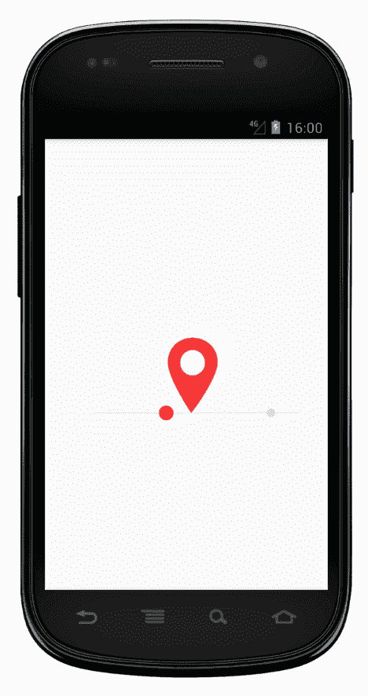

# 重新制作动画

> 原文：<https://medium.com/androiddevelopers/re-animation-7869722af206?source=collection_archive---------4----------------------->

在上一篇文章中，我描述了一种在 Android 上创建矢量动画的技术:

[](/google-developers/animation-jump-through-861f4f5b3de4) [## 动画:跳转

### 最近，一个求助的电话引起了我的注意；询问如何在 Android 上实现一个奇特的“获取位置”动画:

medium.com](/google-developers/animation-jump-through-861f4f5b3de4) 

在撰写本文时，这种技术的一部分(路径变形)只在 Lollipop 和更新版本的操作系统上受支持。然而，Android 支持库的版本 25.4 将这一功能一直支持到冰激凌三明治(即令人印象深刻的 [99%的设备](https://developer.android.com/about/dashboards/index.html#Platform))。查看这个 Google I/O 会话，它涵盖了支持库中的这一变化和其他令人惊叹的变化:

我想通过更新我的示例来尝试这些新功能，以便在旧设备上工作，并分享我的发现。

## 14 是新的 21

第一步就是把我的`minSdkVersion`从 21 岁改成 14 岁。打开完全相同的`AnimatedVectorDrawable,`Lint 工具指出了几个错误。具体来说，我使用了一些标准的材质插值器，这些插值器只在 API 21 中引入，所以不会在旧平台上使用。由于支持库也支持`PathInterpolators`,我简单地将它们的实现从平台复制到我的项目中，并引用它们。

我还将我的`build.gradle`文件中的`vectorDrawables.useSupportLibrary = true`设置为[告诉构建工具链](/@chrisbanes/appcompat-v23-2-age-of-the-vectors-91cbafa87c88)不要剥离旧设备上的矢量资源。

## 建设中

要播放动画，您需要在代码中获得对它的引用并调用`start()`。有多种方法可以实际创建动画 drawable:

1.  在你的布局(`app:srcCompat="@drawable/avd_foo"`)中引用它，然后从`ImageView`中检索 drawable。
2.  使用`[AppCompatResources#getDrawable](https://developer.android.com/reference/android/support/v7/content/res/AppCompatResources.html#getDrawable(android.content.Context, int))`
3.  使用`[AnimatedVectorDrawableCompat#create](https://developer.android.com/reference/android/support/graphics/drawable/AnimatedVectorDrawableCompat.html#create(android.content.Context, int))`

我发现方法 1 & 2 可以返回不同的具体类；一个`AnimatedVectorDrawable`或者一个`AnimatedVectorDrawable**Compat**`,这取决于你使用哪种 API。

> 有趣的是，支持库[目前使用 API 24+上的本地版本](https://android.googlesource.com/platform/frameworks/support/+/master/v7/appcompat/src/android/support/v7/widget/AppCompatDrawableManager.java#92)和之前的 compat 版本，尽管该类是在 API 21 中引入的。这使它能够为 API 21–23 提供错误修复。

如果/当你需要铸造`drawable`的时候，这可能会有问题。

> 注意，两个类都实现了`[Animatable](https://developer.android.com/reference/android/graphics/drawable/Animatable.html)`，所以如果你需要的只是启动/停止它，那么你就可以安全地抛弃它了。此外，`AnimatedVectorDrawableCompat`提供了一个方便的静态方法来[注册回调](https://developer.android.com/reference/android/support/graphics/drawable/AnimatedVectorDrawableCompat.html#registerAnimationCallback(android.graphics.drawable.Drawable, android.support.graphics.drawable.Animatable2Compat.AnimationCallback))，它将检查我们正在处理的类型，并适当地委托回调。

相反，我选择了 3 号门；总是使用 compat 类。这可能会增加一点点开销(因为在较新的平台上`AVDC`只是将所有事情委托给本地类),但这使我的消费代码更简单。

## 给我回电话

我发现的一个小问题是我用来制作动画循环的技术。不幸的是`AnimatorSet`不支持重复，所以我添加了一个`AnimationCallback`来监听动画的结尾并再次调用`start`来解决这个问题。这在老的平台上不起作用，但是我可以通过在一个处理程序上发布`start`调用来解决这个问题，这个调用将在结束回调之后执行:

```
avd?.registerAnimationCallback(
        object : Animatable2Compat.AnimationCallback() {
    override fun onAnimationEnd(drawable: Drawable?) {
        imageView.**post** {avd.start() }
    }
})
```

## 陈旧状态

动画的某些部分只在循环中的某些点上运行；例如，当这些点进入/退出场景时，它们会淡入/淡出。在旧设备上，我发现它们的“状态”在每次循环中都没有被重置(重置为在`VectorDrawable`中定义的状态)。


注意当灰点从右边进入时是如何(不正确地)可见的，然后短暂消失，*然后*淡入。为了解决这个问题，我添加了一个零长度动画，以便在每个循环开始时将属性设置为它们的期望值，这样它们就可以进行动画制作了，例如:

```
<!-- Fade dot 5 in as it enters the scene -->
<set>
    <objectAnimator
        android:propertyName="fillAlpha"
        android:valueFrom="0"
        android:**valueTo="0"**
        android:**duration="0"** />
    <objectAnimator
        android:propertyName="fillAlpha"
        android:valueFrom="0"
        android:valueTo="1"
        android:startOffset="1900"
        android:duration="60"
        android:interpolator="@android:interpolator/linear" />
</set>
```

## 排成一队

我遇到的最后一个问题是*顺序*有序`AnimatorSet`的问题。主要的引脚跳转动画是一系列路径变形动画，从一个关键帧到另一个关键帧。我的动画假设这个序列将运行所有单个动画师的持续时间总和。然而，在旧平台上，一个错误导致每个动画师在开始之前等待下一帧边界。这些小的延迟加在一起，使得动画花费的时间*比持续时间的总和还要长*，因此作品的其他部分会被错误地定时。我可以通过切换到`ordering="together"`来解决这个问题，并在每个单独的动画师身上使用`startOffset`在正确的时间启动他们。

## 令人印象深刻的平庸

最终的结果是非常令人印象深刻的。也就是说，动画看起来和以前完全一样，但是现在可以在更多的设备上运行。



Animation running on API 16\. #holoyolo.

尽管我确实遇到了一些在旧设备上运行的问题，但这些问题都很容易解决，我认为在如此多的 API 级别上运行的能力使得努力*非常*值得。

我对许多工作感到满意，包括允许你在一个文件中指定`VectorDrawable`和动画的 XML bundle 格式。Lint 工具也有助于指出一些问题。你可以在 Github 上找到我的后向移植动画[的代码。](https://gist.github.com/nickbutcher/b1806905c6bc0ef29f545fd580935bd3)

如果您因为缺乏 API 支持而推迟向您的应用程序添加精彩的动画，那么就不要再推迟了。如果你正在研究路径变形动画，那么一定要看看[亚历克斯·洛克伍德](https://medium.com/u/f61fb1c467cd?source=post_page-----7869722af206--------------------------------)的神奇的[变形器](https://shapeshifter.design/)工具，它将帮助你创建可变形的形状。如果这启发了你去创造一些东西，那么[让我知道](http://twitter.com/crafty)！