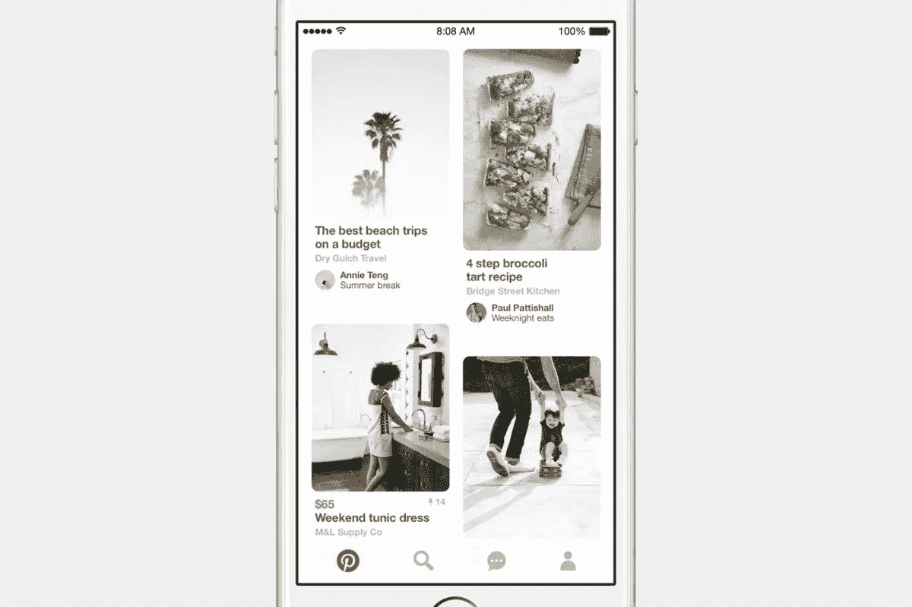
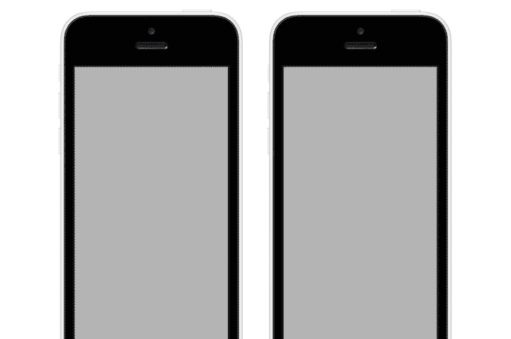
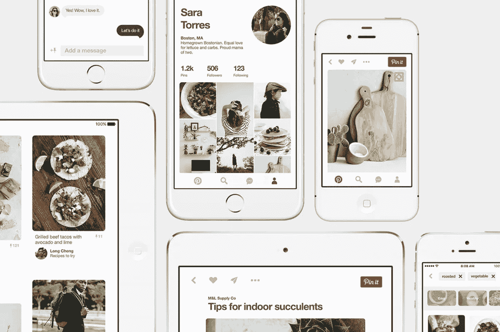
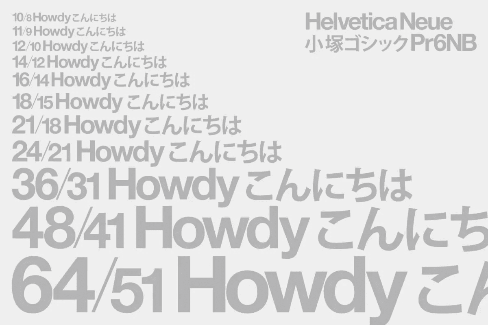

# 重新设计 Pinterest 的 iOS 应用

> 原文：<https://medium.com/pinterest-engineering/re-architecting-pinterest-039-s-ios-app-e0a2d34a6ac2?source=collection_archive---------1----------------------->

Garrett Moon | Pinterest 工程师，iOS 核心体验

Pinterest iOS 工程师的一个小团队最近获得了每个工程师梦寐以求的机会——彻底重新思考和重建我们的应用程序。我们发展得如此之快，以至于对我们的平台产生了很高的需求。为了覆盖全球下一个 1 亿 pinner，[我们重新设计了我们的平台](https://blog.pinterest.com/en/our-fastest-cleanest-app-yet),采用了一个构建速度更快、更易于扩展的框架，在许多不同的场景中，pinner 的速度提高了 3 倍。以下是该项目的一些较大的部分，更多的将在未来几周内公布。我们走吧！

## 性能取胜

要接触到更多美国以外的人，这就要求应用程序尽可能高性能，尤其是在旧设备上。这意味着之前可能出现的问题——比如滚动主页时丢帧——需要解决。降低能耗和提高性能的最快和最简单的方法是利用大多数 iPhones 都有多个处理器这一事实。

我们的新系统非常依赖多线程代码；UI 渲染、图像下载、GIF 解码和模型处理都是我们设计的多线程系统的例子。这使我们能够更好地保持滚动的平稳性和 Pinner 点击时的响应性。在测试中，我们测得触摸响应和滚动流畅度提高了 10 倍。没有一堆小的调整，什么样的性能项目是完整的呢？我们构建了至少三种不同的方法来圆角化视图的角(在 CALayer 上使用 cornerRadius 属性的成本增加得惊人地快)。

## 异步显示

新框架的大部分都建立在 [AsyncDisplayKit](https://asyncdisplaykit.org/) (ASDK)之上，这是一个开源的 iOS 框架，最初由 Pinterest 工程师 [Scott Goodson](https://www.pinterest.com/iosengineer/) 创作，它保持了用户界面的流畅和响应。对于我们的问题来说，ASDK 似乎是一颗银弹，因为它提供了 UI 的异步渲染，所以我们可以在主线程之外进行昂贵的布局和渲染工作。

虽然异步显示是 ASDK 的主要承诺，但它也提供了一个类似于 [CSS Box Model](http://www.w3schools.com/css/css_boxmodel.asp) 的布局系统，易于使用 CALayers 而不是 UIViews(当你不需要注册触摸时)以及无数其他性能改进。一个特别有效的优化是计算滚动视图的不同范围。ASDK 将在 Pinner 的滚动位置之前计算一个单元格范围，这些单元格需要从网络获取数据，并计算一个较小范围的单元格进行预渲染。这自动允许及时获取、渲染和清除用户已经通过的范围，从而节省了在单个运行循环上花费的内存和时间来加速滚动。

当然，在重写几乎整个应用程序以利用 ASDK 的过程中，我们发现了一些错误，并向项目提交了一些改进。事实上，ASDK 十大贡献者中有五个是 Pinterest 的员工。

## 不可变数据模型

另一个重要的痛点是由我们的模型系统引起的。我们拥有的系统是间歇性线程安全的，虽然创建模型可以在后台线程上完成，但它要求对模型的任何修改都发生在主线程上。这不利于性能，并且引入了开发人员并不总是很明显的复杂性，导致了许多崩溃。

我们需要的是一个线程安全且高性能的系统。保证线程安全的最简单的方法是让一切都不可变，然而，随着新特性的开发，改变近 100 个模型并保持它们更新是一个挑战。为了解决这个问题，我们自己生成了它们。我们的一位杰出的工程师( [Rahul Malik](https://pinterest.com/rmalik/) )去学了一些 Swift 并建立了一个系统，将 JSON 文件转换成不可变的模型。我们对我们的生成器感到非常兴奋，并将很快对它进行开源和博客！

现在我确信你在问自己，“但是加勒特，如果你的模型是不可变的，你怎么把你的架构图钉放在你的板上呢？”。很高兴你问了！我们新的不可变模型允许用构建器系统创建修改的副本。我们有一个健壮的框架(由天才的 [Wendy Lu](https://www.pinterest.com/wendylu1/) 构建)来快速安全地通知 UI 和任何其他感兴趣的观察者这些变化。我们将很快分享更多关于我们的模型、生成器和保持 UI 同步的系统。

## 一种新的设计语言和系统

除了几乎完全重写 iOS 应用程序之外，我们还承担了修改视觉设计的任务。我们与产品设计团队密切合作(包括实地考察我们在波特兰的远程办公室),以实施新的设计语言和框架，简化针对多种设备尺寸的应用构建。与设计师一起，我们创建了一个 BRIO(内部设计代码名称)和 points(即“boints”)的组合，以指定与设备无关的布局。一旦大声说出来，就不会死。

新的框架还可以根据你的屏幕大小和语言自动调整字体、边距和字距。我们发现中文、日文和韩文对本地读者来说太大了，所以我们的框架会自动处理这个问题。

总的来说，这是一个任何工程师都可以支持的系统:一个适用于任何屏幕尺寸的实现(好吧，仍然有一些分散的 IPADs，但至少少了一个数量级)。

如果没有新的交互设计，什么样的视觉更新会是完整的呢？(这正是我们在工作时问自己的问题，当时我们已经过了睡觉的时间。)所以我们接受挑战，以表演的方式构建新的动画和过渡。如何制作一个按钮，无论它出现在 UI 的什么地方，都可以扩展到边界之外？你如何计算变换来模拟一个图像变得全屏和不同的长宽比？我们将在后续文章中回答这些棘手的问题。

## 日志，日志，日志

最重要的是，随着所有的更新，我们希望确保 Pinners 将继续享受发现和保存想法的体验。做到这一点的唯一方法是准确测量使用情况！但是，如果我们必须为应用程序中的每个按钮编写代码来向服务器发送日志，那就太糟糕了。为什么不建立一个智能系统，可以问按钮，“你有什么特别的吗，按钮？你是什么观点？”。这就是为什么我们的一位天才工程师( [Chris Danford](https://www.pinterest.com/cdanf/) )构建了一个系统，该系统可以处理很多令人头疼的日志记录问题，而开发人员无需做太多工作。它沿着层次结构向上走，收集上下文并生成详细的日志记录，然后将它们发送到后端。

我们已经经历了一个漫长的旅程来发布这个项目，我们都为我们所取得的成就感到无比自豪——一个闪亮的新应用程序，在低端设备上执行令人钦佩，同时提供优质的体验。我们迫不及待地想与您分享我们是如何做到的。

Android 和 web 是我们清单上的下一个要改革的。如果你很乐意帮助我们从头开始构建这些框架，[加入我们的团队](https://careers.pinterest.com/careers/engineering)！

*鸣谢:此次更新是公司全体成员共同努力的结果，包括 Allen Williams、Arla Rosenzweig、Andreas Pihlströ、Austin Louden、Bill Kunz、Brendan Ryan、柳斌、Chris Danford、Connor Montgomery、Evan Sharp、Huy Nguyen、Garrett Moon、Gordon Chen、Jay Marsh、刘文秀、Kim Fellman、、Levi McCallum、Long Cheng、Lukas Blakk、Luke Zhao、Martin Jiang、Max Gu、Michael Schneider、Nicole、Patrik Goethe、Rahul Malik、Ricky Cancro、Rocir 、Vincent Tian、、Wendy Lu、Yunnan Wu、Adam Barton 以及来自我们数据和商业分析团队的无数人*