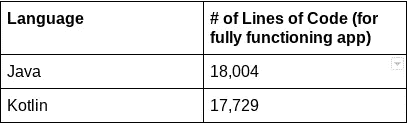

# 用科特林语言重新编写 AOSP 日历应用程序

> 原文：<https://medium.com/androiddevelopers/re-writing-the-aosp-calendar-app-in-kotlin-48ceb0e3a65c?source=collection_archive---------0----------------------->


*作者达米安·帕特尔* [和*作者玛希·K*](https://medium.com/u/be32be256154?source=post_page-----48ceb0e3a65c--------------------------------)

两年前， [Android 开源项目(AOSP)应用](https://android.googlesource.com/platform/packages/apps/)团队开始了将 AOSP 应用从 Java 重构为 [Kotlin](https://kotlinlang.org/) 的过程。推行这一举措有两个原因:确保 AOSP 应用程序遵循 Android 的最佳实践，并首先提供用 Kotlin 开发应用程序的良好范例。此外，Kotlin 最大的吸引力之一是其简洁的语法。在许多情况下，用 Kotlin 编写的大部分代码块比相应的功能相同的 Java 代码块要小。此外，这种富于表现力的编程语言具有各种其他有益的特性，例如:

*   空安全:这个概念已经深入 Kotlin，有助于避免毁灭性的空指针异常。
*   并发:正如 Android 在 [Google I/O 2019](https://developer.android.com/kotlin/first) 上所描述的，结构化并发允许协同例程简化后台任务管理。
*   与 Java 的兼容性:特别是在这个项目的环境中，Kotlin 与 Java 编程语言的兼容性允许我们一次执行一个文件的转换过程。

去年夏天，AOSP 团队发表了一篇文章，详细介绍了 AOSP 桌面时钟应用的[转换过程。今年夏天，我们将 AOSP 日历应用程序从 Java 转换成了 Kotlin。在转换之前，该应用程序有超过 18，000 行代码。转换之后，我们能够减少大约 300 行代码。遵循与 AOSP 桌面时钟转换类似的技术，我们利用 Kotlin 与 Java 编程语言的互操作性，一个接一个地转换 Java 文件，并在转换时使用单独的构建目标将 Java 文件替换为它们的 Kotlin 等效文件。因为我们中的两个人正在做这件事，所以我们还在`Android.bp`文件中为我们每个人创建了一个`exclude_srcs`属性，这样我们两个人都可以转换和推送变更，同时减少合并冲突。此外，这使我们能够逐步测试并查明哪些文件导致了错误。](/androiddevelopers/re-writing-the-aosp-deskclock-app-in-kotlin-76c836370cb)

为了转换任何给定的文件，我们从 [Android Studio 的](https://developer.android.com/studio) Kotlin 插件中的[自动 Java 到 Kotlin 转换工具](https://developer.android.com/kotlin/add-kotlin#convert)开始。虽然该插件成功地转换了大部分代码，但开发人员可能会遇到一些必须手动解决的问题。我们必须进行的手动更改将在下一节中描述。

在将每个文件转换为 Kotlin 后，我们手动测试了日历应用程序的 UI，运行了单元测试，并运行了[兼容性测试套件(CTS)](https://source.android.com/compatibility/cts) 测试的子集，以验证功能并确保没有回归。

# 自动转换后采取的步骤

如前所述，在运行自动转换工具后，有许多重复出现的问题需要手动解决。AOSP 桌面时钟的文章详细介绍了这些错误以及必要的修复。下面是我们在转换 AOSP 日历时遇到的几个例子。

## **打开父类**

我们遇到的一个问题是 Kotlin 中父类和子类的交互。在 Kotlin 中，要将类标记为可继承的，必须在类声明中添加`open`关键字。对于在子类中被覆盖的父类中的任何方法也是如此。`open`关键字在 Java 继承中不是必需的。由于 Kotlin 和 Java 的互操作性，这个问题直到大部分文件完全转换成 Kotlin 后才出现。

例如，下面的代码片段显示了一个继承了`SimpleWeeksAdapter`的声明类:

由于转换过程是一次执行一个文件，这会导致一个错误，因为即使是完全转换的`SimpleWeeksAdapter.kt`文件在其类声明中也没有`open`关键字。这需要手动添加，以便`SimpleWeeksAdapter`可以继承。这个特定的类声明看起来像这样:

## 覆盖修饰符

类似地，子类中覆盖父类中方法的方法必须用一个`override`修饰符来标记。在 Java 中，这是使用`@Override`注释来完成的。然而，尽管看到了相应的 Java 注释，自动转换器并没有自动将`override`修饰符添加到 Kotlin 的方法声明中。修复方法是手动将`override`修饰符添加到所有适当的方法声明中。

## 覆盖属性

在 Kotlin 中，我们遇到了另一个关于覆盖属性的异常问题。当一个子类声明了一个与父类中定义的非私有变量同名的变量时，我们需要添加一个`override`修饰符。然而，即使子类的变量与父类的类型不同，修饰符似乎仍然是必需的。添加`override`修饰符在某些情况下并不能解决问题，尤其是当子类的类型完全不同的时候。事实上，如果存在类型不匹配，将`override`修饰符添加到子类的变量并将`open`添加到父类的变量会导致另一个错误:

```
type of *property name* doesn’t match the type of the overridden var-property
```

这可能会造成混乱，因为在 Java 中，以下代码编译起来没有任何问题:

然而，在 Kotlin 中，下面相应的代码会导致前面提到的错误:

这是一个有趣的问题，目前我们已经重命名了子类中的变量以避免这种冲突。上面的 Java 代码片段用 Android Studio 当前的转换器转换成麻烦的 Kotlin 代码，甚至被[报告为 bug](https://youtrack.jetbrains.com/issue/KTIJ-8621) 。

## 导入报表

在我们转换的每个文件中，自动转换器工具倾向于将 Java 文件中 import 语句的完整列表截断到相应 Kotlin 文件的第一行。最初，这会导致一些令人沮丧的错误，编译器会抱怨整个代码中存在“未知引用”。在意识到这个 bug 之后，我们开始手动将导入语句从 Java 文件复制到 Kotlin 文件，并单独转换该段。

## 公开字段

默认情况下，Kotlin 会自动为类中的实例变量生成 getters 和 setters。然而，有时我们希望变量是一个简单的 Java 字段。这可以使用`@JvmField`注释来完成。

[@JvmField 批注](https://kotlinlang.org/api/latest/jvm/stdlib/kotlin.jvm/-jvm-field/)“指示 Kotlin 编译器不要为该属性生成 getter/setter，并将其作为字段公开”。这个注释在包含两个静态最终变量的 [CalendarData 类](https://android.googlesource.com/platform/packages/apps/Calendar/+/42e4b43133c4f866e0729438fb38bebc6d03b0a4/src/com/android/calendar/CalendarData.kt)中特别有用。通过在只读 [val 变量](https://kotlinlang.org/docs/basic-syntax.html#variables)上使用`@JvmField`注释，我们确保了这些变量可以作为字段被其他类访问，从而允许 Java 和 Kotlin 类之间的兼容性。

## 对象中的静态方法

在 Kotlin 对象中定义的函数必须用`@JvmStatic`标记，以允许它们在 Java 代码中通过方法名调用，而不是通过实例化。换句话说，这个注释强制类名调用的方法具有类似 Java 的行为。根据 Kotlin [文档](https://kotlinlang.org/docs/java-to-kotlin-interop.html#static-methods)，“编译器将在对象的封闭类中生成一个静态方法，并在对象本身中生成一个实例方法。”我们在[实用程序文件](https://android.googlesource.com/platform/packages/apps/Calendar/+/42e4b43133c4f866e0729438fb38bebc6d03b0a4/src/com/android/calendar/Utils.kt)中遇到了这个问题。一旦被转换，Java 类就变成了一个 Kotlin 对象。随后，对象中定义的所有方法都必须用`@JvmStatic`标记，这样就可以在其他文件中使用`Utils.*method*()`语法调用它们。另外值得一提的是，在类名和方法名之间使用`.INSTANCE`(`Utils.INSTANCE.method()`)是一种替代；然而，它违背了普通的 Java 语法，并且需要修改所有的 Java 静态方法调用。

# 绩效评估和分析

所有基准测试都是在具有 96 个内核和 176 GiB RAM 的机器上进行的。为这个项目分析的主要指标是删除的代码行数、目标 APK 大小、构建时间以及显示初始启动屏幕所用的时间。除了对上述每个因素的分析，我们还提供了为每个参数收集的数据的表格表示。

## 代码行被删除



从 Java 完全转换到 Kotlin 后，代码行数从 **18，004 减少到了 17，729** 。这大约比最初的 Java 代码减少了 1.5%的 T2。虽然减少的代码量并不多，但这种转换可能会大大减少大型应用程序的代码行，比如本文[中提到的](/androiddevelopers/re-writing-the-aosp-deskclock-app-in-kotlin-76c836370cb)。

## 目标 APK 尺寸


Kotlin 应用的 APK 大小为 **2.7 MB** ，而 Java 应用的 APK 大小为 **2.6 MB** 。可以肯定地说，这种大小差异可以忽略不计，由于包含了一些额外的小型 Kotlin 库，这种微小的大小增加实际上是意料之中的。这种尺寸的增加可以通过使用[progguard](https://developer.android.com/studio/build/shrink-code)或 [R8](https://r8.googlesource.com/r8) 来缓解。

## 构建时间


Kotlin 和 Java 应用程序的构建时间是通过取 10 次干净构建试验的平均时间(不包括异常值)来计算的。 **Kotlin 应用程序**的平均构建时间为 **13 分 27 秒**，而 **Java 应用程序**的平均构建时间为 **12 分 6 秒**。Java 和 Kotlin 之间的差异(如[](https://www.educba.com/java-vs-kotlin/)**和 [*Kotlin vs Java:编译速度*](/keepsafe-engineering/kotlin-vs-java-compilation-speed-e6c174b39b5d) 讨论到，特别是对于干净的构建，Kotlin 编译时间实际上落后于 Java 的编译时间。一些分析断言 Java 的编译速度大约快 10-15 %,而其他人则宣称快 15-20%。根据干净编译时间，Java 比 Kotlin 快大约 11.2%，尽管这一微小的差异不在上述范围内，可能是由于 AOSP 日历是一个相对较小的应用程序，仅由 43 个类组成。尽管清理构建时间较慢，但 Kotlin 仍然有其优势，这一点应该被考虑在内。例如，如前所述，与 Java 相比，使用 Kotlin 的语法更简洁，因此通常可以保证代码量更少。这使得维护 Kotlin 代码库变得更加容易。此外，作为一种隐含的更安全和更高效的语言，可以合理地论证为什么较慢的干净构建时间可以忽略不计。**

## **初始显示时间**

****

**使用[这种方法](https://developer.android.com/topic/performance/vitals/launch-time#time-initial)测试应用程序完全显示初始启动屏幕的时间，我们发现 **Kotlin 应用程序**在 10 次测试后的平均时间约为 **197.7 ms** ，而**Java**应用程序的平均时间约为 **194.9 ms** 。这些试验都是在 Pixel 3a XL 设备上进行的。从这个测试中可以得出结论，与 Kotlin 应用程序相比，Java 应用程序可能具有微小的优势；然而，由于平均时间非常相似，时间差可能可以忽略不计。因此，可以肯定地说，AOSP 日历的 Kotlin 转换没有对应用程序的初始启动时间产生负面影响。**

# **结论**

**在两名实习生的参与下，将 AOSP 日历应用程序转换为 Kotlin 花费了大约 1.5 个月(6 周)的时间。一旦我们熟悉了代码库，并且更加擅长解决反复出现的编译时、运行时和语法问题，效率肯定会提高。总的来说，这个特殊的项目成功地展示了 Kotlin 如何影响现有的 Android 应用程序，并被证明是向其他 AOSP 应用程序转换的下一个伟大步骤。**