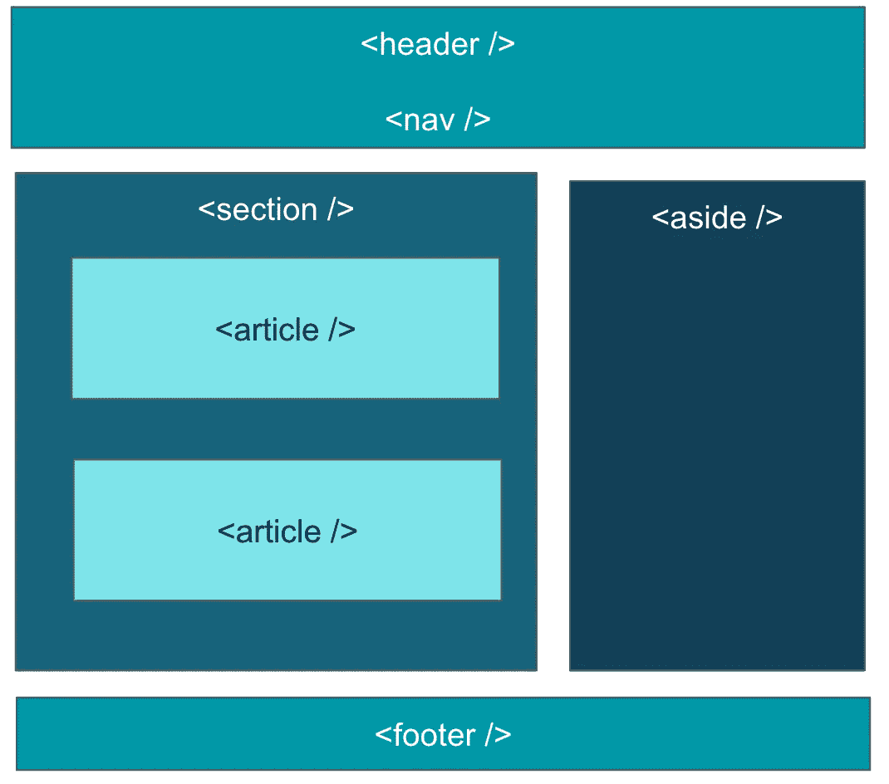

# 反应+可及性——打火需要两个人(第一部分)

> 原文：<https://medium.com/globant/react-accessibility-it-takes-two-to-flint-a-fire-part-1-2ee50cc88f7c?source=collection_archive---------1----------------------->


React component image with assistive tools

JavaScript 框架正在成为创建强大、快速和多功能网站的标准。基于这些事实，React 是最流行的框架之一。React 在过去几年中以令人难以置信的速度流行起来。创建可重用组件的能力、虚拟 DOM、巨大的支持社区、低学习曲线，这些因素帮助它迅速流行起来。

最近，我开发了一个 web 应用程序，它主要是为 50 多个终端用户设计的。我意识到，为了让 react 应用变得可访问，我们需要额外的意识。事实上，React 实际上是最早开始包含可访问性的 JavaScript 框架之一。根据 [React 的文档](https://reactjs.org/docs/accessibility.html)—***“React 完全支持构建可访问的网站，通常使用标准的 HTML 技术。”***

所以首先要做的是:)

***语义元素的使用*** —语义 HTML 是 web 应用程序可访问性的基础。在应用程序中使用的语义越多，开发人员和辅助技术用户的双赢局面就越多。



Semantic HTML

大多数 React 开发人员对我们可信赖的`div`元素更加放心。如果我们放弃 div，转而使用语义 HTML，它会非常有帮助，原因如下:

1.  屏幕阅读器很聪明，能更好地理解每个元素的重要性。
2.  对于开发人员来说，代码本身变得更加易于理解。

让我们用一些代码检查一下，

在上面的代码中，为屏幕阅读器识别标题元素、列表元素变得很困难，因为屏幕阅读器只理解 ***语义 HTML。*** 让我们修改我们的代码，让它变得对屏幕阅读器友好:)

> 快速获取:尝试在组件中使用除 div 之外的元素。通常有更好的选项可以大大提高可访问性和可读性(比如页眉、页脚、节、侧边、文章等等。)

***用 ARIA*** 升级语义——有时候，我们会遇到这样的情况，我们完全忘记了语义，试图只用视觉设计来匹配我们的开发。


Customised button component with increment and decrement counter

为了实现上面的设计，如果有人编写如下代码，它会工作得很好——在功能上。

然而，如果最终用户在辅助技术的帮助下使用你的 web 应用程序，他会理解这些按钮的用途吗？屏幕阅读器会把它们当成一个按钮来读吗？或者有什么可点击的操作吗？答案是否定的。正如我在第一点中提到的，如果你使用语义元素，只有这样屏幕阅读器才能理解它的目的。

让我们修改我们的代码片段，以便屏幕阅读器能够为辅助用户正确地阅读它。因为我们的按钮有一个符号表示，所以我们在这里添加了:" **aria-label"** ，这样屏幕阅读器会把它和它的标签一起读成" button "。

JSX 完全支持所有的 HTML 属性。这些属性应该以类似于我们在普通 HTML 中使用的方式使用。

***片段的使用*** — [片段](https://reactjs.org/docs/fragments.html)是 React 中使用的一种模式，它允许一个组件返回多个元素，而不包含`<div>`组件。在 React 的某些上下文中使用`<div>`元素可能会破坏 HTML 语义，导致难以理解的页面结构，或者无效的 HTML 和屏幕阅读器无法阅读它。

而输出是这样的，破碎的 HTML:(

具有正确的语义

输出是正确的语义 HTML -

***大小写和反义词—*** 属性不过是 HTML 标签中用来控制元素行为的特殊单词。它为某些元素类型提供了额外的功能。例如:必需，最大长度等。这对于有视觉障碍的人非常有用，因为屏幕阅读器可以读取这些属性。出于同样的原因，我们也应该注意这些反应。

在 React 组件中编写语义 HTML 需要注意属性的大小写。在 React 中，大多数 HTML 属性应该用 camel case 编写。

```
maxlength becomes **maxLength** tabindex becomes **tabIndex** contenteditable becomes **contentEditable**
```

像 **class** 和 **for** 这样的保留关键字在 HTML 和 javascript 中分别是完全不同的东西。

这就是 React 这样改变它们的原因:

```
for becomes **htmlFor** class becomes **className**
```

***表单标记—*** 所有的 HTML 表单控件，如`<input>`和`<textarea>`，都应该被标记为可访问，以便屏幕阅读器能够访问辅助技术用户。这里有一个例子:

我希望这篇文章能帮助你理解一些关于 React Accessibility 的基本概念。如果你想对你的 React 应用做一个简单的审计，看看我的这篇文章。

在接下来的部分中，我们将讨论:

*   页面标题
*   焦点管理
*   动态添加的内容

# 敬请关注即将推出的部分！！😌 👋