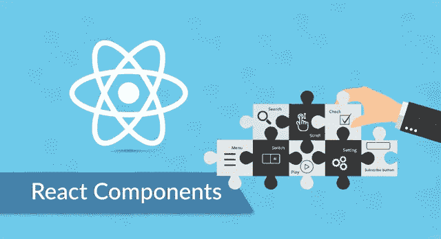
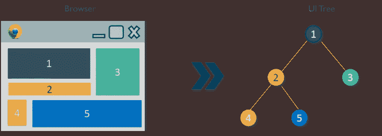
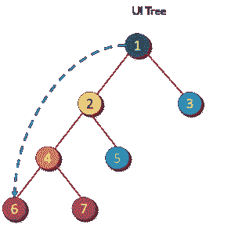
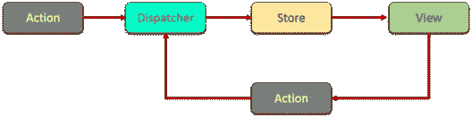
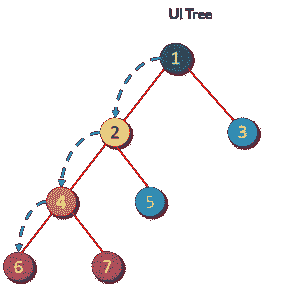
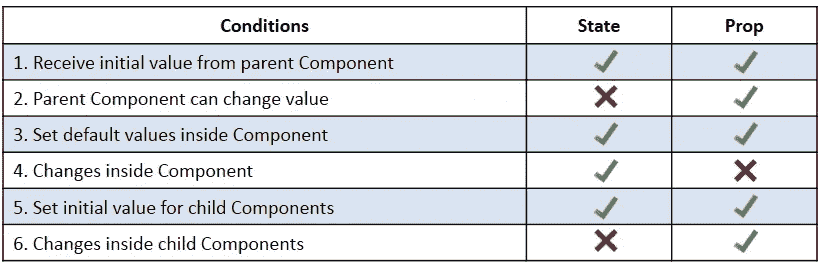
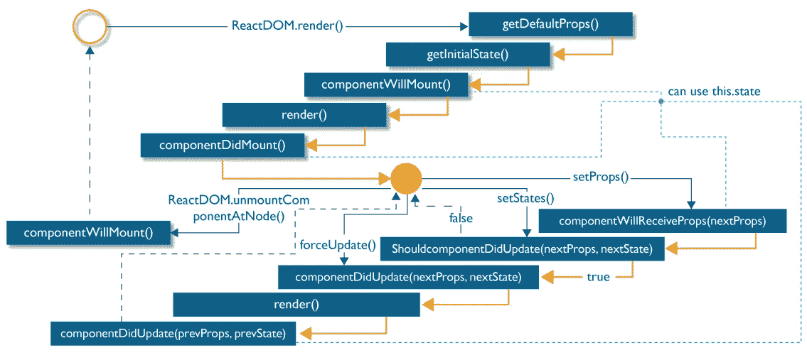

# React 组件 React 组件中的属性和状态以及示例

> 原文：<https://medium.com/edureka/react-components-65dc1d753af5?source=collection_archive---------1----------------------->



React Components — Edureka

> “在 React 中，一切都是组件”

如果你熟悉 React，那么你一定听过或读过这个短语很多次。但是你知道它到底是什么意思，怎么用的吗？如果你不知道，那么阅读这篇博客，了解 React 组件及其生命周期中的不同阶段。我相信当你读完这篇博客时，你会对 React 组件及其相关概念有一个完整的理解。但在继续之前，请快速浏览一下我将讨论的主题:

*   什么是 React 组件？
*   React 组件的优势
*   小道具
*   州
*   状态 vs 道具
*   反应组件生命周期

# 什么是 React 组件？

早期，开发人员必须编写 1000 行代码来开发一个简单的单页应用程序。这些应用程序中的大多数都遵循传统的 DOM 结构，对它们进行更改对开发人员来说是非常具有挑战性和乏味的任务。他们必须手动搜索需要更改的元素，并相应地更新它。即使是一个小错误也会导致应用程序失败。此外，更新 DOM 非常昂贵。因此，引入了基于组件的方法。在这种方法中，整个应用程序被分成称为组件的逻辑块。React 是选择这种方法的框架之一。

现在让我们了解一下这些组件是什么。

React 组件被视为用户界面的构建块。这些组件中的每一个都存在于相同的空间中，但是彼此独立地执行。React 组件有自己的结构、方法和 API。它们是可重用的，可以根据需要注入到接口中。为了更好地理解，可以将整个 UI 看作一棵树。在这里，起始组件成为根，每个独立的部分成为分支，分支又被进一步划分为子分支。



这使我们的 UI 保持有序，并允许数据和状态变化从根逻辑地流向分支，然后流向子分支。组件直接从客户端调用服务器，这允许 DOM 在不刷新页面的情况下动态更新。这是因为 react 组件是基于 AJAX 请求的概念构建的。每个组件都有自己的接口，可以调用服务器并更新它们。由于这些组件彼此独立，每个组件都可以刷新，而不会影响其他组件或整个 UI。

我们使用 **React.createClass()** 方法创建一个组件。必须向该方法传递一个将定义 React 组件的对象参数。每个组件必须恰好包含一个 **render()** 方法。它是负责在 JavaScript，JSX 中解析 HTML 的组件的最重要的属性。这个 **render()** 将组件的 HTML 表示作为一个 DOM 节点返回。因此，所有的 HTML 标签必须包含在 **render()** 内部的封闭标签中。

下面是创建组件的示例代码。

```
import React from 'react';
import ReactDOM from 'react-dom';

class MyComponent extends React.Component{
    render(){
        return(       
              <div>           
                <h1>Hello</h1>
                <h1>This is a Component</h1>
              </div>
        );
    }
}
ReactDOM.render(
    <MyComponent/>, document.getElementById('content')
);
```

# **React 组件的优点**

1.  **代码可重用性** —基于组件的方法使您的应用程序开发更加简单快捷。如果你想在你的代码中使用一个预先存在的功能，你可以把它放在你的代码中，而不是从头开始构建。它还允许您的应用程序架构随着时间的推移保持最新，因为您可以更新需要升级的特定区域。
2.  **快速开发** —基于组件的 UI 方法导致迭代和敏捷的应用程序开发。这些组件托管在一个库中，不同的软件开发团队可以在整个开发过程中访问、集成和修改它们。
3.  **一致性** —实现这些可重用的组件有助于保持设计的一致性，并且可以在整个应用程序中清晰地组织代码。
4.  **可维护性** —具有一组组织良好的组件的应用程序可以快速更新，您可以确信哪些区域会受到影响，哪些不会。
5.  **可伸缩性** —有了一个组织良好的现成组件库，开发变得更加容易。确保组件有正确的命名空间有助于避免样式和功能随着项目的扩大而泄漏或重叠到错误的位置。
6.  **容易集成** —组件代码存储在像 GitHub 这样的库中，并对公众开放使用。应用程序开发团队精通使用源代码库，因此他们能够根据需要提取代码并将其注入到应用程序中。

既然您已经理解了什么是组件以及它的优点是什么，现在让我们看看如何向这些组件提供数据。

组件接收数据有两种方式:

1.  小道具
2.  州

# 小道具

道具代表属性。它们是只读组件，工作方式类似于 HTML 属性。Prop 是一种将数据从父组件传递到子组件的方法。我们用一个例子来理解这个。

正如我们已经知道的，react 组件以树的形式排列 UI，其中父组件成为根，子组件成为分支和子分支。现在假设父组件想要发送数据到它的一个嵌套很深的组件。假设您需要从组件 1 向组件 6 发送一个属性。你会怎么做？



您不能将属性直接传递给目标组件。这是因为 React 遵循这样一条规则，即属性必须从父组件向下流到一个*直接*子组件。这意味着在发送属性时不能跳过子组件层，子组件也不能将属性发送回父组件。如果父组件没有传递属性，您可以使用默认属性，以便它们仍然被设置。这就是 React 具有单向数据绑定的原因。



因此，在这种情况下，我们需要一层一层地发送数据，直到它到达目标子组件。该路径中的每个组件都必须从其父组件接收属性，然后将该属性重新发送给其子组件。这个过程重复进行，直到您的属性到达其目标组件。



下面是一个传递道具的例子。

```
import React from 'react';
import ReactDOM from 'react-dom';

class MyComponent extends React.Component{
        render(){
        return(   
              <div>
               <h1>Hello</h1>
               <Header name="maxx" id="101"/>
           </div>
        );
    }
}

function Header(props) {
    return (              
           <div>
            <Footer name = {props.name} id = {props.id}/>
           </div>
    );
}
function Footer(props) {
    return (             
           <div>             
            <h1> Welcome : {props.name}</h1>             
            <h1> Id is : {props.id}</h1>
           </div>
  );
}
ReactDOM.render(
   <MyComponent/>, document.getElementById('content')
);
```

由于属性只能从父组件传递，因此不能更改。这使它们变得不可改变和愚蠢。这带来了巨大的挑战，因为现代应用程序在页面加载时并没有准备好所有的状态。Ajax 或事件可能在数据返回时发生，因此需要有人负责处理更新。这就是反应状态发挥作用的地方。

# 州

一般是组件取道具，渲染。这些被称为无状态组件。但是它们也可以提供用于存储关于组件的数据或信息的状态，这些数据或信息可以随时间而改变。这样的组件被称为有状态组件。状态的改变可以作为对用户事件或系统事件的响应而发生。换句话说，**状态**是每个 react 组件的核心，它决定了组件的行为和呈现方式。他们还负责使组件具有动态性和交互性。因此，它们必须尽可能简单。

可以通过 **this** 引用来访问状态，例如 **this.state** 。您可以使用花括号 **{}** 在 JSX 中访问和打印变量。同样，你可以在 **render()** 里面渲染 **this.state** 。您必须为组件设置默认状态，否则它将设置为空。

现在让我们看看一个**状态**是如何分配给一个组件的。

```
import React from 'react';
import ReactDOM from 'react-dom';

class MyComponent extends React.Component {
    constructor() {
        super();
        this.state = {
            name: 'Maxx',
            id: '101'
        }
    }
    render()
        {
            setTimeout(()=>;{this.setState({name:'Jaeha', id:'222'})},2000)
            return (             
                   <div>                     
                     <h1>Hello {this.state.name}</h1>
                     <h2>Your Id is {this.state.id}</h2>
                   </div>
             );
        }
    }
ReactDOM.render(
    <MyComponent/>, document.getElementById('content')
);
```

# 状态 vs 道具



# 反应组件生命周期

React 提供了各种方法来通知组件生命周期中的某个阶段何时发生。这些方法被称为生命周期方法。这些生命周期方法并不复杂。您可以将这些方法视为在组件生命周期的不同时间点调用的专用事件处理程序。您甚至可以向这些方法添加自己的代码来执行各种任务。谈到组件的生命周期，生命周期分为 4 个阶段。它们是:

1.  初始相位
2.  更新阶段
3.  道具变化阶段
4.  卸载阶段

每个阶段都包含一些特定于它们的生命周期方法。现在让我们来看看每个阶段都发生了什么。

## **初始阶段**

React 组件生命周期的第一个阶段是初始阶段或初始呈现阶段。在这个阶段，组件将开始它的旅程，并向 DOM 前进。这个阶段由以下方法组成，这些方法按预定义的顺序调用。

1.  ***getDefaultProps():***该方法用于指定 **this.props** 的默认值。它甚至在你的组件被创建或者父组件的任何属性被传递给它之前就被调用了。
2.  **getInitialState():** 该方法用于在创建组件之前指定 **this.state** 的默认值。
3.  ***componentWillMount():****这是组件呈现到 DOM 之前可以调用的最后一个方法。但是如果你在这个方法中调用 **setState()** ，你的组件将不会重新呈现。*
4.  ****render():*** 该方法负责返回单个根 HTML 节点，必须在每个组件中定义。如果不想渲染任何东西，可以返回 **null** 或 **false** 。*
5.  ****componentDidMount():***一旦组件被渲染并放置在 DOM 上，就调用这个方法。在这里，您可以执行任何 DOM 查询操作。*

## ***更新阶段***

*一旦组件被添加到 DOM 中，只有当状态发生变化时，它们才能更新和重新呈现。每当状态改变时，组件再次调用它的 **render()** 。任何依赖于该组件输出的组件也会再次调用其 **render()** 。这样做是为了确保我们的组件显示自己的最新版本。因此，为了成功地更新组件状态，按照给定的顺序调用以下方法:*

1.  ****【shouldcomponentdupdate():***使用这个方法你可以控制你的组件更新自身的行为。如果从此方法返回 true，组件将会更新。否则，如果该方法返回 false，组件将跳过更新。*
2.  ****componentWillUpdate():***这个方法在组件即将更新之前被称为。在这个方法中，你不能通过调用 **this.setState** 来改变你的组件状态。*
3.  ****render():*** 如果您通过**shouldComponentUpdate()**返回 false，那么 **render()** 内部的代码将被再次调用，以确保您的组件正确显示自身。*
4.  ****componentDidUpdate():***一旦组件被更新和渲染，那么这个方法就被调用。您可以将任何代码放入该方法中，以便在组件更新后执行。*

## ***道具变化阶段***

*在组件被呈现到 DOM 中之后，除了状态改变之外，组件唯一更新的时间是它的属性值改变的时候。实际上，这一阶段的工作与前一阶段类似，但是它处理的不是状态，而是道具。因此，这个阶段只有一个来自更新阶段的附加方法。*

1.  ****componentWillReceiveProps():***该方法返回一个参数，该参数包含将要分配给组件的新属性值。其余的生命周期方法的行为与我们在上一阶段看到的方法相同。*
2.  ****【shouldcomponentdupdate()】****
3.  ****componentWillUpdate()****
4.  ****渲染()****
5.  ****componentDidUpdate()****

## ***卸载阶段***

*这是组件生命周期的最后一个阶段，在这个阶段，组件被销毁并从 DOM 中完全删除。它只包含一种方法:*

1.  ****componentWillUnmount():***一旦这个方法被调用，你的组件就从 DOM 中永久删除了。在这个方法中，你可以执行任何清理相关的任务，比如删除事件监听器，停止定时器等等。*

*以下是整个生命周期图:*

**

*这就把我们带到了 React 组件博客的结尾。我希望在这篇文章中，我能够清楚地解释什么是 React 组件，它们是如何使用的。*

*如果你想查看更多关于人工智能、Python、道德黑客等市场最热门技术的文章，你可以参考 Edureka 的官方网站。*

*请留意本系列中的其他文章，它们将解释 Web 开发的各个方面。*

> *1. [ReactJS 教程](/edureka/reactjs-tutorial-aa087fd7fc90)*
> 
> *2. [React 路由器 v4 教程](/edureka/react-router-2aab4e781736)*
> 
> *3. [React Redux 教程](/edureka/react-redux-tutorial-2b3d81cfd3f7)*
> 
> *4. [HTML vs HTML5](/edureka/html-vs-html5-83302f95652e)*
> 
> *5.[什么是 REST API？](/edureka/what-is-rest-api-d26ea9000ee6)*
> 
> *6.[颤振 vs 反作用自然](/edureka/flutter-vs-react-native-58133fbf9f33)*
> 
> *7.[前端开发者技能](/edureka/front-end-developer-skills-ebb32d19f488)*
> 
> *8.[前端开发人员简历](/edureka/front-end-developer-resume-c3d443f98296)*
> 
> *9.[网络开发项目](/edureka/web-development-projects-b01f0fe85d3f)*

**原载于 2017 年 9 月 3 日 www.edureka.co**的* [*。*](https://www.edureka.co/blog/react-components/)*