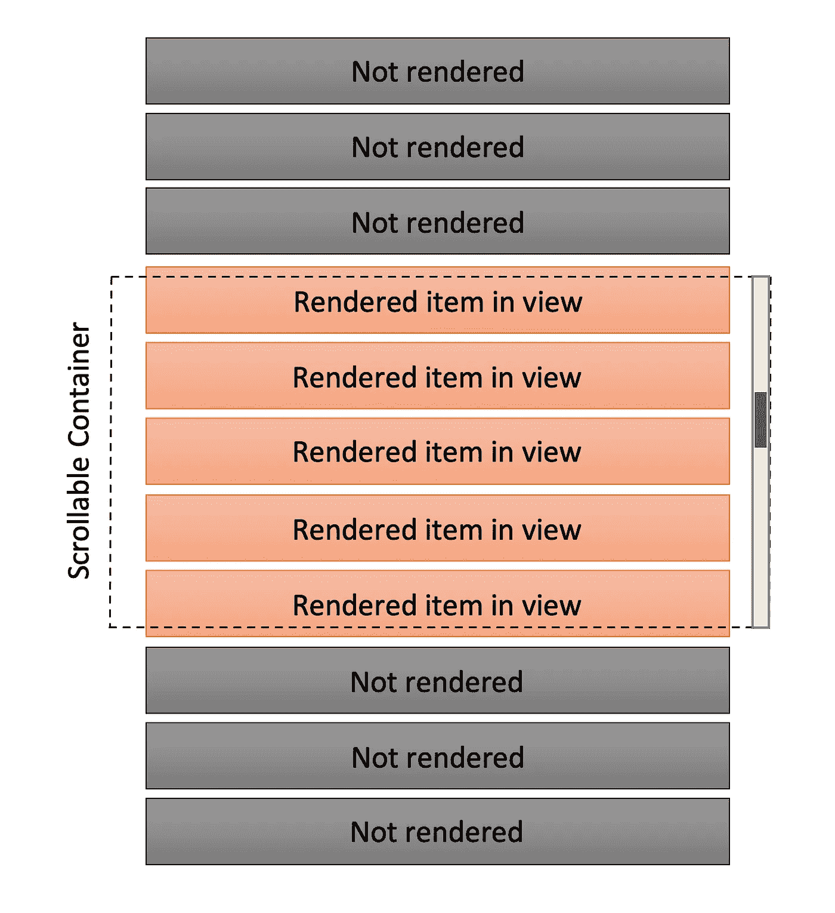
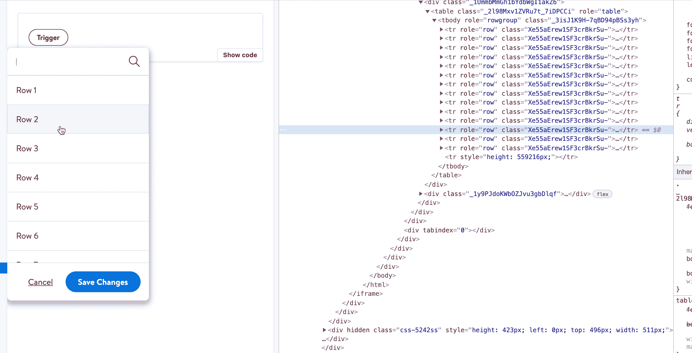

# React Hooks:虚拟化概念！

> 原文：<https://medium.com/walmartglobaltech/react-hooks-concept-of-virtualisation-ea3c1515f14c?source=collection_archive---------2----------------------->

如果你是一个前端开发人员，你肯定在渲染一个巨大的菜单列表时遇到过这个问题。只是渲染和更新太花时间了。我们可以实现很多解决方案来解决无限滚动和分页这样的问题。但是今天，我们将探讨虚拟化的概念。

虚拟化是什么概念？
简单来说，这是一种技术，其中我们在任何给定的时间仅呈现项目/行的小子集，这将在窗口中对用户实际可见。一旦用户开始滚动，我们就呈现下一组项目，并删除那些看不到的项目。



React Virtualisation

现在我们已经知道了我们想要达到的目标，让我们深入探讨如何在这个概念上创造一些简单的挂钩。
但在我们开始 React 虚拟化之前，让我们看看如何使用 IntersectionObserver 观察渲染的项目并跟踪它们在窗口中的可见性。

**什么是 IntersectionObserver？** *intersection observer API 提供了一种异步观察目标元素与祖先元素或顶级文档视窗的交集变化的方法。*

简而言之，我们有一个观察器，它将观察目标相对于某个父元素的情况，并且每当某个阈值被匹配时，它将调用一个回调方法。

**使用 IntersectionObserver 钩子的实现**

```
import { useEffect, useRef, useState, useCallback } from "react";

const useIntersectionObserver = (elementRef, observerOptions, callback) => {

  const [intersectionState, setIntersectionState] = useState({});
  const observerCallback = useRef();
  observerCallback.current = callback;

  const overallCallback = useCallback(([newIntersectionState]) => {
    setIntersectionState(newIntersectionState);
    if(observerCallback.current) observerCallback.current(newIntersectionState);
  }, [setIntersectionState]);

  useEffect(() => {
    const element = elementRef && elementRef.current;
    const hasSupport = !!window.IntersectionObserver;

    if (!element || !hasSupport) return;

    const {
      root = null,
      rootMargin = "0%",
      threshold = 0,
      ...restOptions
    } = observerOptions;

    const observer = new IntersectionObserver(
      overallCallback,
      {
        root,
        rootMargin,
        threshold,
        ...restOptions
      }
    );

    observer.observe(element);

    return () => observer.disconnect();
  }, [elementRef, observerOptions, overallCallback])

  return {
    intersectionState
  }
};

export default useIntersectionObserver;
```

现在让我们开始实现我们的虚拟化挂钩

**use virtualization hook 的实现**

```
import { useLayoutEffect, useState, useMemo, useCallback, useRef } from "react";
import { useIntersectionObserver } from "./useIntersectionObserver";
import { useSyncStateRef } from "./useSyncStateRef";

const INITIAL_VIRTUAL_STATE = {
  virtualBucketStart: 0,
  virtualBucketMiddle: 0,
  virtualBucketEnd: 1,
  calculatedStartIndex: 0,
  calculatedEndIndex: 1
};

export const useVirtualisation = ({ childrensCount = 0, parentRef }) => {
  const [syncParentRef] = useSyncStateRef({ ref: parentRef });
  const [virtualState, setVirtualState] = useState({ ...INITIAL_VIRTUAL_STATE });
  const middleChildRef = useRef();

  const boundVirtualIndex = useCallback(
    (nextStepIndex) => {
      return Math.min(Math.max(nextStepIndex, 0), childrensCount);
    },
    [childrensCount]
  );

  const getExtraPaddedIndexes = useCallback(
    (startIndex, endIndex) => {
      const boundedStartIndex = boundVirtualIndex(startIndex);
      const boundedEndIndex = Math.max(boundedStartIndex, boundVirtualIndex(endIndex));
      const totalRootWidthInElements = boundedEndIndex - boundedStartIndex;
      const nextStartIndex = boundVirtualIndex(boundedStartIndex - totalRootWidthInElements);
      const nextEndIndex = boundVirtualIndex(boundedEndIndex + totalRootWidthInElements);
      const nextMiddleIndex = Math.ceil((boundedStartIndex + boundedEndIndex) / 2);

      return {
        virtualBucketStart: nextStartIndex,
        virtualBucketEnd: nextEndIndex,
        virtualBucketMiddle: nextMiddleIndex,
        calculatedStartIndex: startIndex,
        calculatedEndIndex: endIndex
      };
    },
    [boundVirtualIndex]
  );

  const safelyGetVirtualisedState = useCallback(
    (startIndex, endIndex) => {
      return getExtraPaddedIndexes(startIndex, endIndex);
    },
    [getExtraPaddedIndexes]
  );

  const hasStateChangedForCallback = (asyncVirtualState, syncVirtualState) => {
    const {
      virtualBucketStart: asyncVirtualBucketStart,
      virtualBucketMiddle: asyncVirtualBucketMiddle,
      virtualBucketEnd: asyncVirtualBucketEnd,
      childRef: asyncChildRef
    } = asyncVirtualState;
    const {
      virtualBucketStart: syncVirtualBucketStart,
      virtualBucketMiddle: syncVirtualBucketMiddle,
      virtualBucketEnd: syncVirtualBucketEnd,
      childRef: syncChildRef
    } = syncVirtualState;
    return !(
      asyncVirtualBucketStart === syncVirtualBucketStart &&
      asyncVirtualBucketMiddle === syncVirtualBucketMiddle &&
      asyncVirtualBucketEnd === syncVirtualBucketEnd &&
      asyncChildRef === syncChildRef
    );
  };

  const getBodyRemainingTopHeight = () => {
    const element = middleChildRef?.current;
    if (!element) return 50;
    const { virtualBucketStart } = virtualState;
    return virtualBucketStart * (element.clientHeight || 50);
  };

  const getBodyRemainingBottomHeight = () => {
    const element = middleChildRef?.current;
    if (!element) return 50;
    const { virtualBucketEnd } = virtualState;
    return (childrensCount - virtualBucketEnd) * (element.clientHeight || 50);
  };

  const shouldUpdate = (virtualBucketStart, virtualBucketEnd, startIndex, endIndex) => {
    return startIndex !== virtualBucketStart || endIndex !== virtualBucketEnd;
  };

  const getRoughClientHeightEstimate = (intersectionState) => {
    const boundingClientRect = intersectionState?.boundingClientRect;
    return boundingClientRect?.height || 50;
  };

  const getSlideEstimateForScroll = (intersectionState) => {
    const rootBounds = intersectionState?.rootBounds;
    const boundingClientRect = intersectionState?.boundingClientRect;
    if (!rootBounds || !boundingClientRect) return [0, 1];
    const height = getRoughClientHeightEstimate(intersectionState);
    const { bottom: rootBottom, top: rootTop } = rootBounds;
    const { bottom: clientBottom, top: clientTop } = boundingClientRect;
    const topElementsDifference = Math.ceil(Math.abs(rootTop - clientTop) / height);
    const bottomElementsDifference = Math.ceil(Math.abs(rootBottom - clientBottom) / height);
    const startIndexSteps = rootTop <= clientTop
      ? topElementsDifference + 1
      : -(topElementsDifference - 1);
    const endIndexSteps =
      clientBottom <= rootBottom ? bottomElementsDifference + 1 : -(bottomElementsDifference - 1);
    return [-startIndexSteps, endIndexSteps];
  };

  const getNextScrollStep = (intersectionState, targetRefIndex) => {
    const [nextStartIndex, nextEndIndex] = getSlideEstimateForScroll(intersectionState);
    return [
      boundVirtualIndex(targetRefIndex + nextStartIndex),
      boundVirtualIndex(targetRefIndex + nextEndIndex)
    ];
  };

  const generateSetScrollState = (targetRef, targetRefIndex) => {
    const asyncVirtualState = { ...virtualState, childRef: targetRef?.current };
    const setScrollState = (newIntersectionState) => {
      const [intersectionState] = newIntersectionState;
      setVirtualState((syncVirtualState) => {
        const { calculatedStartIndex, calculatedEndIndex } = syncVirtualState;
        const syncChildRef = intersectionState?.target;
        if (
          hasStateChangedForCallback(
            asyncVirtualState,
            { ...syncVirtualState, childRef: syncChildRef }
          )
        ) return syncVirtualState;
        const [startIndex, endIndex] = getNextScrollStep(intersectionState, targetRefIndex);
        return shouldUpdate(calculatedStartIndex, calculatedEndIndex, startIndex, endIndex)
          ? safelyGetVirtualisedState(startIndex, endIndex)
          : syncVirtualState;
      });
    };

    return setScrollState;
  };

  const observerOptions = useMemo(() => {
    const rootRef = syncParentRef?.current;
    return {
      threshold: 1,
      rootMargin: "10px",
      root: rootRef
    };
  }, [syncParentRef]);

  useIntersectionObserver({
    elementRef: middleChildRef,
    observerOptions,
    callback: generateSetScrollState(middleChildRef, virtualState.virtualBucketMiddle)
  });

  useLayoutEffect(() => {
    setVirtualState((oldVirtualState) => {
      const { calculatedStartIndex, calculatedEndIndex } = {
        ...INITIAL_VIRTUAL_STATE,
        ...oldVirtualState
      };
      return safelyGetVirtualisedState(calculatedStartIndex, calculatedEndIndex);
    });
  }, [parentRef, safelyGetVirtualisedState]);

  return {
    virtualState,
    middleChildRef,
    topHeight: getBodyRemainingTopHeight(),
    bottomHeight: getBodyRemainingBottomHeight(),
    element: { type: middleChildRef?.current?.localName }
  };
};
```

**要使用的助手组件使用虚拟化挂钩**

```
import { useVirtualisation } from "../utility";
import React, { Fragment } from "react";

export const Virtualisation = ({
  childrensCount = 0,
  completeRowsProp,
  childRenderer,
  parentRef,
}) => {
  const { topHeight, bottomHeight, element, middleChildRef, virtualState } = useVirtualisation({
    childrensCount,
    parentRef
  });
  const { virtualBucketStart, virtualBucketEnd, virtualBucketMiddle } = virtualState;
  const renderPaddingElement = (elementHeight) => {
    const sampleElement = element;
    return !!elementHeight && element?.type && <sampleElement.type style={{ height: elementHeight }} />;
  };

  const setRef = (node) => {
    if (node) middleChildRef.current = node;
    return node;
  };

  const renderVirtualisedChildren = () => {
    return (
      Array.isArray(completeRowsProp) &&
      completeRowsProp
        .slice(virtualBucketStart, virtualBucketEnd)
        .map((row, index) =>
          childRenderer(row, index + virtualBucketStart === virtualBucketMiddle && ((node) => setRef(node)))
        )
    );
  };

  return (
    <Fragment>
      {renderPaddingElement(topHeight)}
      {renderVirtualisedChildren()}
      {renderPaddingElement(bottomHeight)}
    </Fragment>
  );
};
```

**到底是怎么回事？** 让我们一个一个的过代码。

1.  首先，我们将一个 ref 附加到父元素和列表中呈现的中间元素(最初是第一个元素)。
2.  然后，我们使用 IntersectionObserver 计算实际的可见区域，然后是应该呈现的第一个元素和最后一个元素。
3.  现在，利用这些信息，我们可以得到下一个中间元素，并开始观察这个元素。一旦这个元素移出窗口范围，我们就计算下一组应该呈现的元素。

**还有最后的结局！** 观察几件事:

1.  仅呈现那些对用户可见的元素。
2.  当用户开始滚动时，我们添加下一个元素。之前可见但不可见的元素也被移除。



Demo: React Virtualisation

# 推荐人和证明人:

[](https://reactjs.org/docs/optimizing-performance.html#virtualize-long-lists) [## 优化性能-反应

### 在内部，React 使用了几种巧妙的技术来最小化更新…

reactjs.org](https://reactjs.org/docs/optimizing-performance.html#virtualize-long-lists) [](https://addyosmani.com/blog/react-window/) [## 用 react-window 渲染大型列表

### 如果您使用 React 并需要高效地显示大型数据列表，您可能对 react-virtualized 比较熟悉。这是…

addyosmani.com](https://addyosmani.com/blog/react-window/) [](https://developer.mozilla.org/en-US/docs/Web/API/Intersection_Observer_API) [## intersect observer API-Web API | MDN

### IntersectionObserver API 提供了一种异步观察目标元素交集变化的方法…

developer.mozilla.org](https://developer.mozilla.org/en-US/docs/Web/API/Intersection_Observer_API)