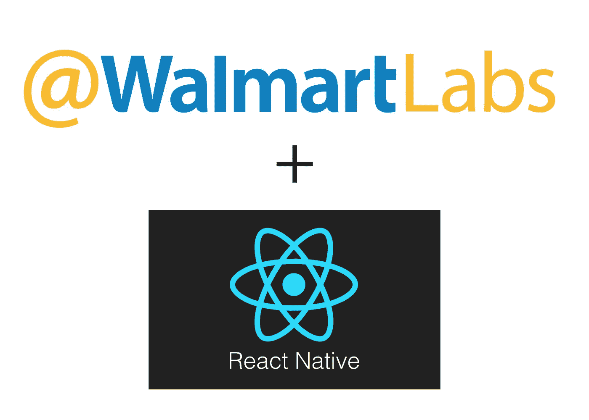
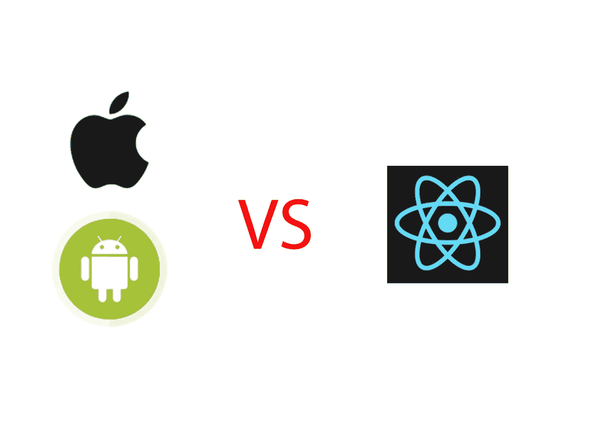

# 沃尔玛实验室的本土反应

> 原文：<https://medium.com/walmartglobaltech/react-native-at-walmartlabs-cdd140589560?source=collection_archive---------0----------------------->

在[沃尔玛](http://careers.walmart.com/)，顾客永远是第一位的，所以我们一直在寻找改善顾客购物体验的方法。目前，沃尔玛应用程序有许多嵌入式 web 视图，我们发现这些实现低于我们和我们的客户对应用程序的要求。混合 web 视图实现的性能不是很好，即使在高端设备上也是如此，并且没有任何本地的感觉。不仅如此，由于 web 视图严重依赖于网络请求(我们在 web 实现中使用服务器端呈现)，连接速度较慢的用户会有不愉快的体验。因此，我们想知道:“有没有一种方法可以改进或替换当前的实现，为我们的客户提供更好、更流畅的体验？”于是，我们开始寻找答案。

# 潜在的解决方案

经过一番头脑风暴，我们提出了以下解决方案:

1.  纯本机实现(不再有 web 视图)
2.  反应自然

本机实现在理论上很棒，但实际上，我们需要考虑生产率/代码共享/上市时间，这就是像 React Native 这样的跨平台框架的用武之地。React Native 之外还有其他跨平台移动开发框架，如 PhoneGap、Xamarin 和 Meteor，但鉴于我们当前的 web 代码库使用 React 和 Redux，在任何其他跨平台框架之前考虑 React Native 是最有意义的——更不用说，它是一个相当稳定的框架，可能会流行一段时间。

以下是我们观察到的 React Native 的优势:

**生产力**

*   95%的代码库在 iOS 和 Android 之间共享
*   不需要知识共享，因为每个功能都是由单个团队实现的
*   *开发者体验超赞*。无需重启打包程序即可查看简单的更改
*   React Native 是用 JavaScript 写的。我们可以利用整个组织的编程技能/资源

**代码共享**

*   前端/演示代码可以在 iOS 和 Android 之间共享
*   业务逻辑(redux store)也可以与 Web 应用程序共享
*   平台间大量代码的可重用性

**应用商店批准**

*   无需经过 app store 审批流程。我们可以在自己的服务器上托管这个包，并进行空中更新

**上市时间**

*   非常快
*   我们可以控制发布日期
*   两个平台可以在同一天同一个时间发布

**性能**

*   React Native 提供了与 Native 几乎相同的性能

**动画**

*   React Native 提供了非常流畅的动画，因为代码在渲染之前被转换为本机视图

**UX**

*   我们可以进行特定于平台的用户界面设计

**自动化**

*   相同的自动化套件可以在 iOS 和 Android 上运行

# **表演**

当我们在[沃尔玛实验室](http://www.walmartlabs.com/team/)进行性能测试时，我们心中有几个目标。我们想知道 React Native 在 RAM 使用、FPS、CPU 利用率等指标上与其竞争对手相比如何。但我们也想调查 React Native 的扩展能力，因为 React Native 有可能成为整个企业的标准移动技术。由于该项目是 WalmartLabs 的一项实验，我们的短期目标是证明该技术的性能与当前解决方案相当或更好。我们长期追求的是将性能测试与我们的 CI 整合在一起，就像[脸书](https://code.facebook.com/posts/924676474230092/mobile-performance-tooling-infrastructure-at-facebook/)所做的那样，这样我们就可以测试我们的每个变化对整体应用性能的影响。

***特里布尔斯的麻烦***

就目前而言，性能测试 React Native 是一种痛苦。马上，由于两个不同的平台，有两套收集数据的工具。苹果公司提供了测试仪器，为我们提供了我们所追求的大部分测量结果。Android 需要使用多种实用程序来收集我们想要的所有数据。此外，对于许多测量来说，没有简单的方法来获得数据流，所以一些测量必须被估计。

脸书试图通过提供内置于 React 原生开发者菜单中的性能监视器来弥合 Android 和 iOS 性能测试之间的差距。不幸的是，这个解决方案远非完美。在 iOS 上，它提供 RAM 使用、FPS 数据以及一系列与 React 原生相关的测量，但是对于 Android，perf monitor 仅提供 FPS 数据。将来，如果可能的话，我希望看到所提供的度量在两个平台上实现标准化。

**闭嘴，告诉我土人是怎么反应的！**

好吧，但是请注意，我们报告的性能是基于我们的应用程序，并不代表您的应用程序。然而，我将试图提供从我们的测试中可以得出的一般性结论。

我们收集的数据很有希望。事实证明，React Native 确实是大大小小的移动应用程序的可行解决方案。在图形性能、RAM 使用和 CPU 方面，我们采取的每一项措施都相当于或优于我们当前的混合解决方案，这适用于两个平台。该应用程序的整体感觉得到了显著改善，并提供了远优于 hybrid 的用户体验。

原生反应很快，真的很快。虽然我们没有测试纯本机版本，但可以肯定地说，就外观和感觉而言，用纯本机编写这个应用程序不会比 React Native 提供任何显著的优势。总的来说，我们对 React Native 到目前为止的表现非常满意，我们希望我们收集的结果能够得到业务部门以及最终我们的用户的认可。

# 测试

为了确保 React 本机代码的质量，我们的目标是单元测试和集成测试的 100%测试覆盖率。

## 集成测试

沃尔玛的 iOS 和 Android 应用程序是由数百名工程师合作开发的。我们使用我们的集成测试来确保我们的 React 本机代码在代码库继续发展时仍然有效。

在沃尔玛，我们需要支持各种设备和操作系统。 [Sauce Labs](https://saucelabs.com/) 允许我们在 iOS 和 Android 硬件和操作系统版本的几种组合上运行我们的集成测试。在多个设备上运行集成测试需要很长时间，所以我们每天晚上只做一次。

我们还使用我们的集成测试来防止回归。我们已经将我们的[团队城市 CI](https://www.jetbrains.com/teamcity/) 与 GitHub Enterprise 连接起来，对每个拉请求进行测试。与夜间作业不同，对于拉取请求，我们只在一台设备上运行测试。但是即使这样也可能会比实际可行的时间更长，所以我们使用一些工具来减少这个时间。[麦哲伦](https://github.com/TestArmada/magellan)，这是我们的开源项目之一，允许我们并行运行测试，以显著减少测试时间。

测试本身用 JavaScript 编写，由 Mocha 运行，并使用 [Appium](http://appium.io/) 命令来控制移动模拟器。React Native 允许我们在每个组件上设置一个“testID”属性。这些“testID”充当 CSS 类名。我们使用 XPaths 精确而方便地指定一个组件，并为了测试的目的与它进行交互。

## 单元测试

我们使用单元测试来孤立地测试我们的 React 本地组件，并防止无意的更改。

我们使用常见的 React 单元测试工具，如 Mocha、Chai、Sinon 和 Enzyme。但是 React Native 有一些独特的挑战，因为它的组件有环境依赖性，这使得它不能在节点上运行。 [react-native-mock](https://github.com/lelandrichardson/react-native-mock) 为我们解决了这个问题，因为它提供了在 iOS 或 Android 之外运行时不会崩溃的模拟 react 原生组件。当我们发现自己需要模仿额外的依赖时，我们使用 [rewire](https://github.com/jhnns/rewire) 节点模块。

## 复用性

我们利用相同的自动化测试套件在 iOS 和 Android 上运行。

# 部署

React Native 的主要优势之一是能够绕过应用商店，通过无线方式推送快速错误修复，这意味着 React Native JavaScript 捆绑包将托管在服务器上，并由客户端直接检索，类似于 web 的工作方式。

然而，React Native 面临的一个挑战是，要使 JS 包工作，必须在本机端有一个兼容的 React Native 副本。如果你将原生端升级到最新的 React Native，用户更新了他们的应用程序，但他们下载了一个旧的捆绑包，应用程序将会崩溃。如果你更新捆绑包以匹配最新的本机端，并将其提供给仍未更新其应用程序的用户，它也会中断。

像微软 [CodePush](https://github.com/Microsoft/react-native-code-push) 这样的工具可以用来将捆绑包映射到正确的应用版本。但是同时支持多个版本的应用程序是决定使用 React Native 时应该考虑的开销。

# 挑战

## iOS 和 Android 的区别

在 iOS 和 Android 上 React Native 的功能之间有足够多的不一致，使得支持这两个平台变得很棘手。几个 React 本机行为和样式实现在平台之间有所不同。例如，样式属性“溢出”在 iOS 上受支持，但在 Android 上不受支持。组件属性也可以是特定于平台的。在 React 原生文档中，您可以看到许多标记为“仅限 Android”或“仅限 iOS”的属性和功能。测试自动化代码也需要针对每个平台进行调整。

我们发现 iOS 比 Android 拥有更多的功能，所以对于一个同时面向两个平台的产品来说，采用 Android 优先的方法进行开发可能是有意义的。

## 开发和调试

我们经验中的一个难点是，React Native 代码在调试模式和常规模式下的行为有何不同，因为 React Native 为这两种模式中的每一种模式使用了[不同的 JavaScript 引擎。当一个 bug 是常规模式特有的时候，它自然会很难调试，因为它在调试模式下是不可再现的。](https://facebook.github.io/react-native/docs/javascript-environment.html#javascript-runtime)

# 结论

React Native 有一些很好的优势。React Native 的定义性特征，也可以说是它的最佳卖点，是它的跨平台性——允许同一团队在 iOS 和 Android 上同时开发，这可以将劳动力成本削减大约一半。说到团队，JavaScript 开发人员非常多，而且所需的特定于移动设备的技能非常少，这意味着有适当技能的劳动力很容易获得。初始开发以及增量功能的开发非常快，因此您可以比竞争对手更快地满足客户的需求。作为锦上添花，一般来说，用 React Native 编写的应用程序具有与那些作为本机应用程序编写的应用程序相当甚至可能更好的性能。

虽然 React Native 确实有一些很棒的卖点，但在开始使用 React Native 进行项目之前，您也需要记住一些事情。首先，尽管 React Native 很好地弥合了 iOS 和 Android 之间的差距，但你不会在两个操作系统之间实现完全平等。有些事情一个平台可以做，而另一个平台不能处理，这些事情大多与样式视图有关，但也有更重要的考虑因素，如性能测试。虽然开源社区在开发和发布新功能和性能调整方面非常出色，但实际上升级 React 原生版本往往是一件非常痛苦的事情，尤其是如果你有一个像沃尔玛一样围绕 React 原生构建的平台。

我们坚信 React Native 是一个非常棒的框架。它做了我们想要它做的一切，而且做得如此令人钦佩。虽然它确实有一些问题，但这些问题都被使用它所带来的巨大好处掩盖了。从创业公司到财富 500 强公司，如果你正在考虑接受一个新的移动项目，考虑使用 React Native——我们知道你不会后悔的。

**演职员表**

这篇文章是由沃尔玛实验室 React Native 团队的工程师们共同完成的，他们分别是[马特·布雷斯南](https://medium.com/u/bbf6a1d22e3?source=post_page-----cdd140589560--------------------------------)、 [M.K .萨菲](https://medium.com/u/a4da983a03a0?source=post_page-----cdd140589560--------------------------------)、[桑凯特·帕特尔](https://medium.com/u/3736ca4de438?source=post_page-----cdd140589560--------------------------------)和[科尔蒂](https://medium.com/u/5d46542ee15f?source=post_page-----cdd140589560--------------------------------)。