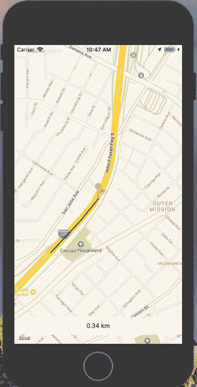

# 反应本地位置跟踪

> 原文：<https://medium.com/quick-code/react-native-location-tracking-14ab2c9e2db8?source=collection_archive---------0----------------------->

## 使用 react native 和 react-native-maps 构建实时位置跟踪应用程序



Tracks user’s location and draws the path as the location changes

如果你一直在使用 React Native，你一定用过或者听说过 react-native-maps。React native maps 是一个 React native 包，为 react native 提供 Google Maps API。使用静态谷歌地图是非常常见的，但今天我们将使用谷歌地图的一个广泛使用的功能，使用 React native 进行位置跟踪。

> 在这里找到项目回购

## 入门指南

首先创建一个 React 原生项目，并随意命名。我用的是 react-native-cli，但是 [create-react-native-app](https://github.com/react-community/create-react-native-app) 应该也可以。

```
react-native init locationTracking
```

## 安装 react-native-maps

首先，从 npm 下载这个库:

```
npm install react-native-maps --save
```

安装 react-native-maps 需要在原生 iOS 和 Android 文件中添加代码。遵循 react-native-maps 提供的[安装](https://github.com/react-community/react-native-maps/blob/master/docs/installation.md)说明。安装后，确保项目成功构建，然后再继续。

安装 react-native-maps 不是一项简单的任务。如果你是第一次这样做，我建议仔细阅读安装说明。相信我，这将是本教程最艰巨的任务。如果你遇到任何错误，请使用谷歌。😅在 [best react-native 教程](https://blog.coursesity.com/best-react-native-tutorials/)的帮助下，你将能够开发适用于 Android 和 iOS 的全功能应用。

## 使用反应原生映射

很好，现在您已经成功安装了 react-native-maps。让我们进入有趣的部分，真正的奇迹发生了。😃

让我们首先设置一些将用于这个项目的初始状态。

```
constructor(props) {
  super(props); *this*.state = {
    latitude: LATITUDE,
    longitude: LONGITUDE,
    routeCoordinates: [],
    distanceTravelled: 0,
    prevLatLng: {},
    coordinate: new AnimatedRegion({
     latitude: LATITUDE,
     longitude: LONGITUDE
    })
  };
}
```

我们稍后将在应用程序中使用这些状态，这里唯一感兴趣的是`new AnimatedRegion`，它将帮助我们在位置更新时制作标记动画。

## 注意位置变化

现在我们需要获得用户每次移动的位置坐标。谷歌地图地理定位 API 有`watchPosition`方法，这将帮助我们在位置坐标发生变化时获取它们。

```
componentDidMount() {
  this.watchID = navigator.geolocation.watchPosition(
    position => {
      const { coordinate, routeCoordinates, distanceTravelled } =   this.state;
      const { latitude, longitude } = position.coords;

      const newCoordinate = {
        latitude,
        longitude
      }; if (Platform.OS === "android") {
        if (this.marker) {
          this.marker._component.animateMarkerToCoordinate(
            newCoordinate,
            500
          );
         }
       } else {
         coordinate.timing(newCoordinate).start();
       } this.setState({
         latitude,
         longitude,
         routeCoordinates: routeCoordinates.concat([newCoordinate]),
         distanceTravelled:
         distanceTravelled + this.calcDistance(newCoordinate),
         prevLatLng: newCoordinate
       });
     },
     error => console.log(error),
     { enableHighAccuracy: true, timeout: 20000, maximumAge: 1000 }
  );
}
```

无论何时用户的位置发生变化,`watchPosition`都会给我们提供相关信息。然后我们使用 ES6 [析构](https://developer.mozilla.org/en-US/docs/Web/JavaScript/Reference/Operators/Destructuring_assignment)从`position.coords`中获取`latitude & longitude`。同样，我们会从初始状态得到`coordinate, routeCoordinates & distanceTravelled`。

然后我们将创建`newCoordinate`变量，它将存储我们从`position.coords`接收到的这些新的更新的位置坐标。现在我们已经得到了更新坐标，我们将动画标记这些新的坐标。Android 和 iOS 对此有不同的处理方式，所以我们将使用`[Platform Specific Code](https://facebook.github.io/react-native/docs/platform-specific-code.html)`来处理。

```
if (Platform.OS === "android") {
  if (this.marker) {
  this.marker._component.animateMarkerToCoordinate(
    newCoordinate,
    500
   );
  }
} else {
  coordinate.timing(newCoordinate).start();
}
```

现在是用新的状态更新初始状态的时候了。

```
this.setState({
  latitude,
  longitude,
  routeCoordinates: routeCoordinates.concat([newCoordinate]),
  distanceTravelled: distanceTravelled + this.calcDistance(newCoordinate),
  prevLatLng: newCoordinate
});
```

## 计算行驶距离

我们使用了`distanceTravelled`状态变量来存储用户走过的距离。为了计算这个距离，我们将创建一个新函数`calcDistance`，它将`newLatLng`作为参数，将`prevLatLng`作为状态变量，并将返回距离。

```
calcDistance = newLatLng => {
  const { prevLatLng } = this.state;
  return haversine(prevLatLng, newLatLng) || 0;
};
```

看着这个函数，你可能想知道什么时候计算距离变得如此复杂。显然，由于地球的曲率，借助`latitude`和`longitude`计算距离并不那么简单。地球有一些曲线😝。

为了使用`latitude`和`longitude`计算距离，我们需要使用[哈弗辛公式](https://en.wikipedia.org/wiki/Haversine_formula)。如果你像我一样纠结于数学😅，有一个以`haversine` npm 包的形式出现的希望，它可以帮助我们使用`latitude`和`longitude`计算距离。使用以下命令安装`haversine` npm 包。

```
npm install haversine
```

## 渲染`MapView`

因为`<MapView>`组件需要`region`道具，该道具接受带有位置坐标的`object`。我们将创建一个函数，返回所需的所有必要信息。

```
getMapRegion = () => ({
  latitude: this.state.latitude,
  longitude: this.state.longitude,
  latitudeDelta: LATITUDE_DELTA,
  longitudeDelta: LONGITUDE_DELTA
});
```

现在我们有了渲染地图所需的所有信息。

```
<MapView
  style={styles.map}
  showUserLocation
  followUserLocation
  loadingEnabled
  region={this.getMapRegion()}
> <Polyline coordinates={this.state.routeCoordinates} strokeWidth={5} />
  <Marker.Animated
    ref={marker => {
      this.marker = marker;
    }}
    coordinate={this.state.coordinate}
  />
</MapView>
```

我们还使用谷歌地图`[Polyline](https://github.com/react-community/react-native-maps/blob/master/docs/polyline.md)`来绘制用户移动的路径。`Polyline`有一个`coordinate`道具，它接受一个坐标数组，我们可以从`routeCoordinates`中得到这个数组。我们还将`strokeWidth`设置为，这样我们可以清楚地看到路径。

接下来，为了显示动画标记，我们将使用`Marker.Animated`组件来显示用户当前位置的标记。它有`coordinate`道具，可以从状态中获取`coordinate`对象。

## 显示旅行距离

最后，为了显示用户走过的距离，我们将设置一个应用了适当样式的`View`。

```
<View style={styles.buttonContainer}>
  <TouchableOpacity style={[styles.bubble, styles.button]}>
    <Text style={styles.bottomBarContent}>
      {parseFloat(this.state.distanceTravelled).toFixed(2)} km
    </Text>
  </TouchableOpacity>
</View>
```

## 测试

现在我们已经准备好了所有必要的部分，我们终于可以运行我们的应用程序了。

为了在 iOS 模拟器上测试该应用程序，我们将使用 iOS 模拟器中可用的定位模式。运行应用程序后，进入模拟器中的`Debug` > `Location` > `Freeway Drive`设置，打开此功能。这样做应该会产生类似下面的结果。


对于 Android，这并不简单，因为 Android 模拟器没有内置的功能来测试动态位置变化。为了测试它，你可以通过步行一段距离来手动改变你的位置，或者你可以使用第三方模拟定位应用程序。我能够在 Android 上使用 [GPS 操纵杆](https://play.google.com/store/apps/details?id=com.theappninjas.gpsjoystick&hl=en_IN)应用程序来测试这一点。

## 结论

我们已经成功创建了一个 React 本机应用程序，它可以跟踪用户位置并绘制路径。它还可以计算用户行进的距离。

我已经跳过了这个应用程序需要的样式和一些其他样板代码，但是你可以在 GitHub repo [这里](https://github.com/vikrantnegi/react-native-location-tracking)找到。

我希望这能帮助你理解谷歌地图 API。也许你可以从中获得灵感来建造一些令人惊叹的东西。请随时留下任何反馈，我一直在寻找更好的解决方案！

编辑:我在 Sitepoint 上发表了一篇后续文章，扩展了本文的功能。

*   【React Native 和 PubNub 的实时位置跟踪

查看我的其他文章:

*   [React Native FlatList 具备实时搜索能力](https://medium.freecodecamp.org/how-to-build-a-react-native-flatlist-with-realtime-searching-ability-81ad100f6699)
*   [用动态工具提示反应原生图表](https://medium.freecodecamp.org/how-to-build-react-native-charts-with-dynamic-tooltips-64aefc550c95)
*   [如何在 React Native 中创建一个漂亮的动画加载器](https://medium.freecodecamp.org/how-to-create-a-beautifully-animated-loader-in-react-native-21da37a8f6b0)