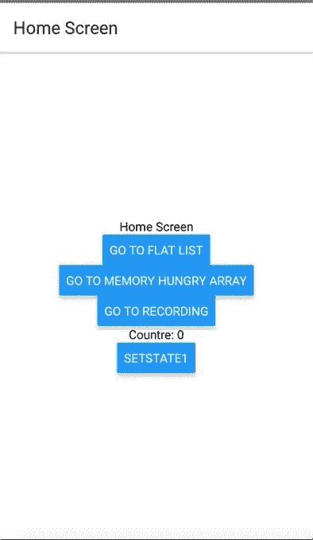
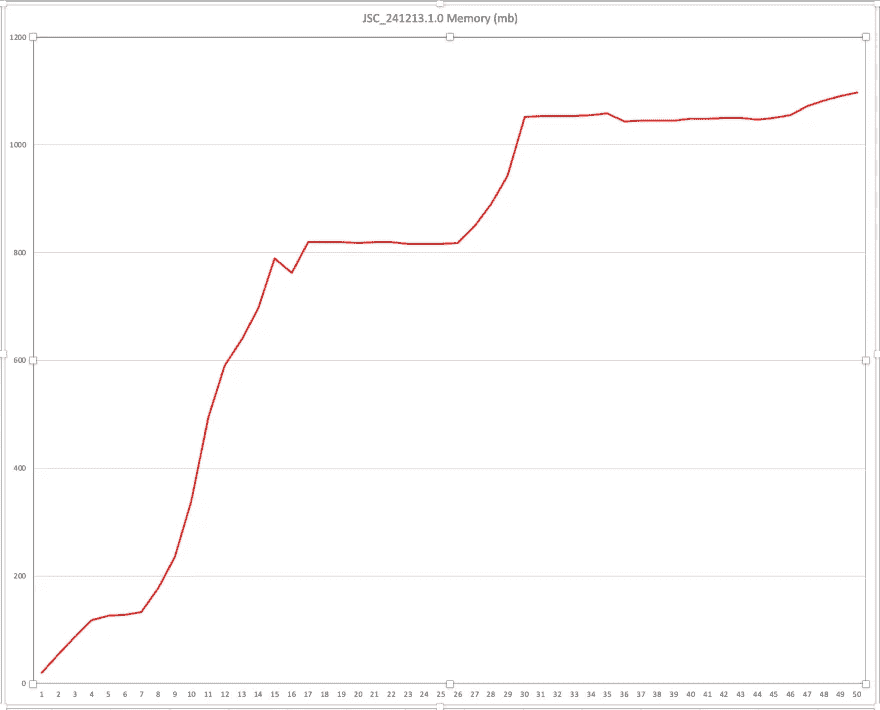
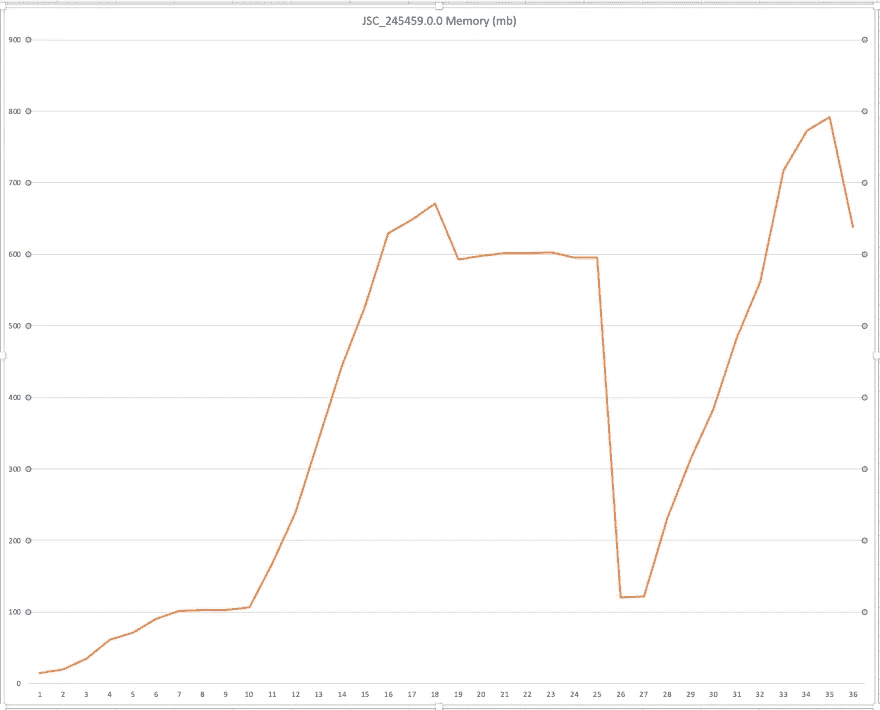
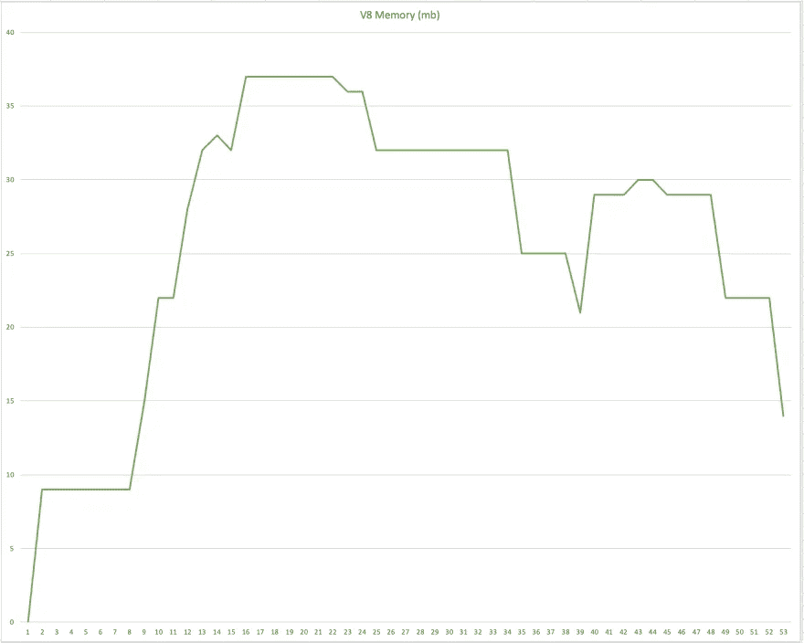
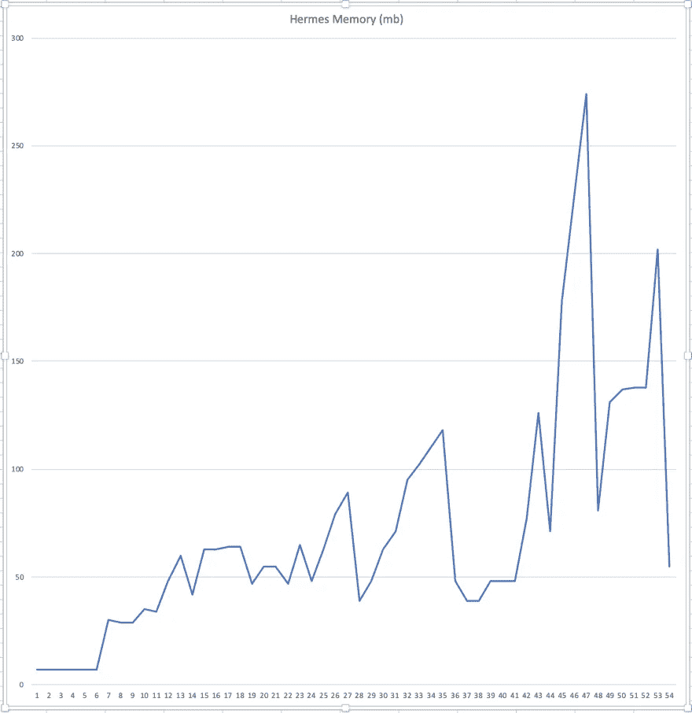
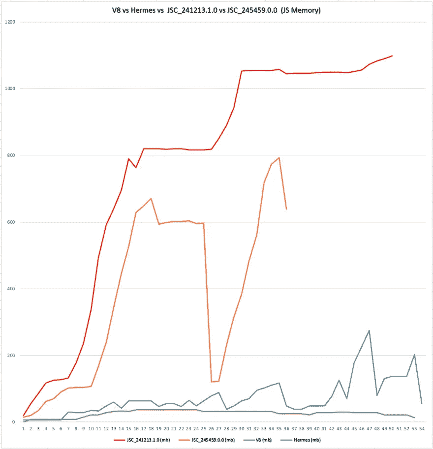

# React 本机内存分析(JSC vs V8 vs Hermes)

> 原文：<https://medium.com/walmartglobaltech/react-native-memory-profiling-jsc-vs-v8-vs-hermes-1626949a653b?source=collection_archive---------0----------------------->

我们的 Android 应用程序面临着内存问题，因为斯托克·JSC 在 Android 中进行了最少的垃圾收集。我们尝试了各种方法来减少应用程序的内存占用，但都没有成功。
对于包含大量条目(在我们的例子中大约 1k)的 react 本机平面列表，这个问题变得非常严重。随着屏幕之间的每次导航，内存不断增加，甚至在清除数据后也没有下降。

# 救助者

2019 年 6 月中旬，@kudochien 在推特上发布了关于 [react-native-v8](https://www.npmjs.com/package/react-native-v8) 包的消息，该包可以使我们将 v8 与 react-native for android 捆绑在一起，而不是 JSC。

与此同时， [jsc-android](https://www.npmjs.com/package/jsc-android/v/245459.0.0) 发布了新版本 245459.0.0，Hermes 也在@ChainReactConf 期间发布。

因此，我们决定比较[股票 JSC (v241213.1.0)](https://www.npmjs.com/package/jsc-android/v/241213.1.0) 、新 [JSC(v245459.0.0)](https://www.npmjs.com/package/jsc-android/v/245459.0.0) 、[爱马仕](https://facebook.github.io/react-native/docs/hermes/)和 [react-native-v8](https://www.npmjs.com/package/react-native-v8) 的内存占用。

为了模拟真实世界的用例，我们创建了一个样本存储库。

 [## bhaskarGyan/react-native-memory-profile

### 要对其进行内存分析的签出分支 npm i 在单独的终端中运行服务器，npm 运行…

github.com](https://github.com/bhaskarGyan/react-native-memory-profile) 

我们考虑了以下用例:

1.  包含约 1k 个项目的平面列表
2.  巨大的数组列表来模拟存储/删除大记录(一个记录是新数组(999999))。在反应状态下加入(“—”)
3.  使用[反应导航](https://www.npmjs.com/package/react-navigation)的内存占用

**ABI 用过的** - > x86_64

# 观察

## TL；速度三角形定位法(dead reckoning)

新 JSC v241213.1.0 处理内存的能力强于之前的版本 v241213.1.0，其次是爱马仕。

然而，react-native-v8 在应用启动内存、处理平面列表的内存、处理大数据的内存占用以及最重要的垃圾收集方面远远超过了他们。

# 示例应用程序

App Home Screen

# 步伐

*   主页->平面列表
*   滚动到最后一项(870 项)->主页
*   内存饥渴数组->添加记录(100) ->删除->首页
*   平面列表->内存饥饿数组->添加记录(100) ->主页

# 结果

## 库存 JSC (v241213.1.0)

这是三个国家中表现最差的。内存占用非常高，垃圾收集很少

**App 启动内存(MB)** — 59(总)，20 (JS)
**平单加载后(MB) (870 项)** - > 239(总)，128 (JS)
**添加记录后(添加 16 条记录后 App 崩溃)(MB)** - > 1153(总)，1098(JS)
**垃圾回收** —最小

## 内存消耗图

Stock JSC Memory Graph

## 新 JSC (v245459.0.0)

在处理内存和垃圾收集方面，它比 JSC 股票要好。

**App 启动内存(MB)** — 53(合计)、15 (JS)
**平单加载后(MB) (870 项)** - > 191(合计)、107 (JS)
**添加记录后(MB)** - > 714(合计)、596(JS)
**垃圾回收** - >是的，内存降到了 20

## 内存消耗图

New JSC Memory Graph

## React-Native-V8

**App 启动内存(MB)** — 40(总)，9(JS)[↓55%(JS)】
**平单加载后(MB) (870 项)** - > 105(总)，36(JS)[↓70%(JS)
**添加记录后(100)** - > 82(总)，25(JS)【GC ran in-中

## 内存消耗图

React-Native-V8 Memory Graph

## 爱马仕

爱马仕于 2019 年 7 月 11 日@ChainReactConf 公布。它是一个开源的 JavaScript 引擎，针对在 Android 上运行 React 原生应用进行了优化。

**App 启动内存(MB)** — 33(总)，7(JS)[↓65%(JS)】
**平表加载后(MB) (870 项)** - > 397(总)，110(JS)
**GC 后(MB) ** - > 358(总)，48(JS)
* *添加记录后(添加 50 条记录后 App 崩溃)【T44**

## 内存消耗图

Hermes Memory Graph

# 结论:

根据内存分析图，react-native-v8 是获胜者，紧随其后的是 Hermes。

然而，在 react-native 中选择 JS 引擎并没有什么灵丹妙药。这完全取决于一个人的用例。现在 react-native 向用户提供选择 JS 引擎的选项，这很好。

根据不同的 JS 引擎来衡量你的应用程序的性能，并选择最适合你的用例是非常重要的。