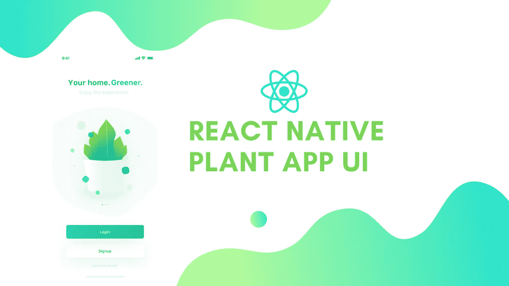
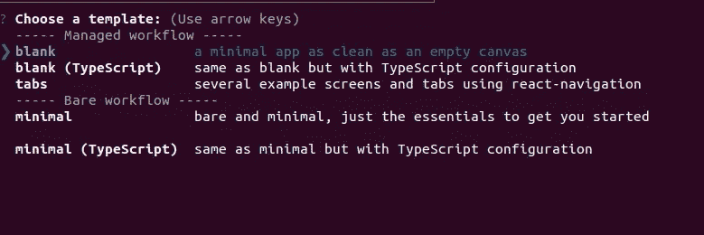
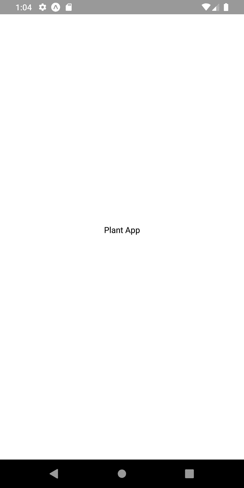
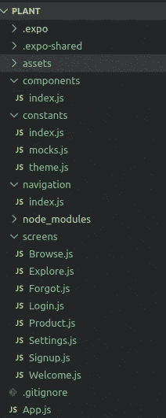
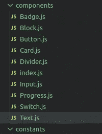
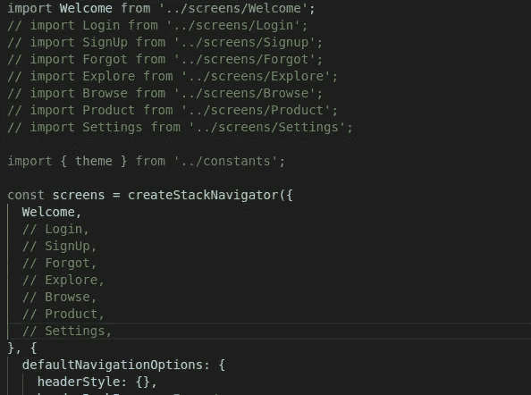
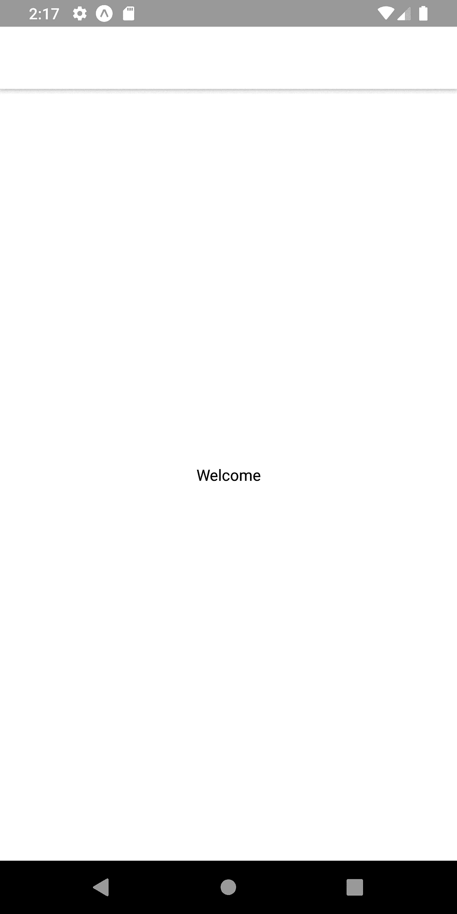

# React 原生植物应用程序 UI #1:入门

> 原文：<https://medium.com/quick-code/react-native-plant-app-ui-1-getting-started-4c018f98288e?source=collection_archive---------0----------------------->



这个 React Native Plant 应用程序 UI 克隆教程系列的灵感来自于 [React Native 模板](https://www.instamobile.io/)，该模板提供了用 React Native 编写的各种移动应用程序模板，并由通用功能和设计提供支持。这些应用程序模板允许我们实现自己的应用程序，甚至启动自己的创业公司。我们可以使用这些模板构建的一些应用示例包括房地产、餐馆、酒吧、汽车、经销商、电子商务产品、市场二手产品、酒店、旅游地点等。

本系列教程复制了来自 Youtube 视频教程的编码实现和设计，由 [React UI Kit](https://www.youtube.com/watch?v=gyiwFcrVRCM&list=PLNRPou200YIeu4UllJkv8-Ca19Ld_eOay&index=2) 用于工厂应用程序 UI 克隆。视频教程非常彻底地交付了整体 app 的编码实现。本教程系列是实现相同的编码风格和设计形式的文章。通过这个书面文章教程系列，学习者可以更清楚地了解应用程序不同 UI 部分的代码和实现。它消除了从视频教程中学习的一个缺点，即必须在不同的部分暂停视频以理解实现。在书面教程系列中，学习者可以浏览每个步骤，慢慢理解实现。

## 概观

在本教程系列的第一部分中，我们将为接下来的教程部分设置 starter 项目。这第一部分将通过组织本系列教程中所需的不同文件和文件夹来构成整个教程的基础。这里的想法是使用 expo 从一个新的 React 原生启动项目开始。之后，我们将为整个项目建立一个基本的项目目录结构，包括导航器配置。然后，我们还将设置不同的主题常量，并配置 App.js 文件来缓存资产。

*那么，让我们开始吧！！*

***注意，在本教程中，我们将使用 EXPO 作为 React 原生项目开发工具。首先，我们将使用 expo 客户端创建一个样板 React 本地应用程序。***

## 创建 Starter React 本地项目

首先也是最重要的，因为我们要把世博会作为一个开发引擎，我们需要把它安装到我们的系统中。要将 expo 全局安装到我们的系统中，我们需要先安装节点包管理器(NPM)。然后，我们需要运行以下命令:

```
npm install -g expo
```

现在，我们需要使用 expo 创建一个样板 react 本地应用程序。为此，我们需要在所需的项目目录中运行以下命令:

```
expo init <project_name> // project name==> Plant
```

运行上述命令后，我们将被要求为样板应用程序选择模板。在这里，我们将选择**空白**模板。空白模板提供了一个非常简单的应用程序模板，就像一块空白画布一样干净。选择屏幕截图如下所示:



正如我们所看到的，我们选择空白模板并按 enter 键。然后，我们需要输入项目名称，之后，样板文件 react native app 被配置到我们的目录中。

现在，在 App.js 文件中，我们将使用以下代码片段中的模板:

```
import React from 'react';
import { StyleSheet, Text, View } from 'react-native';

export default class App extends React.Component {

  render(){
    return (
      <View style={styles.container}>
        <Text>Plant App</Text>
      </View>
    );
  }

}

const styles = StyleSheet.create({
  container: {
    flex: 1,
    backgroundColor: '#fff',
    alignItems: 'center',
    justifyContent: 'center',
  },
});
```

现在，我们需要进入项目目录，然后运行命令:

```
expo start
```

然后，我们将在模拟器屏幕上看到以下样板应用程序:



正如我们所看到的，我们已经在模拟器中运行了 starter 模板。屏幕没有配置太多的样式和布局设计。只是一个简单的白色屏幕，中间有文字。

## 配置**项目文件和文件夹**

现在，在项目文件夹中，我们需要创建四个名为“屏幕”、“导航”、“组件”和“常量”的新目录。为的是。/screens/'目录，我们需要创建八个 JavaScript 文件。在“/navigation/”目录中，我们需要创建一个名为“index.js”的 JavaScript 文件来保存我们的导航器配置。在。/constants/'文件夹中，我们将保留我们将在此应用程序中使用的默认常量。下面的屏幕截图提供了项目文件夹的整体结构:



这里，我们需要设置所需文件夹中的所有文件，如上面的截图所示。

## 组件文件

现在，我们还需要在。/components/'文件夹，如下面的屏幕截图所示:



在这里，我们刚刚为将要在本系列教程中使用的组件创建了文件。我们将在下一个教程中实现这些组件。

但是，我们可以看到，我们有' index.js '文件在。/components/'文件夹。在这个 index.js 文件中，我们将导入所有组件并将它们作为一个整体返回。下面的代码片段提供了 index.js 文件中的配置:

```
import Block from "./Block";
import Badge from "./Badge";
import Button from "./Button";
import Card from "./Card";
import Input from "./Input";
import Text from "./Text";
import Progress from "./Progress";
import Divider from "./Divider";
import Switch from "./Switch";

export { Block, Badge, Button, Card, Input, Text, Progress, Divider, Switch };
```

## **设置 React 导航**

在这里，我们将设置我们的导航配置，以便我们能够在应用程序中从一个屏幕导航到另一个屏幕。为此，我们需要安装 [**react-navigation**](https://reactnavigation.org/docs/en/getting-started.html) 包及其支持的依赖包，如下面的代码片段所示:

```
>>>expo install react-navigation
>>>expo install react-native-gesture-handler
>>>expo install react-navigation-stack
```

现在，我们已经安装了所需的包，我们现在可以在'的 index.js 文件中设置我们的导航器。/navigation '文件夹。在 index.js 文件中，我们将设置一个堆栈导航器，所有屏幕如下面的代码片段所示:

```
import { Image } from 'react-native';
import { createAppContainer } from 'react-navigation';
import { createStackNavigator } from 'react-navigation-stack';

import Welcome from '../screens/Welcome';
import Login from '../screens/Login';
import SignUp from '../screens/SignUp';
import Forgot from '../screens/Forgot';
import Explore from '../screens/Explore';
import Browse from '../screens/Browse';
import Product from '../screens/Product';
import Settings from '../screens/Settings';

const screens = createStackNavigator({
  Welcome,
  Login,
  SignUp,
  Forgot,
  Explore,
  Browse,
  Product,
  Settings,
}, {
  defaultNavigationOptions: {
    headerStyle: {},
    headerBackImage: <Image/>,
    headerBackTitle: null,
    headerLeftContainerStyle: {},
    headerRightContainerStyle: {},
  }
});

export default createAppContainer(screens);
```

这里，我们从 **react-navigation-stack** 包中导入了`createStackNavigator`函数。这个`createStackNavigator`函数使我们能够将我们的屏幕堆叠在 other 中，以配置一个带有导航屏幕的应用程序容器。然后，我们还从'中导入了屏幕。/screens/'目录。然后，所有的屏幕都作为第一个参数包含在`createStackNavigator`功能中。在第二个参数中，我们已经配置了`defaultNavigationOptions`。为这个`defaultNavigationOptions`对象配置的导航选项默认应用于所有屏幕。这里，在`defaultNavigationOptions`对象中，我们已经为尚未配置的标题初始化了不同的选项。

最后，我们利用了 react-navigation 包中的`createAppContainer`函数。在这个函数中，我们传递了我们定义为堆栈导航器的`screens`导航器常量。该函数将为我们的应用程序创建一个容器，将所有屏幕绑定在一起。

## 下载必要的资产

在这里，我们需要下载必要的资产，包括我们项目的图像和图标。图标和图像保存在“资源”文件夹中的单独文件夹中。想法是下载资产文件夹，然后将图像和图标文件夹复制到。/assets/'文件夹。

此处提供了下载所需资产的链接[。](https://kriss.io/wp-content/uploads/2019/11/assets.zip)

## **配置常量**

现在，我们将在'中配置我们的常数。/constants/'文件夹。在 constants 文件夹中，我们有三个文件，分别是 mock.js、theme.js 和 index . js。mock . js 将包含应用程序的不同 UI 部分所需的模拟数据。因此，如果我们需要为任何屏幕使用任何模拟数据，我们只需从 mock.js 文件中导入它，并在屏幕 UI 中使用它。theme.js 文件将包含我们将在整个应用程序中使用的默认样式属性。

添加到 **mock.js** 文件所需的模拟数据在下面的代码片段中提供:

```
const categories = [
    {
      id: 'plants',
      name: 'Plants',
      tags: ['products', 'inspirations'],
      count: 147,
      image: require('../assets/icons/plants.png')
    },
    {
      id: 'seeds',
      name: 'Seeds',
      tags: ['products', 'shop'],
      count: 16,
      image: require('../assets/icons/seeds.png')
    },
    {
      id: 'flowers',
      name: 'Flowers',
      tags: ['products', 'inspirations'],
      count: 68,
      image: require('../assets/icons/flowers.png')
    },
    {
      id: 'sprayers',
      name: 'Sprayers',
      tags: ['products', 'shop'],
      count: 17,
      image: require('../assets/icons/sprayers.png')
    },
    {
      id: 'pots',
      name: 'Pots',
      tags: ['products', 'shop'],
      count: 47,
      image: require('../assets/icons/pots.png')
    },
    {
      id: 'fertilizers',
      name: 'fertilizers',
      tags: ['products', 'shop'],
      count: 47,
      image: require('../assets/icons/fertilizers.png')
    },
  ];

  const products = [
    {
      id: 1, 
      name: '16 Best Plants That Thrive In Your Bedroom',
      description: 'Bedrooms deserve to be decorated with lush greenery just like every other room in the house – but it can be tricky to find a plant that thrives here. Low light, high humidity and warm temperatures mean only certain houseplants will flourish.',
      tags: ['Interior', '27 m²', 'Ideas'],
      images: [
        require('../assets/images/plants_1.png'),
        require('../assets/images/plants_2.png'),
        require('../assets/images/plants_3.png'),
        // showing only 3 images, show +6 for the rest
        require('../assets/images/plants_1.png'),
        require('../assets/images/plants_2.png'),
        require('../assets/images/plants_3.png'),
        require('../assets/images/plants_1.png'),
        require('../assets/images/plants_2.png'),
        require('../assets/images/plants_3.png'),
      ]
    }
  ];

  const explore = [
    // images
    require('../assets/images/explore_1.png'),
    require('../assets/images/explore_2.png'),
    require('../assets/images/explore_3.png'),
    require('../assets/images/explore_4.png'),
    require('../assets/images/explore_5.png'),
    require('../assets/images/explore_6.png'),
  ];

  const profile = {
    username: 'Kriss',
    location: 'Asia',
    email: 'kriss@kriss.com',
    avatar: require('../assets/images/avatar.png'),
    budget: 5000,
    monthly_cap: 7000,
    notifications: true,
    newsletter: false,
  };

  export {
    categories,
    explore,
    products,
    profile,
  }
```

这里，我们得到了每个屏幕的模拟数据，包括个人资料、浏览、产品和类别。

现在，需要添加到 **theme.js** 文件中的默认样式配置在下面的代码片段中提供:

```
const colors = {
  accent: "#F3534A",
  primary: "#0AC4BA",
  secondary: "#2BDA8E",
  tertiary: "#FFE358",
  black: "#323643",
  white: "#FFFFFF",
  gray: "#9DA3B4",
  gray2: "#C5CCD6",
};

const sizes = {
  // global sizes
  base: 16,
  font: 14,
  radius: 6,
  padding: 25,

  // font sizes
  h1: 26,
  h2: 20,
  h3: 18,
  title: 18,
  header: 16,
  body: 14,
  caption: 12,
};

const fonts = {
  h1: {
    fontSize: sizes.h1
  },
  h2: {
    fontSize: sizes.h2
  },
  h3: {
    fontSize: sizes.h3
  },
  header: {
    fontSize: sizes.header
  },
  title: {
    fontSize: sizes.title
  },
  body: {
    fontSize: sizes.body
  },
  caption: {
    fontSize: sizes.caption
  },
};

export { colors, sizes, fonts };
```

在这里，我们已经预先定义了颜色，大小和字体属性，我们将在这个项目中使用。

现在，我们将通过'的 **index.js** 文件从 mock.js 和 theme.js 文件中导出常量。/constants”文件夹。为此，我们需要将 mock.js 和 theme.js 文件导入 index.js 文件，并导出主题，如下面的代码片段所示:

```
import * as theme from './theme';
import * as mocks from './mocks';

export {
  theme,
  mocks,
};
```

这里，我们已经通过一个文件(即 index.js)导出了来自 theme.js 和 mock.js 文件的所有导出内容。现在，我们可以简单地将 index.js 文件导入到我们的屏幕和组件中，以使用主题和模拟数据。

## 配置 App.js

在这里，我们将配置 App.js 文件，以便我们可以缓存我们的资产。由于我们在这个项目中有太多的图像和图标文件，缓存这些文件会使应用程序运行得更快。为此，我们需要安装一个名为 [expo-asset](https://www.npmjs.com/package/expo-asset) 的新包。这个包提供了一个 Expo 通用模块来下载资产并将其传递给其他 API。为了安装这个软件包，我们需要运行以下命令:

```
>>>expo install expo-asset
```

现在，我们需要在 App.js 文件中导入这个包和其他一些包，如下面的代码片段所示:

```
import { AppLoading } from 'expo';
import { Asset } from 'expo-asset';

import Navigation from './navigation/index';
```

这里，我们将 expo-asset package 作为`Asset`模块导入。我们还导入了 AppLoading，它告诉 Expo，如果它是应用程序中第一个也是唯一一个呈现的组件，请保持应用程序加载屏幕打开。并且，我们还导入了'的 index.js 文件。/navigation/'文件夹作为导航。这个`Navigation`组件包含我们在 index.js 文件中创建的应用程序容器。

现在，我们需要导入该项目中所需的所有图像，以便我们可以缓存它们:

```
// import all used images
const images = [
  require('./assets/icons/back.png'),
  require('./assets/icons/plants.png'),
  require('./assets/icons/seeds.png'),
  require('./assets/icons/flowers.png'),
  require('./assets/icons/sprayers.png'),
  require('./assets/icons/pots.png'),
  require('./assets/icons/fertilizers.png'),
  require('./assets/images/plants_1.png'),
  require('./assets/images/plants_2.png'),
  require('./assets/images/plants_3.png'),
  require('./assets/images/explore_1.png'),
  require('./assets/images/explore_2.png'),
  require('./assets/images/explore_3.png'),
  require('./assets/images/explore_4.png'),
  require('./assets/images/explore_5.png'),
  require('./assets/images/explore_6.png'),
  require('./assets/images/illustration_1.png'),
  require('./assets/images/illustration_2.png'),
  require('./assets/images/illustration_3.png'),
  require('./assets/images/avatar.png'),
];
```

这里，我们已经从资产文件夹中导入了所有的图像，并将它们作为一个数组存储在`images`常量中。

## 处理图像的缓存

在这里，我们将配置一个名为`handleResourcesAsync()`的功能。在这个函数中，我们将配置缓存图像所需的代码。下面的代码片段提供了该函数的整体编码实现:

```
handleResourcesAsync = async () => {
    // we're caching all the images
    // for better performance on the app

    const cacheImages = images.map(image => {
      return Asset.fromModule(image).downloadAsync();
    });

    return Promise.all(cacheImages);
  }
```

这里，我们定义了一个名为`cacheImages`的常数，它被初始化为`images`常数的`map()`数组函数。这个`map()`数组函数遍历`images`数组中的每个项目，然后返回同步到缓存下载的每个图像。最后，这个函数返回常量`cacheImages`作为`Promise`。

下面的代码片段提供了 App.js 文件的总体配置:

```
export default class App extends React.Component {
  state = {
    isLoadingComplete: false,
  }

  handleResourcesAsync = async () => {
    // we're caching all the images
    // for better performance on the app

    const cacheImages = images.map(image => {
      return Asset.fromModule(image).downloadAsync();
    });

    return Promise.all(cacheImages);
  }

  render() {
    if (!this.state.isLoadingComplete && !this.props.skipLoadingScreen) {
      return (
        <AppLoading
          startAsync={this.handleResourcesAsync}
          onError={error => console.warn(error)}
          onFinish={() => this.setState({ isLoadingComplete: true })}
        />
      )
    }

    return (
        <Navigation />
    );
  }
}

const styles = StyleSheet.create({
});
```

这里，在`render()`函数中，我们已经基于`isLoadingComplete`状态返回了`AppLoading`组件。定义了`isLoadingComplete`状态来处理 app 的加载状态。如果该状态为假，则返回`AppLoading`组件，否则返回`Navigation`组件。

## 实现一个简单的欢迎屏幕

在最后一步中，我们将在 **Welcome.js** 屏幕中实现一个简单的模板，以显示我们的应用程序在所有配置的仿真器中都能完美运行。

由于我们刚刚在屏幕文件夹中创建了文件，并且没有为它们实现任何模板，应用程序可能会抛出错误。这里，我们只是要为 Welcome.js 屏幕创建一个模板，所以我们需要**注释掉**我们的 **index.js 文件中的所有其他导入。/navigation/'** 文件夹如下图截图所示:



现在，我们的导航器只有一个欢迎屏幕。

## 模板化欢迎屏幕

这里，我们将把 React 本机模板添加到 Welcome.js 文件中。下面的代码片段提供了欢迎屏幕的整体编码实现:

```
import React from 'react';
import { StyleSheet, Text, View } from 'react-native';

export default class Welcome extends React.Component {

  render(){
    return (
      <View style={styles.container}>
        <Text>Welcome</Text>
      </View>
    );
  }

}

const styles = StyleSheet.create({
  container: {
    flex: 1,
    backgroundColor: '#fff',
    alignItems: 'center',
    justifyContent: 'center',
  },
});
```

因此，我们将在模拟器屏幕中获得以下结果:



因此，我们在模拟器屏幕上看到了欢迎屏幕。至此，我们已经结束了这部分的教程。

最后，我们已经成功地设置和配置了 React Native Plant 应用程序 UI 克隆实施所需的所有文件和文件夹。

## 结论

这是我们克隆 React Native Plant 应用程序 UI 的教程系列的第一部分。在这部分教程中，我们首先学习了如何使用 expo 设置 stater react native app 项目。然后，我们学习了如何配置不同的目录和文件，以便形成我们整个项目的基础。之后，我们得到了如何为我们的应用程序屏幕设置导航器的一步一步的指导。

我们还在“/constants”文件夹中设置了默认常量，在接下来的教程中，我们将在屏幕和组件中使用这些常量。然后，我们配置 App.js 以缓存图像资产，并显示应用程序加载状态和应用程序欢迎屏幕。最后，我们为欢迎屏幕实现了一个简单的模板，并在 Android 模拟器中运行该应用程序，以显示该应用程序在所有配置下都运行良好。

这个教程只是为后面的教程做铺垫。在下一部分中，我们将通过实现'中的所有组件来设置预定义的组件。/components '文件夹。

*所以，敬请期待！！！*

*最初发表于*[](https://kriss.io/react-native-plant-app-ui-1-getting-started/)**。**