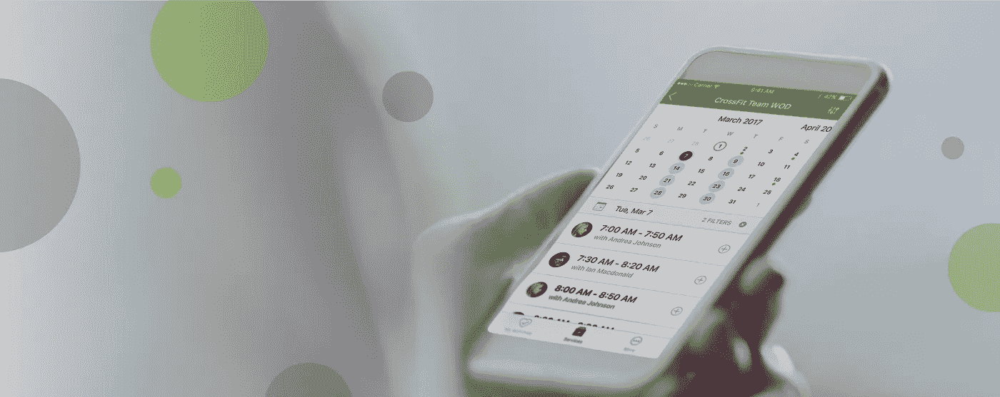
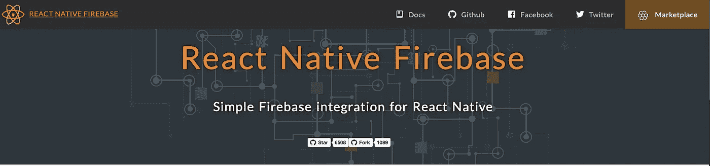
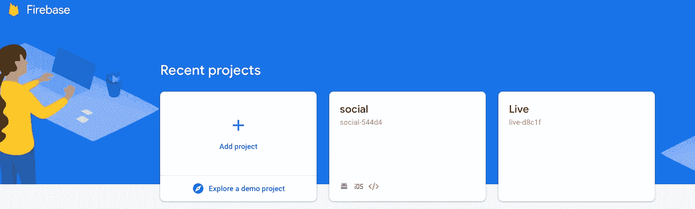
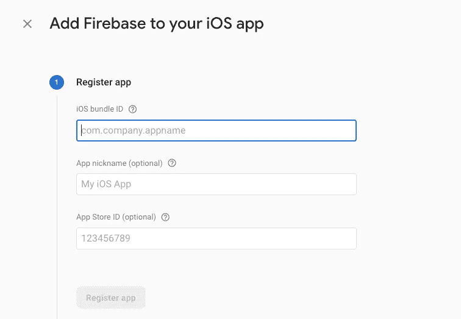
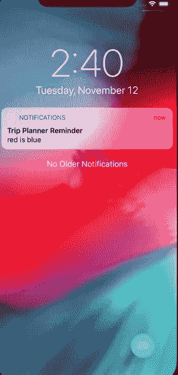
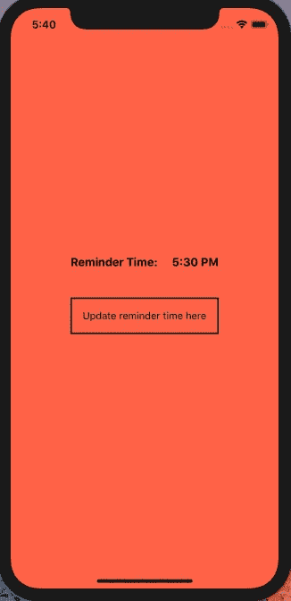

# 通过 Firebase 集成响应本机提醒

> 原文：<https://medium.com/quick-code/react-native-push-notification-with-firebase-integration-c26c434f271c?source=collection_archive---------0----------------------->



# 反应原生 Firebase 整合:

React Native Firebase 是免费向跨平台(Android、iOS 和 web)的用户发送消息和通知的最佳方式。消息可以发送到单个设备、设备组或特定主题或用户群。Firebase Cloud Messaging (FCM)甚至可以扩展到最大的应用程序，每天可以发送数千亿条消息。



React native firebase Plugin

使用一个简单的命令将 Firebase 集成到您的应用程序中。

```
yarn add react-native-firebase
```

安装好 firebase 后，转至[谷歌控制台](https://console.firebase.google.com/u/0/)。



通过单击“添加项目”按钮，创建一个与您的项目同名的新项目。一旦您完成了整个设置。现在是集成和创建特定应用程序的时候了

# iOS 安装:核心设置

1.  转到项目仪表板，单击顶部的添加应用程序按钮。一旦你点击了按钮，一个新的窗口将会打开，根据你的平台注册 firebase 凭据。选择 iOS，现在，以后，我们还会使用相同的按钮来创建 Android 凭据。
2.  Google Service Infoplist 是一个包含所有凭据的文件。输入您的应用程序的名称，如 com . James . notification。其余两个值是可选的，您可以跳过它。完成后，下载该文件并将其存储在项目的 XCode 应用程序文件夹中。



1.  更新 AppDelegate.m 文件:要在应用程序中初始化本机 SDK，请将以下内容添加到您的`ios/[YOUR APP NAME]/AppDelegate.m`文件中

```
#import <Firebase.h>@implementation AppDelegate
- (BOOL)application:(UIApplication *)application didFinishLaunchingWithOptions:(NSDictionary *)launchOptions
{[FIRApp configure]; // Add this line to the existing code.
```

2.更新播客文件:你可以去你项目的 iOS 文件夹中寻找播客文件。在测试的目标代码之前添加以下一行。

```
# Required by RNFirebase
pod 'Firebase/Core', '~> 6.6.0'Run pod install once you have updated the code.
```

3.最后一步是将模块与项目链接起来。您需要运行代码一次

```
// Add this code to your podfilepod 'RNFirebase', :path => '../node_modules/react-native-firebase/ios'// Once pod is updated link the plugin with the following commandreact-native link react-native-firebase
```

一旦这样做了，我们就完成了 iOS 的反应本地链接。让我们更多地了解安卓。

# 安卓安装:核心设置

1.  重复 iOS 安装步骤 1，但这次是 android，注册应用程序以便以后下载。下载后，将此文件放在`android/app/google-services.json`处的项目根目录下。
2.  在 android 文件夹的主 build.gradle 文件中，您需要添加以下行。

```
buildscript {
  // ...
  dependencies {
    // ...
    classpath 'com.google.gms:google-services:4.2.0'
  }
}// To apply the plugin to your project, add the following to the VERY BOTTOM of your app android/app/build.gradle file:apply plugin: 'com.google.gms.google-services'
```

3.在`android/app/build.gradle`文件中，添加以下内容:

```
dependencies {
  // This should be here already
  implementation project(':react-native-firebase')// Firebase dependencies
  implementation "com.google.android.gms:play-services-base:16.1.0"
  implementation "com.google.firebase:firebase-core:16.0.9"...
```

您已经成功地将该库与 iOS 和安卓平台集成在一起。

# 通知模块设置

因为我们要添加通知。我们需要 firebase 的两个基本通知模块，即云消息和通知。

# iOS 安装:通知

将以下代码添加到您现有的 podfile 中。

```
pod 'Firebase/Messaging'
pod update
```

将以下导入添加到您的`ios/[App Name]/AppDelegate.m`顶部:

`#import "RNFirebaseNotifications.h"`

将以下内容添加到方法的`didFinishLaunchingWithOptions:(NSDictionary *)launchOptions`中，紧接在`[FIRApp Configure]`之后:

```
[RNFirebaseNotifications configure];
```

添加以下方法:

```
- (void)application:(UIApplication *)application didReceiveLocalNotification:(UILocalNotification *)notification {
  [[RNFirebaseNotifications instance] didReceiveLocalNotification:notification];
}
```

## [远程通知(可选)](https://rnfirebase.io/docs/v4.0.x/notifications/ios#Remote-Notifications-(Optional))

如果您想通过 FCM 支持远程通知，也可以将以下导入添加到您的`ios/[App Name]/AppDelegate.m`的顶部:

```
#import "RNFirebaseMessaging.h"
```

然后将以下方法添加到您的`ios/[App Name]/AppDelegate.m`中:

```
- (void)application:(UIApplication *)application didReceiveRemoteNotification:(nonnull NSDictionary *)userInfo
                                                       fetchCompletionHandler:(nonnull void (^)(UIBackgroundFetchResult))completionHandler{
  [[RNFirebaseNotifications instance] didReceiveRemoteNotification:userInfo fetchCompletionHandler:completionHandler];
}- (void)application:(UIApplication *)application didRegisterUserNotificationSettings:(UIUserNotificationSettings *)notificationSettings {
  [[RNFirebaseMessaging instance] didRegisterUserNotificationSettings:notificationSettings];
}
```

# Android 安装:通知

将 Firebase 云消息传递依赖项和可选的快捷方式依赖项添加到`android/app/build.gradle`:

```
dependencies {
  // ...
  implementation "com.google.firebase:firebase-messaging:15.0.2"
  implementation '[me.leolin:ShortcutBadger:1.1.21@aar](mailto:me.leolin:ShortcutBadger:1.1.21@aar)' // <-- Add this line if you wish to use badge on Android
}
```

## [安装 RNFirebase 消息传递包](https://rnfirebase.io/docs/v4.0.x/messaging/android#Install-the-RNFirebase-Messaging-package)

将`RNFirebaseMessagingPackage`添加到您的`android/app/src/main/java/com/[app name]/MainApplication.java`中:

```
// ...
import io.invertase.firebase.RNFirebasePackage;
import io.invertase.firebase.messaging.RNFirebaseMessagingPackage; // <-- Add this linepublic class MainApplication extends Application implements ReactApplication {
    // ... @Override
    protected List<ReactPackage> getPackages() {
      return Arrays.<ReactPackage>asList(
          new MainReactPackage(),
          new RNFirebasePackage(),
          new RNFirebaseMessagingPackage() // <-- Add this line
      );
    }
  };
  // ...
}
```

## [更新 Android 清单](https://rnfirebase.io/docs/v4.0.x/messaging/android#Update-Android-Manifest)

将以下内容添加到`android/app/src/main/AndroidManifest.xml`:

在应用程序组件中，添加消息服务和实例 ID 服务:

```
<application ...>
  <service android:name="io.invertase.firebase.messaging.RNFirebaseMessagingService">
    <intent-filter>
      <action android:name="com.google.firebase.MESSAGING_EVENT" />
    </intent-filter>
  </service>
  <service android:name="io.invertase.firebase.messaging.RNFirebaseInstanceIdService">
    <intent-filter>
      <action android:name="com.google.firebase.INSTANCE_ID_EVENT"/>
    </intent-filter>
  </service>
</application>
```

## [(可选)背景信息](https://rnfirebase.io/docs/v4.0.x/messaging/android#(Optional)-Background-Messages)

如果您希望在应用程序处于后台时能够对纯数据消息做出反应，例如显示提醒通知，那么您需要将以下内容添加到`android/app/src/main/AndroidManifest.xml`:

```
<application ...>
  <service android:name="io.invertase.firebase.messaging.RNFirebaseBackgroundMessagingService" />
</application>
```

## [安装 RNFirebase 通知包](https://rnfirebase.io/docs/v4.0.x/notifications/android#Install-the-RNFirebase-Notifications-package)

将`RNFirebaseNotificationsPackage`添加到您的`android/app/src/main/java/com/[app name]/MainApplication.java`中:

```
// ...
import io.invertase.firebase.RNFirebasePackage;
import io.invertase.firebase.notifications.RNFirebaseNotificationsPackage; // <-- Add this linepublic class MainApplication extends Application implements ReactApplication {
    // ... @Override
    protected List<ReactPackage> getPackages() {
      return Arrays.<ReactPackage>asList(
          new MainReactPackage(),
          new RNFirebasePackage(),
          new RNFirebaseNotificationsPackage() // <-- Add this line
      );
    }
  };
  // ...
}
```

# [更新 Android 清单](https://rnfirebase.io/docs/v4.0.x/notifications/android#Update-Android-Manifest)

将以下内容添加到`android/app/src/main/AndroidManifest.xml`:

添加权限:

```
<manifest ...>
  <uses-permission android:name="android.permission.INTERNET" />
  <uses-permission android:name="android.permission.RECEIVE_BOOT_COMPLETED" />
  <uses-permission android:name="android.permission.VIBRATE" />
```

设置 app [启动模式](https://inthecheesefactory.com/blog/understand-android-activity-launchmode/en)内活动道具:

```
<activity ...
  android:launchMode="singleTop"
>
```

## [预定通知(可选)](https://rnfirebase.io/docs/v4.0.x/notifications/android#Scheduled-Notifications-(Optional))

如果您想安排本地通知，那么您还需要将以下内容添加到`android/app/src/main/AndroidManifest.xml`的应用程序组件中:

```
<application ...>
  <receiver android:name="io.invertase.firebase.notifications.RNFirebaseNotificationReceiver"/>
  <receiver android:enabled="true" android:exported="true"  android:name="io.invertase.firebase.notifications.RNFirebaseNotificationsRebootReceiver">
    <intent-filter>
      <action android:name="android.intent.action.BOOT_COMPLETED"/>
      <action android:name="android.intent.action.QUICKBOOT_POWERON"/>
      <action android:name="com.htc.intent.action.QUICKBOOT_POWERON"/>
      <category android:name="android.intent.category.DEFAULT" />
    </intent-filter>
  </receiver>
</application>
```

# 通知代码:

在集成代码之前，请安装以下依赖项:

```
yarn add @react-native-community/async-storage
```

将以下代码添加到 App.js 文件中

```
import React from 'react';
import {View, Alert} from 'react-native';
import {styles} from './styles';
import firebase from 'react-native-firebase';
import Dash from './Dashboard';export default class App extends React.Component {componentDidMount() {
// Create notification channel required for Android devices
this.createNotificationChannel();
// Ask notification permission and add notification listener
this.checkPermission();
}createNotificationChannel = () => {
// Build a android notification channel
const channel = new firebase.notifications.Android.Channel(
'reminder', // channelId
'Reminders Channel', // channel name
firebase.notifications.Android.Importance.High, // channel importance
).setDescription('Used for getting reminder notification'); // channel description
// Create the android notification channel
firebase.notifications().android.createChannel(channel);
};checkPermission = async () => {
const enabled = await firebase.messaging().hasPermission();
if (enabled) {
// We've the permission
this.notificationListener = firebase
.notifications()
.onNotification(async notification => {
// Display your notification
await firebase.notifications().displayNotification(notification);
console.log(notification);
});
} else {
// user doesn't have permission
try {
await firebase.messaging().requestPermission();
} catch (error) {
Alert.alert(
'Unable to access the Notification permission. Please enable the Notification Permission from the settings',
);
}
}};
render() {
return (
<View style={styles.container}>
 <Dashboard />
</View>
);}}
```

前端的仪表板代码:

```
/* eslint-disable react-native/no-inline-styles */
import React, {useState, useEffect} from 'react';
import {SafeAreaView,Text,Platform,View,TouchableOpacity} from 'react-native';
import AsyncStorage from '@react-native-community/async-storage';
import DateTimePicker from 'react-native-modal-datetime-picker';
import moment from 'moment';
import firebase from 'react-native-firebase';
import {styles} from './styles';const Dashboard = () => {
const [showTimer, setShowTimer] = useState(false);
const [reminderTime, setReminderTime] = useState(moment({hour: 17}));useEffect(() => {
async function setReminder() {
await firebase.notifications().cancelAllNotifications();
// schedule notification
await firebase.notifications().scheduleNotification(buildNotification(), {
fireDate: reminderTime.valueOf(),
repeatInterval: 'day',
exact: true,
});
}setReminder();
}, [reminderTime]);useEffect(() => {retrieveData();}, []);const buildNotification = () => {
const title = Platform.OS === 'android' ? 'Daily reminder' : 'Trip Planner Reminder';
const notification = new firebase.notifications.Notification().setNotificationId('1') // Any random ID
.setTitle(title) // Title of the notification
.setBody('red is blue') // body of notification
.android.setPriority(firebase.notifications.Android.Priority.High) // set priority in Android
.android.setChannelId('reminder') // should be the same when creating channel for Android
.android.setAutoCancel(true); // To remove notification when tapped on it
return notification;
};const showDateTimePicker = () => {
setShowTimer(true);
};const hideDateTimePicker = () => {
setShowTimer(false);
};const handleDatePicked = async time => {
await AsyncStorage.setItem('time', JSON.stringify(time));
setReminderTime(moment(time));
hideDateTimePicker();
};const retrieveData = async () => {
try {
const valueString = await AsyncStorage.getItem('time');
const value = JSON.parse(valueString);
if (value !== null) {
setReminderTime(moment(value));
}} catch (error) {console.log(error);}};return (
<SafeAreaView style={styles.container}>
<View style={styles.row}>
<Text style={styles.title}>Reminder Time:</Text>
<Text style={styles.text}>{reminderTime.format('LT')}</Text>
</View>
<TouchableOpacity onPress={showDateTimePicker} style={styles.btn}>
<Text>Update reminder time here</Text></TouchableOpacity></View><DateTimePicker isVisible={showTimer} onConfirm={handleDatePicked}onCancel={hideDateTimePicker} mode="time" date={new Date()} is24Hour={false} titleIOS="Select a reminder time" /></SafeAreaView>
);};export default Dashboard;
```



> C 结束语:上面给出的代码将为您提供一个计时器来选择时间，您只需要添加时间，然后等待通知提醒的确切时间。对于 iOS，该应用程序将在前台显示提醒，而在 android 中，通知将只在后台可见。

如果你有任何问题让我知道。如果代码中有错误。