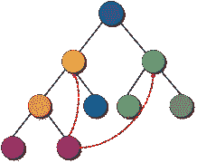
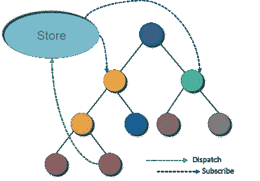
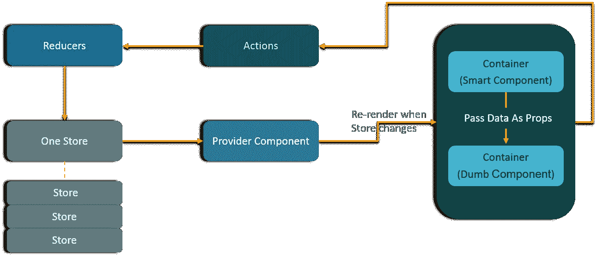

# 使用 React Redux 有效管理 React 中的状态

> 原文：<https://medium.com/edureka/react-redux-tutorial-2b3d81cfd3f7?source=collection_archive---------2----------------------->


React Redux Tutorial-Edureka

React 是最流行的 JavaScript 库之一，用于前端开发。通过提供基于组件的方法，我们的应用程序开发变得更加容易和快速。

正如你可能知道的，它不是完整的框架，而只是 MVC(模型-视图-控制器)框架的视图部分。那么，在使用 React 开发的应用程序中，如何跟踪数据和处理事件呢？好吧，这就是 Redux 作为救星从后端处理应用程序数据流的地方。

通过这篇关于 React Redux 教程的文章，我将解释你需要知道的关于如何将 Redux 与 React 应用程序集成的一切。以下是我将在 React Redux 教程下讨论的主题:

*   为什么 Redux 用 React？
*   Redux 是什么？
*   Redux 的优势
*   Redux 的组件
*   与 Redux 反应

# 为什么 Redux 用 React？


正如我已经提到的，React 遵循基于组件的方法，其中数据流经组件。事实上，React 中的数据总是从父组件流向子组件，这使得它是单向的。这无疑使我们的数据保持有序，并帮助我们更好地控制应用程序。因此，应用程序的状态包含在特定的存储中，因此，其余组件保持松散耦合。这使得我们的应用程序更加灵活，从而提高了效率。这就是为什么从父组件到子组件的通信是方便的。

但是当我们试图与非父组件通信时会发生什么呢？



子组件永远不能将数据传递回父组件。React 不提供任何组件间直接通信的方式。尽管 React 具有支持这种方法的特性，但它被认为是一种糟糕的做法。它容易出错，导致代码杂乱无章。那么，两个非父组件如何互相传递数据呢？

这就是 React 未能提供解决方案的地方，Redux 就出现了。



Redux 提供了一个“**商店**作为这个问题的解决方案。存储区是您可以将所有应用程序状态存储在一起的地方。现在，组件可以"*将*状态更改发送给存储，而不是直接发送给其他组件。然后，需要关于状态变化的更新的组件可以"*向商店订阅*。

因此，有了 Redux，组件从哪里获得它们的状态以及它们应该把它们的状态发送到哪里就变得很清楚了。现在，发起更改的组件不必担心需要状态更改的组件列表，而可以简单地将更改分派给存储。这就是 Redux 如何使*数据流*变得更容易。

# Redux 是什么？

和 React 一样，Redux 也是一个广泛用于前端开发的库。它基本上是一个在 JavaScript 应用程序中管理数据状态和 UI 状态的工具。Redux 将应用程序数据和业务逻辑分离到自己的容器中，以便让 React 只管理视图。它不是传统的库或框架，而是应用程序数据流架构。它与单页应用程序(SPAs)最兼容，在单页应用程序中，随着时间的推移，状态的管理会变得复杂。

Redux 是由*丹·阿布拉莫夫*和*安德鲁·克拉克*在 2015 年 6 月左右创作的。它的灵感来自脸书的 Flux，并受到函数式编程语言 *Elm* 的影响。Redux 很快流行起来，因为它简单、小(只有 2 KB)且文档丰富。

## **Redux 的原理**

Redux 遵循三个基本原则:

1.  ***单一事实来源:*** 整个应用程序的状态存储在一个单一存储内的对象/状态树中。单一状态树使得跟踪随时间的变化以及调试或检查应用程序变得更加容易。对于更快的开发周期，它有助于在开发中保持应用程序的状态。
2.  ***状态只读:*** 改变状态的唯一方法是触发一个动作。动作是描述变更的普通 JS 对象。就像状态是数据的最小表示一样，动作是数据变化的最小表示。一个动作必须有一个类型属性(通常是一个字符串常量)。所有的变化都是集中的，并以严格的顺序一个接一个地发生。
3.  ***用纯函数做改变:*** 为了指定状态树如何被动作转化，你需要纯函数。纯函数是那些返回值仅依赖于参数值的函数。Reducers 只是纯粹的函数，它接受前一个状态和一个动作，然后返回下一个状态。您的应用程序中可以有一个减速器，随着它的增长，您可以将其拆分成更小的减速器。这些较小的缩减器将管理状态树的特定部分。

# Redux 的优势

以下是 Redux 的一些主要优势:

*   **结果的可预测性—** 因为总是有一个真实的来源，即商店，所以不存在如何将当前状态与应用程序的动作和其他部分同步的混淆。
*   **可维护性—** 代码变得更容易维护，具有可预测的结果和严格的结构。
*   **服务器端渲染** —您只需要将在服务器上创建的存储传递到客户端。这对于初始渲染非常有用，并提供了更好的用户体验，因为它优化了应用程序的性能。
*   **开发人员工具—** 从动作到状态变化，开发人员可以实时跟踪应用程序中发生的一切。
*   **社区和生态系统—** Redux 背后有一个庞大的社区，这使得它的使用更具吸引力。一个由才华横溢的个人组成的大型社区为改善图书馆做出了贡献，并开发了各种应用程序。
*   **易于测试—** 冗余代码大多是小的、纯粹的、孤立的函数。这使得代码是可测试的和独立的。
*   **组织—** Redux 非常精确地规定了代码应该如何组织，这使得团队使用代码时更加一致和容易。

# Redux 的组件

Redux 有四个组件。

1.  行动
2.  还原剂
3.  商店
4.  视角

让我们详细讨论一下:

## **动作**

改变状态内容的唯一方法是发出一个动作。动作是普通的 JavaScript 对象，是从应用程序向商店发送数据(用户交互、内部事件，如 API 调用和表单提交)的主要信息源。商店仅从操作中接收信息。您必须使用 **store.dispatch()** 将操作发送到商店。
内部动作是简单的 JavaScript 对象，具有一个**类型**属性(通常是字符串常量)，描述动作的类型和发送到存储的全部信息。

```
{
    type: ADD_TODO,
    text
}
```

动作是使用动作创建器创建的，动作创建器是返回动作的普通函数。

```
function addTodo(text) {
    return {
        type: ADD_TODO,
        text
    }
}
```

*   要在应用程序中的任何地方调用操作，请使用 **dispatch()** 方法:

```
dispatch(addTodo(text));
```

## **减速器**

动作描述了*某事发生的事实*，但是没有说明应用程序的状态如何响应变化。这是减速器的工作。它基于 array reduce 方法，在该方法中，它接受回调(reducer ),并允许您从多个值、整数之和或值流的累积中获取单个值。在 Redux 中，reducers 是(纯)函数，它接受应用程序和动作的当前状态，然后返回一个新状态。理解减速器如何工作很重要，因为它们完成了大部分工作。

```
function reducer(state = initialState, action) {
    switch (action.type) {
        case ADD_TODO:
            return Object.assign({}, state,
                { todos: [ ...state.todos,
                    {
                        text: action.text,
                        completed: false
                    }
                    ]
                })
        default:
            return state
    }
}
```

## **商店**

store 是一个 JavaScript 对象，它可以保存应用程序的状态，并提供一些助手方法来访问状态、调度操作和注册侦听器。应用程序的整个状态/对象树保存在单个存储中。因此，Redux 非常简单且可预测。我们可以将中间件传递给商店来处理数据，并记录改变商店状态的各种操作。所有的动作通过 reducers 返回一个新的状态。

```
import { createStore } from 'redux'
import todoApp from './reducers'

let store = createStore(reducer);
```

## **视图**

智能和非智能组件一起构建视图。视图的唯一目的是显示商店传递的日期。智能组件负责这些动作。智能组件下面的哑组件在它们需要触发动作时通知它们。智能组件依次传递道具，而非智能组件将这些道具视为回调动作。

下图显示了数据实际上是如何流经 Redux 中所有上述组件的。



# 与 Redux 反应

既然您已经熟悉了 Redux 及其组件，现在让我们看看如何将它与 React 应用程序集成。

**第一步:**你需要设置基本的 react、webpack、babel 设置。下面是我们在这个应用程序中使用的依赖关系。

```
"dependencies": {
  "babel-core": "^6.10.4",
  "babel-loader": "^6.2.4",
  "babel-polyfill": "^6.9.1",
  "babel-preset-es2015": "^6.9.0",
  "babel-preset-react": "^6.11.1",
  "babel-register": "^6.9.0",
  "cross-env": "^1.0.8",
  "css-loader": "^0.23.1",
  "expect": "^1.20.1",
  "node-libs-browser": "^1.0.0",
  "node-sass": "^3.8.0",
  "react": "^15.1.0",
  "react-addons-test-utils": "^15.1.0",
  "react-dom": "^15.1.0",
  "react-redux": "^4.4.5",
  "redux": "^3.5.2",
  "redux-logger": "^2.6.1",
  "redux-promise": "^0.5.3",
  "redux-thunk": "^2.1.0",
  "sass-loader": "^4.0.0",
  "style-loader": "^0.13.1",
  "webpack": "^1.13.1",
  "webpack-dev-middleware": "^1.6.1",
  "webpack-dev-server": "^1.14.1",
  "webpack-hot-middleware": "^2.11.0"
},
```

**步骤 2:** 一旦你完成了依赖项的安装，那么在 **src** 文件夹中创建 **components** 文件夹。在创建的 **App.js** 文件中。

```
import React from 'react';
import UserList from '../containers/user-list';
import UserDetails from '../containers/user-detail';
require('../../scss/style.scss');

const App = () => (
    <div>
        <h2>User List</h2>
        <UserList />
        <hr />
        <h2>User Details</h2>
        <UserDetails />
    </div>
);

export default App;
```

**第三步:**接下来新建一个 **actions** 文件夹，并在其中创建 **index.js** 。

```
export const selectUser = (user) => {
    console.log("You clicked on user: ", user.first);
    return {
        type: 'USER_SELECTED',
        payload: user
    }
};
```

**步骤 4:** 现在在一个名为**容器的新文件夹中创建 **user-details.js** 。**

```
import React, {Component} from 'react';
import {connect} from 'react-redux';

class UserDetail extends Component {
    render() {
        if (!this.props.user) {
            return (<div>Select a user...</div>);
        }
        return (
            <div>
                
                <h2>{this.props.user.first} {this.props.user.last}</h2>
                <h3>Age: {this.props.user.age}</h3>
                <h3>Description: {this.props.user.description}</h3>
            </div>
        );
    }
}

function mapStateToProps(state) {
    return {
        user: state.activeUser
    };
}

export default connect(mapStateToProps)(UserDetail);
```

**第五步:**在同一个文件夹下创建 **user-list.js** 文件。

```
import React, {Component} from 'react';
import {bindActionCreators} from 'redux';
import {connect} from 'react-redux';
import {selectUser} from '../actions/index'
class UserList extends Component {
    renderList() {
        return this.props.users.map((user) => {
            return (
                <li key={user.id}
                    onClick={() => this.props.selectUser(user)}
                >
                    {user.first} {user.last}
                </li>
            );
        });
    }
    render() {
        return (
            <ul>
                {this.renderList()}
            </ul>
        );
    }
}
function mapStateToProps(state) {
    return {
        users: state.users
    };
}
function matchDispatchToProps(dispatch){
    return bindActionCreators({selectUser: selectUser}, dispatch);
}
export default connect(mapStateToProps, matchDispatchToProps)(UserList);
```

**第六步:**现在创建 **reducers** 文件夹，并在其中创建 **index.js** 。

```
import {combineReducers} from 'redux';
import UserReducer from './reducer-users';
import ActiveUserReducer from './reducer-active-user';

const allReducers = combineReducers({
    users: UserReducer,
    activeUser: ActiveUserReducer
});
export default allReducers
```

**第七步:**在同一个 **reducers** 文件夹下，创建 **reducer-users.js** 文件。

```
export default function () {
    return [
        {
            id: 1,
            first: "Maxx",
            last: "Flinn",
            age: 17,
            description: "Loves basketball",
            thumbnail: "[https://goo.gl/1KNpiy](https://goo.gl/1KNpiy)"
        },
        {
            id: 2,
            first: "Allen",
            last: "Matt",
            age: 25,
            description: "Food Junky.",
            thumbnail: "[https://goo.gl/rNLgwv](https://goo.gl/rNLgwv)"
        },
        {
            id: 3,
            first: "Kris",
            last: "Chen",
            age: 23,
            description: "Music Lover.",
            thumbnail: "[https://goo.gl/EVbPHb](https://goo.gl/EVbPHb)"
        }
    ]
}
```

**步骤 8:** 现在在 **reducers** 文件夹中创建一个 **reducer-active-user.js** 文件。

```
export default function (state = null, action) {
    switch (action.type) {
        case 'USER_SELECTED':
            return action.payload;
            break;
    }
    return state;
}
```

**第 9 步:**现在你需要在**根**文件夹中创建 **index.js** 。

```
import 'babel-polyfill';
import React from 'react';
import ReactDOM from "react-dom";
import {Provider} from 'react-redux';
import {createStore, applyMiddleware} from 'redux';
import thunk from 'redux-thunk';
import promise from 'redux-promise';
import createLogger from 'redux-logger';
import allReducers from './reducers';
import App from './components/App';

const logger = createLogger();
const store = createStore(
    allReducers,
    applyMiddleware(thunk, promise, logger)
);

ReactDOM.render(
    <Provider store={store}>
        <App />
    </Provider>,
    document.getElementById('root')
);
```

**步骤 10:** 现在你已经完成了代码的编写，在***localhost:3000***启动你的应用程序。

这就把我们带到了 React Redux 教程这篇文章的结尾。我希望通过这篇 React Redux 教程文章，我能够清楚地解释什么是 Redux，它的组成部分，以及为什么我们使用 React。如果你想查看更多关于人工智能、Python、道德黑客等市场最热门技术的文章，你可以参考 Edureka 的官方网站。

请留意本系列中的其他文章，它们将解释 Reactjs 的各个其他方面。

> 1. [ReactJS 教程](/edureka/reactjs-tutorial-aa087fd7fc90)
> 
> 2. [React 路由器 v4 教程](/edureka/react-router-2aab4e781736)
> 
> 3. [ReactJS 组件](/edureka/react-components-65dc1d753af5)
> 
> 4. [HTML vs HTML5](/edureka/html-vs-html5-83302f95652e)
> 
> 5.[什么是 REST API？](/edureka/what-is-rest-api-d26ea9000ee6)
> 
> 6.[颤振 vs 反作用自然](/edureka/flutter-vs-react-native-58133fbf9f33)
> 
> 7.[前端开发者技能](/edureka/front-end-developer-skills-ebb32d19f488)
> 
> 8.[前端开发人员简历](/edureka/front-end-developer-resume-c3d443f98296)
> 
> 9.[网络开发项目](/edureka/web-development-projects-b01f0fe85d3f)

*原载于 2017 年 9 月 15 日 www.edureka.co**的* [*。*](https://www.edureka.co/blog/react-redux-tutorial/)