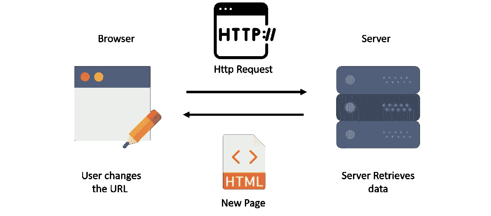
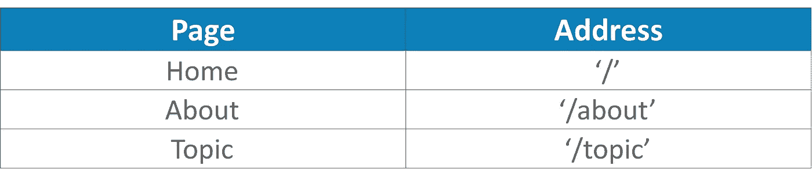

# React 路由器 v4 教程-为 React 应用程序创建路由

> 原文：<https://medium.com/edureka/react-router-2aab4e781736?source=collection_archive---------3----------------------->


React Router V4-Edureka

在我开始这篇文章之前，我希望你已经看完了我的 [***React 教程***](/edureka/reactjs-tutorial-aa087fd7fc90) 文章中 React 的**积木**。如果没有，请先浏览一遍，以便更好地理解 React。在学习 React 的基础知识时，我相信您一定想知道如何在应用程序中添加导航。如果是这样，你就来对地方了。在这篇 **React 路由器**博客中，我将带你浏览 React 中的**路由**概念。

我们将关注以下主题:

*   传统路由
*   为什么我们需要 React 路由器？
*   React 中的路由
*   React 路由器 v4 的优势

# 传统路由

通常，当用户在浏览器中键入 URL 时，会向服务器发送一个 HTTP 请求，然后服务器检索 HTML 页面。对于每个*新的 URL，*用户被重定向到一个**新的** HTML 页面。您可以参考下图来更好地理解路由是如何工作的。



# 为什么我们需要 React 路由器？

单页面应用程序仅限于**单视图**对于许多流行的社交媒体网站来说是不公平的，比如脸书、Instagram，它们使用 React today 呈现多视图。我们需要继续前进，学习如何在我们的单页应用程序中显示多视图。

例如，我们习惯于看到一个显示欢迎信息和相关内容的主页。该网站的背景资料可以在“关于我们”页面上找到，用户列表和他们的详细信息列在不同的页面上，可能有各种其他页面包括几个不同的视图。

那么你认为这是如何实现的呢？在我们的应用程序中添加一个路由器库解决了这个需求。

# React 中的路由

这就把我们带到了今天博客的主题:React 路由器 v4。2017 年 3 月 13 日，Micheal Jackson & Ryan Florence 发布了 React 路由器 v4 以及可靠的文档。

他们信奉“学一次，路到天涯”的意识形态。

在 React Conf 2017 的演讲中，他们解释了这一点，展示了他们如何将他们的路由概念从 Web 无缝地投影到原生平台，以及将 **React Router** 集成到 **VR** 中，并在 **React Native** 中创建动画。尽管他们谈话的吸引点围绕着他们的路由器 API 是如何“**都是关于组件**”的。

在 React 中，只涉及到一个**单个**‘Html’文件。每当用户键入一个**新的** URL 请求时，路由器不是从服务器获取数据，而是为每个新的 URL 请求换入一个不同的**组件**。用户被骗在多个页面之间切换，但实际上，每个单独的**组件重新呈现**以根据我们的需要实现多个视图。

## React 是如何做到这一点的？

这就是**‘历史’**的概念出现的地方。在 React 中，路由器查看每个**组件**的历史，当历史中有任何变化时，该**组件**会重新呈现。直到路由器版本 4，我们不得不手动**设置*历史*值。然而，从路由器 v4 开始，基本路径被<浏览器路由器>绕过，节省了我们很多工作。如果你仍然需要访问历史，HTML5 提供了一个内置的 API，允许我们通过**推状态**和**替换状态**方法来修改**历史**对象。**

**事实上，React Router 4 完全重写了之前的版本。创建自己的路由只是您已经非常熟悉的 React 组件代码的自然扩展。尽管需要一些时间来理解，但是一旦你向前迈进，路由器 v4 将开始变得有意义。**

**好了，现在让我们深入了解一下第 4 版提供了什么。**

# **React 路由器 v4 的优势**

**我们本质上想在 React 的 render 方法中调用路由器组件。这是因为整个路由器 API 都是关于组件的。当然，每个组件的作用是呈现 UI，就像任何 React 应用程序一样。**

## ****1。** **无需手动设置历史****

**我们所做的就是将路由器应用程序组件包装在<browserrouter>中。</browserrouter>**

```
ReactDOM.render((
<BrowserRouter>
<App/>
</BrowserRouter>
), document.getElementById(“root”));
```

**现在，让我们借助一个示例来理解路由:**

**我们将创建三个页面。这是页面列表及其地址。**

****

## ****2。套餐拆分:****

**“react-router”库现在被分成三个独立的包。**

*   ****react-router-dom** :专为 web 应用设计。**
*   ****react-router-native** :专为移动应用设计。**
*   ****react-router-core:** 可以在任何地方用于核心应用。**

**我们需要安装依赖项:**

```
$ npm install --save react-router-dom
```

**(如果您没有安装最新的 npm (5.x)版本，请使用“保存”命令。)
我们从‘react-router-DOM’库中导入‘browser router’**组件**以及‘Link’和‘Route’。**

**我们可以将 **BrowserRouter** 视为呈现子路由的根组件。**

```
import {
BrowserRouter,
Route,
Link
} from 'react-router-dom'
```

**在继续介绍路由器 v4 的优势之前，让我们先了解一下**链路**和**路由**组件。**

*****链接*****

**Link 用于在路由器应用程序的**内部路由**中导航。它相当于锚标签:< a > < /a >。**

**将字符串参数**传递给指定 URL 路径的“**”。**

```
<ul>
<li><Link to="/">Home</Link></li>
<li><Link to="/about">About</Link></li>
<li><Link to="/topics">Topics</Link></li>
</ul>
```

*****路线*****

**我们现在来看一下 **<路由>，**，它们可以被认为是负责根据用户的输入位置呈现 **UI、**的单个**子** **组件**。如果用户指定的位置与 **<路线>** 中定义的路径相匹配，那么 **<路线>** 可以通过两种方式定义**视图**:**

1.  **在 **<路径>** 中创建一个**组件****
2.  **使用内嵌的**渲染**函数**

**如果指定的 URL 与定义的路径不匹配，<**路由** >将返回 null。基本的 **<路径>** 有两个参数，一个用于**路径**，一个用于渲染 **UI。****

**让我在下面举例说明:**

```
<BrowserRouter>
<div>
<Route exact path="/" render={ ( ) => (<h2> HomePage </h2>) } />
<Route path="/about" component={About}/>
<Route path="/topics" component={Topics}/>
</div>
</BrowserRouter>
```

## ****3。IndexRoute 被替换为“精确的**”**:****

**无需使用 IndexRoute 来呈现主页，您会注意到前面代码片段中的**‘exact’**prop。这是 React 路由器 v4 的**声明性**本质的一个很好的例子。**

**v4 中的路线包含*意味着可以同时渲染*多条路线*。我们使用**【exact】**道具来解决多个匹配之间的争用。***

***在前面的例子中没有使用“exact”，URL **'/'** 将匹配路径为'/'、'/about '和'/topics '的路线。然而**，**我们希望 **'/'** 只匹配**我们的渲染函数，因此使用‘exact’显式实现了这一点。*****

## *******4。路由器只能有一个子元素:*******

*****这就是为什么我们需要在*****

*****内包装我们的路线。*****

*****如果我们没有这样做，您将得到以下异常。*****

```
**** Uncaught Error: A <Router> may have only one child element ****
```

## *******5。开关:*******

*****虽然我们可以在单个*****

*****标签中封装几个路由。如果我们希望一次只呈现一个路由组件，我们使用一个<switch>标签。它依次检查每条路线的匹配**，一旦找到第一个**匹配就停止。****</switch>*****

```
*******<switch>
<route exact path=’/’   component={Home}/>
<route path=’/users/:id’ component={User }/>
<route path=’/users’   component={Roster}/>
<switch>*******
```

*******在我们的示例中，我们将路径为“users/:id”的路由放置在“users”之上。这是因为“用户/:id”将与“用户”和“用户/:id”匹配。*******

*******现在您已经对 React Router 有了基本的了解，下面是定义我们的路由器应用程序组件的完整代码。*******

```
*******const App= () => (
<BrowserRouter>
<div>
<ul>
<li><Link to="/">Home</Link></li>
<li><Link to="/about">About</Link></li>
<li><Link to="/topics">Topics</Link></li>
</ul>
<Route exact path="/" render={ ( ) => (<h2> HomePage </h2>) } />
<Route path="/about" component={About}/>
<Route path="/topics" component={Topics}/>
</div>
</BrowserRouter>
)*******
```

*******如果你想查看更多关于人工智能、Python、道德黑客等市场最热门技术的文章，你可以参考 Edureka 的官方网站。*******

*******请留意本系列中的其他文章，它们将解释 Reactjs 的各个其他方面。*******

> *******1. [ReactJS 教程](/edureka/reactjs-tutorial-aa087fd7fc90)*******
> 
> *******2.[反应堆组件](/edureka/react-components-65dc1d753af5)*******
> 
> *******3. [React Redux 教程](/edureka/react-redux-tutorial-2b3d81cfd3f7)*******
> 
> *******4. [HTML vs HTML5](/edureka/html-vs-html5-83302f95652e)*******
> 
> *******5.[什么是 REST API？](/edureka/what-is-rest-api-d26ea9000ee6)*******
> 
> *******6.[颤振 vs 反应原生](/edureka/flutter-vs-react-native-58133fbf9f33)*******
> 
> *******7.[前端开发者技能](/edureka/front-end-developer-skills-ebb32d19f488)*******
> 
> *******8.[前端开发者简历](/edureka/front-end-developer-resume-c3d443f98296)*******
> 
> *******9.[网络开发项目](/edureka/web-development-projects-b01f0fe85d3f)*******

********原载于 2017 年 9 月 12 日*[*www.edureka.co*](https://www.edureka.co/blog/react-router/)*。********