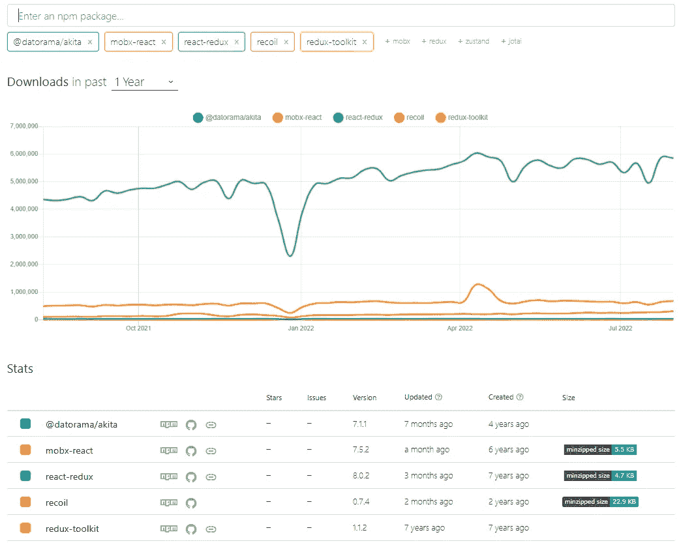

# 反应状态管理

> 原文：<https://medium.com/globant/react-state-management-83cfd77fa94a?source=collection_archive---------7----------------------->

管理状态可能是应用程序中最具挑战性的部分。这就是为什么每天都有这么多国家管理图书馆的原因。尽管状态管理是一个困难的问题，但这表明使它变得如此困难的一个原因是我们经常过度设计我们的问题解决方案。

企业级 React 应用程序的开发人员知道状态管理对于一致的最终用户体验有多么重要。然而，用户并不是唯一受状态管理影响的人。React 开发人员创建并维护状态。他们希望状态管理简单、可扩展、原子化。React 通过引入钩子已经朝着这个方向发展了。

GitHub 上有几十个状态管理工具(如 [**Redux**](https://redux.js.org/) **，** [**MobX**](https://mobx.js.org/README.html) **，** [**秋田**](https://datorama.github.io/akita/) **，** [**反冲**](https://recoiljs.org/) **，上下文 API 等**。然而，把它们都考虑进去会导致无休止的研究和比较。这就是我们根据受欢迎程度、使用情况和维护者将选择范围缩小到五个主要竞争对手的原因。

**趋势图(参考表格 npm 趋势**[https://npmtrends.com/](https://npmtrends.com/)**)**

我们已经介绍了 React 状态管理的介绍部分。接下来，我们将探索各种状态管理库及其比较。