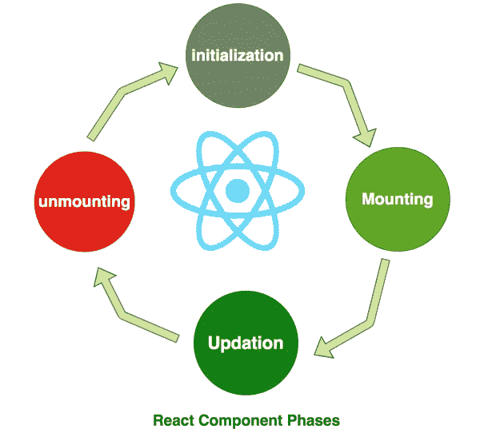

# react——了解组件生命周期方法

> 原文：<https://medium.com/bb-tutorials-and-thoughts/react-understanding-component-lifecycle-methods-1aaa32b33047?source=collection_archive---------5----------------------->

## React 组件生命周期初学者指南

在使用 react 时，理解组件阶段和生命周期方法对于任何成功的 react 项目都是非常重要的。在本文中，我将更深入地讨论这些生命周期挂钩及其用例。

