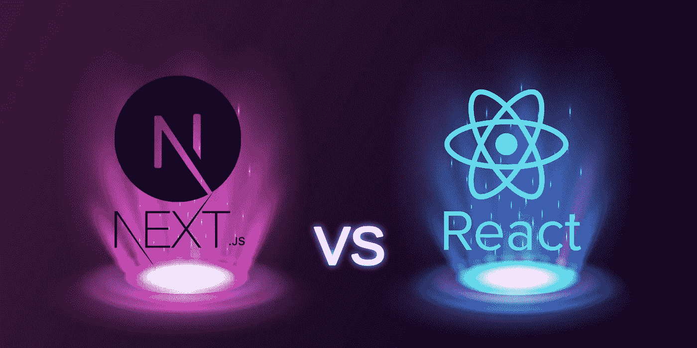
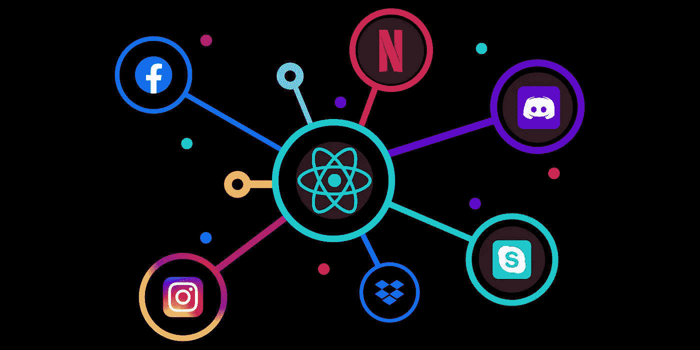
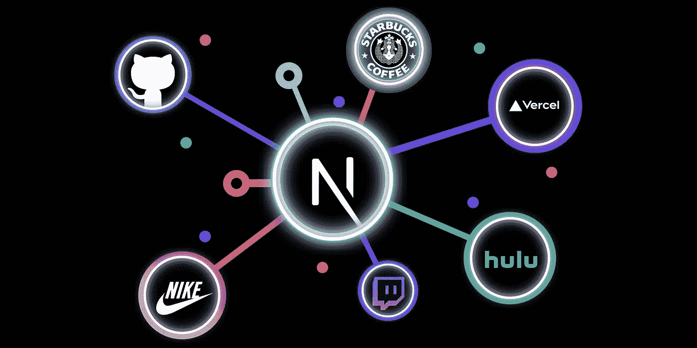
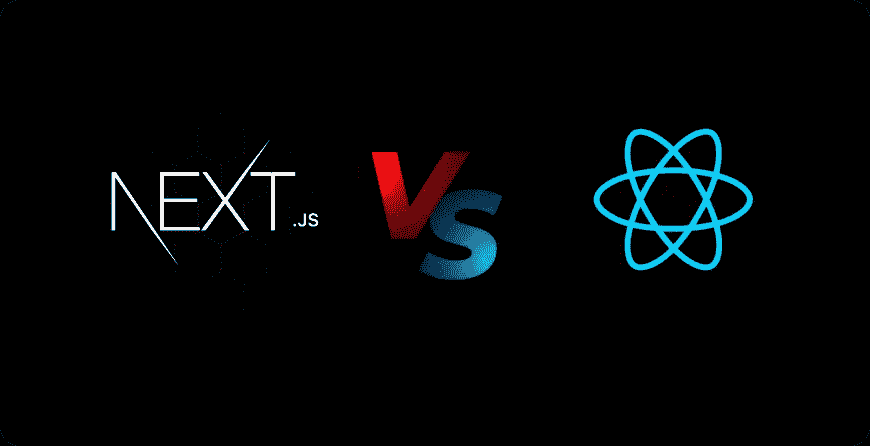
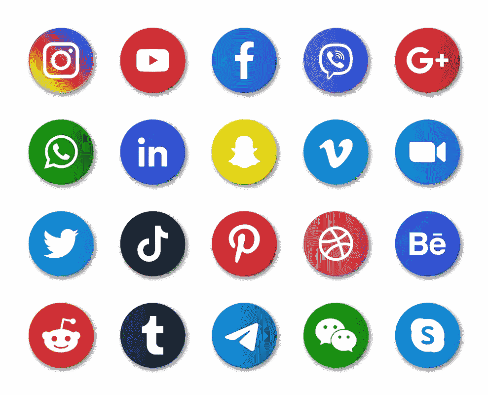
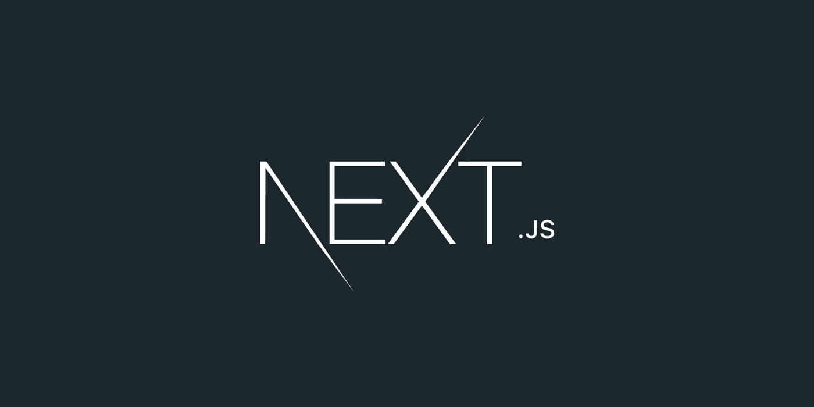

# React Vs Next JS:综合概述。👨🏻‍💻

> 原文：<https://medium.com/quick-code/react-vs-next-js-a-comprehensive-overview-da6e0633bd49?source=collection_archive---------0----------------------->

当谈到简化和满足项目目标时，开发人员选择正确的框架或库是至关重要的。有各种各样奇妙的前端框架可用。然而，说到受欢迎程度和使用情况，React 已经领先近十年了。尽管近年来，另一个框架已经成为 React 的流行替代方案，这个框架不是别人，正是 NextJS。嗯，在这篇关于 **Next JS vs React JS** 的文章中，我们将深入讨论这项技术。

React 和 Next.js 都是时下最流行的前端 web 开发工具。与他们一起工作是令人愉快的，他们负责将我们的在线体验定义为用于在全世界创建用户界面(UI)的标准工具。但问题是，你该选哪一个？

基本上，当谈到框架时，开发者倾向于支持那些提供可伸缩性和便利性的**。因为他们并不总是有时间从头开始掌握新的软件库。因此，开发一个开发者经验相当的平台有助于缩短学习曲线。除此之外，还有几个经常被评估的重要标准，比如表现、学习曲线、社区支持等等。**

在本文中，我们将回顾所有的要点，并对 Next JS 和 React JS 进行全面的比较。另外，在写这篇博客的时候，我分析了 Next.js vs. React 的开发者体验。

在深入比较之前，我们先从 React 和 NextJS 的一些基本信息开始。之后，我们将深入探讨具体细节。

# 什么是 ReactJS？

ReactJS 由[T5【脸书】T6](https://www.facebook.com/)建立，是最流行的前端库之一。此外，它很容易扩展，并使用 Redux 等库提供了路由和状态管理模式等惊人的特性。此外，它占地面积小，但可适用于任何项目。

[**React**](https://reactjs.org/) 是一个伟大的解决方案，它包括许多重要的特性，比如路由和状态管理模式。它是一个巨大的、功能丰富的库，可用于开发复杂的应用程序。它非常适合大型项目。

React 区别于其他前端技术的另一个特征是 JSX，它是一个语法和 JavaScript 扩展。没有必要为模板创建一个新文件，然后用 JSX 创建另一个文件逻辑。简单地说，JSX 使程序员能够用 JavaScript 编写 HTML。

你可以查看官方 React 文档了解更多关于 React 的信息。

**特色:**

*   JSX
*   成分
*   单向数据绑定
*   虚拟 DOM
*   简单
*   表演

由于这些有利的功能，React 在开发者和科技巨头中非常受欢迎，如 [**【网飞】**](https://www.netflix.com/)**[**insta gram**](https://www.instagram.com/)**[**Trello**](https://trello.com/)**[**Skype**](https://www.skype.com/en/)**[**Discord**](https://discord.com/)**，**********

******优点:******

****使用 React JS 的主要优势之一是能够重用组件。它节省了开发人员的时间，因为他们不必为相同的功能编写许多程序。此外，对应用程序特定部分的任何修改都不会影响应用程序的其他部分。****

****除此之外，以下是 ReactJS 优于框架的一些优点。****

*   ****它简化了 JavaScript 编码。****
*   ****非常能干****
*   ****出色的跨平台兼容性****
*   ****照顾受抚养人****
*   ****设计模板从未如此简单****
*   ****提供出色的开发工具****
*   ****以用户界面为中心的设计****
*   ****易于修改****

****说到提供最佳性能，ReactJS 是构建 web 应用程序的最佳库之一。****

# ****什么是 NextJS？****

********

****[**Next.js**](https://nextjs.org/) 建立在 React 之上，目的是为了创建一个简单的开发框架。它由 [**Vercel**](https://vercel.com/) (之前的 Zeit)创建，并融合了 React 的许多流行功能。Next.js 具有现成的预渲染、路由、代码分割和 Webpack 兼容性。****

****换句话说，NextJS 允许您快速轻松地使用 ReactJS。此外，它有大量的有效成分和功能。它寻求使 React 应用程序开发更简单、更有效。自动代码分割、热模块重载和路由都是这样的例子。Next.js 管理 React 工具和设置，以及项目的其他结构、功能和优化。****

****使用 NextJS，开发人员只需创建页面，并在页面头中包含组件的链接，从而减少代码，提高可读性，并改善项目管理。这一特性使其区别于 React JS。****

****它可以与 headless 或电子商务平台完美结合，以推动非凡的性能和搜索引擎优化结果。除此之外，还有几家公司，包括 [**【星巴克】**](https://www.starbucks.com/)[**耐克**](https://www.nike.com/)**[**优步**](https://www.uber.com/)**[**Twitch**](https://www.twitch.tv/)**和**GitHub****都在使用。Next.js 因其易用性和创建通用 JavaScript 应用程序的能力而在 React 社区获得了突出地位。************

******更多信息请访问[官方 Next.js 文档](https://nextjs.org/docs/getting-started)。******

********功能:********

*   ****数据提取****
*   ****内置 CSS****
*   ****适应性和反应能力****
*   ****图像优化****
*   ****以打字打的文件****
*   ****快速刷新****
*   ****元标签****
*   ****按指定路线发送****

******优点:******

*   ****增加你的转化率和销售额****
*   ****提升您的营销渠道****
*   ****超越你的在线竞争对手****
*   ****为客户提供更好的用户体验****
*   ****削减维护成本****
*   ****更轻松地扩展业务****
*   ****速度优化****
*   ****SEO 就绪****

****这是 ReactJS 和 NextJS 的简报。现在，我们将分解 ReactJS 和 NextJS 之间的区别。虽然，你有必要知道到底是什么引发了 NextJS 的流行。****

# ****下一个 JS Vs React JS:崩溃****

********

****好了，我们现在要深入比较:React vs Next JS。如果您在开发项目中使用 Next JS 和 React，您会注意到在 React/JavaScript 项目中使用它们有很多好处和坏处。然而，这些是关键的前端开发工具，它们提供了流畅且引人入胜的在线开发体验。虽然，两者都有不同的学习曲线，尽管事实上它们都很容易学习。****

****现在让我们深入分析一下。****

*   ****接下来是基于 react 库构建的 react 框架。React 是一个库，不是框架。****
*   ****Next 以服务器端渲染和网站静态生成而闻名。另一边的 React 不支持服务器端渲染。****
*   ****如果没有之前的反应知识，接下来的学习会很困难。与 NextJS 相比，React 更容易学习。****
*   ****使用 NextJS 构建的 web 应用非常快。与 NextJS 相比，使用 ReactJS 构建的 web 应用程序速度较慢。****
*   ****Next 不需要离线支持。ReactJS 需要离线支持。****
*   ****有了 NextJS，我们可以构建一个完整的 web 应用程序。ReactJS 有助于构建 web 应用程序的漂亮 UI。****
*   ****使用 NextJS 开发一个 app 的成本很低。使用 ReactJS 开发一个 app 的成本也很低。****
*   ****在下一个 Js 公共文件夹中，没有 index.html 文件，因为下一个 js 会根据需要类型生成一个 HTML 文件。在 React js 中，单个 HTML 文件 index.html 位于一个管理整个 React 应用的公共文件夹中。****

# ****是什么导致了对 NextJS 的需求？****

****相当一段时间以前，React 压倒了 JS 界，成为其无可争议的领导者。现在，每一个 React 开发公司都建议利用一种接受性的方法和函数式编程范式，使 ReactJs 更像一个库，而不是一个框架。****

****事实上，React 对任何项目都是一个很好的补充，如果有机会，它还可以扩展。React 比 Next.js 更通用只是因为它是一个库；由工程师决定其实现。****

****React 的 UI 库非常强大，但是强大的能力意味着巨大的责任，你必须配置 Babel、Webpack、ESLint 和一个服务器——这是最起码的。如此广泛的工具让每个人都望而生畏，尤其是想要更直接的方法的初学者和开发人员。这就是 NextJS 的用武之地。****

****Next.js 比 React 和其他使用 React 的框架需要更少的代码。这是比较 Next.js 和 React 时很重要的一点。开发人员只需要构建站点并链接到标题中的元素，从而减少代码，提高可读性，并更好地管理项目。此外，在速度方面，NextJS 比 ReactJS 更胜一筹。****

****现在，让我们检查一下使用场景，即何时使用 React & NextJS…！！****

# ****何时使用 ReactJS？****

********

****React 就是这样一种技术，几乎每个公司都使用过。如前所述，以上优点，确实是目前最好的前端库。作为一个前端库，它使开发人员能够快速构建复杂、健壮的产品并在其上迭代。****

****您获得了将同构 JavaScript 与 React 集成的好处，这允许您在 dashboard 应用程序的客户端和服务器端使用相同的代码。因此，当加载网页时，React 仍然可以生成模块并显示内容。****

****但是你应该什么时候在你的项目中使用 React 呢？****

****如果你正在创建一个需要大量用户交互的前端 UI，你应该使用 React。为每一个将时间与底层业务逻辑联系起来的交互元素编码是一件麻烦的事情。因为 React 处理底层算法，所以您只需要关注接口的视图模型。****

****如果您当前的代码库变得难以使用，您应该考虑转而使用 React。写几百行 UI 代码是需要耐心的。否则，代码库变得太复杂而无法执行基本的故障排除只是时间问题。现在，让我们检查 React 有帮助的案例。****

## ******社交媒体平台******

********

****Credit: [FreePik](https://www.freepik.com/premium-vector/round-social-media-icons-network-platforms-logos_12628744.htm)****

****社交网络应用是另一个突出的用例，Reactjs 作为一个 UI 工具包是理想的。虽然将社交网络构建为一个动态网站在理论上似乎是一个可行的选择，但即使是开发专家也会说这种技术有缺点，如长期维护和 DOM 操纵的永无止境的诅咒。****

****例如，脸书一开始是一个标准的动态网站，后来逐渐过渡到单页基础。****

## ****电子商务应用****

********

****Credit: [FreePik](http://Apart from social media, you should consider ReactJS while working on an eCommerce App. Because Reactjs may be simply integrated as a UI library in eCommerce-based web apps. Well, React makes it easy to create reusable components using ideas such as atomic design. The gist is that each element of your React-based eCommerce app should be independent of one another. So, even if your web app has one point of failure, your programmer can still get it up and running because other functions may still remain operational.)****

****除了社交媒体，在开发电子商务应用时，你应该考虑 ReactJS。因为 Reactjs 可以简单地作为 UI 库集成到基于电子商务的 web 应用程序中。****

****React 使得使用原子设计之类的思想创建可重用组件变得容易。要点是，基于 React 的电子商务应用程序的每个元素都应该相互独立。因此，即使您的 web 应用程序有一个故障点，您的程序员仍然可以让它正常运行，因为其他功能仍然可以运行。****

## ****单页应用程序，即 SPA****

********

****Credit: By [VectorJuice on FreePik](https://www.freepik.com/free-vector/single-page-application-abstract-concept-illustration-spa-web-page-web-development-trend-app-inside-browser-dynamically-rewriting-page-responsive-website-creation_10782838.htm#query=single%20page%20applications&position=4&from_view=search&track=sph)****

****ReactJS 对于为任何行业创建单页面应用程序(SPA)都非常有帮助。单页应用不同于随处可见的典型多页应用。当用户在 SPA 上滚动时，他将继续在同一页面上交互，而不是切换到新页面。****

****取而代之的是，网页通常被内嵌在一个页面中。Trello 是单页面应用的最好例子。路由是一种技术，可以用来实现这种形式的导航。React 提供了…！！****

## ******手机应用******

********

****Credit: [Adobe Stock Photo](https://stock.adobe.com/search?k=mobile+app+development&asset_id=200208909)****

****ReactJS 有一个额外的好处:React Native，你可以用它来创建 Android 和 iOS 的跨平台应用。它为用户提供了一个干净、流畅、响应迅速的界面，同时大大缩短了加载时间。****

****与原生应用相比，React 原生应用的开发速度更快、成本更低，而且不会牺牲质量或功能。通常，你必须用 Java 为 Android 编写移动应用程序，用 Swift/Objective C 为 iOS 编写。****

****React Native 可以帮助您避免这些限制，它允许您利用单个代码库在相当短的时间内为 Android 和 iOS 平台创建功能齐全的应用程序。****

****除此之外，下面是您可以考虑使用 ReactJS 的更多情况。****

*   ****商业网站****
*   ****文件夹****
*   ****论坛****
*   ****给网站评级****
*   ****会员网站****
*   ****电子学习模块****
*   ****画廊等等****

# ****什么时候用 NextJS？****

********

****NextJS 允许您使用 React 创建服务器端呈现和静态 web 应用程序。这是创建你未来网站的一个极好的工具。它包含了许多奇妙的特性和好处，可以让 Next.js 成为您构建下一个在线应用程序的首选。****

****基本上，它是创建一个优化的登陆页面，主页，或任何其他依赖于有机搜索流量的页面的理想选择。对 SSR 的内置支持可以提高性能和 SEO，这是 Next.js 的主要优势。服务器端呈现的工作原理是改变 React 应用程序的请求流，以便除客户端之外的所有组件都向服务器传输数据。****

****有了服务器上的所有数据，用户可以预览页面的 HTML 代码。客户端可以向服务器发送一个请求并接收一个完整的 HTML 页面，而不是通过客户端呈现来分别访问每个组件。****

****现在，让我们检查一下 NextJS 有帮助的案例。****

## ****SEO 优化网站****

********

****Credit: By [StorySet on FreePik](https://www.freepik.com/free-vector/seo-analytics-team-concept-illustration_25921169.htm#query=SEO&position=1&from_view=search&track=sph)****

****如果 SEO 是您网站的重中之重，并且它需要 SSR(服务器端渲染)来确保 SEO 友好的页面，那么您应该选择 Next.js，因为 SSR 带来了开箱即用、可索引和可抓取网站的优势，这对搜索引擎优化(SEO)至关重要，因为查看页面内容不需要客户端 JavaScript。****

## ****营销网站****

********

****Credit: [Adobe Stock](https://stock.adobe.com/search?k=marketing&asset_id=288509649)****

****因为您的应用程序将呈现在服务器上，所以加载时间应该尽可能短，Next.js 正好达到了这一点。电子商务商店包括一个复杂的电子商务初学者工具包，允许开发人员创建 Google 友好的高性能在线商店。尤其是当访问者使用较慢的设备时。****

## ****电子商务网站****

********

****Credit: [iStock Getty Image](https://www.istockphoto.com/photo/online-shopping-and-payment-man-using-tablet-with-shopping-cart-icon-digital-gm1206800961-348184330)****

****最近，Next JS 发布了一个强大的[电子商务入门套件](https://nextjs.org/commerce)，可以让你建立高性能、谷歌友好、用户友好的在线商店。Next.js 的架构使网站能够将其在线商店与其他第三方系统(如 CMS、PIM 和 ERP)相集成。****

## ****登录页面****

********

****Credit: [FreePik](https://www.freepik.com/free-vector/organic-flat-creative-solutions-landing-page_13405340.htm#query=landing%20page&position=4&from_view=search&track=sph)****

****如果你有一个简单的登陆页面需求，Next.js 可以简单处理，营销团队会很乐意使用 Next.js 开发的登陆页面。****

****除此之外，以下是您可以考虑使用 NextJS 的更多情况。****

*   ****门户网站****
*   ****单一网页****
*   ****静态网站****
*   ****SaaS 产品****

# ****关于下一个 js vs React 的最终想法****

****在我看来，像“**Next JS 更好**”或者“**react JS 更好**”这样的问题是不合适的。问题应该是 Next.js 是否是开发 React 应用程序的好选择。无论您是作为开发人员还是 CTO，这都归结于项目的类型和目标。****

****如前所述，选择框架或库完全取决于项目的需求。React 和 Next.js 是您的应用程序的不断增长的有用工具，但仅用于特定目的。然而，要使用的最佳技术或库是由项目需求和商业目标决定的。****

****关于开发人员的体验，对于 Next.js 和 React 来说，最初的搭建过程非常简单。然而，React 确实需要您添加 React Router 之类的库来进行路由，而 Next.js 通过 Link 组件提供了开箱即用的功能。****

****另一方面，NextJS 提供了最好的服务器端渲染和静态网站构建解决方案。它还通过各种工具和功能简化了项目管理。另一方面，React 非常适合为单页面应用程序创建用户界面。它允许你设计视觉丰富、反应灵敏、直观的应用程序，因为它工作在移动和网络应用程序之上。****

****嗯，React 和 Next JS 都有各自的优势和特点。在这里，我已经尽力在这里呈现一个 Next JS vs React JS 的全面概述。最终还是要看个人的选择。因此，最好对您的项目要求和需求进行研究。因此，首先对需求进行优先排序，这将有助于您选择适合自己的技术。****

****我希望这篇文章对你有所帮助。****