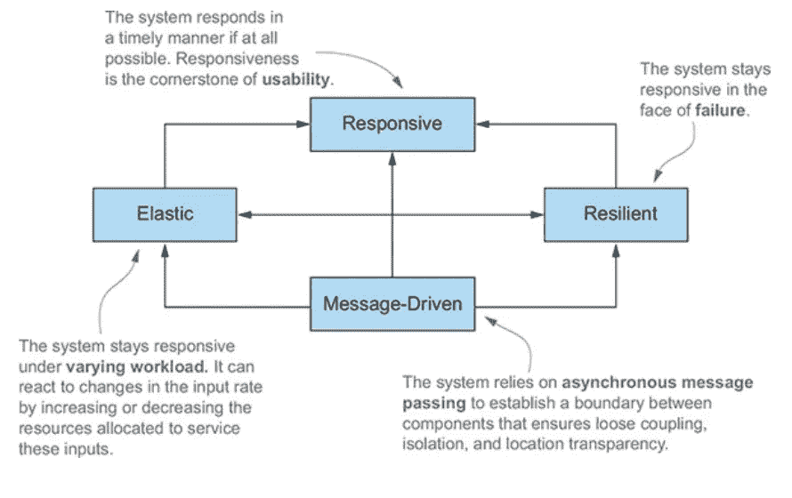
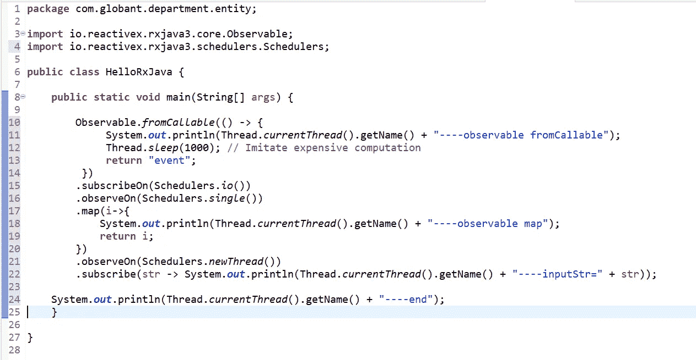
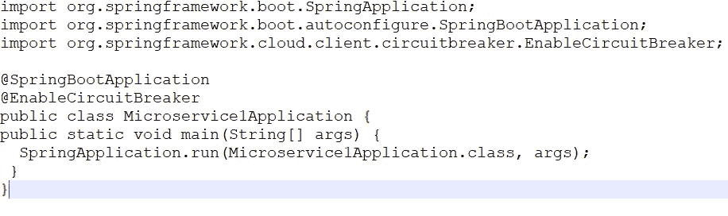
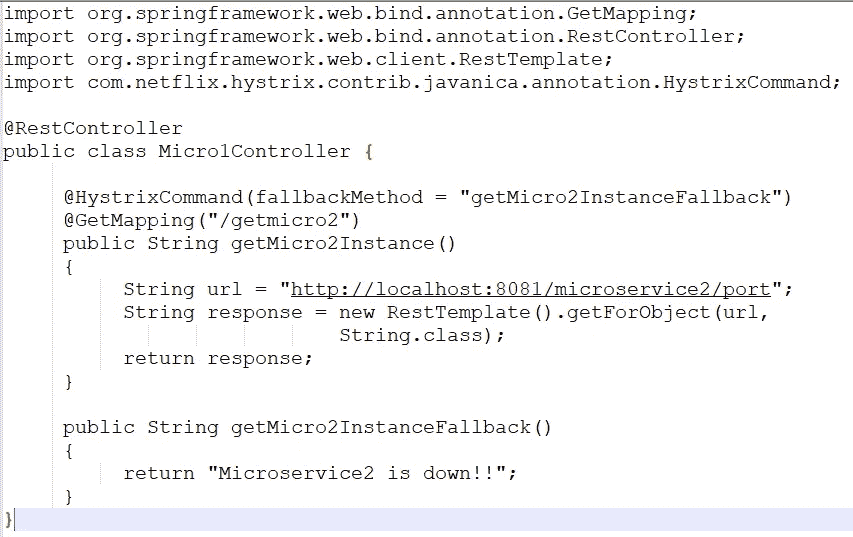
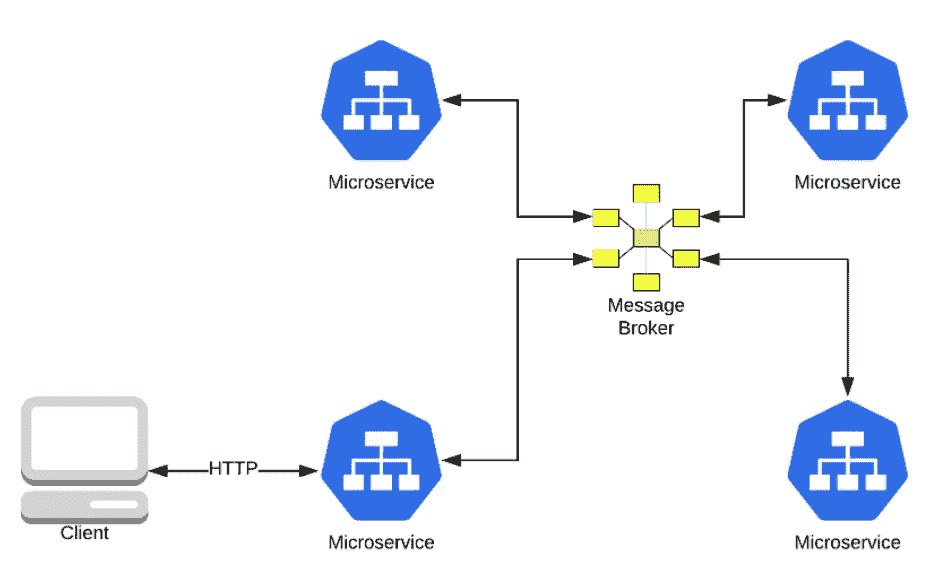

# Java 中的反应式编程

> 原文：<https://medium.com/globant/reactive-programming-in-java-rxjava-2c3fafaa9d0c?source=collection_archive---------0----------------------->

反应式编程是另一种范式，就像其他过程式、面向对象和函数式编程一样。反应式编程是一种编程范式，它提倡异步、非阻塞、事件驱动的数据处理方法。反应式编程包括将数据和事件建模为可观察的数据流，并实现数据处理例程以对这些数据流中的变化做出反应。

在反应式编程中，我们请求资源并开始执行其他事情。当数据可用时，我们以回调函数的形式获得通知和数据。在回调函数中，我们根据应用程序/用户的需求来处理响应。

走向反应式编程有四个支柱-
1。响应式
2。弹性
3。弹性
4。消息驱动

1.  响应性:响应性意味着问题可以被迅速发现并有效处理。响应系统专注于提供快速一致的响应时间和服务质量。例如，在 web 应用程序的情况下，如果用户点击一个按钮从互联网下载一些数据并在屏幕上显示，我们将注册一个回调，同时显示一个加载屏幕，并返回执行结果。此时，用户仍然可以与屏幕交互，取消这个请求，或者选择另一个选项。之前，在我们的按钮点击处理程序中，如果我们没有注册一个回调并同步加载数据，那么整个屏幕将没有响应，直到我们的操作完成。因此，这是一个我们设计了反应灵敏的系统的例子。

下面是异步*和非阻塞*的例子——

这里我们使用`Observable.fromCallable()`来创建一个可观察对象(观察者)。`fromCallable`方法创建了一个懒惰的可观察对象，传入的代码只有在有人监听时才会被执行。
然后，您可以使用`subscribeOn(Schedulers.io())`来指定观察者执行的线程池。`observeOn(Schedulers.single())`指定下游观察器执行的线程池。(*地图方法是观察者。)与许多流编程 API 一样，map 方法将每个上游元素转换为另一个元素。最后，通过`observeOn(Schedulers.newThread())`公式化当前下游观察器，它指的是上一次订阅中由传入观察器(Lambda 模式)执行的线程池。

前面的代码执行后，打印出来的线程名显示被观察线程、映射线程、观察线程都是不同的线程，主线程的最后一个“end”会先执行。这意味着实现了异步非阻塞。

**2。弹性**:弹性意味着系统在故障时保持响应。复原力是通过复制、遏制、隔离和授权实现的。故障包含在每个组件中，将组件彼此隔离，从而确保系统的各个部分可以在不影响整个系统的情况下发生故障并恢复。每个组件的恢复被委托给另一个(外部)组件，并且在必要时通过复制来确保高可用性。组件的客户机没有处理其故障的负担。
在微服务架构中，这一点尤为重要，因为随着我们从整体解决方案转向网络可访问的分散架构，网络的不可靠性是我们不能忽视的。例如，在微服务中，我们利用断路器模式来短路一个失败的后端服务，以立即响应调用者，直到后端服务恢复正常。这方面的一个例子如下-

1.  在 pom.xml 中添加**spring-cloud-starter-网飞-hystrix** 依赖关系
2.  在应用程序类上添加@EnableHystrix 注释:
    该注释启用断路器实现。它告诉弹簧在这个应用中使用了断路。

3.**使用 *@HystrixCommand* 注释:**指定回退方法

春云网飞海斯特里克斯寻找用`@HystrixCommand`标注标注的方法。这使得该方法具有容错性。使用它，我们可以指定在出现*错误*、*超时*或*电路断开*情况时将执行的回退方法。

4.**在** `**application.properties**` **中添加以下属性:**

hystrix . command . default . circuit breaker . requestvolumethreshold = 2
hystrix . command . default . metrics . rolling stats . timeinmilliseconds = 10000
hystrix . command . default . circuit breaker . error threshold percentage = 50
hystrix . command . default . circuit breaker . sleep windowinmilliseconds = 3000

通过以上所有步骤，可以实现微服务架构的弹性，在微服务架构中，系统将始终在服务失败时返回响应。

**3。弹性**:系统在变化的工作负载下保持响应，也就是说，它可以处理 N 个请求，并能够对它们进行负载平衡。它有能力启动新的服务实例，还能发现新的端点与它们通信。随着云计算平台的出现，这些服务现在已经成为一种商品。随着基于容器的技术(如 Docker)和容器编排系统(如 Kubernetes)的采用，这种趋势得到了加速。

**4。消息驱动**:系统依赖于异步执行流程，我们向服务器发送请求，流程继续执行程序的下一步，无需等待第一个响应，因为一旦响应可用，它将由回调机制处理。

微服务架构也使用消息驱动的系统方法。这加强了松耦合、隔离和更好的故障恢复能力。在使用消息传递时，我们确保系统的未来扩展(例如添加使用现有服务的新服务)可以无缝完成，而无需重新部署系统中的任何现有服务。微服务架构中的最佳实践在其标准库中支持许多领先的消息传递解决方案，如 NATS、Kafka 和 RabbitMQ。

*Message-driven microservices*

**结论** :
在这里，我们已经讨论了反应式编程及其在 Java 中的重要性，详细解释了四个支柱，这些支柱有助于通过示例和代码片段更好地理解反应式编程。

如果有任何令人困惑的地方，或者想在本文中添加您的想法或内容，您可以发表评论。

感谢您的宝贵时间！