# 反应式编程:Project-Reactor / Rx-Java / Java 9 反应式流程

> 原文：<https://medium.com/globant/reactive-programming-project-reactor-rx-java-java-9-reactive-flow-881f5070f7df?source=collection_archive---------0----------------------->

**什么是反应式编程？**
反应式编程(Reactive Programming)是一种对数据流进行非阻塞、异步和事件驱动处理的编程范式。它有助于自动传播更改的数据流。

**为什么无功？**

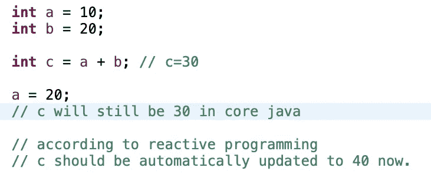

Need of reactive programming

上面的例子显示了反应式编程的需要，如果数据变化很快，并且您不希望对每个对数据值感兴趣的部分进行显式更新调用，您会希望您的应用程序是反应式的。

**反应式编程的业务用例:**
-股票市场应用，股票价格持续变化。
-像优步/Ola 这样的出租车服务应用程序，其中多个指标(如出租车位置、接送位置等)不断变化。

【JAVA 的不同实现选项:

1.  项目反应堆
2.  Rx-Java
3.  Java 9 反应流

反应式编程的新手总是会有这样一个问题:使用哪一个？
我们将在本文中一探究竟。

# **无功规划的四大支柱:**

在探讨不同的实现方式之前，让我们先来看一下反应式编程的基础，这 4 个支柱是上面列出的 3 个库中的每一个都直接或间接使用的 4 个接口。

*   接口**发布者**
    有 1 个方法:
    - subscribe(订阅者<？超级 T >订户)
*   接口**订阅方**
    有 4 种方法:
    - onSubscribe(订阅订阅)
    - onNext(T 项)
    - onError(Throwable 可抛出)
    - onComplete()
*   接口**订阅**
    有 2 种方法:
    -请求(Long n)
    -取消()
*   接口**处理器**
    扩展订阅者< T >，发布者< T >

**反应式编程范例中的基本工作流程/序列:**

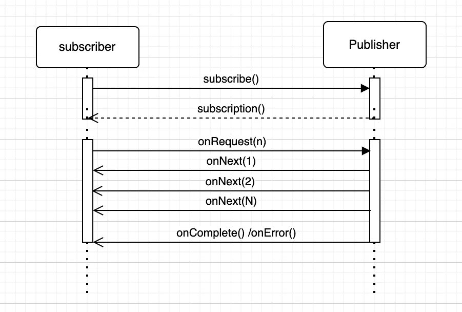

Sample workflow for Reactive Paradigm

订阅者调用发布者的 subscribe 方法进行订阅，发布者将订阅返回给订阅者。订阅者可以通过 onRequest 向发布者请求数据，然后发布者通过 onNext 调用发出事件 1 到 N 次，最后发出 onComplete 事件以告知订阅者事件已完成。

**让我们看看每个库是如何使用这些概念的:**

# 项目反应堆

Project Reactor 提供了 Spring-WebFlux，用于在 spring boot 应用程序中进行反应式编程。它提供了两种数据类型:
**Flux** :可以发布 0 或 N 个元素的 Publisher。
**Mono** :可以发布 0 或 1 个元素的发布者。

您需要在您的 maven 项目中添加显式的依赖关系

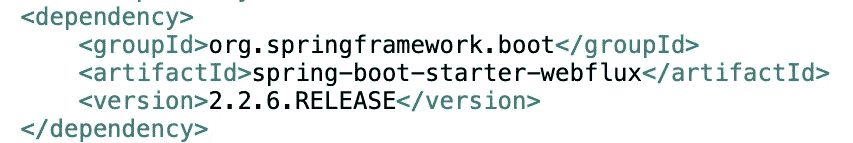

**例如:**

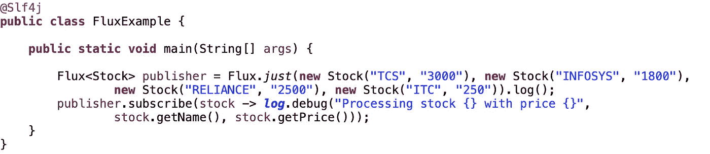

Example Code

这个例子展示了一个 flux publisher 如何在订阅时发出 4 个事件，也可以使用库提供的操作符进行修改。下面的日志显示了我们在上面的工作流中看到的订阅者和发布者之间的流程，该流程从 subscribe()开始，到 onComplete()调用结束。

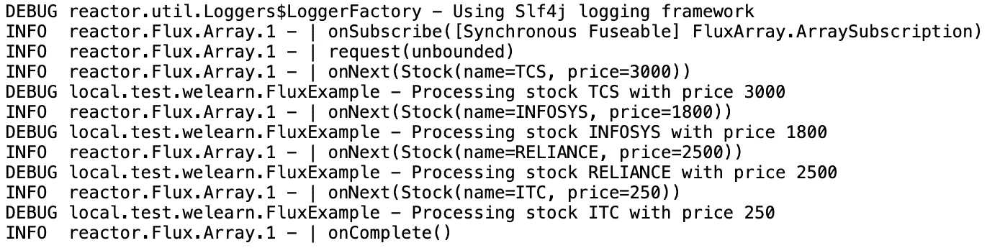

Output

# Rx-Java

它是 react vex 的基于 Java 的扩展，react vex 旨在为不同的编程语言提供反应式编程概念。

Rx-Java 的关键组件:
**Observables** :表示任何可以从 datasource 获取数据的对象，并且其状态可能是其他人以某种方式注册的兴趣，简而言之我们可以称之为 publisher。

**观察者**:任何希望在另一个对象的状态改变时得到通知的对象，简而言之我们可以假设它是订阅者。

观察者订阅 Observables，然后 Observables 一次向观察者发送一个项目。

*Observable 可以通过以下方式之一创建:
- Observable:发出 0 到 N 个项目，它不支持背压
- Flowable:发出 0 到 N 个项目，并且支持背压，因此当我们的项目较少或发布率预计较低时，我们可以使用 Observable，否则应该使用 Flowable。我不会在这篇文章中谈论背压，你可以在这里阅读***。
-可完成:不发射任何物品。
- Single:仅发出 1 个项目或错误。
-也许:不发射任何物品或发射 1 件物品。*
你可以从 just 中创建一个像 Flux 一样的可观察对象，同时它还有其他选项可以创建，我们在这里不会涉及，比如 fromIterable、fromCallable 等等。*

*您需要在您的 maven 项目中添加显式的依赖关系*

*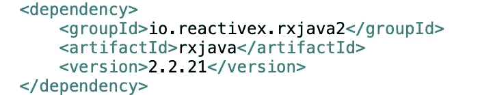*

***示例**:*

*与上面我们用于 Project Reactor 的例子相同，我们将从 Observable 创建 publisher，然后订阅它以打印所有值，而不是 Flux。*

*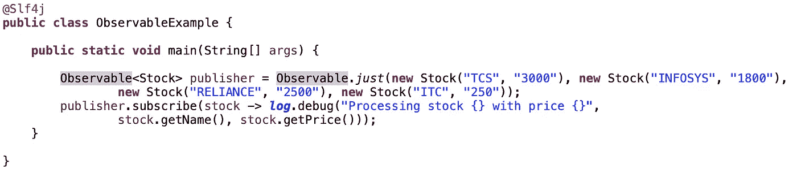*

*Example code*

*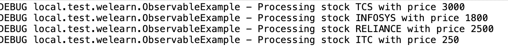*

*Output*

*Rx-Java 没有为我们从 Project Reactor 获得的调用提供日志记录功能，但流程与我们在上面的工作流程图中看到的一样。*

# *Java 9 反应流*

*Java 9 在**Java . util . concurrent . flow**包下引入了**反应流**。Flow API 包含四个相互关联的核心接口:**Java . util . concurrent . publisher**、**Java . util . concurrent . subscriber**、**Java . util . concurrent . subscription**和**Java . util . concurrent . processor、**，这与我们在上面讨论的反应式编程的四大支柱完全相同。*

*因为它是随 Java 9 一起提供的，所以在您的项目中不需要任何额外的依赖。*

***示例**:*

*在这里，我们将创建一个发布者，它将发出字符串的输入列表，我们还将创建一个订阅者，它将订阅发布者并处理发出的事件。*

*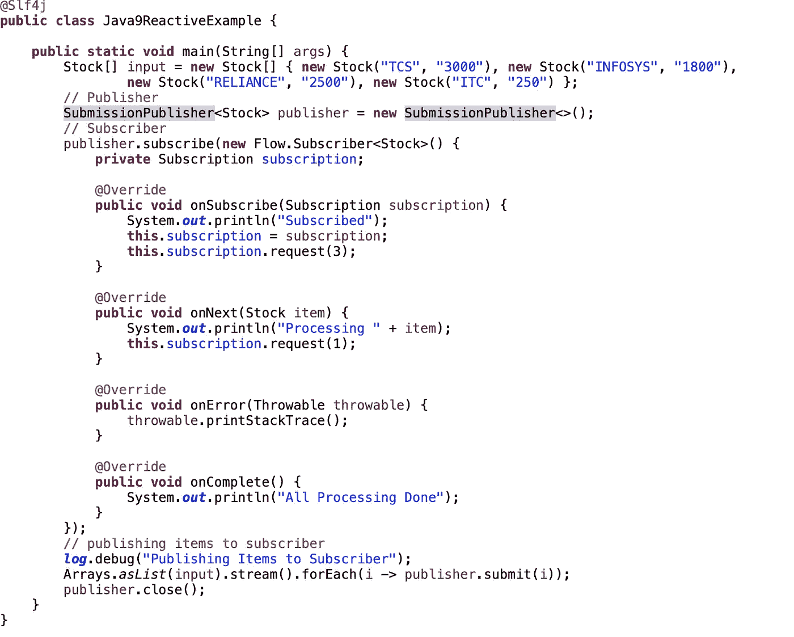*

*Example code*

*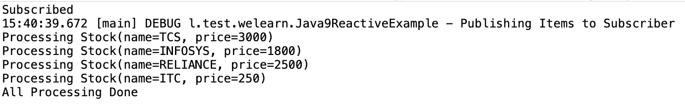*

*Output*

*如果你注意到我们使用了心流。订阅来控制这里的背压，因为一旦我们处理了项目，我们就请求下一个项目。*

# *比较:*

*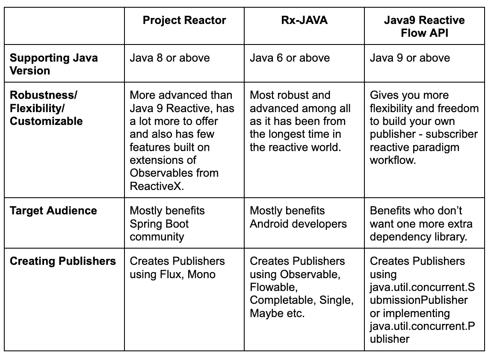*

*Comparison*

> *注意:所有这三个库都比本文中列出的要多得多，本文的目的只是让大家对每个库的反应式编程和 kickstart 有一个初步的了解。*

***结论:***

*这三个库在 API 和流模式方面各有利弊。这完全取决于需要执行集成操作的工具的需求和选择。API 包含的差别也很小。希望这将节省您为您的特定需求选择正确库的时间。*

***参考文献**:*

*【https://github.com/ReactiveX/RxJava
[https://projectreactor.io/](https://projectreactor.io/)
[https://docs . Oracle . com/javase/9/docs/API/Java/util/concurrent/flow . html](https://docs.oracle.com/javase/9/docs/api/java/util/concurrent/Flow.html)*