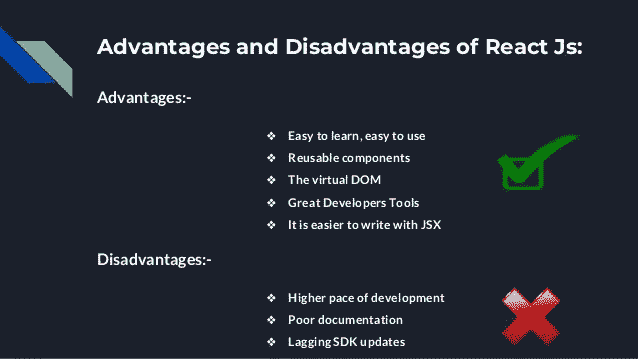
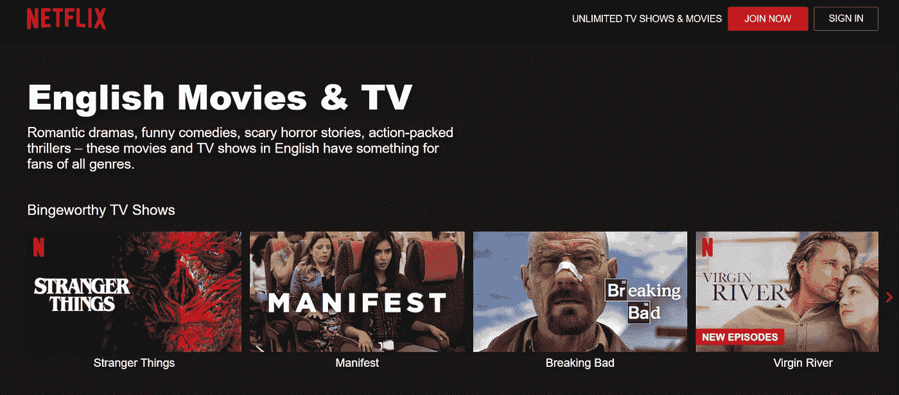
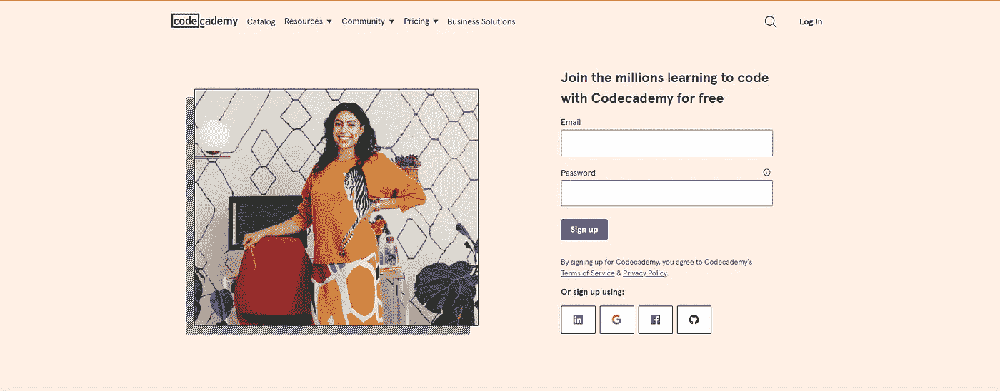

# 反应不到 5 分钟就解释完毕

> 原文：<https://medium.com/quick-code/reactjs-explained-in-less-than-5-minutes-321a38fdd8c3?source=collection_archive---------7----------------------->

React Logo

如果你最近一直在寻找一份开发人员的工作，你一定已经注意到，几乎所有的工作机会都要求你知道 React。有可能你已经开始研究它了，或者你已经开始了初学者教程，但是…你真的知道 React 是什么吗？你能说一下在你的项目中什么时候使用 React 是正确的，什么时候不正确吗？放心吧！今天你要消除任何疑虑。

# 好吧！但是…到底是什么反应？

React 是一个开源的 Javascript 库，用来制作用户界面。总而言之，这只是由脸书团队开发的一堆代码，它将允许我们制作用户界面。

多亏了这个库，我们可以使用 Javascript(真的是 JSX)管理我们 web 项目的整个前端。有了 React，Javascript 不仅可以为你的项目提供一些功能，还可以用它来创建你的应用程序的前端。

# 我应该在我的项目中使用 React 吗？

如果您的前端界面需要与用户进行大量的交互，建议在您的项目中使用 Javascript。如果您还知道 Javascript，并且不想学习新的框架或技术，那么您应该考虑在您的项目中使用 React。如果你使用 Angular 或 Vue(或任何其他前端库/框架),但你想在你的网页上有更快的速度，你应该使用 React。最重要的是，如果你要在你的项目中使用组件或其他可重用的代码，你必须将 React 添加到你的项目技术栈中。

Image from [forum.attainu.com](https://forum.attainu.com/t/what-is-the-advantage-of-react/863/3)

如果您想在下一个项目中使用这个库，React 有许多好处，您应该记住:

*   **可复用组件**。毫无疑问，这是 React 的主要品质之一。这个库允许我们重用组件。这个特性使我们能够在项目中节省编码的时间和精力，因为我们不必多次编码相同的组件。
*   **轻松学习路径**。许多人认为这个库比 Angular 或 Vue 等其他前端解决方案更容易学习。还有，网上有很多资源(免费的和不免费的)可以学习这项技术。
*   **本土开发**。如果你听说过 React，在很多情况下你会听到 React Native 而不是 React。React Native 是一个旨在制作原生移动应用的框架。出于这个原因，如果你已经学习了 React，你可以开始开发原生移动应用程序，而无需学习新的语言。

此外，React 可以与 Angular 等其他技术或框架一起使用。因此，您可以记住这个库，在您的项目中作为一项技术使用，以支持您的前端技术堆栈。

# 用 React 制作的著名网页

[**脸书**](https://www.facebook.com/)

Facebook official website

[**网飞**](https://www.netflix.com/es-en/browse/genre/107548)

****

**Netflix official website**

**[**代码学院**](https://www.codecademy.com/)**

****

**Codeacademy official website**

# **学习 React 的资源**

**你看到 React 的巨大潜力了吗？有 3 种资源可以帮助您开始学习 React 之旅:**

*   **[官方反应文件](https://reactjs.org/)。**
*   **[FreeCodeCamp 初级课程](https://www.youtube.com/watch?v=bMknfKXIFA8&ab_channel=freeCodeCamp.org)。**
*   **[Web.dev 课程](https://web.dev/react/)。**

# **结论👋**

**谢谢大家！非常感谢您阅读这篇文章。我很想知道你对此的看法，所以不要在评论里写了，我会读给你听的。**

**反过来，如果这篇文章已经帮助你记住了，你可以为它鼓掌，并与你的同志分享。如果你不想错过我的任何一篇文章，别忘了关注我。**

## **关于作者🤓**

**我的两个爱好是技术和交流，所以我抓住一切机会谈论或写关于技术的东西。**

## **想要连接？📲**

**📩**jesuslagaresgalan@gmail.com****

**📸[insta gram](https://instagram.com/jesuslagares_)**

**💼 [**领英**](https://www.linkedin.com/in/jesus-lagares/)**

**📹 [**Youtube**](https://www.youtube.com/c/Jes%C3%BAsLagares)**

**🐦 [**推特**](https://twitter.com/jesuslagares_)**

**谢谢！❣️**