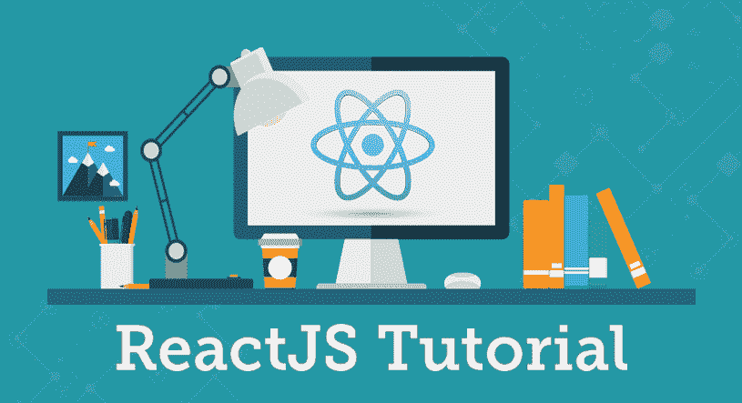
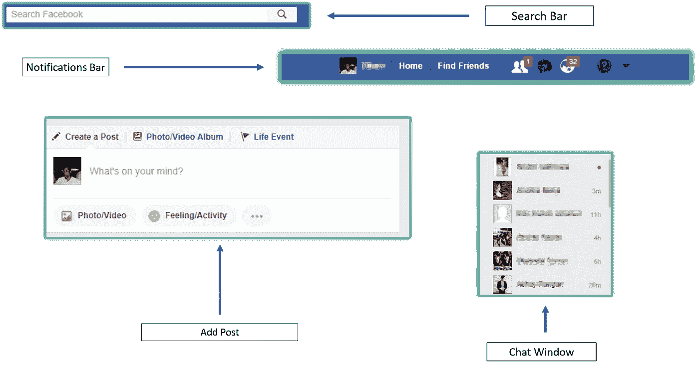
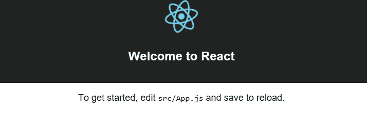

# ReactJS 教程——使用 ReactJS JavaScript 库设计您的 Web UI

> 原文：<https://medium.com/edureka/reactjs-tutorial-aa087fd7fc90?source=collection_archive---------0----------------------->



ReactJS Tutorial — Edureka

你们大多数人可能听说过 ReactJS，也就是 React。对于那些好奇想知道更多的人，我将介绍 React 的所有核心概念。在本文结束时，我相信您会清楚 React 的所有基础知识。让我先给你一个我将在这个 ReactJS 教程中涉及的概述。

*   反应的演变
*   为什么要学习 React？
*   React 功能概述
*   它是如何工作的？
*   积木
*   反应装置

# 反应的演变

React 是一个 JavaScript 库，用于构建 web 应用程序的用户界面。React 最初是由脸书的人开发和维护的，后来被用于他们的产品(WhatsApp & Instagram)。现在它是一个开源项目，有一个活跃的开发者社区。网飞、Airbnb、雅虎等热门网站 Mail、KhanAcademy、Dropbox 和许多其他应用都使用 React 来构建它们的 UI。现代网站是使用 MVC(模型视图控制器)架构构建的。React 是 MVC 中代表视图的‘V’，而架构是由 **Redux** 或 **Flux** 提供的。React native 用于开发移动应用程序，脸书移动应用程序是使用 React native 构建的。

脸书 2017 年年度 F8 开发者大会发布了两个充满希望的公告: **React Fiber** 和 **ReactVR** 。React Fiber 是对以前版本的完全重写，侧重于增量渲染和快速响应，React Fiber 向后兼容所有以前的版本。ReactVR 建立在 React 原生框架之上，它支持通过添加 3D 模型来开发 UI，以复制 360 度环境，从而产生完全沉浸式的 VR 内容。

# 为什么要学习 React？

> ***“还是少写多做吧！!"***

React 是最容易上手的 JS 库之一。传统的普通 JavaScript 更加耗时，既然可以用 React 顺利完成任务，为什么还要浪费时间写冗长的代码呢？React 在 GitHub 上有超过 71，200 颗星，是有史以来第四大明星项目。看了下面的例子后，我相信你会理解为什么全世界的前端开发人员都在转向 React。现在让我们尝试在 React 中编写一组嵌套列表，并将其与传统的 JavaScript 语法进行比较。

*举例:* ***香草 JavaScript 中的 30*** *行代码可以替换成仅仅是* ***的 10*** *行 React 代码，这不是很棒吗！！*

**做出反应**

```
<ol>
<li>List item 1 </li>
<li>List item 2 (child list)
<ul>
<li>Subitem 1</li>
<li>Subitem 2</li>
</ul>
</li>
<li>Final list item</li>
</ol>
```

**等同于香草** **JavaScript**

```
React.createElement(
 "ol",
 null,
 React.createElement(
 "li",
 null,
 "List item 1 "
 ),
 React.createElement(
 "li",
 null,
 "List item 2 (child list)",
 React.createElement(
 "ul",
 null,
 React.createElement(
 "li",
 null,
 "Subitem 1"
 ),
 React.createElement(
 "li",
 null,
 "Subitem 2"
 )
 )
 ),
 React.createElement(
 "li",
 null,
 "Final list item"
 )
);
```

正如您已经知道的，当复杂性增加时，生成的 JavaScript 代码会变得难以管理。这就是 JSX 出手相救的地方，确保代码简短易读。

# 关键术语


在我们深入本文之前，让我先向您介绍一些您需要熟悉的关键术语。

## **JSX (JavaScript 扩展)**

JSX 允许我们在同一个文件中包含“HTML”和“JavaScript”(HTML+JS = JSX)。React 中的每个组件都生成一些由 DOM 呈现的 HTML。

## **ES6 (ES2015)**

JavaScript 第六版由 ECMA International 于 2015 年标准化。因此这种语言被称为 ECMAScript。并非所有现代浏览器都完全支持 ES6。

## **ES5(ES2009)**

这是第五个 JavaScript 版本，被所有现代浏览器广泛接受，它基于 2009 ECMA 规范标准。工具用于在运行时将 ES6 转换成 ES5。

## **网络包**

一个模块捆绑器，它生成一个连接所有依赖项的构建文件。

## **巴别塔**

这是用来把 ES6 转换成 ES5 的工具。这样做是因为不是所有的浏览器都能直接渲染 React (ES6+JSX)。

# React 功能概述


## 学习曲线

React 的学习曲线较浅，适合初学者。ES6 语法更易于管理，尤其是对于较小的待办事项应用程序。在 React 中，你用“JavaScript”方式编码，让你可以根据需要自由选择工具。Angular 希望你学习一个额外的工具“typescript ”,它可以被看作是做事的“Angular”方式。在 Angular 中，你需要学习整个框架，即使你只是在构建一个简单的 UI 应用程序。

在本 ReactJS 教程中，我将讨论 React 的虚拟 DOM。

## 概念:虚拟 DOM 的简单性


与实际的 DOM 相反，react 使用虚拟 DOM。虚拟 DOM 利用差分算法进行计算。这释放了真正的 DOM，它可以处理其他任务。让我举个例子来说明这一点。

现在，假设有 10，000 个节点，其中我们只需要处理 2 个节点。现在，大部分处理都浪费在遍历这 10，000 个节点上，而我们只在 2 个节点上操作。虚拟 DOM 完成计算以找到这两个节点，而真实 DOM 快速检索它们。

## 表演

谈到性能，React 位居榜首。React 以其卓越的渲染速度而闻名。“反应”这个名字由此而来，它是一种瞬间反应，能在最短的时间内改变。DOM 操作是响应式网站的核心，不幸的是，它在大多数 JavaScript 框架中都很慢。然而，虚拟 DOM 是在 React 中实现的，因此它是 React 卓越性能背后的基本原理。

## 大小

正如我们已经知道的，React 不是一个框架，因此可以根据用户的需要添加功能。这是基于 React 构建的轻量级应用程序背后的原则— *只挑选需要的东西*。Webpack 提供了几个插件，在生产过程中进一步最小化(minify)大小，缩小的 React + Redux 捆绑包构成了大约 200 kb，而它的竞争对手 Angular 几乎是它的四倍大(Angular + RxJS 捆绑包)。

## 排除故障

当一个开发者遇到障碍时，会有一个时间点。它可能像“丢失括号”一样简单，也可能像“分段错误”一样棘手。无论如何，越早发现异常，开销就越小。React 使用编译时调试并在早期检测错误。这确保了错误不会在运行时悄悄出现。脸书的单向数据流允许干净和平滑的调试，更少的堆栈痕迹，更少的混乱和更大的应用程序有组织的流量架构。

# 它是如何工作的？

虽然 React 对于没有 JavaScript 经验的初学者来说更容易学习，但是移植 JSX 代码的细节常常让人不知所措。这为 Babel 和 Webpack 等工具定下了基调。Webpack 和 Babel 将所有的 JavaScript 文件捆绑到一个文件中。就像我们过去在 HTML 代码中包含 CSS 和 JS 文件的链接一样，Webpack 执行类似的功能，消除了显式链接文件的需要。

我肯定你们都用脸书。现在，想象一下脸书被分成几个组件，每个功能被分配给一个特定的组件，每个组件产生一些 HTML，由 DOM 输出。

## **脸书组件**

*   搜索栏
*   添加帖子
*   通知栏
*   订阅源更新
*   个人资料信息
*   聊天窗口

为了把事情说清楚，参考下图。



# 积木

*   成分
*   小道具
*   状态
*   状态生命周期
*   事件处理
*   键

转到 ReactJS 教程的核心方面，让我们讨论 React 的构建模块。

## 成分

整个应用程序可以被建模为一组独立的组件。不同的组件用于不同的目的。这使我们能够将逻辑和视图分开。React 同时渲染多个组件。组件可以是有状态的，也可以是无状态的。

在我们开始创建组件之前，我们需要包含一些“导入”语句。

在第一行，我们必须指示 JavaScript 从安装的“npm”模块导入“react”库。这就解决了 React 所需的所有依赖关系。

```
import React from 'react';
```

组件生成的 HTML 需要显示在 DOM 上，我们通过指定一个 render 函数来实现这一点，该函数告诉 React 它需要在屏幕上的确切位置呈现(显示)。为此，我们通过传递容器元素来引用现有的 DOM 节点。

在 React 中，DOM 是“react-dom”库的一部分。所以在下一行中，我们必须指示 JavaScript 从安装的 npm 模块导入“react-dom”库。

```
import ReactDOM from 'react-dom';
```

在我们的示例中，我们创建了一个名为“MyComponent”的组件，它显示一条欢迎消息。我们传递组件实例'<mycomponent>'以及它的容器'</mycomponent>

'标签。

```
const MyComponent =()=> {
      {     return
<h2>Way to go you just created a component!!</h2>
;
      }
}
ReactDOM.render(<MyComponent/>, document.getElementById('root'));
```

## **道具**

***“用户所要做的就是，改变父组件的状态，而这些改变会通过道具传递给子组件。”***

Props 是 properties 的简写(你猜对了！).React 使用“props”将属性从“父”组件传递到“子”组件。

Props 是传递给最终由 React 处理的函数或组件的参数。让我举个例子来说明这一点。

```
function Message(props) {
    return
<h1>Good to have you back, {props.username}</h1>
;
}
function App() {
    return (
<div>
            <Message username="jim" />
            <Message username="duke" />
            <Message username="mike" />
        </div>
    );
}
    ReactDOM.render(
        <App/>,
    document.getElementById('root')
);
```

这里,“App”组件已经传递了三个带有属性“username”的“Message”组件实例。这三个用户名都作为参数传递给消息组件。

输出屏幕如下所示:


## 状态

***“而且我相信状态增加了反应的最大价值。”***

状态允许我们创建动态的、交互式的组件。国家是私有的，不能被外界操纵。此外，知道何时使用“状态”也很重要，它通常用于必然会改变的数据。例如，当我们单击切换按钮时，它会从“非活动”状态变为“活动”状态。状态仅在需要时使用，确保在 render()中使用它，否则不要在状态中包含它。我们不对静态组件使用“state”。状态只能在构造函数内部设置。让我们包含一些代码片段来解释这一点。

```
class Toggle extends React.Component {
constructor(value)
{
super(value);
this.state = {isToggleOn: true};
this.handleClick = this.handleClick.bind(this);
}
```

绑定是显式需要的，因为默认情况下事件没有绑定到组件。

## 事件处理和状态操作

每当按钮点击或鼠标悬停等事件发生时，我们需要处理这些事件并执行适当的操作。这是使用事件**处理程序**完成的。

虽然状态在构造函数中只设置一次，但是可以通过“setState”命令来操作。每当我们基于之前的状态调用“handleclick”函数时，“isToggleOn”函数就在“活动”和“非活动”状态之间切换。

```
handleClick()
{
this.setState(prevState =>({
isToggleOn: !prevState.isToggleOn
}));
}
```

OnClick 属性指定当单击目标元素时要执行的函数。在我们的示例中，每当听到“onclick”时，我们就告诉 React 将控制权转移给 handleClick()，后者在两种状态之间切换。

```
render()
{
return(
<button onClick={this.handleClick}>
{this.state.isToggleOn ? 'ON': 'OFF'}
);
}
}// end class
```

## 状态生命周期

我们需要根据组件的需求将资源初始化为组件。这在 React 中称为“挂载”。销毁组件时，清除组件占用的这些资源至关重要。这是因为性能可以管理，未使用的资源可以销毁。这在 React 中称为“卸载”。使用状态生命周期方法并不重要，但是如果您希望控制整个资源分配和检索过程，可以使用它们。状态生命周期方法 component DidMount()和 componentWillUnmount()分别用于分配和释放资源。

```
Class Time extends React.component
{
constructor(value) {
super(value);
this.state = {date: new Date()};
}
```

我们创建一个名为 Timer ID 的对象，并将时间间隔设置为 2 秒。这是页面刷新的时间间隔。

```
componentDidMount() {
this.timerID = setInterval( () => this.tick(),2000);
}
```

这里的时间间隔是一个时间范围，在这个时间范围之后，资源被清除，组件应该被销毁。使用“状态”在数据集上执行这种操作可以被视为最佳方法。

```
componentWillUnmount() {clear interval(this.timerID);}
```

设置一个计时器，每两秒钟调用一次 tick()方法。具有当前日期的对象被传递到 set 状态。每次 React 调用 render()方法， **this.state.date** 值都不一样。React 然后在屏幕上显示更新的时间。

```
tick(){this.setState({date:new Date()});} 
render()
{ 
return ( 
<div>
<h2>The Time is {this.state.date.toLocaleTimeString()}.</h2> 
</div>
     );
   } 
ReactDOM.render( <Time />, document.getElementById('root') );
}// end class
```

## 键

React 中的键为组件提供标识。关键字是 React 唯一标识组件的方法。在处理单个组件时，我们不需要按键，因为 react 会根据它们的渲染顺序来分配按键。然而，我们需要一种策略来区分列表中成千上万的元素。我们给它们分配“钥匙”。如果我们需要使用键来访问一个列表中的最后一个组件，这样可以避免我们顺序遍历整个列表。密钥用于跟踪哪些项目被操作过。应该给数组内部的元素赋予键，以给元素一个稳定的标识。

在下面的例子中，我们创建了一个包含四项的数组“Data ”,我们为每一项分配了索引“I”作为键。我们通过将键定义为属性(“Prop”)并使用 JavaScript“map”函数来传递数组中每个元素的键，并将结果返回给“content”组件来实现这一点。

```
class App extends React.Component {
constructor() {
super();
this.state = {
data:
[
{
item: 'Java',
id: '1'
},
{
item: 'React',
id: '2'
},
{
item: 'Python',
id: '3'
},
{
item: 'C#',
id: '4'
}
]
}
render() {
        return (
<div>
<div>
                    {this.state.data.map((dynamicComponent, i) => <Content key = {i} componentData = {dynamicComponent}/>)}
                </div>
            </div>
        );
    }
}
class Content extends React.Component {
    render() {
        return ( 
<div> 
<div>{this.props.componentData.component}</div>
<div>{this.props.componentData.id}</div>
            </div>
        );
    }
}
ReactDOM.render(
    <App/>,
    document.getElementById('root'));
```

# 反应装置

安装 React 有几种方法。简而言之，我们既可以手动配置依赖项，也可以使用 GitHub 上的开源入门包。由脸书自己维护的“创建-反应-应用”(CRA)工具就是这样一个例子。这适合于专注于代码的初学者，而不必手动处理像 webpack 和 Babel 这样的跨平台工具。在本文中，我将向您展示如何使用 CRA 工具安装 React。

Npm:节点包管理器管理运行 ReactJs 应用程序所需的不同依赖项。Npm 与 node.js 捆绑在一起。

**第一步:下载节点**

首先转到 node.js 网站并下载。exe 文件并安装它。

链接:[https://nodejs.org/en/download/](https://nodejs.org/en/download/)

**第二步:从 GitHub 下载“创建-反应-应用”工具**

链接:【https://github.com/facebookincubator/create-react-app 

**第三步:打开 cmd 提示符，导航到项目目录。**

现在，输入以下命令

```
->  npm install -g create-react-app
->  cd my-app 
->  create-react-app my-app
```

**步骤 4:- > npm 启动**

一旦我们键入“npm start ”,应用程序将在端口 3000 上开始执行。打开 [http://localhost:3000/](http://localhost:3000/) ，你会看到这个页面。



成功安装 React 后，文件结构应该是这样的。

```
my-app
├── README.md
├── node_modules
├── package.json
├── .gitignore
├── public
│   └── favicon.ico
│   └── index.html
│   └── manifest.json
└── src
    └── App.css
    └── App.js
    └── App.test.js
    └── index.css
    └── index.js
    └── logo.svg
    └── registerServiceWorker.js
```

当你创建新的应用程序时，你所需要做的就是更新文件“App.js ”,所做的更改将会自动反映出来，还可以添加或删除其他文件。确保将所有 CSS 和 JS 文件放在“/src”目录中。

这就把我们带到了这篇 ReactJS 教程文章的结尾。如果你想查看更多关于人工智能、Python、道德黑客等市场最热门技术的文章，那么你可以参考 [Edureka 的官方网站。](https://www.edureka.co/blog/?utm_source=medium&utm_medium=content-link&utm_campaign=reactjs-tutorial)

请留意本系列中的其他文章，它们将解释 Reactjs 的各个其他方面。

> 1.[反应堆组件](/edureka/react-components-65dc1d753af5)
> 
> 2. [React 路由器 v4 教程](/edureka/react-router-2aab4e781736)
> 
> 3. [React Redux 教程](/edureka/react-redux-tutorial-2b3d81cfd3f7)
> 
> 4.HTML vs HTML5
> 
> 5.[什么是 REST API？](/edureka/what-is-rest-api-d26ea9000ee6)
> 
> 6.[颤振 vs 反应原生](/edureka/flutter-vs-react-native-58133fbf9f33)
> 
> 7.[前端开发者技能](/edureka/front-end-developer-skills-ebb32d19f488)
> 
> 8.[前端开发者简历](/edureka/front-end-developer-resume-c3d443f98296)
> 
> 9.[网络开发项目](/edureka/web-development-projects-b01f0fe85d3f)

*原载于 2017 年 8 月 2 日 www.edureka.co*[](https://www.edureka.co/blog/reactjs-tutorial)**。**