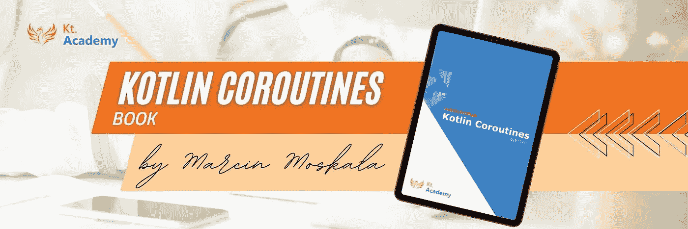
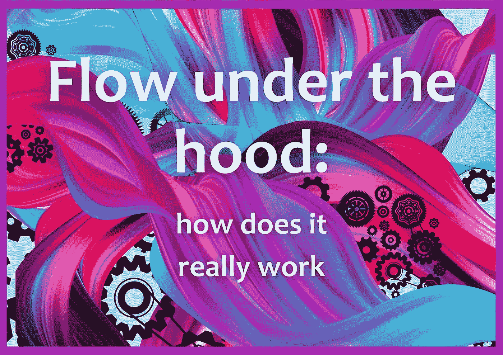
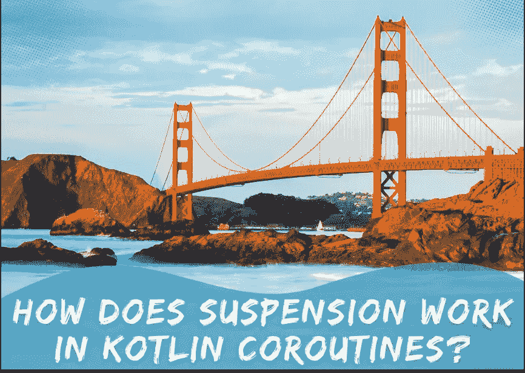
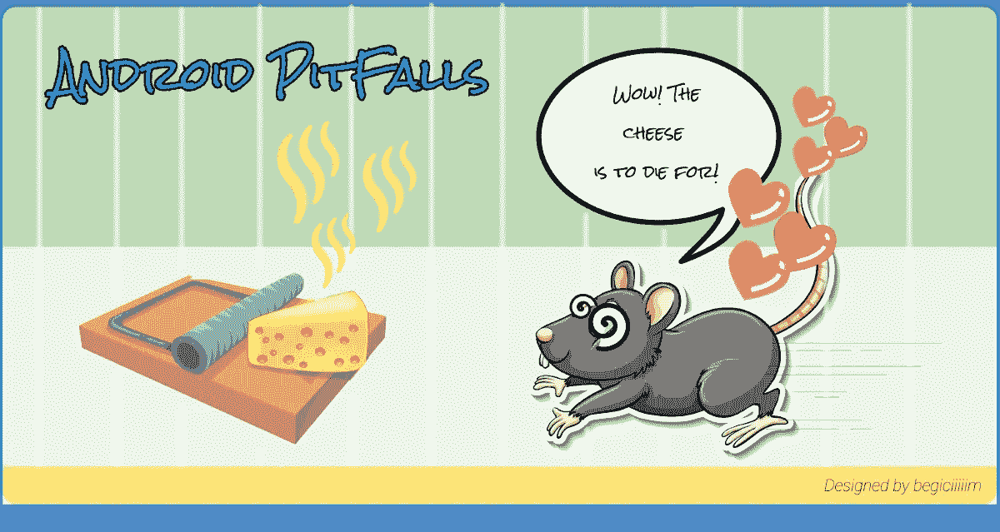
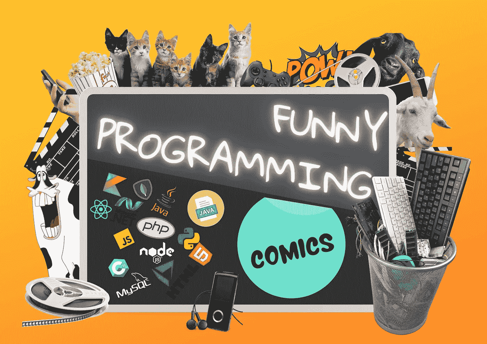
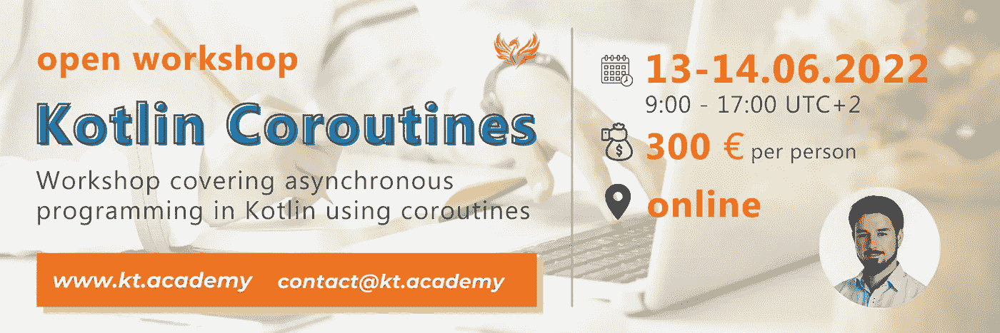

# 阅读和学习:2 篇 Kotlin 协同程序文章& Android 问题&有趣的编程&学习驱动&协同程序研讨会😎

> 原文：<https://blog.kotlin-academy.com/read-and-learn-2-kotlin-coroutines-articles-android-problems-funny-programming-learning-27c181467fd?source=collection_archive---------2----------------------->

嗨，代码爱好者们！🤗

距离 Kotlin Coroutines 图书正式发行还有 3 周。我们收到很多评论说你喜欢我们的书。
感谢您的反馈！🙏

让我们回到文章上来。📰

👩‍💻👨‍💻👩‍💻👨‍💻👩‍💻👨‍💻👩‍💻👨‍💻👩‍💻👨‍💻👩‍💻👨‍💻👩‍💻👨‍💻👩‍💻👨‍💻👩‍💻👨‍💻👩‍💻👨‍💻

下面是今天新闻简报内容的简要列表:

**科特林的文章**作者**马尔钦·莫斯卡兹** :
👉[引擎盖下的流程:它到底是如何工作的](https://kt.academy/article/how-flow-works)
👉[在 Kotlin 协程中，挂起是如何工作的？](https://kt.academy/article/cc-suspension)

文章是来自 **Kotlin Coroutine** 书的部分。你可以在这里找到整本书[。📖](https://leanpub.com/coroutines/)

**Android 的**常见问题文章由**begüm yazēc:**
撰写👉[最常见的 Android 问题——Android 陷阱🐭🧀](/most-common-android-problems-android-pitfalls-d7f3e11dabff)

✳ [贝古姆](https://yazicibegum.medium.com/)联系了我们，开始写精彩的内容。我们仍然对新作者开放。
更多关于我们[媒体的信息](https://blog.kotlin-academy.com/)📝

想知道一些**学习技巧**？
阅读 Marcin Moskał a 写的关于**沉浸**的文章:
👉沉浸式学习——学习的金钥匙

**Offtop 搞笑内容文章**由**马尔辛·莫斯卡亚**撰写让你开怀大笑第二部:
👉[搞笑编程漫画](https://kt.academy/article/humour-comics)

尽情享受吧！🙃

Kotlin 协同程序流是一个比大多数开发人员认为的简单得多的概念。它只是执行什么操作的定义。类似于一个悬浮的 lambda 表达式(带有一些额外的元素)。
是时候探索“心流”及其处理是如何真正发挥作用的了。

**引擎盖下的流动:它到底是如何工作的👇**

🔻 This is a chapter from the [Kotlin Coroutines](https://kt.academy/book/coroutines) book. You can find the whole book on [LeanPub](https://leanpub.com/coroutines/).

挂起函数是 Kotlin 协程的标志。挂起能力是所有其他 Kotlin 协程概念所依赖的最重要的特性。这就是为什么我们在这一章的目标是打造一个如何工作的坚实的理解。

在 Kotlin 协程中，挂起是如何工作的？👇

🔻 This is a chapter from the [Kotlin Coroutines](https://kt.academy/book/coroutines) book. You can find the whole book on [LeanPub](https://leanpub.com/coroutines/).

在本文中，**begüm yaz UC**将解释 **Android 的**常见问题以及我们应该如何解决它们。她将在 3 个标题下讨论这些问题:**核心，UI，网络。**🐭

**最常见的 Android 问题——Android 陷阱🐭 🧀 👇**

[Most Common Android Problems — Android Pitfalls 🐭 🧀](/most-common-android-problems-android-pitfalls-d7f3e11dabff)

学习的一个最重要的元素是沉浸。我们将沉浸定义为增加对你所学学科的接触。如果它要求你在这个学科中操作(和实践)是最好的，但是仅仅被这个学科包围也是一种有用的沉浸形式。
更多文章由**马尔钦·莫斯卡亚**撰写👇

沉浸式学习——学习的黄金地带

[Immersion — The golden Graal of learning](https://learningdriven.fun/post/immersion)

🤣漫画是一种非常流行的编程幽默形式。对一些人来说，创作漫画是释放他们挫折感的一种方式。其他人变得受欢迎，甚至因制作关于它或相邻领域的漫画而获得报酬。

在本文中，**Marcin moska a**将展示他最喜欢的编程漫画的例子。

**搞笑编程漫画👇**

[Funny programming comics](https://kt.academy/article/humour-comics)

你已经读过科特林的协同程序书了吗？🤔
加入由**Marcin moska a**主持的**open kot Lin Coroutines workshop**。
📅2022 年 6 月 13 日至 14 日
⏲世界协调时+2 时 00 分至 17 时
💰每人 300 **€** 更多信息
👇
[Kt。学院](https://kt.academy/workshop/coroutines/form/public/coroutinesJun2022/register)

📚📚📚📚📚📚📚📚📚📚📚📚📚📚📚📚📚📚📚📚📚📚📚📚📚📚

编码快乐！✍:这就是我们今天的全部内容🙂

如果你有什么想告诉我们的，请回复这封邮件让我们知道！💌

敬请期待！👌
Kt。学院团队

www: [kt.academy](https://kt.academy/)
博客:【blog.kotlin-academy.com】
Twitter EN:[@ ktdotsacademy](https://twitter.com/ktdotacademy)
Twitter PL:[@ ktdotsacademypl](https://twitter.com/ktdotacademyPL)
FB:[@ ktdotsacademy](https://www.facebook.com/KtDotAcademy)
LinkedIn:[@ Kt。学院](https://www.linkedin.com/company/kt-academy/)

