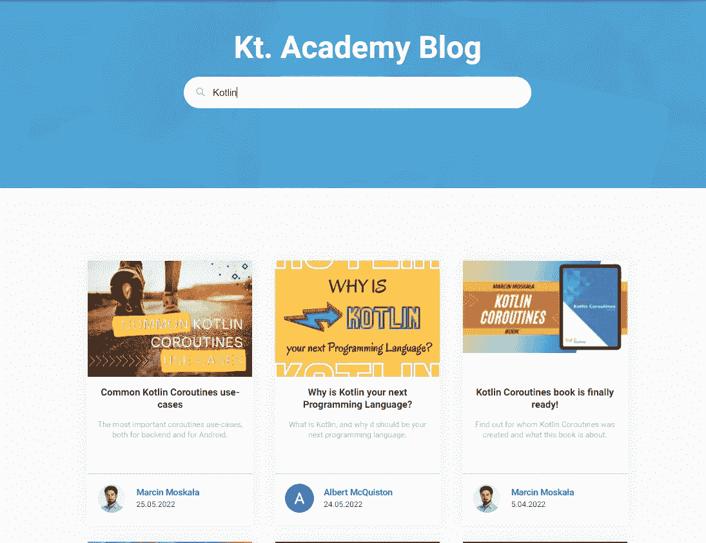
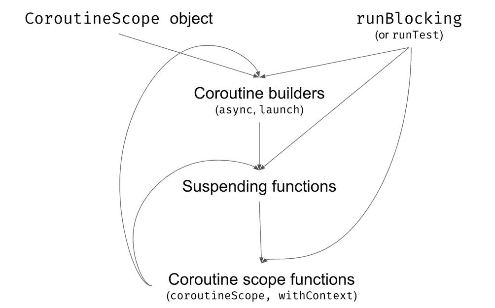
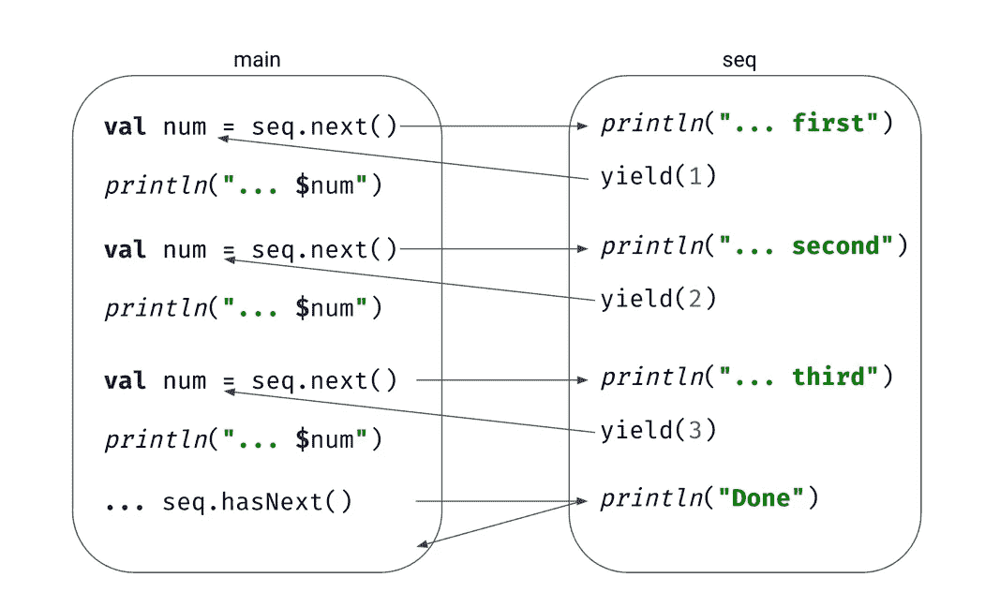
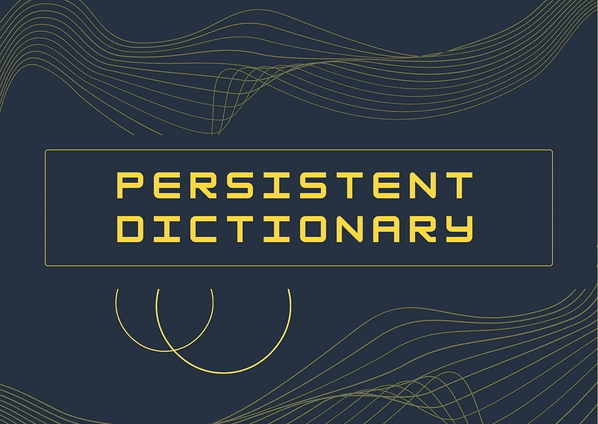
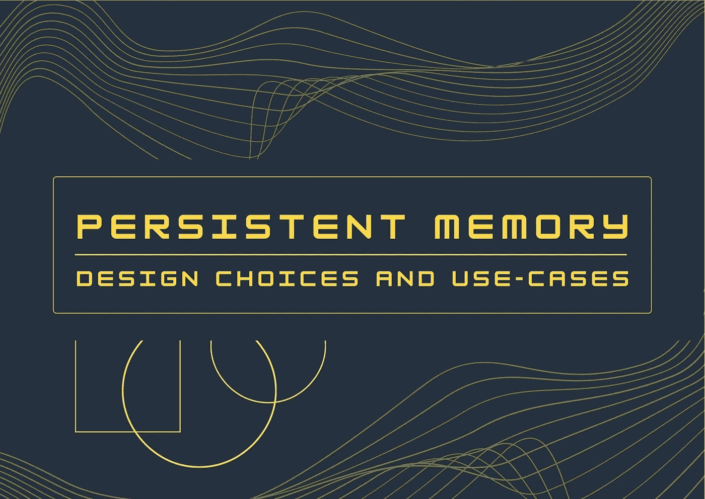

# 阅读和学习:5 篇 Kotlin 文章&重新设计的网站&持久存储系列&软件测试&如何写一本技术书👌

> 原文：<https://blog.kotlin-academy.com/read-and-learn-5-kotlin-articles-redesigned-website-persistent-memory-series-software-b343acb5da44?source=collection_archive---------1----------------------->

大家好！🙂

已经有一段时间了，但是我们已经完成了对我们网站的修改。💪为了让你更直观、更有吸引力，我们做出了改变。🔍
看看重新设计的 [kt。学院网站](http://kt.academy/)！
你觉得怎么样？😎

👩‍💻👨‍💻👩‍💻👨‍💻👩‍💻👨‍💻👩‍💻👨‍💻👩‍💻👨‍💻👩‍💻👨‍💻👩‍💻👨‍💻👩‍💻👨‍💻👩‍💻👨‍💻👩‍💻

下面是今天新闻简报内容的简要列表:

**4 Kotlin Coroutines 更新文章**由**Marcin moska a**撰写:
👉[常见的 Kotlin 协程用例](https://kt.academy/article/cc-use-cases)
👉[协程构建器](https://kt.academy/article/cc-builders)
👉[kot Lin 协程中的序列生成器](https://kt.academy/article/cc-sequence)
👉[引擎盖下的花冠](https://kt.academy/article/cc-under-the-hood)

文章是《T21》一书中的部分内容。你可以在这里找到整本书[。📖](https://leanpub.com/coroutines/)

**科特林**的文章由**阿尔伯特·麦奎斯特**撰写:
👉为什么 Kotlin 是你的下一门编程语言？

✳ [阿尔伯特](https://medium.com/@albertmcquiston)联系了我们，我们在我们的网站上发表了他的文章。谢谢大家！记住，我们总是对新的作者和有价值的内容开放。
关于我们的[介质](https://blog.kotlin-academy.com/)的更多信息📝

最后两篇**永久记忆**文章由**萨尔塔克·马基雅** 🧠
准备👉[持久词典](https://kt.academy/article/pmem-persistent-dictionary)👉[持久存储器设计选择和使用案例](https://kt.academy/article/pmem-design-choices-and-use-cases)

✳ [萨尔萨克](https://www.linkedin.com/in/sarthak-makhija-7a165a55?original_referer=https%3A%2F%2Fwww%2Egoogle%2Ecom%2F&originalSubdomain=in)写了几篇文章。我们很高兴能帮助他在我们的网站上发表文章。你愿意和我们分享你写的一些有趣的东西吗？
写信给 **kasia@kt.academy** 📧
所有的**持久存储系列**都可以在[这里](https://kt.academy/user/sarthakmakhija) 🧠

**🤖2** **软件测试和 AI** 使用 **Mesut Durukal**
撰写的文章👉[软件测试标准(与 ISTQB 一致)](https://kt.academy/article/software-testing-standards)
👉[在软件测试中利用人工智能](https://kt.academy/article/ai-in-testing)

✴·梅苏特是我们的教练之一。👨‍💻
对测试、机器学习、AI 感兴趣？查看他的[工作室并立即注册！](https://kt.academy/user/mesutdurukal)

关于写技术书的小技巧**马尔钦·莫斯卡亚**写的💭
👉[如何写一本技术书？](https://kt.academy/article/writing-technical-books)

阅读量真大！
享受！🙃

最重要的协程用例，包括后端和 Android。
**常见 Kotlin 协程用例👇**

[Common Kotlin Coroutines use-cases](https://kt.academy/article/cc-use-cases)
🔻 This is a chapter from the [Kotlin Coroutines](https://kt.academy/book/coroutines) book. You can find the whole book on [LeanPub](https://leanpub.com/coroutines/).

展示 kotlinx.coroutines 库的不同元素是如何使用的图表。我们需要从一个范围或`runBlocking`开始。在作用域上，我们启动使用挂起函数的协程。如果他们需要启动新的协程，他们首先使用协程作用域函数。
**协程构建器** **👇**

[Coroutine builders](https://kt.academy/article/cc-builders)
🔻 This is a chapter from the [Kotlin Coroutines](https://kt.academy/book/coroutines) book. You can find the whole book on [LeanPub](https://leanpub.com/coroutines/).

序列生成器使用协程，因此，当我们请求下一个值时，它们会从之前使用的 yield 恢复。
**kot Lin 协程中的序列生成器**👇

[Sequence builders in Kotlin Coroutines](https://kt.academy/article/cc-sequence)
🔻 This is a chapter from the [Kotlin Coroutines](https://kt.academy/book/coroutines) book. You can find the whole book on [LeanPub](https://leanpub.com/coroutines/).

深入探究暂停和延续在幕后是如何工作的。更新文章**引擎盖下的协程**👇

[Coroutines under the hood](https://kt.academy/article/cc-under-the-hood)
🔻 This is a chapter from the [Kotlin Coroutines](https://kt.academy/book/coroutines) book. You can find the whole book on [LeanPub](https://leanpub.com/coroutines/).

现在科特林越来越受欢迎了。想知道为什么它应该是你的下一个编程语言吗？🤔阅读艾伯特·麦克基斯顿写的文章👇
**为什么 Kotlin 是你的下一个编程语言？**

[Why is Kotlin your next Programming Language?](https://kt.academy/article/why-is-kotlin-your-next-programming-language)

**永久内存**是一种非易失性存储器，可安装在标准 DIMM 插槽中。永久内存提供比 SSD 和 NVMe 更高的吞吐量，但比 DRAM 慢。使用永久内存，即使在意外断电、用户启动关机或系统崩溃的情况下系统断电，内存内容仍会保留。

让我们的**内存词典**持久化，了解一些 PMDK 的概念。阅读由 Sarthak Makhija 撰写的持久记忆系列文章的第四部分👇

[Persistent dictionary](https://kt.academy/article/pmem-persistent-dictionary)
🔺The rest of Sarthak’s articles available [here](https://kt.academy/user/sarthakmakhija)

让我们来了解一下持久性存储器的一些设计选择和持久性存储器的使用案例。
**持久内存设计选择和用例👇**

[Persistent memory design choices and use-cases](https://kt.academy/article/pmem-design-choices-and-use-cases)
🔺The rest of Sarthak’s articles available [here](https://kt.academy/user/sarthakmakhija)

使我们的测试活动符合 ISTQB 标准有助于我们高效地执行和应对项目范围和期限。在本次研讨会中，我们将回顾从定义到维护的软件测试阶段。

更多内容请见由 **Mesut Durukal**
**撰写的文章软件测试标准(与 ISTQB 一致)👇**

[Software Testing Standards (Aligned with ISTQB)](https://kt.academy/article/software-testing-standards)
🔺 More about Mesut and his workshops you can find [here](https://kt.academy/user/mesutdurukal)

由于人工智能在我们的日常生活中面临着我们，并且它通过消除一些手动工作来改善开发活动，所以在我们的任务中拥抱它是有益的。我们将看到如何在软件测试中利用基于人工智能的算法。
**在软件测试中利用人工智能👇**

[Leveraging AI in Software Testing](https://kt.academy/article/ai-in-testing)
🔺 More about Mesut and his workshops you can find [here](https://kt.academy/user/mesutdurukal)

你想过自己写一本技术书吗？💡去吧！💪

阅读由 Marcin moska a 编写的技术书籍写作指南，他也是 5 本编程书籍的作者。
**如何写一本技术书？👇**

[How to write a technical book?](https://kt.academy/article/writing-technical-books)

📚📚📚📚📚📚📚📚📚📚📚📚📚📚📚📚📚📚📚📚📚📚📚📚📚📚

编码快乐！🌞这就是今天我们的全部内容🙂

如果你有什么想告诉我们的，请回复这封邮件让我们知道！💌

敬请期待！👌
Kt。学院团队

www: [kt.academy](https://kt.academy/)
博客:[blog.kotlin-academy.com](http://blog.kotlin-academy.com/)
Twitter EN:[@ ktdotsacademy](https://twitter.com/ktdotacademy)
Twitter PL:[@ ktdotsacademypl](https://twitter.com/ktdotacademyPL)
FB:[@ ktdotsacademy](https://www.facebook.com/KtDotAcademy)
LinkedIn:[@ Kt。学院](https://www.linkedin.com/company/kt-academy/)

