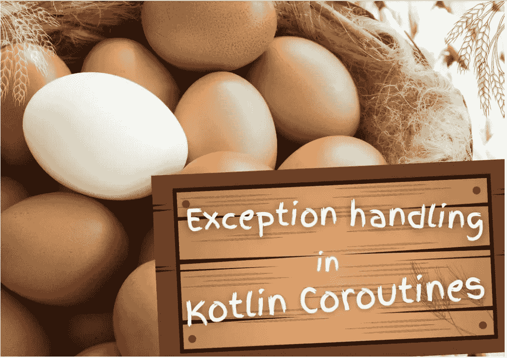
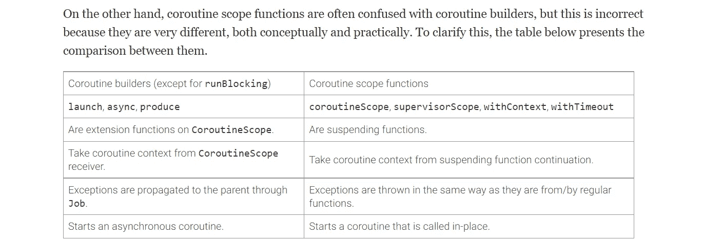
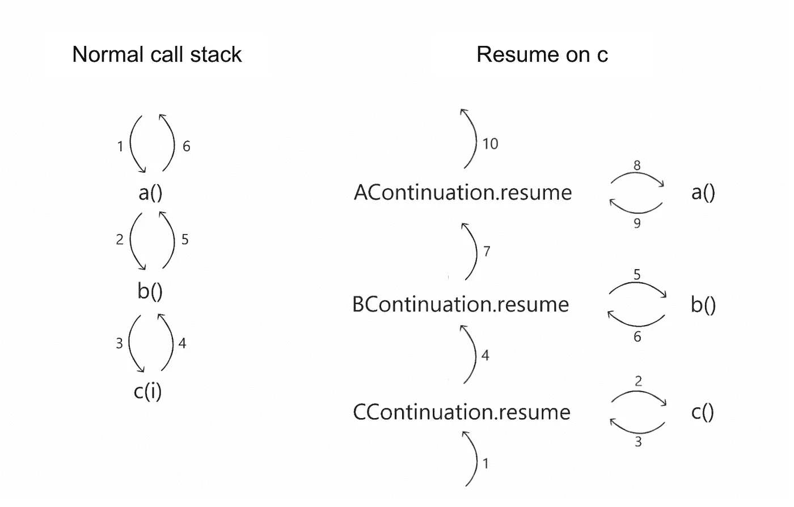
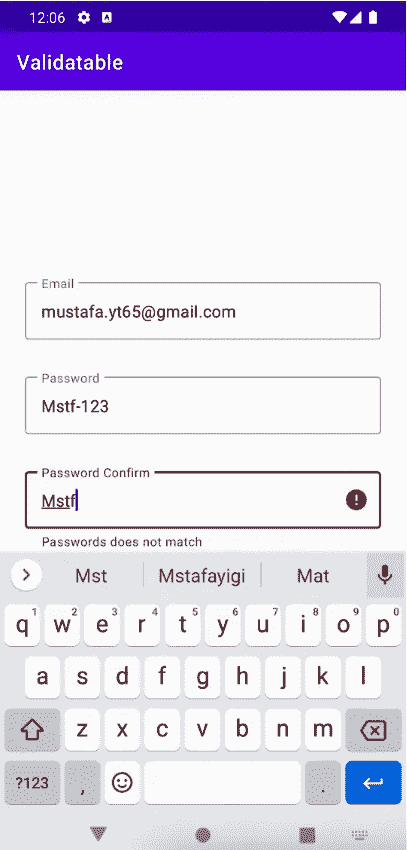

# 阅读和学习:收集处理第 1 部分和第 4 部分更新了 Kotlin Coroutines 文章和 Android 文章&假期愉快🏖

> 原文：<https://blog.kotlin-academy.com/read-and-learn-collection-processing-part1-4-updated-kotlin-coroutines-articles-android-36aaaf076fe4?source=collection_archive---------1----------------------->

大家好！🙂

我们希望你一切都好。我们正与出色的评论家合作撰写功能性科特林书籍。首映式很快就要开始了！我们祝你假期愉快、阳光明媚，并推荐一些在海边或任何你想放松的地方阅读的好内容。🌴

🌍🌍🌍🌍🌍🌍🌍🌍🌍🌍🌍🌍🌍🌍🌍🌍🌍🌍🌍🌍🌍🌍

下面是今天新闻简报内容的简要列表:

**收藏加工篇**系列第一篇**马尔钦·莫斯卡亚:
👉**[kot Lin 中的采集处理:基本功能](https://kt.academy/article/fk-cp-basic)

这些章节将会出现在最新的书[**Functional kot Lin**](https://leanpub.com/kotlin_functional)中，该书的作者不是别人，正是**Marcin moskaa**！

**4 Kotlin Coroutines 更新文章**作者**Marcin moska a**:
👉[kot Lin 协同程序中的异常处理](https://kt.academy/article/cc-exception-handling)
👉[协程作用域函数](https://kt.academy/article/cc-scoping-functions)
👉[科特林协程中的注销](https://kt.academy/article/cc-cancellation)
👉[引擎盖下的花冠](https://kt.academy/article/cc-under-the-hood)

文章是从**科特林协程**书的部分。你可以在这里找到整本书[。📖](https://leanpub.com/coroutines/)

**Android** 文章由**Mustafa yiòit:**
👉[验证器| Android 中基于规则的验证库](/validator-rule-based-validation-library-in-android-2058e8d6c27)

✳ [穆斯塔法](https://mustafayigitt.medium.com/)在我们[媒体](https://blog.kotlin-academy.com/)上发表了几篇文章。看看其他的:
[打个招呼👋与 XML 进行比较。](/say-hello-to-jetpack-compose-and-compare-with-xml-6bc6053aec13)
学院(kotlin-academy.com)谢谢！👏

记住，我们总是对新作者和有价值的内容开放。📝

尽情享受吧！🙃

**函数式编程**最有用的应用之一是集合处理。让我们来了解一下**的基本采集处理功能**。这也是由**Marcin moska a**撰写的关于函数集合处理函数的系列文章的开始。

**第 1 部分:Kotlin 中的收集处理:基本功能**👇

[Collection processing in Kotlin: Basic functions](https://kt.academy/article/fk-cp-basic)
You can find the early access to the book below 👇
[[Early Access] Functional… by Marcin Moskała [PDF/iPad/Kindle] (leanpub.com)](https://leanpub.com/kotlin_functional)

在更新的 Kotlin Coroutines 文章中，您需要了解的关于异常处理机制的一切。
**kot Lin 协程中的异常处理👇**

[Exception handling in Kotlin Coroutines](https://kt.academy/article/cc-exception-handling)
🔻 This is a chapter from the [Kotlin Coroutines](https://kt.academy/book/coroutines) book. You can find the whole book on [LeanPub](https://leanpub.com/coroutines/).

协程构建器(如 launch)经常与**协程作用域函数(如协程作用域)混淆。它们都创建了协程，但是它们的行为和用法完全不同。
**协程作用域函数👇****

[Coroutine scope functions](https://kt.academy/article/cc-scoping-functions)
🔻 This is a chapter from the [Kotlin Coroutines](https://kt.academy/book/coroutines) book. You can find the whole book on [LeanPub](https://leanpub.com/coroutines/).

关于 Kotlin 协同例程中的取消机制，您只需在本文的更新版本中了解。
**在 Kotlin 协程中取消**👇

[Cancellation in Kotlin Coroutines](https://kt.academy/article/cc-cancellation)
🔻 This is a chapter from the [Kotlin Coroutines](https://kt.academy/book/coroutines) book. You can find the whole book on [LeanPub](https://leanpub.com/coroutines/).

延续就像一个调用堆栈，但是当我们使用它们时，顺序是相反的:我们首先从调用堆栈的顶部恢复函数，一旦完成，我们就恢复调用它的函数。
**兜帽下的花冠**👇

[Coroutines under the hood](https://kt.academy/article/cc-under-the-hood)
🔻 This is a chapter from the [Kotlin Coroutines](https://kt.academy/book/coroutines) book. You can find the whole book on [LeanPub](https://leanpub.com/coroutines/).

最近，我们为我的所有输入编写了一个基于规则的验证结构。它非常灵活且易于管理。今天我们将试着解释一下**验证器**库。阅读由**Mustafa yi it
validator | Android 中基于规则的验证库撰写的文章👇**

[validator | Rule Based Validation Library in Android](/validator-rule-based-validation-library-in-android-2058e8d6c27)

🌴🌞🌴🌞🌴🌞🌴🌞🌴🌞🌴🌞🌴🌞🌴🌞🌴🌞🌴🌞🌴🌞🌴🌞🌴

阳光编码！🌞这就是今天我们的全部内容🙂

如果你有什么想告诉我们的，请回复这封邮件让我们知道！💌

敬请期待！👌
Kt。学院团队

www: [kt.academy](https://kt.academy/)
博客:[blog.kotlin-academy.com](http://blog.kotlin-academy.com/)
Twitter EN:[@ ktdotsacademy](https://twitter.com/ktdotacademy)
Twitter PL:[@ ktdotsacademypl](https://twitter.com/ktdotacademyPL)
FB:[@ ktdotsacademy](https://www.facebook.com/KtDotAcademy)
LinkedIn:[@ Kt。学院](https://www.linkedin.com/company/kt-academy/)

